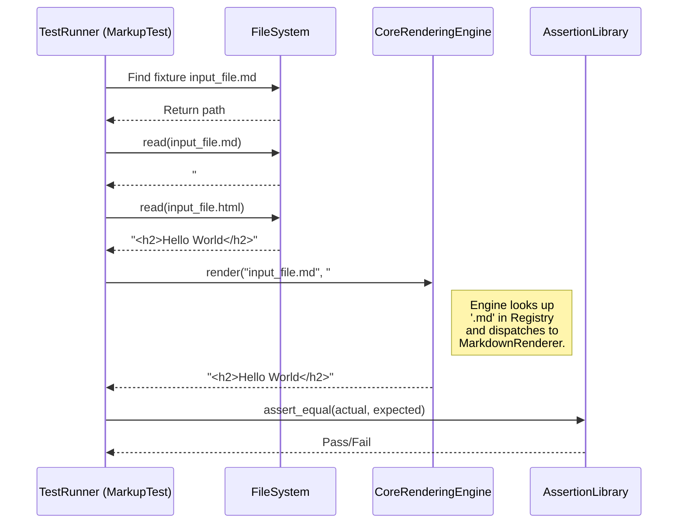

# Chapter 7: Fixture-Based Testing Strategy
- Reference: Renderer Implementation Contract

### Architectural Intent & Motivation
The Fixture-Based Testing Strategy is the cornerstone of the system's quality assurance protocol. Its primary responsibility is to provide comprehensive, deterministic, and end-to-end verification of the entire rendering pipeline for every supported markup language.

This approach satisfies the core architectural requirement of maintaining consistent output across a diverse and extensible set of renderers. By treating the `Core Rendering Engine` as a black box and verifying its final output against a known-good "snapshot," the test suite guarantees that changes to individual renderers, the language registry, or the core engine itself do not introduce regressions. It ensures that the public contract of the library—transforming a specific markup file into a specific HTML output—is perpetually upheld.

### Contextual Use Case
A developer is tasked with upgrading the underlying gem that powers the `MarkdownRenderer`. The new version of the gem produces slightly different HTML for fenced code blocks. To ensure this change is intentional and correct, the developer updates the corresponding Markdown fixture file (`code_block.html`) to reflect the new, valid output. Upon running the test suite, all other fixtures for Markdown and other languages must continue to pass. This validates that the upgrade only affected the intended component and that the system as a whole remains stable. The test fails if the upgrade caused unintended side-effects in other rendering scenarios, immediately flagging a regression.

### Concept Decomposition
The strategy is composed of three primary logical units:

*   **Fixtures:** An atomic test case represented as a pair of files: an input file in a specific markup format (e.g., `example.md`) and a corresponding expected output file containing the canonical HTML (`example.html`).
*   **Fixture Directory:** A structured directory (`test/fixtures/`) that organizes fixtures into subdirectories named after the markup format they test. This convention allows for the automatic discovery and association of test cases with their respective renderers.
*   **Test Runner (`MarkupTest`):** The test class that contains the logic to discover, iterate through, and execute tests for all available fixtures. It is responsible for orchestrating the file I/O, invoking the rendering engine, and performing the final assertion.

### Reference Implementation
The canonical implementation resides within the `MarkupTest` suite. The core logic iterates over each fixture, processes the input file using the main public API, and asserts that the result matches the expected output file.

```ruby
# Simplified logic from MarkupTest
class MarkupTest < Minitest::Test
  # Discover all non-HTML files in the fixtures directory
  FIXTURES = Dir["test/fixtures/**/*.*"].reject { |f| File.extname(f) == ".html" }

  FIXTURES.each do |input_file|
    define_method("test_#{File.basename(input_file, '.*')}") do
      expected_file = input_file.sub(/\.\w+$/, '.html')
      
      # Invoke the Core Rendering Engine
      actual_html = GitHub::Markup.render(input_file, File.read(input_file))
      expected_html = File.read(expected_file)

      assert_equal expected_html, actual_html
    end
  end
end
```

### Architectural Mechanics (White-Box Analysis)
#### Design Pattern Identification
The strategy employs the **Data-Driven Testing** pattern. The test execution logic (`MarkupTest`) is decoupled from the test case data (the fixture files). This allows the test suite to be expanded with new test cases by simply adding files, without requiring any modification to the test runner's code. This approach treats the `Core Rendering Engine` as a black box, focusing solely on validating its input/output behavior, which is a form of **Black-Box Testing**.

#### Control Flow/State
The execution flow is stateless and linear for each test case:
1.  The `MarkupTest` class is loaded, and its test discovery mechanism identifies all valid input files within the fixture directory.
2.  For each discovered input file, a new test method is dynamically generated.
3.  Upon execution, the test method determines the corresponding expected output file path based on convention.
4.  It reads the content of both the input and expected output files from the disk.
5.  It invokes `GitHub::Markup.render`, passing the input filename and content. This triggers the full system pipeline: `Core Rendering Engine` -> `Markup Language Registry` -> `Specific Markup Renderer`.
6.  The `render` method returns the generated HTML as a string.
7.  An assertion compares the returned HTML string with the content of the expected output file. A mismatch causes the test to fail. Each test is fully independent and does not share or mutate state.

### Architectural Visualization (Mermaid)
A sequence diagram best illustrates the interaction between the test runner and the core system components during the verification of a single fixture.



### System Topology & Integration
#### Dependency Graph
*   **Upstream (Dependents):** The test strategy has no runtime dependents. It is a development-time component whose results are consumed by the Continuous Integration (CI) pipeline and developers to validate system integrity.
*   **Downstream (Dependencies):**
    *   **Core Rendering Engine (Chapter 1):** The test suite is a primary client of the engine's public API. It depends directly on the `render` method to execute the functionality under test.
    *   **File System:** The strategy is fundamentally dependent on the file system for the storage and retrieval of all fixture-based test cases.

#### Data Propagation
*   **Ingress:** Data enters the process as a collection of file paths from the file system. For each test, two string buffers are read into memory: the markup source and the expected HTML.
*   **Egress:** The primary output is a boolean result (pass/fail) for each assertion, which is aggregated by the test framework. The generated HTML string is a transient artifact used for comparison and is discarded after each test.

### Engineering Standards
#### Performance Implications
The performance of the test suite exhibits linear complexity, O(n), where 'n' is the number of fixtures. The total execution time is the sum of the rendering times for every file. As the project adds support for more languages or more complex fixtures, the CI build time will increase proportionally. Renderers that rely on shelling out to external commands (`CommandImplementation`) typically introduce more overhead than native `GemImplementation` renderers.

#### Anti-Patterns
*   **Overly-Specific Fixtures:** Fixtures that assert against non-semantic details like whitespace, attribute order, or auto-generated class names are brittle. They can fail due to inconsequential changes in an underlying dependency, creating noise and increasing maintenance overhead. Fixtures should be normalized to test for semantic HTML equivalence where possible.
*   **Testing Non-Public Contracts:** Creating fixtures that depend on an internal, undocumented behavior of a specific renderer. This couples the tests to implementation details, making the renderer difficult to refactor and violating the black-box testing principle.
*   **Inadequate Coverage:** Failing to create fixtures for common edge cases, such as empty files, malformed syntax, or Unicode characters. A "happy path" only fixture suite provides a false sense of security.

### Conclusion
The Fixture-Based Testing Strategy provides an exceptionally high degree of confidence in the `markup` library's correctness. By decoupling test logic from test data, it establishes a simple, scalable, and declarative framework for end-to-end validation. This approach makes it trivial to expand test coverage for existing languages and to validate new renderers as they are integrated, forming the definitive guard against regressions and ensuring long-term architectural stability.