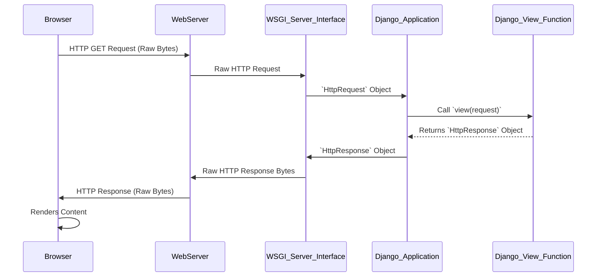

# Chapter 1: HTTP Request and Response

Welcome to the first chapter of the `markup` project documentation! This chapter lays the foundational understanding of how web applications communicate, focusing on the core concepts of HTTP Requests and Responses.

---

### Problem & Motivation

The internet, at its core, is a vast network of computers exchanging information. But how do these computers "talk" to each other? How does your web browser ask a server for a webpage, and how does that server send the page back? Without a standardized way of communicating, every interaction would require a custom language, leading to chaos and incompatibility. This is the fundamental problem that **HTTP Request and Response** solves.

In the context of the `markup` project, a Django web application, understanding this interaction model is absolutely critical. Every single interaction a user has with `markup`—whether they're browsing an article, submitting a new post, or logging in—is initiated by an HTTP Request and concluded with an HTTP Response. These objects are the primary interface through which `markup` receives user input and delivers content back to their browsers.

Consider a concrete use case: A user wants to view an article titled "Getting Started with Markup" on our platform. The user's browser needs to ask the `markup` server for this specific article, and the `markup` server needs to process that request, find the article, and send its content back to the user's browser for display. This entire process is orchestrated through HTTP Requests and Responses.

---

### Core Concept Explanation

At the heart of web communication lies the **Hypertext Transfer Protocol (HTTP)**. Think of HTTP as the standardized language that web clients (like your browser) and web servers use to exchange information. It's a request-response protocol, meaning every interaction begins with a client sending a request and ends with the server sending a response.

An **HTTP Request** is essentially a message sent by a client to a server asking for something. This message contains several key pieces of information:
*   **Method**: Specifies the type of action the client wants to perform (e.g., `GET` to retrieve data, `POST` to send data).
*   **URL**: The specific address of the resource the client is requesting (e.g., `/articles/getting-started`).
*   **Headers**: Additional metadata about the request, such as the client's browser type (`User-Agent`), accepted content types (`Accept`), or authentication tokens.
*   **Body**: Optional data being sent to the server, typically used with `POST` requests for form submissions.

Conversely, an **HTTP Response** is the server's reply to an HTTP Request. It informs the client about the outcome of the request and provides the requested content. Key components of an HTTP Response include:
*   **Status Code**: A three-digit number indicating the result of the request (e.g., `200 OK` for success, `404 Not Found` for a missing resource, `500 Internal Server Error` for a server-side problem).
*   **Headers**: Metadata about the response, such as the content type (`Content-Type: text/html`), the server software (`Server`), or caching instructions.
*   **Body**: The actual content being sent back, which could be HTML for a webpage, JSON for an API, an image, or any other data type.

In essence, the client is like a customer ordering food, and the server is the chef preparing and delivering it. The request is the order, and the response is the meal. This simple yet powerful model enables all interaction on the World Wide Web.

---

### Practical Usage Examples

Let's revisit our use case: a user wants to view the article "Getting Started with Markup."

#### 1. Browser Sends an HTTP GET Request

When a user types `https://markup.com/articles/getting-started` into their browser's address bar and presses Enter, their browser constructs and sends an HTTP `GET` request to the `markup` server.

```http
GET /articles/getting-started HTTP/1.1
Host: markup.com
User-Agent: Mozilla/5.0 (Windows NT 10.0; Win64; x64) AppleWebKit/537.36 (...)
Accept: text/html,application/xhtml+xml,application/xml;q=0.9,image/webp,*/*;q=0.8
```
*Explanation*: This is a simplified representation of the raw HTTP request. `GET` indicates the intention to retrieve data. `/articles/getting-started` is the specific path on the server being requested. `Host` specifies the domain, and `User-Agent` identifies the browser.

#### 2. `markup` Server Sends an HTTP Response

The `markup` Django application receives this request. Inside a Django *view* (a Python function that handles requests), it processes the request and generates an appropriate response.

```python
# In a Django view function (e.g., in views.py)
from django.http import HttpResponse

def article_detail_view(request):
    # Imagine retrieving article content from a database based on the URL
    article_title = "Getting Started with Markup"
    article_body = "<p>This is the content of your first article on Markup!</p>"
    html_content = f"<h1>{article_title}</h1>{article_body}"

    # Construct and return an HttpResponse
    return HttpResponse(html_content, status=200, content_type="text/html")
```
*Explanation*: This Python code snippet demonstrates how a Django view would construct an `HttpResponse`. It creates HTML content dynamically and then instantiates `HttpResponse`, passing the HTML, a `200 OK` status code, and specifying `text/html` as the content type.

The raw HTTP response sent back to the browser would look something like this:

```http
HTTP/1.1 200 OK
Content-Type: text/html; charset=utf-8
Content-Length: 98
Server: WSGIServer/0.2 CPython/3.x.x
Date: Thu, 01 Jan 2023 12:00:00 GMT

<h1>Getting Started with Markup</h1><p>This is the content of your first article on Markup!</p>
```
*Explanation*: The `200 OK` status indicates success. `Content-Type` tells the browser to render the body as HTML. The `Content-Length` is the size of the HTML body, which is then included after the headers. The browser receives this and displays the formatted HTML to the user.

---

### Internal Implementation Walkthrough

The `markup` project, being a Django application, sits behind a **WSGI Server Interface** (Web Server Gateway Interface). This interface is crucial for translating raw HTTP communication into Python objects that Django can understand, and vice-versa.

Here's a step-by-step conceptual walkthrough of what happens internally when `markup` handles an HTTP Request and produces an HTTP Response:

1.  **Browser Initiates Request**: The user's browser sends raw HTTP request bytes over the network to the `markup` server.
2.  **Web Server Receives Request**: A web server (like Nginx or Apache) running on the server machine receives these raw HTTP request bytes.
3.  **WSGI Server Interface Translation**: The web server passes these raw bytes to the WSGI server (e.g., Gunicorn, uWSGI), which then translates them into a Python object called `HttpRequest`. This `HttpRequest` object is a standardized representation of the incoming HTTP request that Django can easily work with.
4.  **Django Application Processing**:
    *   The `HttpRequest` object enters the Django application.
    *   Django's [URL Dispatcher](chapter_04.md) examines the `HttpRequest.path` and matches it against defined URL patterns.
    *   Once a match is found, the `HttpRequest` is passed to the designated [View (Request Handler)](chapter_05.md) function.
5.  **View Logic Execution**: The view function processes the `HttpRequest` (e.g., reads query parameters, retrieves data from a database, performs calculations). It then constructs a Python object called `HttpResponse`, containing the content and metadata to be sent back to the client.
6.  **WSGI Server Interface Re-translation**: The `HttpResponse` object is returned from the view back through the Django application. The WSGI server interface takes this `HttpResponse` object and converts it back into raw HTTP response bytes.
7.  **Web Server Sends Response**: The web server receives these raw HTTP response bytes and sends them over the network back to the user's browser.
8.  **Browser Renders Response**: The browser receives the raw HTTP response, parses it, and displays the content (e.g., renders the HTML page).

Here's a sequence diagram illustrating this flow:


*Explanation*: This diagram visually represents the journey of an HTTP request through the various layers of the `markup` project. It starts from the user's browser, passes through a web server, the WSGI interface (where it becomes a Python object), gets processed by Django's application logic and a specific view, and then travels back through the same layers to be rendered by the browser.

Within a Django view, the `HttpRequest` object provides easy access to various parts of the incoming request:
*   `request.method`: String representing the HTTP method (e.g., `'GET'`, `'POST'`).
*   `request.path`: The full path to the requested resource (e.g., `'/articles/getting-started/'`).
*   `request.GET`: A dictionary-like object for all HTTP GET parameters (from the URL query string, e.g., `?search=term`).
*   `request.POST`: A dictionary-like object for all HTTP POST parameters (typically from HTML forms).
*   `request.headers`: A dictionary of all incoming HTTP headers.

Similarly, the `HttpResponse` object is constructed to define the output. Django provides several convenience classes like `JsonResponse` for returning JSON data or `render` for rendering templates, all of which ultimately return an `HttpResponse` object.

---

### System Integration

The **HTTP Request and Response** paradigm is the backbone of the `markup` project, seamlessly integrating with almost every other component:

*   **[URL Dispatcher](chapter_04.md)**: This is the first stop for an incoming `HttpRequest`. It takes the request's URL and maps it to the correct view function that should handle it.
*   **[Views (Request Handlers)](chapter_05.md)**: Views are the core logic units that directly receive the `HttpRequest` object, process it (e.g., interact with a database, perform calculations), and generate an `HttpResponse` object to send back.
*   **[WSGI Server Interface](chapter_06.md)**: As discussed, this layer is responsible for translating the raw bytes of an HTTP request into a usable `HttpRequest` object for Django, and then converting the `HttpResponse` object generated by Django back into raw bytes for the web server to send to the client.
*   **[Configuration Settings](chapter_03.md)**: Django's settings can define middleware that intercepts and processes `HttpRequest` or `HttpResponse` objects globally before they reach a view or before they leave the application. Examples include authentication middleware or security headers.

Essentially, `HttpRequest` objects flow *into* the Django application from the WSGI layer, are routed by the URL Dispatcher to Views, processed there, and then `HttpResponse` objects flow *out* from Views, back through the WSGI layer, and finally to the client.

---

### Best Practices & Tips

Adhering to best practices when working with HTTP Requests and Responses is crucial for building robust, secure, and maintainable web applications like `markup`.

*   **Always Return an `HttpResponse`**: Every Django view function *must* return an `HttpResponse` object (or a subclass, or a result from `render()`, `redirect()`, `JsonResponse()`, etc.). If a view doesn't return an `HttpResponse`, Django will raise an error.
*   **Use Appropriate HTTP Methods**:
    *   **`GET`**: Use for retrieving data. `GET` requests should be "safe" (not change server state) and "idempotent" (making the same request multiple times has the same effect as making it once). Example: Fetching an article.
    *   **`POST`**: Use for submitting data that creates or modifies server-side resources. `POST` requests are neither safe nor idempotent. Example: Creating a new article or submitting a form.
    *   Consider `PUT` for updating a resource completely and `DELETE` for removing a resource for RESTful APIs.
*   **Set Meaningful HTTP Status Codes**: Always return an HTTP status code that accurately reflects the outcome of the request.
    *   `200 OK`: Request succeeded.
    *   `201 Created`: Resource successfully created (often after a `POST` request).
    *   `302 Found` / `301 Moved Permanently`: For redirects.
    *   `400 Bad Request`: Client sent an invalid request (e.g., missing required form data).
    *   `401 Unauthorized`: Client is not authenticated.
    *   `403 Forbidden`: Client is authenticated but doesn't have permission.
    *   `404 Not Found`: The requested resource does not exist.
    *   `500 Internal Server Error`: An unexpected error occurred on the server.
*   **Sanitize User Input**: Never trust data received in `request.GET` or `request.POST` directly. Always validate and sanitize user input to prevent security vulnerabilities like SQL injection or Cross-Site Scripting (XSS). Django's form system helps greatly with this.
*   **Don't Put Sensitive Data in `GET` Parameters**: Since `GET` request parameters are visible in browser history, server logs, and can be bookmarked, avoid using them for sensitive information (e.g., passwords, API keys). Use `POST` with an encrypted connection (HTTPS) instead.
*   **Error Handling**: Implement robust error handling in your views. Catch potential exceptions (e.g., database lookup failures) and return appropriate `HttpResponse` objects (e.g., `HttpResponseNotFound` or `HttpResponseServerError`).

---

### Chapter Conclusion

In this chapter, we've established the fundamental communication mechanism of the web: **HTTP Requests and Responses**. We explored how clients and servers exchange information, the structure of these messages, and how `markup` (and Django) uses them internally. Understanding this interaction is paramount, as it forms the bedrock of every single web interaction within our project. From a simple page view to complex data submissions, the dance between `HttpRequest` and `HttpResponse` dictates how information flows and how `markup` ultimately delivers its functionality.

This foundational knowledge will be crucial as we delve into the structure of a Django project and how it leverages these concepts. Next, we'll explore the overall organization of the `markup` project in Chapter 2, laying out where these requests and responses are handled within the system.

---
Next Chapter: [Django Project Structure](chapter_02.md)