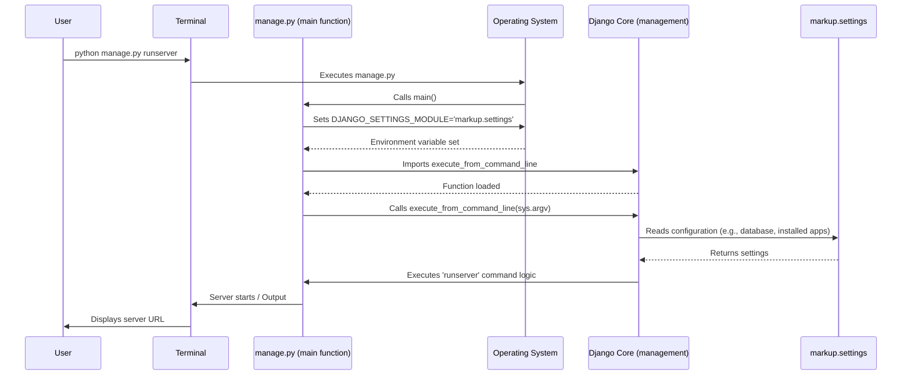

# Chapter 2: Django Project Structure

In the previous chapter, we delved into the foundational concept of [HTTP Request and Response](chapter_01.md), understanding how clients communicate with servers and receive content. This interaction forms the basis of all web communication. However, for a web application to effectively handle these requests and generate meaningful responses, it needs a well-organized and predictable environment. This is precisely where the "Django Project Structure" comes into play.

---

### Problem & Motivation

Imagine trying to build a complex house without a blueprint or a clear organizational plan. You'd have materials scattered everywhere, no clear pathways, and a chaotic build process. Similarly, in web development, an unstructured codebase quickly becomes unmanageable. Without a standardized way to organize files for global configurations, URL routing, database models, and business logic, projects become difficult to scale, collaborate on, and maintain. Developers would spend more time searching for files or understanding ad-hoc organizational schemes than actually building features.

For our "markup" project, which aims to provide a structured framework for building web applications, a robust and clear project structure is paramount. It's not just about neatness; it's about providing a predictable environment where every component knows its place and how to interact with others. This standardization is crucial for ensuring the project's long-term viability, allowing new features to be added seamlessly, and facilitating teamwork. For instance, when we want to add a new feature like user authentication, we'll know exactly where to create the relevant files (views, models, templates) because the project structure guides us.

---

### Core Concept Explanation

The "Django Project Structure" represents the overall organization of a Django web application, including its core files and directories. It defines how the project is managed, configured, and served, providing a convention over configuration approach. At its heart, Django differentiates between a **Project** and an **Application**.

A **Project** is the entire web application, encompassing multiple "applications" and global configurations. Think of it as your entire website. It's the top-level container that holds common settings, the main URL dispatcher, and the WSGI configuration. When you start a new Django project, it creates a directory for the project and a `manage.py` file.

An **Application** (or "app") is a self-contained module that does one thing and does it well, designed to be reusable. For example, a blogging app, a user authentication app, or an e-commerce cart app. A Django project can (and usually does) consist of several applications. This modularity allows developers to build small, focused components that can even be reused across different Django projects, greatly enhancing productivity and code organization. Key files within the project structure include `manage.py` (a command-line utility), `settings.py` (global configurations), `urls.py` (main URL routing), and `wsgi.py` (the server interface file).

---

### Practical Usage Examples

Let's start by illustrating how to initiate a Django project and understand its immediate structure. For our "markup" project, we'd typically create a project and then add applications within it.

First, you'd create the project itself. This creates the foundational files and directories.

```bash
# Create the 'markup' project in the current directory
django-admin startproject markup .
```
*Explanation*: This command uses Django's built-in administrative tool (`django-admin`) to create a new project named `markup`. The `.` at the end tells Django to create the project files directly in the current directory, rather than nesting them in another `markup` subdirectory.

After running the command, your directory structure will look something like this:

```
markup/
├── manage.py
└── markup/
    ├── __init__.py
    ├── asgi.py
    ├── settings.py
    ├── urls.py
    └── wsgi.py
```
*Explanation*: You now have two key items at the top level: `manage.py` and a directory named `markup` (which is your project's Python package). The `manage.py` file is critical for interacting with your project.

Let's examine the `main` function found in `manage.py`. This function is the entry point for all management commands.

```python
# From markup/manage.py
import os
import sys

def main():
    os.environ.setdefault('DJANGO_SETTINGS_MODULE', 'markup.settings') # Changed from my_django_project.settings
    try:
        from django.core.management import execute_from_command_line
    except ImportError as exc:
        raise ImportError(
            "Couldn't import Django. Are you sure it's installed and "
            "available on your PYTHONPATH environment variable? Did you "
            "forget to activate a virtual environment?"
        ) from exc
    execute_from_command_line(sys.argv)

if __name__ == '__main__':
    main()
```
*Explanation*: This `main` function is the heart of `manage.py`. It first sets an environment variable `DJANGO_SETTINGS_MODULE` to point to our project's `settings.py` file (in this case, `markup.settings`). This tells Django where to find all its configuration. Then, it imports and calls `execute_from_command_line`, which processes the command-line arguments (like `runserver` or `makemigrations`) and executes the corresponding Django management command.

To run your project's development server, you would use:

```bash
# Run the development server
python manage.py runserver
```
*Explanation*: This command tells Django to start a local web server, typically on `http://127.0.0.1:8000/`, allowing you to view your application in a browser. It uses the `main` function we just discussed to kick off the `runserver` command.

Finally, to add functionality, you'll create reusable applications within your project:

```bash
# Create a new app named 'core'
python manage.py startapp core
```
*Explanation*: This command creates a new directory named `core` (your new app) inside your main project folder. This `core` app will have its own set of files like `models.py`, `views.py`, `admin.py`, etc., allowing for clear separation of concerns.

The new structure would look like:

```
markup/
├── manage.py
├── markup/ # Project's package
│   ├── __init__.py
│   ├── asgi.py
│   ├── settings.py
│   ├── urls.py
│   └── wsgi.py
└── core/ # New Django app
    ├── migrations/
    ├── __init__.py
    ├── admin.py
    ├── apps.py
    ├── models.py
    ├── tests.py
    └── views.py
```
*Explanation*: The `core` directory now contains all the standard components of a Django app, ready for you to define models, views, and more.

---

### Internal Implementation Walkthrough

The `manage.py` file is the primary interface for interacting with your Django project from the command line. When you run a command like `python manage.py runserver`, the following sequence of events unfolds internally:

1.  **Execution of `manage.py`**: Your operating system executes the Python script `manage.py`.
2.  **`main()` Function Call**: Inside `manage.py`, the `main()` function is invoked.
3.  **Settings Module Identification**: The line `os.environ.setdefault('DJANGO_SETTINGS_MODULE', 'markup.settings')` is executed. This is crucial because it tells the Django framework exactly where to find the project's global configuration settings, which are stored in the `markup/settings.py` file. Without this, Django wouldn't know how to configure itself (e.g., database connections, installed apps, static file paths).
4.  **Django Management Utility Load**: The script then attempts to import `execute_from_command_line` from `django.core.management`. This function is Django's core utility for parsing command-line arguments and dispatching them to the appropriate management commands (like `runserver`, `makemigrations`, `createsuperuser`, etc.).
5.  **Command Execution**: Finally, `execute_from_command_line(sys.argv)` is called. `sys.argv` contains the command-line arguments passed by the user (e.g., `['manage.py', 'runserver']`). Django's management utility then identifies the command (`runserver`), loads the necessary components (including your project's settings), and executes the logic associated with that command.

Here's a sequence diagram illustrating this flow:



This internal mechanism ensures that every time you interact with your Django project via `manage.py`, the correct project settings are loaded, and the specified command is executed within the proper project context.

---

### System Integration

The Django Project Structure is the foundational layer upon which all other core Django abstractions are built and integrated. It provides the essential context and organizational framework:

*   **[Configuration Settings](chapter_03.md)**: The `markup/settings.py` file, nestled within the project's core directory, is the central repository for all project configurations. The `manage.py` script explicitly tells Django where to find this file, ensuring that all subsequent operations and components operate with the correct global parameters. This file dictates everything from database connections to security keys and installed applications.

*   **[URL Dispatcher](chapter_04.md)**: The main `markup/urls.py` file defines the root URL patterns for the entire project. This file is the primary entry point for routing incoming web requests. It's often responsible for including URL patterns from individual applications, creating a unified request routing system that directs requests to the appropriate [Views (Request Handlers)](chapter_05.md).

*   **[Views (Request Handlers)](chapter_05.md)**: While views themselves reside within individual Django applications (like our `core` app in `core/views.py`), the project structure dictates where these applications are placed and how they are integrated into the overall URL routing. The `settings.py` file must list these applications under `INSTALLED_APPS` for Django to discover and utilize their views, models, and other components.

*   **[WSGI Server Interface](chapter_06.md)**: The `markup/wsgi.py` file (and `asgi.py` for asynchronous applications) acts as the entry point for production-grade web servers (like Gunicorn or Apache with mod_wsgi) to communicate with the Django application. This file essentially provides a callable Python object that the WSGI server uses to forward incoming HTTP requests to your Django project. The project structure ensures this file is in a predictable location for server configuration.

In essence, the project structure is the glue that holds these pieces together, ensuring they can locate each other and function as a cohesive web application. Data flows from the WSGI interface into the URL dispatcher, which then routes it to a view, and that view leverages settings and potentially models (not yet covered) to generate a response.

---

### Best Practices & Tips

Adhering to best practices when organizing your Django project can significantly improve maintainability, scalability, and developer experience.

*   **Keep Apps Small and Focused**: Each Django app should ideally adhere to the Single Responsibility Principle. A `blog` app should handle blogging functionality, a `users` app should manage user accounts, and so on. Avoid creating monolithic apps that try to do too much.
*   **Meaningful Naming**: Use clear, descriptive names for your projects and applications. `my_website` is less informative than `portfolio_manager`. `app1` is unhelpful; `products` is clear.
*   **Use Virtual Environments**: Always develop your Django projects within a Python virtual environment. This isolates your project's dependencies from other projects and your system-wide Python installation, preventing dependency conflicts.
*   **Layered Settings**: For larger projects, it's common to split `settings.py` into multiple files (e.g., `base.py`, `local.py`, `production.py`) to manage different environments (development, staging, production) more effectively.
*   **Understand `manage.py`**: Familiarize yourself with common `manage.py` commands beyond `runserver`, such as `makemigrations`, `migrate`, `createsuperuser`, `shell`, and `test`. These are your primary tools for project interaction.
*   **Don't Modify Django Core**: Resist the urge to directly edit any files within Django's installed library directories. If you need to extend or customize Django's behavior, use its provided extension points (e.g., custom management commands, middleware, signals).

---

### Chapter Conclusion

This chapter has laid the groundwork for understanding how a Django web application is organized. We explored the fundamental distinction between a Django *project* and a reusable *application*, and examined the purpose of key files like `manage.py`, `settings.py`, and `urls.py`. We saw how `manage.py` serves as the central command-line interface, leveraging its `main` function to locate settings and execute various commands. This structured approach is what enables Django to build scalable and maintainable web applications.

Understanding this project structure is crucial as we move forward. The next step is to dive deeper into how we configure these applications, define global parameters, and manage external dependencies, all of which are handled by the project's settings.

Continue to: [Configuration Settings](chapter_03.md)