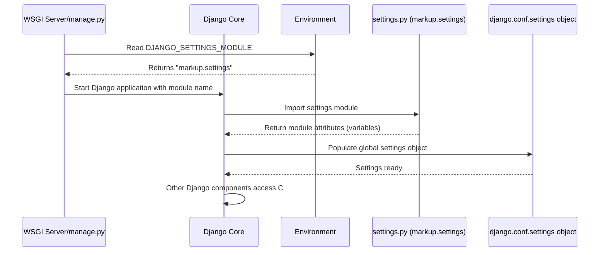

# Chapter 3: Configuration Settings

In the [Django Project Structure](chapter_02.md) chapter, we explored the foundational organization of our `markup` project, identifying key directories and files. Among these crucial components, one file stands out as the central control panel for our entire application: `settings.py`. This chapter delves into how `settings.py` defines the very behavior and operational parameters of our Django project.

---

### Problem & Motivation

Imagine building a dynamic web application like `markup` without a centralized way to define its operational parameters. How would you specify which database to use, what external services your application depends on, or how to secure sensitive information? Without a structured configuration system, such details would be scattered throughout your codebase, leading to a rigid, insecure, and incredibly difficult-to-maintain application. Every minor change, from switching a database to adding a new feature, would require deep modifications across multiple files, increasing the risk of errors.

For our `markup` project, this problem is paramount. We need `markup` to store user-created content and user authentication details reliably. This means connecting to a database. We also want `markup` to evolve, perhaps by adding a new `comments` feature later, or integrating with external APIs. All these aspects require careful, centralized configuration. The `settings.py` file solves this by providing a single, authoritative source of truth for all project-wide variables.

Consider a practical use case: `markup` is initially developed using a simple SQLite database. When deployed to a live server, it needs to switch to a more robust PostgreSQL database. Furthermore, as `markup` grows, we might want to enable a new `blog` application. How do we achieve these changes without altering the core logic of our application? `settings.py` is the answer.

---

### Core Concept Explanation

At its heart, "Configuration Settings" in Django refers to the parameters defined within the `settings.py` file (or files) that govern the entire project's operation. Think of `settings.py` as the **master blueprint** or **control panel** for your `markup` application. Every decision about how your project behaves, from database connections to security keys, is specified here.

This file is essentially a Python module where global variables are defined. When Django starts up, it loads this module, making all its variables accessible throughout your application. These variables dictate:

*   **Database Connections**: How `markup` connects to its data storage.
*   **Installed Applications**: Which individual Django "apps" (like `django.contrib.admin`, `users`, or `blog`) are active within the project.
*   **Security**: Critical elements like `SECRET_KEY` for cryptographic signing, `DEBUG` mode, and `ALLOWED_HOSTS` for controlling what domains can serve your site.
*   **Static and Media Files**: How assets like CSS, JavaScript, images, and user-uploaded files are managed.
*   **Internationalization**: Language, time zones, and formatting.

By centralizing these settings, Django provides a powerful mechanism for customizing and adapting your project to different environments (development, testing, production) without modifying the application's core logic. This separation of concerns makes `markup` flexible, scalable, and maintainable.

---

### Practical Usage Examples

Let's apply our motivating use case: switching databases and enabling a new application for `markup`.

#### 1. Locating `settings.py`

When you create a Django project, a `settings.py` file is generated inside your project's main configuration directory. For `markup`, this would typically be `markup/markup/settings.py`.

```
markup/
├── manage.py
└── markup/
    ├── __init__.py
    ├── settings.py  <-- This is our focus!
    ├── urls.py
    └── wsgi.py
```

#### 2. Enabling a New Application

Suppose we develop a new application within `markup` called `blog`. To make Django aware of this app and include its models, views, and templates in our project, we simply add it to the `INSTALLED_APPS` list in `settings.py`.

```python
# markup/markup/settings.py

INSTALLED_APPS = [
    'django.contrib.admin',
    'django.contrib.auth',
    'django.contrib.contenttypes',
    'django.contrib.sessions',
    'django.contrib.messages',
    'django.contrib.staticfiles',
    'blog',  # <-- Our new blog application
    # 'users', # Another custom app example
]
```
**Explanation:** By adding `'blog'` to `INSTALLED_APPS`, we instruct Django to load this application's configurations and components. This is a crucial step for Django to recognize and integrate your custom apps into the overall project.

#### 3. Configuring Databases (Switching from Dev to Production)

Initially, `markup` uses SQLite, which is great for development as it requires no extra setup.

```python
# markup/markup/settings.py

DATABASES = {
    'default': {
        'ENGINE': 'django.db.backends.sqlite3',
        'NAME': BASE_DIR / 'db.sqlite3',
    }
}
```
**Explanation:** This snippet defines a `default` database connection. `ENGINE` specifies the database type (SQLite in this case), and `NAME` points to the SQLite database file located in your project's base directory. This is standard for a quick development setup.

For production, we might want to use PostgreSQL. Instead of changing any application code, we update `DATABASES` in `settings.py`.

```python
# markup/markup/settings.py - Example for PostgreSQL in production

DATABASES = {
    'default': {
        'ENGINE': 'django.db.backends.postgresql',
        'NAME': 'markup_db',
        'USER': 'markup_user',
        'PASSWORD': 'your_db_password',
        'HOST': 'localhost', # Or your DB server IP/hostname
        'PORT': '',          # Default PostgreSQL port (5432)
    }
}
```
**Explanation:** Here, we've changed the `ENGINE` to `postgresql` and provided specific credentials and connection details. This demonstrates how easily you can swap database backends purely by modifying settings, without touching your `Views` or `Models`. In a real-world scenario, you'd typically load sensitive data like passwords from environment variables, which we'll cover in best practices.

#### 4. Managing Security and Debug Mode

Two critical settings are `SECRET_KEY` and `DEBUG`.

```python
# markup/markup/settings.py

SECRET_KEY = 'django-insecure-m#h9%c!1*@j6p+w-w9x5&^p$p*j_r@!w=x^k=y#^d6z-n6e_' # CHANGE THIS!

DEBUG = True # Set to False in production!

ALLOWED_HOSTS = [] # Add your domain names here in production
```
**Explanation:**
- `SECRET_KEY` is a crucial security setting used for cryptographic signing. It *must* be kept secret and unique for each project.
- `DEBUG = True` enables detailed error pages and development-friendly features. It *must* be set to `False` in production for security and performance reasons.
- `ALLOWED_HOSTS` specifies the hostnames that your Django site can serve. When `DEBUG` is `False`, Django will only allow requests with `Host` headers matching these values. In development, an empty list or `['*']` (with `DEBUG=True`) is common.

---

### Internal Implementation Walkthrough

How does Django actually *use* `settings.py`? The process involves an environment variable and Django's internal configuration loader.

1.  **`DJANGO_SETTINGS_MODULE` Environment Variable**: When Django starts, it needs to know *which* `settings.py` file to load. This is primarily determined by the `DJANGO_SETTINGS_MODULE` environment variable. For our `markup` project, this is usually set to `'markup.settings'`. This variable tells Django, "Look in the `markup` Python package for a module named `settings`."

    ```bash
    # Example of setting the environment variable (usually done by wsgi.py)
    export DJANGO_SETTINGS_MODULE="markup.settings"
    ```

2.  **`django.conf` and the `settings` Object**: Django's `django.conf` module provides the mechanism to access settings. When the server starts (e.g., via `manage.py runserver` or a WSGI server), Django performs the following steps:
    *   It reads the `DJANGO_SETTINGS_MODULE` variable.
    *   It imports the specified Python module (`markup.settings`).
    *   It populates a special object, `django.conf.settings`, with all the uppercase variables defined in that module.

3.  **Accessing Settings**: Once loaded, any part of your Django application can access these configurations by importing `settings` from `django.conf`.

    ```python
    # Example in a view or any other Django component
    from django.conf import settings

    if settings.DEBUG:
        print("Running in debug mode!")
    else:
        print(f"Site allowed hosts: {settings.ALLOWED_HOSTS}")
    ```

Here's a simplified sequence diagram of how Django loads and uses `settings.py`:


**Explanation:** The `WSGI Server` or `manage.py` script acts as the entry point. It first consults the environment for `DJANGO_SETTINGS_MODULE`, then instructs Django's core to load the specified `settings.py` file. All the uppercase variables from `settings.py` are then stored in the `django.conf.settings` object, making them globally accessible to the entire Django application.

---

### System Integration

Configuration settings are fundamental and integrate deeply with almost every other abstraction in a Django project:

*   **[Django Project Structure](chapter_02.md)**: `settings.py` is an integral part of the project structure, defining the project's parameters. Without it, the project wouldn't know how to run.
*   **[URL Dispatcher](chapter_04.md)**: The `ROOT_URLCONF` setting in `settings.py` tells Django where to find the main URL configuration file (`urls.py`). This links configuration directly to how incoming requests are routed.
*   **[Views (Request Handlers)](chapter_05.md)**: Views often need to access settings, for example, to check `settings.DEBUG` for conditional logic or to retrieve custom configuration values.
*   **[WSGI Server Interface](chapter_06.md)**: The WSGI server's `wsgi.py` file is typically where `DJANGO_SETTINGS_MODULE` is explicitly set, enabling Django to load the correct settings before handling any web requests.
*   **HTTP Request and Response**: While not directly interacting, `settings.py` influences how HTTP requests are processed (e.g., middleware defined in `MIDDLEWARE`) and how responses are generated (e.g., template loaders, static file serving).

Essentially, `settings.py` acts as the project's brain, influencing the behavior of all other components by providing their operational parameters.

---

### Best Practices & Tips

1.  **Keep `SECRET_KEY` truly secret**: Never commit your production `SECRET_KEY` directly into your version control system. Use environment variables (e.g., `os.environ.get('SECRET_KEY')`) or external configuration management tools.
    ```python
    # settings.py
    import os

    SECRET_KEY = os.environ.get('SECRET_KEY', 'a-very-insecure-default-key-for-dev-only')
    ```
2.  **`DEBUG = False` in Production**: Always set `DEBUG = False` for live deployments. `DEBUG = True` exposes sensitive information and significantly impacts performance. When `DEBUG` is `False`, make sure `ALLOWED_HOSTS` is correctly configured.
3.  **Use Environment Variables for Sensitive Data**: Database credentials, API keys, and other sensitive information should not be hardcoded in `settings.py`. Load them from environment variables.
    ```python
    # settings.py
    import os

    DATABASES = {
        'default': {
            'ENGINE': 'django.db.backends.postgresql',
            'NAME': os.environ.get('DB_NAME', 'markup_db'),
            'USER': os.environ.get('DB_USER', 'dev_user'),
            'PASSWORD': os.environ.get('DB_PASSWORD', ''),
            'HOST': os.environ.get('DB_HOST', 'localhost'),
            'PORT': os.environ.get('DB_PORT', '5432'),
        }
    }
    ```
4.  **Separate Settings for Different Environments**: For larger projects, it's common to have separate `settings_dev.py`, `settings_prod.py`, etc., and then conditionally load them or merge them. A common pattern is to have a base `settings.py` and then import environment-specific overrides.
    ```python
    # markup/markup/settings.py (Base settings)
    # ... common settings here ...
    # from .local_settings import * # Import local dev settings if they exist
    ```
5.  **Avoid Hardcoding Paths**: Always use `os.path.join` or `pathlib.Path` for constructing file paths to ensure cross-platform compatibility. Django's project template already uses `BASE_DIR` for this purpose.
6.  **Progressive Complexity**: Start with simple settings as generated by Django. As your project grows, introduce more advanced configuration patterns like environment variables and separated settings files.

---

### Chapter Conclusion

This chapter has illuminated the critical role of "Configuration Settings" within our `markup` Django project. We've seen how `settings.py` acts as the central brain, dictating everything from database connections to security protocols and the activation of various applications. By understanding and effectively utilizing this file, we gain immense control over our project's behavior across different environments, making it adaptable, secure, and maintainable. We explored practical examples, walked through Django's internal loading process, and discussed essential best practices for managing configurations safely and efficiently.

With our project's fundamental settings now understood, the next logical step is to explore how `markup` handles incoming web requests and directs them to the appropriate parts of our application. This process is orchestrated by Django's URL Dispatcher, which we will uncover in the next chapter.

[URL Dispatcher](chapter_04.md)