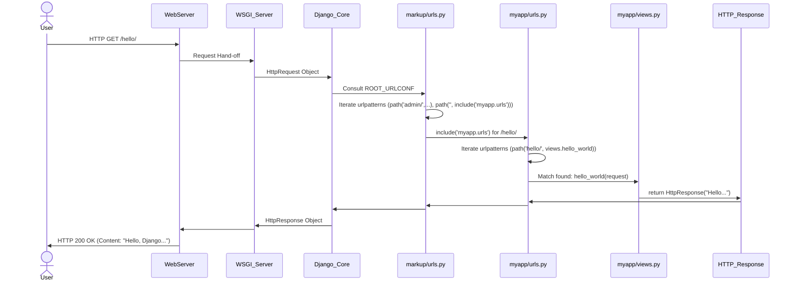

# Chapter 4: URL Dispatcher

In the previous chapter, we established how the `markup` project's fundamental parameters and global configurations are managed through [Configuration Settings](chapter_03.md). These settings lay the groundwork for our application, dictating everything from database connections to security keys. However, defining *what* our project is capable of doing is only one part of the equation. The next crucial step is to determine *how* our web application responds to specific requests from users.

---

### Problem & Motivation

Imagine a sprawling city with countless buildings, each offering a different service: a library, a post office, a café, a government building. When you want to visit a specific place, you rely on a clear address and a system of roads to get there. Without this system, you'd wander aimlessly, unable to find the service you need.

In the world of web applications, the problem is identical. A user types a URL like `http://localhost:8000/products/` or `http://localhost:8000/about/` into their browser. Without a "road map" or a "postal service" within our Django project, how would the application know which specific piece of code (which "building") should handle the request for `/products/` versus `/about/`? It would be impossible to organize functionality, leading to a tangled mess where every request tries to execute the same default code, or worse, fails entirely.

This is precisely the problem the URL Dispatcher solves. It provides a structured, hierarchical system to map incoming web addresses (URLs) to the correct functions or classes (known as "views") that are designed to handle those requests. In our `markup` project, the URL Dispatcher is critical because it's the very first point of contact for any user interaction. It ensures that when a user requests a specific page or action, their request is efficiently and accurately directed to the relevant logic within our application.

For instance, let's consider a simple use case: a user wants to see a basic "Hello World" message. They navigate to `http://localhost:8000/hello/`. The URL Dispatcher's job is to intercept this request, recognize the `/hello/` part of the URL, and then point it to a specific Python function that knows how to generate and return that "Hello World" message. Without it, our web application would be deaf to specific user needs.

---

### Core Concept Explanation

At its heart, the URL Dispatcher acts like the central traffic controller for your Django application. When an HTTP request arrives, it extracts the path part of the URL (e.g., `/hello/` from `http://localhost:8000/hello/`) and then consults a predefined list of URL patterns. Each pattern is like a specific road sign that says, "If the URL looks like *this*, then send the request to *that* specific function or class."

Think of it as a comprehensive street directory for your web application. Django looks up the incoming URL in this directory. The directory is typically stored in `urls.py` files. When a match is found, the dispatcher invokes the associated "view" (a Python function or class) and passes the incoming `HttpRequest` object to it. The view then processes the request and returns an `HttpResponse`.

The core mechanism revolves around `urlpatterns`, which is a Python list of `path()` or `re_path()` objects.
*   `path()` is used for simple string-based URL matching.
*   `re_path()` (short for regular expression path) allows for more complex, pattern-based matching using regular expressions.
*   `include()` is a powerful function that allows us to delegate URL matching to other `urls.py` files, typically found within individual Django applications. This is crucial for maintaining a modular and organized project structure, as it prevents the main project `urls.py` from becoming overly large and complex.

The URL Dispatcher operates on a "first match wins" principle. Django iterates through the `urlpatterns` in the order they are defined. As soon as a pattern matches the incoming URL, Django stops searching and dispatches the request to the corresponding view. If no pattern matches, Django will return an HTTP 404 Not Found error. This ordered matching underscores the importance of defining your patterns carefully, with more specific patterns typically appearing before more general ones.

---

### Practical Usage Examples

Let's walk through our "Hello World" use case to demonstrate how to set up the URL Dispatcher in the `markup` project.

First, we need a Django application to house our view. If you haven't already, create a basic app (e.g., named `myapp`) and add it to `INSTALLED_APPS` in your project's `settings.py`.

```bash
python manage.py startapp myapp
```

Then, in `markup/settings.py`:

```python
# markup/settings.py (excerpt)

INSTALLED_APPS = [
    # ... other apps
    'myapp', # Add your new app here
]
```

#### Step 1: Define a Simple View

Our "Hello World" view will be a simple Python function that takes an `HttpRequest` object and returns an `HttpResponse` containing our message.

```python
# myapp/views.py

from django.http import HttpResponse

def hello_world(request):
    """
    A simple view that returns a 'Hello, Django!' message.
    """
    return HttpResponse("Hello, Django from URL Dispatcher!")
```
*Explanation: This code defines a Python function `hello_world` that will serve as our request handler. It imports `HttpResponse` to send plain text back to the user.*

#### Step 2: Define URL Patterns within the Application

Now, we create an `urls.py` file inside our `myapp` directory. This file will contain the URL patterns specific to our `myapp`.

```python
# myapp/urls.py

from django.urls import path
from . import views # Import views from the current directory

urlpatterns = [
    path('hello/', views.hello_world, name='hello-world'),
]
```
*Explanation: We import `path` from `django.urls` and our `views` module. `urlpatterns` is a list where we define our URL mappings. `path('hello/', views.hello_world, name='hello-world')` maps the URL `/hello/` to our `hello_world` view function and gives it a programmatic name 'hello-world'.*

#### Step 3: Include the Application's URLs in the Project's URL Configuration

Finally, we need to tell the main `markup` project's URL Dispatcher to look into `myapp/urls.py` for additional patterns. We do this in the project's `urls.py` file.

```python
# markup/urls.py

from django.contrib import admin
from django.urls import path, include

urlpatterns = [
    path('admin/', admin.site.urls),
    # Include the URLs from our 'myapp' application
    path('', include('myapp.urls')),
]
```
*Explanation: Here, `include('myapp.urls')` tells Django that for any URL not matched by `/admin/`, it should look for further URL patterns within the `myapp.urls` module. The empty string `path('')` means that `myapp`'s URLs will be served directly from the root of our project, effectively making `/hello/` accessible.*

Now, if you start your Django development server (`python manage.py runserver`) and navigate to `http://localhost:8000/hello/`, you should see the "Hello, Django from URL Dispatcher!" message displayed in your browser. This demonstrates the URL Dispatcher successfully routing an incoming request to the correct view.

---

### Internal Implementation Walkthrough

When an HTTP request hits our Django application, a series of steps involving the URL Dispatcher takes place:

1.  **Request Reception**: The `WSGI Server Interface` receives the incoming `HttpRequest` from the web server.
2.  **Initial Dispatch**: The WSGI handler within Django passes this `HttpRequest` object to Django's core machinery.
3.  **Root URL Configuration Lookup**: Django consults the `ROOT_URLCONF` setting in `markup/settings.py`. This setting (typically `'markup.urls'`) tells Django where to find the project's primary URL patterns.
4.  **`URLResolver` Instantiation**: Django creates an instance of `URLResolver` based on the specified `ROOT_URLCONF`. This resolver is responsible for matching URLs.
5.  **Pattern Iteration**: The `URLResolver` iterates through the `urlpatterns` list defined in `markup/urls.py` (or whatever module `ROOT_URLCONF` points to).
    *   For each `path()` or `re_path()` entry, Django attempts to match the incoming URL against the defined pattern.
    *   If a `path('admin/', admin.site.urls)` is encountered, and the incoming URL starts with `admin/`, Django delegates the matching process to the `admin.site.urls` module.
    *   If a `path('', include('myapp.urls'))` is encountered:
        *   Django first checks if the prefix (in this case, an empty string, meaning any URL) matches.
        *   If it matches, Django effectively "slices off" that prefix from the incoming URL and then loads the `myapp/urls.py` module.
        *   It then iterates through `myapp`'s `urlpatterns` with the remaining part of the URL (e.g., `/hello/`).
6.  **Match Found**: When `myapp/urls.py` defines `path('hello/', views.hello_world, ...)`, and the incoming URL (after prefix removal) is `hello/`, a match is made.
7.  **View Invocation**: The `URLResolver` determines the corresponding `views.hello_world` function. It then calls this function, passing the `HttpRequest` object (which might have additional data like URL arguments) to it.
8.  **Response Generation**: The `hello_world` view executes its logic and returns an `HttpResponse` object.
9.  **Response Back to Client**: This `HttpResponse` object travels back through the Django framework, the WSGI server, and finally to the client's web browser.

Here's a simplified sequence diagram illustrating the internal flow for our `/hello/` request:



The diagram visually represents how the request is funneled from the user, through various layers, until it reaches the specific view intended to handle it, and then the response makes its way back.

---

### System Integration

The URL Dispatcher doesn't operate in a vacuum; it is a central piece that tightly integrates with several other core Django abstractions within the `markup` project:

*   **[Configuration Settings](chapter_03.md)**: The dispatcher's entry point is dictated by the `ROOT_URLCONF` setting in `settings.py`. This setting explicitly tells Django which `urls.py` file serves as the project's primary URL configuration, making it the first lookup point for all incoming requests. Without `ROOT_URLCONF`, Django wouldn't know where to begin dispatching.

*   **[Views (Request Handlers)](chapter_05.md)**: This is the destination for the URL Dispatcher. The dispatcher's sole purpose is to identify the correct view function or class that should process an `HttpRequest`. It acts as the bridge between a web address and the Python code designed to handle the logic for that address. The dispatcher effectively calls the view with the `HttpRequest` object.

*   **[HTTP Request and Response](chapter_01.md)**: The URL Dispatcher receives an `HttpRequest` object from the lower layers (like the WSGI server) and passes it directly to the matched view. After the view processes the request, it returns an `HttpResponse` object, which then travels back through the Django system to the client. The dispatcher facilitates this entire cycle by ensuring the correct view receives the request and its response is properly handled.

*   **Django Project Structure**: The `include()` function, commonly used in URL dispatching, is fundamental to Django's modular project structure. By allowing app-specific `urls.py` files, it enables a clear separation of concerns, making the `markup` project more organized and scalable. For example, `path('blog/', include('blog.urls'))` clearly defines that all URLs starting with `/blog/` belong to the `blog` application.

The data flow can be summarized as:
`Incoming HTTP Request` -> `WSGI Server Interface` -> `Django Framework` -> `ROOT_URLCONF` (from `Configuration Settings`) -> `URL Dispatcher` (matching `urlpatterns`) -> `Calls appropriate View` (passing `HttpRequest`) -> `View returns HttpResponse` -> `HttpResponse` travels back to client.

---

### Best Practices & Tips

To leverage the URL Dispatcher effectively in your `markup` project and maintain a clean, scalable codebase, consider these best practices:

*   **Use `include()` for App-Specific URLs**: Always define URL patterns for individual applications (like `myapp`) in their own `urls.py` files. Then, `include` these files in your project's main `urls.py`. This promotes modularity, keeps your project-level URL configuration clean, and makes apps reusable.
    ```python
    # markup/urls.py (good practice)
    from django.urls import path, include

    urlpatterns = [
        path('admin/', admin.site.urls),
        path('my-app/', include('myapp.urls')), # App-specific prefix
    ]
    ```
    This way, `myapp`'s `/hello/` becomes `/my-app/hello/`.

*   **Always Use Named URLs (`name` argument)**: Provide a `name` argument to your `path()` (and `re_path()`) entries. This allows you to refer to URLs programmatically using Django's `` template tag or `reverse()` function in Python code. This decouples your code from hardcoded URL paths, making your application more flexible and resilient to URL changes.
    ```python
    # myapp/urls.py
    from django.urls import path
    from . import views

    urlpatterns = [
        path('hello/', views.hello_world, name='hello-world'), # Using 'name'
    ]
    ```
    In a template: `<a>Go Home</a>`

*   **Order Matters**: Django processes `urlpatterns` from top to bottom. The first pattern that matches the incoming URL wins. Therefore, place more specific URL patterns *before* more general ones to avoid accidental matches.
    ```python
    # myapp/urls.py (Example of order importance)
    urlpatterns = [
        path('articles/2023/', views.article_2023), # Specific
        path('articles/<int:year>/', views.year_archive), # General, should come after specific
    ]
    ```

*   **Keep `urls.py` Focused**: The `urls.py` files should solely be responsible for URL dispatching. Avoid adding business logic, complex data processing, or heavy computations directly within these files. Delegate such tasks to your views.

*   **Use Path Converters for Simplicity**: For common patterns like integers, strings, or UUIDs, Django's path converters (`<int:year>`, `<str:slug>`, `<uuid:id>`) are highly recommended over regular expressions. They make your URL patterns more readable and concise. Only resort to `re_path()` when path converters aren't sufficient.
    ```python
    # myapp/urls.py
    from django.urls import path
    from . import views

    urlpatterns = [
        path('articles/<int:year>/', views.year_archive), # Using int converter
        path('users/<str:username>/', views.user_profile), # Using str converter
    ]
    ```

*   **Performance Considerations**: While `urlpatterns` lists are typically small enough that the "first match wins" linear scan doesn't cause performance issues, very large and deeply nested `urlpatterns` could slightly impact performance. Keep your URL configurations reasonably flat and well-structured, primarily through `include()`, to minimize lookup times.

---

### Chapter Conclusion

The URL Dispatcher is the navigational heart of your `markup` project. It provides the essential mechanism for mapping user-friendly web addresses to the specific application logic designed to handle them. We've seen how it brings order to requests, solves the problem of directing traffic to the correct `Views`, and integrates seamlessly with `Configuration Settings` and `HTTP Request and Response` objects. By understanding its core concepts, implementing it correctly with `path()` and `include()`, and adhering to best practices like named URLs and modularity, you ensure your Django application is robust, maintainable, and scalable.

With our requests now being successfully routed, the next logical step is to delve into the components that actually *process* these requests and generate content. In the next chapter, we will explore [Views (Request Handlers)](chapter_05.md), understanding how they receive the `HttpRequest` object, interact with your application's logic, and construct the `HttpResponse` that users ultimately see.