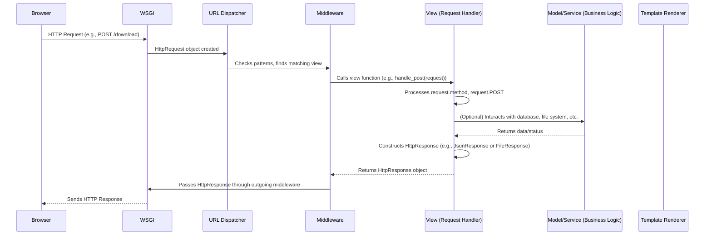

# Chapter 5: Views (Request Handlers)

Welcome back! In the previous chapter, [URL Dispatcher](chapter_04.md), we explored how Django intelligently maps incoming web addresses to specific parts of our application. This routing mechanism is crucial, as it ensures that when a user requests a particular resource, their request lands in the correct "inbox." Now, we turn our attention to what happens once a request arrives at its destination: the **Views**.

---

### Problem & Motivation

Imagine a sophisticated post office where letters (HTTP Requests) are sorted and directed to the right departments (views). What happens when a letter finally reaches its department? Someone has to open it, read its contents, decide what action to take (e.g., retrieve information from a database, perform a calculation), and then write a response letter (HTTP Response) to send back.

In the context of our "markup" project, the URL Dispatcher guides a user's request, for instance, a request to download a specific file, to a designated handler. The problem is, simply routing the request isn't enough. We need a component that can:
1.  Understand the user's intent (e.g., what file do they want?).
2.  Execute the necessary business logic (e.g., find the file, check permissions).
3.  Construct an appropriate response (e.g., send the file, or an error message).
This is precisely the role of **Views**. Without them, our application would be a roadmap without destinations, unable to fulfill any dynamic content requests or process user interactions.

---

### Core Concept Explanation

In Django, a **View** (often called a "request handler") is a Python function or class that takes an `HttpRequest` object as its primary argument and is responsible for returning an `HttpResponse` object. It's the central component where your application's business logic for a specific URL endpoint resides. Think of a view as the application's "brain" for a particular request – it processes the input and decides the output.

Views are the bridge between the raw web request and the dynamic content your application generates. They encapsulate everything from fetching data from a database, validating user input, performing calculations, to rendering templates with dynamic data. When the [URL Dispatcher](chapter_04.md) finds a match for an incoming URL pattern, it invokes the associated view.

The `HttpRequest` object provides all the details about the incoming request, such as the HTTP method (`GET`, `POST`), headers, user data, and query parameters. The `HttpResponse` object is what your view sends back to the user's browser, which could be anything from an HTML page, a JSON response, a redirect, or even a file download. This clear separation ensures that the core logic of handling a request is centralized and easily manageable.

---

### Practical Usage Examples

Let's look at a practical example of a view, specifically one that might handle a `POST` request to allow a user to download a file from our "markup" project. We'll use the provided `handle_post` function.

First, a minimal view simply acknowledging a request:

```python
# my_django_project/my_django_project/views.py
from django.http import HttpResponse

def simple_view(request):
    """
    A very basic view that returns a simple text response.
    """
    return HttpResponse("Hello from simple_view!")
```
This `simple_view` function takes an `HttpRequest` object named `request` and immediately returns an `HttpResponse` containing the text "Hello from simple_view!". This demonstrates the fundamental contract of a view.

Now, let's dissect the `handle_post` view, which is more complex as it processes user input from a POST request:

```python
# my_django_project/my_django_project/views.py
from django.http import JsonResponse # Import for JSON responses
from pathlib import Path

def handle_post(request):
    """
    Handles POST requests to get a downloadable attachment.
    """
    if request.method == 'POST':
        # ... logic to process POST data ...
```
Here, `handle_post` first checks if the incoming request uses the `POST` method. This is a common pattern for views that handle specific types of HTTP interactions. If it's not a `POST`, the view typically returns an error or handles other methods.

Next, the view accesses data sent in the `POST` request and performs basic validation:

```python
        # ... inside handle_post function, after `if request.method == 'POST':`
        local_volume_path = Path("/root/my_django_project/files")
        subdir = request.POST.get('subdir') # Use .get() for safety
        filename = request.POST.get('filename')

        if not filename: # Simplified check for empty or None
            return JsonResponse({'error': 'filename is a required field.'}, status=400)
        # ... more code for file handling ...
```
In this snippet, `request.POST` is a dictionary-like object containing data submitted via a form. We retrieve `subdir` and `filename`. A critical step is validating `filename`: if it's missing or empty, we return a `JsonResponse` with an error message and a `400 Bad Request` status code, indicating client error.

Finally, if the method is invalid, the view returns an error:

```python
    # ... inside handle_post, after all POST-specific logic ...

    return JsonResponse({'error': 'Invalid method'}, status=405)
```
If the `request.method` was not `'POST'`, the initial `if` block is skipped, and the view falls through to this line, returning a `405 Method Not Allowed` error. This ensures the view only responds to its intended HTTP method.

---

### Internal Implementation Walkthrough

When a request reaches a Django view, a well-defined sequence of events unfolds. Let's trace this journey, building on our understanding of the [URL Dispatcher](chapter_04.md).

Here’s a simplified sequence of how a view is invoked and processed:



1.  **Request Arrival**: An incoming HTTP request from the `Browser` is received by the `WSGI Server Interface`.
2.  **`HttpRequest` Creation**: The WSGI server adapts the raw HTTP request into a Django-specific `HttpRequest` object. This object encapsulates all request details.
3.  **URL Dispatch**: The `HttpRequest` is passed to Django's `URL Dispatcher`. Based on the `urlpatterns` defined, the dispatcher identifies which view function (like `handle_post`) is responsible for handling this specific URL.
4.  **Middleware Processing (Incoming)**: Before the view is called, the `HttpRequest` object may pass through various middleware components (e.g., for authentication, session management) that can modify the request or even return a response directly.
5.  **View Invocation**: The `URL Dispatcher` finally calls the identified view function, passing the `HttpRequest` object as its first argument (e.g., `handle_post(request)`).
6.  **View Logic Execution**: Inside the view (e.g., `handle_post`), the application's core logic runs:
    *   It accesses properties of the `request` object (`request.method`, `request.POST`, `request.GET`, etc.).
    *   It performs operations like data validation, database queries, file system interactions, or calculations.
    *   For our `handle_post` example, it checks the method, extracts `subdir` and `filename`, and validates them.
7.  **`HttpResponse` Construction**: Based on the processing, the view constructs an `HttpResponse` object. This could be `HttpResponse` for simple text, `render()` for HTML templates, `JsonResponse` for API responses, or `FileResponse` for file downloads. In our example, it creates a `JsonResponse`.
8.  **Middleware Processing (Outgoing)**: The generated `HttpResponse` object then passes back through the middleware chain (in reverse order), allowing middleware to modify the response (e.g., add headers, compress content).
9.  **Response Sending**: Finally, the `HttpResponse` object is handed back to the `WSGI Server Interface`, which converts it into a raw HTTP response and sends it back to the `Browser`.

---

### System Integration

Views are incredibly central and connect with almost every other part of a Django project. Their role is to orchestrate interactions.

*   **Input from [URL Dispatcher](chapter_04.md)**: The dispatcher is the gateway to views. It determines *which* view gets executed for a given URL, passing the `HttpRequest` object. Without the URL Dispatcher, views would have no way of receiving requests.
*   **Core Interaction with [HTTP Request and Response](chapter_01.md)**: This is the fundamental contract. Views are designed to consume an `HttpRequest` object and produce an `HttpResponse` object. All internal processing is centered around transforming the former into the latter.
*   **Influence from [Configuration Settings](chapter_03.md)**: Views often rely on global settings defined in `settings.py` for things like API keys, database configurations, or debug modes. For instance, a view might dynamically enable a feature based on a setting.
*   **Business Logic Layer (Models/Services)**: While views contain logic, best practices suggest keeping them "thin." Complex operations like database queries, data manipulation, or external API calls are typically delegated to Django Models or dedicated service layers. Views act as coordinators.
*   **Output to [WSGI Server Interface](chapter_06.md)**: Once a view returns an `HttpResponse`, this object is ultimately passed to the WSGI server, which then formats and sends it back to the client over the network. Views complete the request-response cycle before it leaves Django's domain.

Data flow generally looks like this:
`URL Dispatcher -> Middleware -> View (HttpRequest received) -> (Optionally) Models/Services -> View (HttpResponse generated) -> Middleware -> WSGI Server Interface`

---

### Best Practices & Tips

To write effective and maintainable views in Django, consider these best practices:

*   **Keep Views Thin**: This is perhaps the most important rule. Views should primarily focus on orchestrating the request and response. Delegate complex business logic, database interactions, and heavy calculations to Django Models or separate service modules. This improves testability, reusability, and readability.
*   **Handle Different HTTP Methods**: Design your views to explicitly handle `GET`, `POST`, `PUT`, `DELETE` requests. Use `if request.method == 'POST':` as shown in `handle_post`, or consider using Django's class-based views for cleaner separation of method handlers.
*   **Input Validation**: Always validate user input. Never trust data coming from the client. Django forms and serializers are excellent tools for robust validation. Our `handle_post` example includes a basic `if not filename:` check.
*   **Error Handling**: Implement clear error handling. Catch exceptions gracefully and return appropriate HTTP status codes (e.g., 400 Bad Request, 404 Not Found, 500 Internal Server Error) along with informative messages.
*   **Security**: Be mindful of common web vulnerabilities.
    *   **CSRF Protection**: Django automatically handles Cross-Site Request Forgery for POST forms rendered by Django templates.
    *   **SQL Injection**: Using Django's ORM (Object-Relational Mapper) prevents SQL injection.
    *   **XSS (Cross-Site Scripting)**: Django's template engine escapes HTML output by default.
*   **Use Class-Based Views (CBVs)**: For more complex or reusable view logic, Django's Class-Based Views (e.g., `DetailView`, `ListView`, `FormView`) offer a structured way to handle common patterns, promote code reuse, and simplify code. While our example `handle_post` is a function-based view, CBVs are often preferred in larger projects.

---

### Chapter Conclusion

Views are the dynamic heart of any Django application, transforming incoming requests into meaningful responses. We've seen how they act as the primary handlers for web requests, executing business logic, and constructing the `HttpResponse` that defines what the user sees. From parsing `POST` data to validating inputs and delivering JSON results, views are where your application's interactivity comes to life. Understanding their role and how they integrate with the [URL Dispatcher](chapter_04.md) and [HTTP Request and Response](chapter_01.md) objects is fundamental to building robust web applications.

As we move forward, the `HttpResponse` objects generated by our views eventually leave Django's internal processing. In the next chapter, we will explore the [WSGI Server Interface](chapter_06.md), which is responsible for mediating between Django and the actual web server that delivers our application to the world.