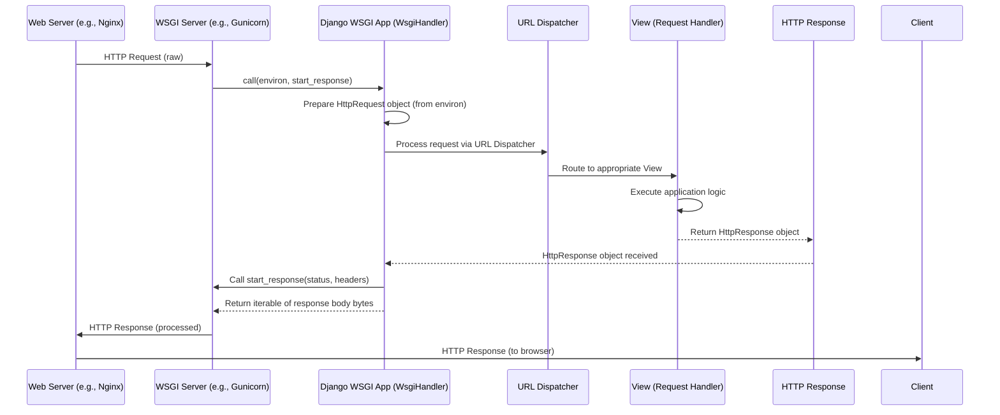

# Chapter 6: WSGI Server Interface

In the previous chapter, we explored [Views (Request Handlers)](chapter_05.md) and understood how they process incoming web requests, perform application logic, and ultimately generate an `HttpResponse` object. Views are the brain of our `markup` project's request handling, but how does the raw HTTP request from a web server reach these views, and how is the `HttpResponse` sent back to the client's browser? This is precisely where the **WSGI Server Interface** plays its critical role, acting as the indispensable bridge between web servers and our Python web application.

---

### Problem & Motivation

Imagine a web server like Nginx or Apache. Its primary job is to listen for incoming HTTP requests on a specific port, say 80 or 443. These servers are highly optimized for serving static files and acting as reverse proxies, but they don't inherently "speak" Python. On the other hand, our Django `markup` project is a Python application, expertly crafted to handle requests, interact with databases, and render dynamic content. A significant challenge arises: how can these two disparate systems – a web server built for raw HTTP and a Python application – communicate efficiently and reliably?

Without a standardized interface, every web server would need a custom way to interact with every Python web framework. This would lead to a chaotic and unmaintainable ecosystem, hindering innovation and deployment. For our `markup` project, this problem manifests when a user navigates to `www.example.com/posts/` in their browser. The web server receives this request, but it needs a clear, universal protocol to hand it off to our Django application, wait for its processing, and then retrieve the generated web page to send back to the user.

The **WSGI Server Interface** solves this exact problem. It provides a consistent, language-agnostic way for web servers to communicate with Python web applications. For our `markup` project, WSGI is the crucial piece that allows our meticulously crafted [Views (Request Handlers)](chapter_05.md) to receive `HttpRequest` objects from the web server and ensures their `HttpResponse` objects are correctly delivered back to the client, forming the complete request-response cycle.

---

### Core Concept Explanation

**WSGI** stands for **Web Server Gateway Interface**. It is not a server, nor is it an application framework; rather, it's a *specification* — a set of rules and conventions that define a standard interface for communication between web servers and Python web applications. Think of it as a universal translator or a contract that both sides agree upon to speak the same language.

At its heart, the WSGI specification defines a simple callable object that takes two arguments:
1.  `environ`: A dictionary containing all the HTTP request variables, such as `REQUEST_METHOD`, `PATH_INFO`, `HTTP_USER_AGENT`, and `QUERY_STRING`. This is how the WSGI server passes the raw request details to the application.
2.  `start_response`: A callable provided by the WSGI server, which the application uses to send HTTP status codes and response headers back to the server.

The application callable then returns an iterable (like a list) of bytes, which constitutes the HTTP response body. This elegant simplicity ensures that any WSGI-compliant web server can talk to any WSGI-compliant Python web application, regardless of the underlying frameworks or technologies. For our `markup` project, Django provides a built-in WSGI application callable that adheres to this specification, allowing it to seamlessly integrate with various WSGI servers like Gunicorn, uWSGI, or even Django's own development server.

---

### Practical Usage Examples

For most Django projects, the WSGI interface is configured automatically. When you create a new Django project, it includes a `wsgi.py` file. This file contains the actual WSGI application callable that a WSGI server will interact with.

Let's look at a typical `wsgi.py` file generated for our `markup` project:

```python
# markup/markup/wsgi.py
import os

from django.core.wsgi import get_wsgi_application

# Points Django to the correct settings module
os.environ.setdefault('DJANGO_SETTINGS_MODULE', 'markup.settings')

# This is the actual WSGI application callable
application = get_wsgi_application()
```
This `wsgi.py` file is located inside your main project directory (e.g., `markup/markup/`).
-   `os.environ.setdefault(...)`: This line tells Django where to find your project's [Configuration Settings](chapter_03.md). It ensures that when the WSGI server loads your application, Django knows which settings to use.
-   `application = get_wsgi_application()`: This is the critical line. `get_wsgi_application()` is a Django function that returns a WSGI-compliant callable object. This `application` object is what the WSGI server will directly call to handle requests.

When you run `python manage.py runserver`, Django uses a simple, built-in WSGI server for development purposes. For production, you would typically use a dedicated WSGI server like Gunicorn.

Here's how you might start Gunicorn to serve your `markup` project:

```bash
# In your project's root directory (where manage.py is)
pip install gunicorn
gunicorn markup.wsgi:application --bind 0.0.0.0:8000
```
-   `pip install gunicorn`: First, you install the Gunicorn WSGI server.
-   `gunicorn markup.wsgi:application`: This command tells Gunicorn to run. `markup.wsgi` refers to the `wsgi.py` file inside your `markup` project directory, and `:application` specifies that the callable object Gunicorn should use is named `application` within that file.
-   `--bind 0.0.0.0:8000`: This tells Gunicorn to listen for incoming requests on all available network interfaces (`0.0.0.0`) on port `8000`.

This command effectively launches your Django `markup` project as a WSGI application, ready to receive requests from a web server.

---

### Internal Implementation Walkthrough

While the `wsgi.py` file appears simple, the `get_wsgi_application()` function does a lot of work behind the scenes to prepare your Django project. It returns an instance of `django.core.handlers.wsgi.WsgiHandler`. This `WsgiHandler` is the actual WSGI callable object.

When a WSGI server (like Gunicorn) receives an HTTP request, it translates the raw HTTP details into the WSGI `environ` dictionary and provides a `start_response` callable. It then calls the `application` (our `WsgiHandler` instance) with these two arguments:

```python
# Simplified conceptual view of what a WSGI server does:
# response_body = application(environ, start_response)
```

Here's a simplified sequence of events within our `markup` project when the `WsgiHandler` callable is invoked:


1.  **Request Reception:** The web server (e.g., Nginx) receives an HTTP request and passes it to the WSGI server (e.g., Gunicorn).
2.  **WSGI Call:** The WSGI server calls Django's `application` (the `WsgiHandler`) with the `environ` dictionary (containing all request details) and the `start_response` callable.
3.  **Django's `WsgiHandler`:**
    *   It takes the `environ` dictionary and constructs a comprehensive Django `HttpRequest` object, as discussed in [HTTP Request and Response](chapter_01.md). This involves parsing headers, body, query parameters, etc.
    *   It then passes this `HttpRequest` object through the Django middleware stack (not shown for simplicity, but part of the [Django Project Structure](chapter_02.md)).
    *   The request is then handed to the [URL Dispatcher](chapter_04.md), which matches the URL path to the appropriate [Views (Request Handlers)](chapter_05.md).
    *   The chosen view executes its logic and returns a Django `HttpResponse` object.
    *   The `WsgiHandler` then uses the `start_response` callable provided by the WSGI server to send the HTTP status code and headers from the `HttpResponse` object.
    *   Finally, it returns an iterable of bytes representing the response body from the `HttpResponse`.
4.  **Response Back:** The WSGI server receives the status, headers, and body, constructs the full HTTP response, and passes it back to the web server, which then sends it to the client's browser.

This intricate dance ensures that the low-level HTTP communication is abstracted away, allowing Django views to focus purely on application logic.

---

### System Integration

The WSGI Server Interface is truly the central nervous system connecting our `markup` project to the outside world. It tightly integrates with several other core concepts:

*   **[HTTP Request and Response](chapter_01.md)**: WSGI is responsible for translating the raw, server-level `environ` dictionary into Django's structured `HttpRequest` object and converting Django's `HttpResponse` object back into a format the web server can understand (status, headers, body bytes). It's the primary mechanism through which these objects are exchanged.
*   **[Views (Request Handlers)](chapter_05.md)**: Views are the ultimate destination for requests processed by WSGI. The `WsgiHandler` ensures that the correct `HttpRequest` reaches the view and that the `HttpResponse` returned by the view is properly packaged and sent back. Without WSGI, views would have no way to receive requests or send responses.
*   **[URL Dispatcher](chapter_04.md)**: The WSGI layer hands off the processed `HttpRequest` to the URL Dispatcher. The dispatcher then uses the URL information to determine which specific view should handle the request, maintaining the application's routing logic.
*   **[Configuration Settings](chapter_03.md)**: The `wsgi.py` file explicitly sets `DJANGO_SETTINGS_MODULE` in the environment. This means that all the critical project configurations – database connections, installed apps, static file settings, security keys – are loaded and available to the entire Django application as soon as the WSGI server starts.

In a production environment, you often have a setup like this:

```mermaid
graph TD
    A[Client Browser] --> B(HTTP Request)
    B --> C[Web Server (e.g., Nginx / Apache)]
    C --> D(Proxy Pass / HTTP)
    D --> E[WSGI Server (e.g., Gunicorn)]
    E --> F[Django Project 'markup' (WSGI App)]
    F --> G[Django URL Dispatcher]
    G --> H[Django View]
    H --> I[Django ORM / Database]
    I --> H
    H --> J[Django HttpResponse]
    J --> F
    F --> E
    E --> D
    D --> C
    C --> K(HTTP Response)
    K --> A
```
This diagram illustrates the full flow: the web server acts as a reverse proxy, forwarding dynamic requests to the WSGI server, which then interacts with our Django application's WSGI interface.

---

### Best Practices & Tips

1.  **Use a Production-Ready WSGI Server:** Never use `python manage.py runserver` for production deployments. It's a single-threaded, simple server not designed for performance or security. Always opt for robust WSGI servers like Gunicorn or uWSGI, which offer features like multiple worker processes, threading, advanced configuration, and better error handling.

2.  **Configure WSGI Server for Performance:**
    *   **Workers:** Adjust the number of worker processes based on your CPU cores and memory. A common rule of thumb is `(2 * CPU_CORES) + 1`.
    *   **Threads:** If your application is I/O-bound (spends a lot of time waiting for database or external API calls), using threads *within* each worker can improve concurrency.
    *   **Timeouts:** Configure appropriate request timeouts to prevent long-running requests from hogging workers indefinitely.

3.  **Integrate with a Web Server (Reverse Proxy):** Always place a dedicated web server (like Nginx or Apache) in front of your WSGI server.
    *   It handles static files efficiently, freeing up your Python application.
    *   It can provide SSL termination, caching, load balancing, and stricter security.
    *   It acts as a buffer against slow client connections.

4.  **Manage Environment Variables:** Crucial [Configuration Settings](chapter_03.md) like `SECRET_KEY`, database credentials, and `DEBUG` status should *not* be hardcoded in `settings.py`. Instead, load them from environment variables within `settings.py`. Your WSGI server configuration (e.g., Gunicorn systemd service file) is the ideal place to set these environment variables before launching your Django application.

5.  **Logging:** Ensure your WSGI server and Django application have proper logging configured. This is vital for monitoring application health, debugging issues, and understanding traffic patterns.

---

### Chapter Conclusion

The **WSGI Server Interface** is the foundational standard that enables Python web applications, including our `markup` project, to communicate effectively with web servers. It abstracts away the complexities of low-level HTTP interaction, providing a consistent gateway for requests to flow into our application and responses to flow out.

From understanding how raw web requests are converted into Django's `HttpRequest` objects, processed by [Views (Request Handlers)](chapter_05.md) via the [URL Dispatcher](chapter_04.md), and ultimately returned as `HttpResponse` objects, WSGI is the glue that makes the entire system work. It ensures our Django project, with its carefully defined [Configuration Settings](chapter_03.md) and structured components, can be deployed and served reliably to users. By adhering to best practices for WSGI server configuration and deployment, we empower our `markup` project to be robust, performant, and scalable in a production environment. This concludes our journey through the core components of the `markup` Django project, revealing how each piece contributes to a cohesive and functional web application.