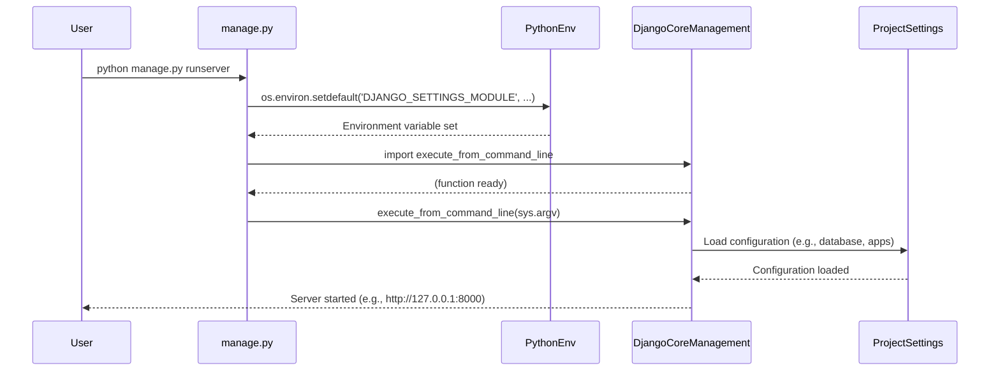

# Chapter 2: Project Management Script

Building on our understanding of [The Django Project](chapter_01.md) as the overarching container for our web application, we now turn our attention to the primary tool for interacting with it: the `manage.py` script. While the project defines the structure, `manage.py` provides the hands-on control to develop, test, and deploy our Django application effectively.

---

### Problem & Motivation

Imagine building a complex house without a single toolbox or instruction manual. You'd struggle with fundamental tasks like connecting utilities, laying foundations, or even just opening the front door. Similarly, a Django project, though well-structured, would be incredibly difficult to manage without a dedicated administrative utility. We'd have to manually handle running a development server, creating and updating database schemas, generating essential project components, and much more. This manual intervention would be error-prone, time-consuming, and inconsistent across development environments.

The `manage.py` script is Django's built-in solution to this very problem. It acts as our project's command-line interface, providing a unified and consistent way to perform all sorts of administrative tasks. For instance, a very common and immediate need during development is to see our web application in action. Without `manage.py`, setting up and running a local web server configured for Django would be a significant hurdle.

Our concrete use case for this chapter will be the foundational task of **starting the Django development server**, allowing us to view our application in a web browser. This single command, facilitated by `manage.py`, streamlines the entire development workflow.

---

### Core Concept Explanation

The `manage.py` script is a crucial command-line utility that comes with every Django project you create. Think of it as your project's personal assistant, capable of executing a wide array of administrative commands that simplify development and deployment. It acts as a thin wrapper around Django's `django.core.management` module, providing a convenient way to invoke its powerful features.

This script ensures that your commands are executed within the correct project context. When you run `manage.py`, it automatically sets up the necessary environment variables, most notably pointing to your project's `settings.py` file. This means every command executed through `manage.py` understands the specific configurations, installed applications, and database connections of your particular Django project.

Its importance cannot be overstated; from creating new apps and managing database migrations to testing code and collecting static files, `manage.py` is the central hub for nearly all project-level interactions. It allows developers to focus on building features rather than wrestling with environment setup or complex manual procedures.

---

### Practical Usage Examples

Let's dive into some practical uses of `manage.py` to address our motivating use case and demonstrate its versatility.

**1. Starting the Development Server**

The most common command you'll use is `runserver`. This starts Django's lightweight development web server, allowing you to view your project in a browser.

```bash
python manage.py runserver
```
*After running this command, you'll see output indicating the server is running, typically at `http://127.0.0.1:8000/`. You can open this URL in your web browser to see your Django application.*

**2. Creating a New Application**

Django projects are composed of reusable applications. `manage.py` makes it easy to scaffold a new application structure.

```bash
python manage.py startapp my_first_app
```
*This command creates a new directory named `my_first_app` within your project, pre-populated with basic files like `models.py`, `views.py`, `admin.py`, etc., ready for you to start building functionality.*

**3. Listing All Available Commands**

If you're unsure what commands are available, `manage.py` can list them for you.

```bash
python manage.py help
```
*This command outputs a comprehensive list of all Django's built-in management commands, along with any custom commands provided by your installed applications, giving you a quick reference.*

---

### Internal Implementation Walkthrough

The `manage.py` script itself is surprisingly concise. Its primary role is to set up the environment and then hand over control to Django's core management utilities. Let's examine the provided `main` function from a typical `manage.py` file:

```python
def main():
    # 1. Sets the default settings module for the current process
    os.environ.setdefault('DJANGO_SETTINGS_MODULE', 'my_django_project.settings')
    try:
        # 2. Imports Django's management utility
        from django.core.management import execute_from_command_line
    except ImportError as exc:
        # 3. Handles cases where Django isn't installed or accessible
        raise ImportError(
            "Couldn't import Django. Are you sure it's installed and "
            "available on your PYTHONPATH environment variable? Did you "
            "forget to activate a virtual environment?"
        ) from exc
    # 4. Executes the requested command
    execute_from_command_line(sys.argv)
```

1.  **`os.environ.setdefault('DJANGO_SETTINGS_MODULE', 'my_django_project.settings')`**: This is a critical step. It tells the Python environment *where* to find your project's main configuration file. `my_django_project.settings` refers to the `settings.py` file inside your root project directory. If this environment variable isn't set, Django wouldn't know which project's settings to use.
2.  **`from django.core.management import execute_from_command_line`**: This line attempts to import the core Django function responsible for parsing command-line arguments and dispatching them to the appropriate Django management command.
3.  **`except ImportError as exc:`**: This block gracefully handles situations where Django might not be installed or available in the current Python environment, guiding the user to common solutions like installing Django or activating a virtual environment.
4.  **`execute_from_command_line(sys.argv)`**: Finally, this is where the magic happens. `sys.argv` is a list of command-line arguments passed to the script (e.g., `['manage.py', 'runserver']`). This function takes these arguments, parses them, finds the corresponding Django command (like `runserver`), and executes it, effectively starting the development server in our example.

Here's a simplified sequence of how a command executed via `manage.py` flows:



---

### System Integration

The `manage.py` script serves as the primary gateway to your entire Django project. Its tight integration with other core components is evident:

*   **[Project Settings](chapter_03.md)**: `manage.py` is intrinsically linked to `settings.py` through the `DJANGO_SETTINGS_MODULE` environment variable. Every command executed through `manage.py` operates under the context defined by your project's settings, affecting things like database connections, installed applications, static file locations, and more. This means whether you're running migrations or starting the server, `manage.py` ensures the correct configuration is loaded.
*   **Applications (Apps)**: When you run commands like `startapp` or `makemigrations`, `manage.py` interacts directly with your project's installed applications. It understands which apps exist in your project based on `INSTALLED_APPS` in `settings.py` and performs operations specific to those apps, such as creating their directory structure or scanning their models for database changes.
*   **Database**: Commands like `makemigrations`, `migrate`, and `dbshell` rely on `manage.py` to connect to your project's configured database (as defined in `settings.py`) to manage schema changes and run database queries.

In essence, `manage.py` is the conductor of the Django orchestra, ensuring that each component plays its part harmoniously according to the master plan laid out in your project's settings.

---

### Best Practices & Tips

To maximize your efficiency and avoid common pitfalls when using `manage.py`, consider these best practices:

*   **Always Use a Virtual Environment**: Before running any `manage.py` command, ensure you've activated your project's virtual environment. This isolates your project's dependencies, preventing conflicts and ensuring consistent behavior.
    ```bash
    source venv/bin/activate
    # (venv) python manage.py runserver
    ```
*   **Explore `help`**: When in doubt, `python manage.py help <command_name>` provides detailed documentation for specific commands, including available options. For example, `python manage.py help runserver`.
*   **Avoid Direct Modification**: In most cases, you should not modify the `manage.py` file itself. Its purpose is to bootstrap Django's management system. If you need custom commands, Django provides mechanisms for creating them within your apps.
*   **Frequent Migrations**: Use `python manage.py makemigrations` and `python manage.py migrate` regularly as you change your database models. This keeps your database schema in sync with your code.
*   **Check for Issues Early**: The `python manage.py check` command can help you identify common problems in your project settings and installed apps without running the server, catching issues early.

---

### Chapter Conclusion

The `manage.py` script is far more than just a simple file; it is the command center for your Django project. We've seen how it solves the critical problem of project administration, providing a consistent and powerful interface for tasks ranging from running the development server to managing database changes. Understanding its core function and how it relies on the `DJANGO_SETTINGS_MODULE` is fundamental to effective Django development. By mastering `manage.py`, you gain essential control over your application's lifecycle and configuration.

As we move forward, our next step is to delve deeper into the project's brain: the settings. The `manage.py` script critically depends on these settings to function, so understanding them is the natural progression.

Continue to learn how your Django project is meticulously configured in the next chapter: [Project Settings](chapter_03.md).