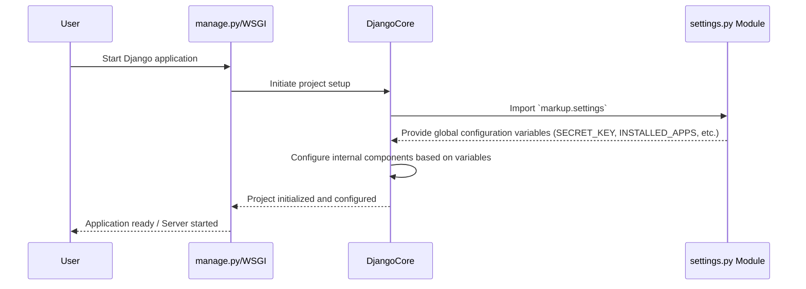

# Chapter 3: Project Settings

---

In the [previous chapter](chapter_02.md), we explored the [Project Management Script](chapter_02.md), `manage.py`, understanding its role as the primary command-line interface for interacting with our `markup` project. While `manage.py` handles *how* we interact with the project, it relies heavily on fundamental configurations that define *what* the project is and *how* it behaves. This brings us to the crucial `settings.py` file.

---

### Problem & Motivation

Imagine building a complex application like `markup` without a central control panel. How would your application know which database to connect to, what time zone to operate in, or which external libraries it's allowed to use? Without a unified configuration, every component would need to be manually configured, leading to scattered, redundant, and error-prone code. This scenario quickly becomes unmanageable, especially as projects grow.

For our `markup` project, this problem is paramount. We need a way to declare the core applications that make up `markup`, define our database connection, manage security keys, and specify how static files (like CSS or JavaScript for our web interface) are handled. `markup` also needs to determine if it's running in a development environment (where debugging information is helpful) or a production environment (where security and performance are critical).

The `settings.py` file is Django's elegant solution to this problem. It serves as the single source of truth for all project-wide configurations, centralizing every piece of information that defines `markup`'s operational environment and behavior. For instance, if `markup` needs to store user-generated content in a database, `settings.py` is where we define the database type (e.g., PostgreSQL, SQLite), its location, and access credentials, ensuring all parts of `markup` connect to the correct data store consistently.

---

### Core Concept Explanation

The `settings.py` file is a standard Python module that contains configuration variables for your Django project. Think of it as the project's blueprint or its master control panel. When Django starts up, it imports this module and uses the variables defined within it to configure itself. These variables cover a vast range of aspects, from security settings and installed applications to database connections and static file paths.

Key concepts within `settings.py` include:
*   **`SECRET_KEY`**: A unique, long, and unpredictable string used for cryptographic signing. It's critical for security and must be kept secret.
*   **`DEBUG`**: A boolean that turns debugging features on or off. `True` in development for verbose error pages; `False` in production for security.
*   **`ALLOWED_HOSTS`**: A list of strings representing the host/domain names that this Django site can serve. Crucial for security in production.
*   **`INSTALLED_APPS`**: A list of strings naming all Django applications that are enabled in this project. Each app contributes its models, views, templates, and other functionalities.
*   **`DATABASES`**: A dictionary containing settings for all databases that Django will use.
*   **`STATIC_URL`**: The URL that serves static files (CSS, JavaScript, images) in your `markup` project.
*   **`TIME_ZONE`**: The default time zone for the project.

By centralizing these settings, `settings.py` ensures consistency across the entire `markup` application, making it easier to manage, scale, and secure.

---

### Practical Usage Examples

Let's look at some key configurations within `settings.py` for our `markup` project.

#### 1. Defining Installed Applications (`INSTALLED_APPS`)

When you create a new app within `markup`, you must tell Django about it. This list also includes default Django apps and any third-party libraries.

```python
# markup/settings.py

INSTALLED_APPS = [
    'django.contrib.admin',
    'django.contrib.auth',
    'django.contrib.contenttypes',
    'django.contrib.sessions',
    'django.contrib.messages',
    'django.contrib.staticfiles',
    # Our custom 'markdown_app' for processing markdown content
    'markdown_app',
]
```
**Explanation:** Here, we've added `'markdown_app'` to the `INSTALLED_APPS` list. This line tells Django that `markdown_app` is an active part of our `markup` project, allowing it to discover its models, views, and templates.

#### 2. Configuring the Database (`DATABASES`)

For `markup` to store data (like user accounts or processed markdown), it needs a database. By default, Django uses SQLite for simplicity in development.

```python
# markup/settings.py

DATABASES = {
    'default': {
        'ENGINE': 'django.db.backends.sqlite3',
        'NAME': BASE_DIR / 'db.sqlite3',
    }
}
```
**Explanation:** This configuration defines a single database named `'default'`. It specifies that `markup` will use SQLite (`'django.db.backends.sqlite3'`) and that its data file will be named `db.sqlite3`, located in the project's base directory (`BASE_DIR`).

#### 3. Setting the `SECRET_KEY` and `DEBUG` Mode

These are fundamental for security and development experience.

```python
# markup/settings.py

# A SECRET_KEY must be kept secret and unique for security.
# In production, load this from environment variables.
SECRET_KEY = 'django-insecure-z*^%j(x0#@&i_0(e1^!j_!#f!^#c!^#b!^#a!^#d!^#$'

# DEBUG = True for development; DEBUG = False for production.
# Never run with DEBUG = True in production due to security risks.
DEBUG = True
```
**Explanation:** `SECRET_KEY` is a crucial security measure; in a real project, this would be loaded from an environment variable, not hardcoded. `DEBUG = True` enables detailed error messages and other development-friendly features, which is helpful while building `markup`. For deployment, this should always be `False`.

#### 4. Managing Static Files (`STATIC_URL`)

`markup` will likely use CSS, JavaScript, and images. `STATIC_URL` tells Django the base URL from which these files will be served.

```python
# markup/settings.py

# URL to use when referring to static files (CSS, JavaScript, images)
STATIC_URL = 'static/'

# Further configuration for where Django looks for static files
# STATICFILES_DIRS = [BASE_DIR / 'static_assets']
# STATIC_ROOT = BASE_DIR / 'staticfiles_collected' # For production
```
**Explanation:** `STATIC_URL = 'static/'` means that if you have a static file `my_style.css`, it will be accessible at `/static/my_style.css`. The commented lines show how you might tell Django where to find these files during development and where to collect them for production.

---

### Internal Implementation Walkthrough

When you execute a Django command via `manage.py` (e.g., `python manage.py runserver`) or deploy your `markup` project using a WSGI server, Django needs to load its configuration. This process involves importing the `settings.py` file as a standard Python module.

Here's a simplified sequence of how `settings.py` is loaded and utilized:



1.  **Initiation**: When `manage.py` runs a command or a WSGI server loads the application, it first tells Django to set up the project environment.
2.  **Settings Module Discovery**: Django looks for the `settings.py` file within your project's main directory (e.g., `markup/markup/settings.py`).
3.  **Module Import**: Django treats `settings.py` as a regular Python module and imports it. All the variables defined in `settings.py` (like `SECRET_KEY`, `INSTALLED_APPS`, `DATABASES`) become attributes of a special Django configuration object, typically accessed via `django.conf.settings`.
4.  **Internal Configuration**: Django's core components then read these attributes to configure themselves. For example, the database backend (`django.db.backends.sqlite3`) is loaded based on `DATABASES['default']['ENGINE']`, and available apps are registered from `INSTALLED_APPS`.

It's important to understand that `settings.py` itself doesn't contain any executable logic beyond defining variables and importing other modules if necessary. Its sole purpose is to *declare* the configuration for the entire `markup` project.

---

### System Integration

The `settings.py` file is the central nervous system for the `markup` project, influencing almost every other component:

*   **[Project Management Script](chapter_02.md) (`manage.py`)**: All `manage.py` commands, such as `runserver`, `makemigrations`, `migrate`, or `createsuperuser`, implicitly load and use the settings defined in `settings.py`. For example, `migrate` needs to know which `INSTALLED_APPS` have database models and which `DATABASES` to apply migrations to.
*   **[URL Dispatcher (Routing)](chapter_05.md) (`urls.py`)**: While `urls.py` defines URL patterns, `settings.py` might define `STATIC_URL` or `MEDIA_URL` which can be used in `urls.py` to serve static or media files during development.
*   **[WSGI Application Gateway](chapter_06.md) (`wsgi.py`)**: The `wsgi.py` file (which enables web servers to run the Django application) explicitly points to `settings.py` to configure the application environment before processing any web requests. It typically contains `os.environ.setdefault('DJANGO_SETTINGS_MODULE', 'markup.settings')`.
*   **[View Functions](chapter_04.md)**: View functions can access settings directly using `from django.conf import settings`. This allows views to behave differently based on the current configuration, e.g., displaying extra debugging information if `settings.DEBUG` is `True`.
    ```python
    # Example snippet within a view function
    from django.conf import settings
    from django.http import HttpResponse

    def my_view(request):
        if settings.DEBUG:
            return HttpResponse(f"Running in DEBUG mode! Secret: {settings.SECRET_KEY[:5]}...")
        else:
            return HttpResponse("Hello from production.")
    ```
    **Explanation:** This shows how a view can dynamically adapt its behavior by checking `settings.DEBUG` or accessing other settings values.

Data flow generally originates from `settings.py`, providing configuration values that other components consume to perform their tasks.

---

### Best Practices & Tips

1.  **Keep `SECRET_KEY` Truly Secret**: Never commit your `SECRET_KEY` directly into version control. For production, always load it from an environment variable (e.g., `os.environ.get('DJANGO_SECRET_KEY')`).
2.  **`DEBUG = False` in Production**: Always set `DEBUG = False` when deploying `markup` to a production environment. Leaving it `True` can expose sensitive information and significantly increase security risks.
3.  **Environment-Specific Settings**: For complex `markup` deployments (e.g., development, staging, production), consider splitting your `settings.py` into multiple files (e.g., `base.py`, `dev.py`, `prod.py`). This allows you to manage configurations for different environments more effectively.
    ```python
    # markup/settings/base.py
    # (Common settings)

    # markup/settings/dev.py
    # from .base import *
    # DEBUG = True

    # markup/settings/prod.py
    # from .base import *
    # DEBUG = False
    # ALLOWED_HOSTS = ['yourdomain.com']
    ```
4.  **Organize `INSTALLED_APPS`**: Group related apps in `INSTALLED_APPS`. A common convention is to list Django's built-in apps first, then third-party apps, and finally your project's custom apps. This improves readability.
5.  **Use `django-environ` or similar**: For managing environment variables in a structured way (like database URLs, API keys), libraries like `django-environ` provide a clean interface.
6.  **`ALLOWED_HOSTS` for Production**: When `DEBUG` is `False`, `ALLOWED_HOSTS` *must* be set to a list of domain names your site will serve. This is a critical security measure against HTTP Host header attacks.

---

### Chapter Conclusion

The `settings.py` file is the heart of your `markup` project's configuration. It acts as the central control panel, dictating everything from database connections and security keys to installed applications and static file handling. By understanding and properly configuring `settings.py`, you lay a robust and secure foundation for your web application. It ensures consistency across all components and environments, making `markup` manageable and scalable.

With `markup`'s core settings in place, defining its foundational behavior and resources, we're now ready to delve into how the application responds to specific web requests. The next crucial step is to understand how we define the logic that processes user input and generates responses.

Continue to: [View Functions](chapter_04.md)