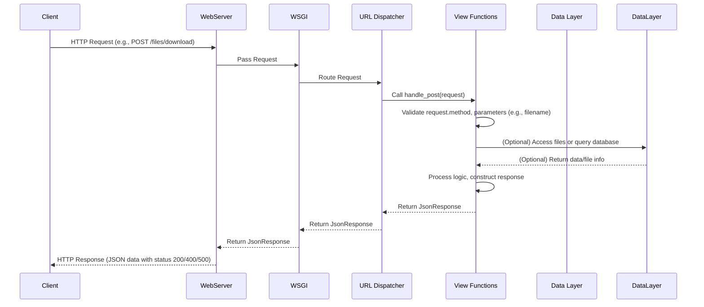

# Chapter 4: View Functions

Welcome back! In the previous chapter, we delved into the heart of your Django project's configuration, exploring the vital role of the [Project Settings](chapter_03.md) (`settings.py`) file. We saw how it dictates everything from database connections to installed applications, providing the foundational rules for your web application. Now that our project has its core settings defined, it's time to explore the components that actually *do* something when a user interacts with your website: **View Functions**.

---

### Problem & Motivation

Imagine a user visits your website or submits a form. How does your Django application know what content to display or what action to perform? Without a specific instruction set, the server wouldn't have any idea how to respond. This is the fundamental problem that view functions solve.

In any web application, the server needs a mechanism to receive an incoming web request (like someone typing a URL or clicking a submit button) and then generate an appropriate web response (like a webpage, a file download, or an API response). View functions are the central processing units for these requests within a Django project. They act as the controllers that orchestrate the application's logic, interacting with data, performing calculations, and ultimately deciding what to send back to the user.

For our "markup" project, let's consider a practical use case: A user interacts with a part of our application that allows them to request a specific file download. They submit a form with the `subdir` and `filename` of the desired attachment. Our application needs to receive this request, validate the inputs, locate the file, and then prepare it for download. Without view functions, there would be no way to implement this crucial server-side logic.

---

### Core Concept Explanation

At its heart, a **view function** in Django is simply a Python function that takes an `HttpRequest` object as its first argument and returns an `HttpResponse` object. Think of it as a specialized message handler. When a web request arrives at your Django application, the system uses a component called the URL Dispatcher (which we'll cover in the next chapter) to figure out which view function should handle that specific request.

The `HttpRequest` object is a powerful container that holds all the information about the incoming request: the HTTP method (GET, POST, etc.), user data, request parameters, headers, and more. This allows your view function to understand *what* the user is asking for. After processing this information and executing any necessary business logic (like fetching data from a database or performing calculations), the view function then constructs an `HttpResponse`. This `HttpResponse` object carries the data and metadata that will be sent back to the user's browser, whether it's an HTML page, a JSON response, a redirect, or a file.

In essence, view functions are the *logic gates* of your Django application. They encapsulate the specific actions that correspond to different user interactions or API endpoints, ensuring that every request receives a meaningful and appropriate response. They are the crucial link between a user's action and your application's underlying code and data.

---

### Practical Usage Examples

Let's start with a very basic view function to illustrate the core concept. First, you'd typically create a `views.py` file inside one of your Django apps (or directly in your project directory for very simple cases, though apps are preferred).

Consider a simple view that just says "Hello":

```python
# my_django_project/my_django_project/views.py
from django.http import HttpResponse

def hello_world(request):
    # This view function simply returns a text response.
    return HttpResponse("Hello, Django World!")
```
This `hello_world` function is a classic view. It takes the `request` object and immediately returns an `HttpResponse` containing the string "Hello, Django World!". This is the simplest form of a response.

Now, let's use the provided `handle_post` example to demonstrate a more complex view function that processes user input, specifically for our file download use case. This function would typically live in a `views.py` file within your project or an app.

```python
# my_django_project/my_django_project/views.py
from django.http import JsonResponse
from pathlib import Path

def handle_post(request):
    # Check if the incoming request uses the HTTP POST method.
    # This is crucial for handling form submissions or API calls that send data.
    if request.method == 'POST':
        # ... logic to process POST request ...
        pass
    else:
        # If it's not a POST request, return an error indicating invalid method.
        return JsonResponse({'error': 'Invalid method'}, status=405)
```
In this initial snippet of `handle_post`, we see a fundamental pattern: checking the `request.method`. It's vital to ensure that a view designed to receive data (like file requests) only processes the correct HTTP method (e.g., POST). If a GET request comes in, it's immediately rejected with a `405 Method Not Allowed` status, which is good practice.

Next, let's look at how the view accesses data sent in a POST request:

```python
# Continuing inside the 'if request.method == 'POST':' block
# my_django_project/my_django_project/views.py
# (Full context is in the 'handle_post' function from above)

        """Get a downloadable attachment given path to a file"""
        # Define the base directory where files are stored.
        local_volume_path = Path("/root/my_django_project/files")
        
        # Extract 'subdir' and 'filename' from the request's POST data.
        # This is how you access data sent by a form or an API client.
        subdir = request.POST['subdir']
        filename = request.POST['filename']
```
Here, `request.POST` is a dictionary-like object that holds all the POST parameters. We're extracting `subdir` and `filename` which we expect the client to send. The `local_volume_path` is a base directory where files are stored, demonstrating how views can use server-side paths.

It's critical to validate any user input. Our example includes a basic check for `filename`:

```python
# Continuing inside the 'if request.method == 'POST':' block
# my_django_project/my_django_project/views.py
# (Full context is in the 'handle_post' function)

        if filename is None or filename == '':
            # If the filename is missing or empty, return an error.
            # JsonResponse is used for API-like responses, and status=400 means Bad Request.
            return JsonResponse({'error': 'filename is a required field.'}, status=400)

    # ... more code would go here to actually locate and serve the file ...
    # For instance, constructing the full path:
    # file_path = local_volume_path / subdir / filename
    # Then checking if file_path exists, handling permissions, and serving it.
```
This block shows input validation. If `filename` is not provided, the view immediately returns a `JsonResponse` with an error message and a `400 Bad Request` status. This prevents further processing with invalid data and provides helpful feedback to the client.

Finally, even within this excerpt, we see an example of robust error handling:

```python
# Continuing inside the 'if request.method == 'POST':' block
# my_django_project/my_django_project/views.py
# (Full context is in the 'handle_post' function)

    # ... potential file processing code here ...
    # For example, if there's an issue with file access:
    # try:
    #     with open(file_path, 'rb') as f:
    #         # ... read and serve file ...
    # except Exception as e:
            return JsonResponse({'error': str(e)}, status=500)
```
This snippet, though commented, illustrates how to catch exceptions that might occur during the complex logic (like file operations) and return a generic `500 Internal Server Error` with the exception message. This is a good practice for debugging and informing the client of server-side problems.

---

### Internal Implementation Walkthrough

When a web request arrives at your Django application, a sequence of events leads to your view function being executed.

1.  **Web Server & WSGI Gateway**: The journey begins with a web server (like Nginx or Apache) receiving the request. It then passes this request to the Django application via the [WSGI Application Gateway](chapter_06.md).
2.  **Django Framework Initialization**: The WSGI application entry point (defined in `wsgi.py`) loads your Django project.
3.  **URL Dispatcher (`urls.py`)**: Django's URL dispatcher (which we'll explore in detail in the [URL Dispatcher (Routing)](chapter_05.md) chapter) takes the request's URL and tries to match it against patterns defined in your project's `urls.py` file.
4.  **View Function Call**: Once a URL pattern matches, the URL dispatcher calls the corresponding view function. It creates an `HttpRequest` object, populates it with details from the incoming web request, and passes this object as the first argument to your view function.
5.  **View Function Execution**: Inside your view function:
    *   You access information from the `HttpRequest` object (e.g., `request.method`, `request.POST`, `request.GET`, `request.user`).
    *   You execute your specific application logic. This might involve querying a database, performing calculations, interacting with external APIs, or reading files from the server's file system, as seen with `local_volume_path` in our `handle_post` example.
    *   You prepare the data that needs to be sent back.
    *   You construct an `HttpResponse` object (or a subclass like `JsonResponse`, `render`, `redirect`). This object encapsulates the response content, HTTP status code, and headers.
6.  **Response Back to Client**: The `HttpResponse` object returned by your view function is then passed back through the Django framework, through the WSGI gateway, and finally back to the web server, which sends it to the client's browser.

Here's a simplified sequence diagram illustrating this flow:



In our `handle_post` example, the view function receives the `HttpRequest`, checks its method, extracts `subdir` and `filename` from `request.POST`, performs validation, and eventually would construct a response. If an error occurs, as shown, it returns a `JsonResponse` with an error message and an appropriate HTTP status code like `400` or `500`.

---

### System Integration

View functions don't operate in isolation; they are a critical piece that integrates with many other parts of your Django project:

*   **URL Dispatcher (Routing)**: This is the most direct integration. Every view function needs a corresponding URL pattern in your project's `urls.py` (or an app's `urls.py`). Without a URL mapping, your view function will never be called. We will explore this vital connection in detail in the [URL Dispatcher (Routing)](chapter_05.md) chapter. The URL dispatcher is the mechanism that translates a web address into a call to your specific view function.
*   **Project Settings (`settings.py`)**: While not directly importing `settings.py`, view functions are implicitly governed by its configurations. For instance, debugging settings affect how errors are displayed, database configurations dictate how views interact with models, and `STATIC_URL`/`MEDIA_URL` influence how files (which views might serve or link to) are handled.
*   **Models**: Views often interact with Django's Object-Relational Mapper (ORM) to retrieve, create, update, or delete data from your database. Although models are beyond the scope of this chapter, know that views are the typical place where you'd call `MyModel.objects.all()` or `MyModel.objects.create(...)`.
*   **Templates**: For displaying dynamic HTML pages, views typically render templates. The `django.shortcuts.render` function is a common way to pass data from a view to an HTML template, which then produces the final `HttpResponse`.
*   **Forms**: Views are responsible for processing data submitted via Django forms, validating it, saving it, and re-displaying forms with errors if necessary.

In essence, a view function acts as a coordinator, receiving requests, leveraging other Django components (like the ORM, templates, forms, and settings) to fulfill the request, and then delivering a response.

---

### Best Practices & Tips

*   **Keep Views Thin**: A common best practice is to keep your view functions as concise as possible. The view should primarily be responsible for handling the request and response, delegating complex business logic, database interactions, and other heavy lifting to separate service layers, helper functions, or Django models. This improves readability, reusability, and testability.
*   **Handle Different HTTP Methods Explicitly**: Always check `request.method` (as seen in `handle_post`) if your view needs to behave differently based on GET, POST, PUT, DELETE, etc. This leads to more robust and predictable APIs.
*   **Return Appropriate HTTP Status Codes**: Don't just return `200 OK` for everything. Use `400 Bad Request` for invalid user input, `401 Unauthorized`, `403 Forbidden`, `404 Not Found`, `405 Method Not Allowed`, and `500 Internal Server Error` as appropriate. This makes your API more expressive and easier for clients to consume.
*   **Validate User Input**: Always validate any data received from the client. Our `handle_post` example showed a basic check for `filename`. Django forms provide a powerful way to handle more complex validation. Never trust data coming directly from the user without sanitization.
*   **Error Handling**: Implement robust error handling (e.g., `try-except` blocks) to gracefully manage unexpected situations, like file not found or database connection issues. Return informative error messages without exposing sensitive internal details.
*   **Avoid Direct Path Traversal/Injection**: Be extremely careful when constructing file paths or database queries based on user input. Always use secure methods like `pathlib.Path.joinpath()` or `os.path.join()` and validate inputs to prevent malicious path traversal attempts, which could allow users to access unauthorized files.

---

### Chapter Conclusion

View functions are the workhorses of your Django application. They are the Python functions that directly handle incoming web requests, process the necessary logic using various Django components, and return appropriate web responses. We've seen how they receive the `HttpRequest`, access input data (like from `request.POST`), perform basic validation, and return structured responses like `JsonResponse`. Understanding view functions is fundamental to building any dynamic web application with Django, as they encapsulate the specific actions that define your application's behavior.

With our understanding of how views process requests, the next logical step is to learn how to connect specific URLs to these view functions. In the upcoming chapter, we will explore the [URL Dispatcher (Routing)](chapter_05.md), which acts as the traffic controller, directing web requests to the correct view function within your Django project.