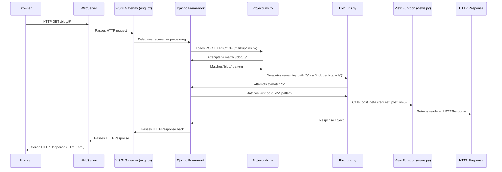

# Chapter 5: URL Dispatcher (Routing)

Having explored the concept of [View Functions](chapter_04.md) as the core logic handlers for web requests, the natural next question arises: how does Django know *which* view function to call for a given URL? This is where the URL Dispatcher, often referred to as routing, comes into play. It acts as the navigation system for your web application, directing incoming web requests to the appropriate processing logic.

---

### Problem & Motivation

Imagine a sprawling city with many different destinations – a central market, a quiet residential area, a bustling entertainment district. When you hail a taxi and tell the driver your destination, they consult a map and navigate the best route. In the world of web applications, users similarly request different "destinations" by typing URLs into their browsers. Without a map, the web server wouldn't know where to send these requests, leading to confusion or an inability to access specific content.

In our `markup` project, this problem is crucial. We need a way to serve a list of all blog posts when a user visits `/blog/` and a specific blog post when they visit `/blog/5/`. Without a dedicated mechanism, how would our application differentiate between these requests and dispatch them to the correct [View Functions](chapter_04.md) that retrieve either all posts or a single post? The URL dispatcher solves this by providing a structured way to map URLs to specific functions or classes within our Python code, ensuring that every web request finds its correct handler.

---

### Core Concept Explanation

The URL Dispatcher in Django is primarily managed by the `urls.py` file. This file contains a list of URL patterns, each acting like a specific entry on our application's map. When an incoming web request arrives, Django's URL resolver takes the requested path (e.g., `/blog/5/`) and attempts to match it against these defined patterns, one by one, from top to bottom.

Each URL pattern consists of two main parts: the *route* and the *view function*. The route is a string (or a regular expression for more complex cases) that defines what the URL should look like. The view function is the Python callable that will be executed if the route matches the incoming request. Django provides the `path()` function for defining these patterns, which is generally preferred for its simplicity and readability. For larger projects, `urls.py` files can become quite extensive, so Django also allows you to delegate parts of the URL matching to application-specific `urls.py` files using the `include()` function, promoting modularity and organization.

---

### Practical Usage Examples

Let's implement the motivating use case for our `markup` project: displaying a list of blog posts and a single blog post.

First, we'll create a simple Django app named `blog` within our `markup` project. If you haven't already, run:
```bash
python manage.py startapp blog
```
Remember to add `'blog'` to your `INSTALLED_APPS` in `markup/settings.py` (covered in [Project Settings](chapter_03.md)).

Next, define the view functions in `blog/views.py`:

```python
# markup/blog/views.py
from django.http import HttpResponse

def post_list(request):
    """
    View to display a list of all blog posts.
    """
    return HttpResponse("<h1>List of Blog Posts</h1><p>Post 1, Post 2, Post 3...</p>")

def post_detail(request, post_id):
    """
    View to display a single blog post based on its ID.
    """
    return HttpResponse(f"<h1>Detail for Post {post_id}</h1><p>This is the content for post {post_id}.</p>")
```
These are basic view functions that simply return an HTTP response with some text, demonstrating what content would be served for the respective URLs.

Now, we'll create an app-specific `urls.py` for our `blog` app. This helps keep our URL patterns organized.

```python
# markup/blog/urls.py
from django.urls import path
from . import views # Import views from the current directory

urlpatterns = [
    path('', views.post_list, name='post_list'),
    path('<int:post_id>/', views.post_detail, name='post_detail'),
]
```
In this `urls.py`, `path('', views.post_list)` maps the root of this app's URL space (e.g., `/blog/`) to the `post_list` view. `path('<int:post_id>/', views.post_detail)` is more interesting: `<int:post_id>` is a path converter that matches an integer and captures it as a keyword argument `post_id` to be passed to the `post_detail` view.

Finally, we need to "include" these blog app URLs into our main project's `urls.py`:

```python
# markup/markup/urls.py (Project-level urls.py)
from django.contrib import admin
from django.urls import path, include

urlpatterns = [
    path('admin/', admin.site.urls),
    path('blog/', include('blog.urls')), # Include blog app's URLs
]
```
Here, `path('blog/', include('blog.urls'))` tells Django: "Any request starting with `/blog/` should be handed over to the `blog.urls` file for further matching." This creates a clean separation of concerns.

Now, if you run the development server (`python manage.py runserver`), you can visit:
*   `http://127.0.0.1:8000/blog/` -> This will display "List of Blog Posts".
*   `http://127.0.0.1:8000/blog/5/` -> This will display "Detail for Post 5".

---

### Internal Implementation Walkthrough

When a user's web browser makes a request to a URL (e.g., `http://localhost:8000/blog/5/`), here's a simplified sequence of what happens internally within Django's URL dispatcher:



1.  **Initial Request**: The web server (e.g., Gunicorn, Apache, Nginx) receives the HTTP request for `/blog/5/`.
2.  **WSGI Gateway**: The web server passes this request to the Django application through the [WSGI Application Gateway](chapter_06.md) (defined in `wsgi.py`).
3.  **Django's URL Resolver**: Django's URL resolver component takes the requested path (`/blog/5/`) and consults the `ROOT_URLCONF` specified in your `settings.py` (which defaults to `markup.urls`).
4.  **Project-Level Matching**: The resolver goes through the `urlpatterns` list in `markup/urls.py` from top to bottom.
    *   It finds `path('blog/', include('blog.urls'))`. This pattern matches the start of the requested path (`/blog/`).
    *   The `include()` function then "chops off" the matched part (`/blog/`) and hands the *remaining* path (`5/`) to the `blog.urls` module for further resolution.
5.  **App-Level Matching**: Now, Django looks at the `urlpatterns` in `blog/urls.py`.
    *   It tries to match the remaining path (`5/`).
    *   It finds `path('<int:post_id>/', views.post_detail)`. This matches `5/`, captures `5` as an integer, and assigns it to the `post_id` variable.
6.  **View Invocation**: The URL resolver then calls the associated view function, `views.post_detail`, passing the `request` object and any captured keyword arguments (in this case, `post_id=5`).
7.  **Response**: The `views.post_detail` function executes its logic, creates an `HttpResponse` object, and returns it.
8.  **Response Delivery**: Django takes this `HttpResponse` and sends it back through the [WSGI Application Gateway](chapter_06.md) to the web server, which then delivers it to the user's browser.

---

### System Integration

The URL Dispatcher is a central component that ties together several other parts of the Django ecosystem:

*   **[View Functions](chapter_04.md)**: This is the most direct link. The URL dispatcher's primary role is to find and invoke the correct view function based on the incoming URL. Without views, routing would have no destination.
*   **[The Django Project](chapter_01.md) & [Project Settings](chapter_03.md)**: The project's root `urls.py` file is a fundamental part of the overall Django project structure. The `ROOT_URLCONF` setting within `settings.py` explicitly tells Django where to find the main URL configuration, serving as the entry point for all routing.
*   **[WSGI Application Gateway](chapter_06.md)**: While routing happens *within* Django, the `wsgi.py` file is the crucial bridge that allows web servers to communicate with your Django application in the first place. The request must first pass through the WSGI gateway before Django's URL dispatcher can begin its work.
*   **Django Apps**: The use of `include()` in the project `urls.py` promotes modularity by allowing individual Django apps (like our `blog` app) to manage their own URL configurations, making applications more reusable and easier to maintain.

Data flow generally starts from the browser, goes through the WSGI gateway, then hits the main `urls.py`, potentially delegates to app `urls.py` files, and finally dispatches to a view, which then generates a response that travels back the same path.

---

### Best Practices & Tips

1.  **Use `include()` for App-Specific URLs**: Always define URL patterns for individual applications in their own `urls.py` files and `include()` them in the project's root `urls.py`. This keeps your project's URL configuration clean, modular, and makes your apps more portable.

2.  **Name Your URL Patterns**: Use the `name` argument in `path()` (e.g., `path('list/', views.post_list, name='post_list')`). This allows you to refer to URLs by their name rather than hardcoding the paths. This is invaluable when generating URLs dynamically in templates or views, as it makes your code more robust to URL changes.
    ```python
    # In a template
    # <a href="">All Posts</a>
    # <a href="">Post 123</a>
    ```

3.  **Order Matters**: Django processes `urlpatterns` from top to bottom. Place more specific patterns *before* more general ones. If a general pattern (`<str:slug>/`) comes before a specific one (`add/`), the general pattern might incorrectly match "add" and prevent the specific one from being reached.

4.  **Use Path Converters**: Leverage path converters like `<int:post_id>`, `<str:slug>`, `<uuid:id>` for cleaner and more readable URL patterns compared to complex regular expressions (`re_path()`). Use `re_path()` only when path converters don't suffice.

5.  **Avoid Hardcoding URLs**: As mentioned, use `` in templates and `reverse()` in Python code to refer to named URLs. This makes your application's navigation resilient to changes in URL structure.

---

### Chapter Conclusion

The URL Dispatcher, driven by your `urls.py` files, is the navigational backbone of your Django project. It provides the essential mapping between human-readable web addresses and the underlying Python logic (our [View Functions](chapter_04.md)) that generates responses. By carefully structuring your URL patterns and employing best practices like using `include()` and named URLs, you create a robust, maintainable, and scalable foundation for how users interact with your web application.

Understanding the URL dispatcher's role is critical, as it dictates how your web server and Django work together to serve content. With this knowledge, we are now ready to explore the final piece of the puzzle: how the web server actually connects and communicates with our entire Django application. This crucial bridge is facilitated by the [WSGI Application Gateway](chapter_06.md).