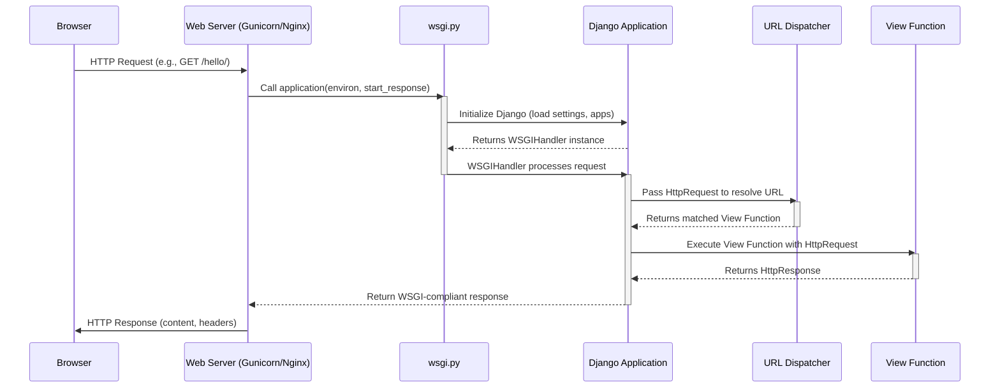

# Chapter 6: WSGI Application Gateway

Welcome back to our journey through the "markup" project! In the [URL Dispatcher (Routing)](chapter_05.md) chapter, we explored how Django meticulously matches incoming web requests to the correct view functions based on predefined URL patterns. This routing mechanism is at the heart of how Django directs traffic within your application. However, before a request can even *reach* Django's URL dispatcher, it needs a way to get *into* the Django application from the outside world – specifically, from a web server. This is where the **WSGI Application Gateway** comes into play, acting as the crucial interface between the web server and your Django project.

---

### Problem & Motivation

Imagine you've built a magnificent Django application, complete with models, views, and URL patterns. Now, how do you make it accessible to users over the internet? A web server (like Nginx, Apache, or Gunicorn) is responsible for listening to incoming HTTP requests, but it doesn't inherently "understand" how to run a Python Django application. There needs to be a standard, agreed-upon way for any web server to communicate with any Python web application framework, irrespective of the framework's internal workings.

This is the problem the WSGI standard solves. Without it, every framework would need custom integration logic for every web server, leading to a fragmented and complex deployment landscape. For our "markup" project, the `wsgi.py` file is the answer. It provides the specific entry point that production-grade web servers use to boot up and interact with our Django application, allowing it to process requests, serve dynamic content, and ultimately bring our project to life for users.

---

### Core Concept Explanation

**WSGI** stands for **Web Server Gateway Interface**. It's not a server, nor a framework, but a *specification* — a set of rules that defines a standard interface between Python web servers and Python web applications. Think of it as a universal translator or a common handshake protocol. When a web server wants to talk to a Python application, it uses the WSGI standard to send requests and receive responses.

Django, like many other Python web frameworks, provides a WSGI-compatible application callable. This callable is a Python object (usually a function or a class instance) that a WSGI-compliant web server can invoke to process an incoming HTTP request. The `wsgi.py` file in your Django project contains this crucial WSGI callable. When a web server receives a request for your "markup" project, it passes that request to the `application` object defined in `wsgi.py`. This object then orchestrates the entire Django request-response cycle, leveraging your project's [Project Settings](chapter_03.md), [URL Dispatcher (Routing)](chapter_05.md), and [View Functions](chapter_04.md).

The `wsgi.py` file is therefore the bridge. It imports and configures your Django project, exposing a single `application` object. This `application` object is what the web server "runs." It's typically only used in production deployments because Django's development server (`manage.py runserver`) includes its own WSGI server for convenience during development.

---

### Practical Usage Examples

When you create a new Django project, a `wsgi.py` file is automatically generated for you. For our "markup" project, you'll find it within the main project directory, e.g., `markup/markup/wsgi.py`.

Let's look at the default content of a `wsgi.py` file:

```python
# markup/markup/wsgi.py

import os

from django.core.wsgi import get_wsgi_application

# Sets the default settings module for the 'markup' project.
os.environ.setdefault('DJANGO_SETTINGS_MODULE', 'markup.settings')

# Creates the WSGI application object.
application = get_wsgi_application()
```
*   `import os`: Imports the `os` module, which provides a way to interact with the operating system, particularly for environment variables.
*   `from django.core.wsgi import get_wsgi_application`: Imports a helper function from Django that creates the WSGI application.
*   `os.environ.setdefault(...)`: This is critical. It tells Django which settings file (`markup.settings`) to use for the current project. Without this, Django wouldn't know how to configure itself.
*   `application = get_wsgi_application()`: This line calls the helper function to instantiate the WSGI application and assigns it to the variable `application`. This `application` variable is the *callable* that WSGI-compliant web servers will look for and use.

To illustrate how a web server uses this, consider a typical setup with Gunicorn (a popular Python WSGI HTTP server). You would run a command similar to this in your production environment:

```bash
gunicorn markup.wsgi:application --bind 0.0.0.0:8000
```
*   `gunicorn`: The command to run the Gunicorn server.
*   `markup.wsgi:application`: This tells Gunicorn *where* to find your WSGI application. It means "look in the `markup` Python package, then for the `wsgi` module, and inside that module, find the `application` object."
*   `--bind 0.0.0.0:8000`: This configures Gunicorn to listen for incoming web requests on all available network interfaces (`0.0.0.0`) on port `8000`.

When a request comes to Gunicorn on port 8000, Gunicorn invokes the `application` callable from your `wsgi.py`, which then hands off the request to the Django framework to be processed.

---

### Internal Implementation Walkthrough

The magic primarily happens within `django.core.wsgi.get_wsgi_application()`. This function is responsible for initializing Django's core components and returning a WSGI-compliant callable object. Let's break down the general flow:

1.  **Setting up the Environment**: When `wsgi.py` is executed by a WSGI server, the first thing it does is set the `DJANGO_SETTINGS_MODULE` environment variable using `os.environ.setdefault`. This ensures that when Django starts up, it knows exactly which configuration ([Project Settings](chapter_03.md)) to load.

2.  **Loading Django**: The `get_wsgi_application()` function then performs necessary Django setup tasks. It effectively "boots up" the Django framework. This includes:
    *   Loading all installed applications defined in `INSTALLED_APPS` within your `settings.py`.
    *   Configuring various Django components like the database connection, caching, static files, etc., based on your project's settings.

3.  **Creating the WSGI Callable**: After initialization, `get_wsgi_application()` returns an instance of `django.core.handlers.wsgi.WSGIHandler`. This `WSGIHandler` object *is* the `application` callable. It's designed to conform to the WSGI specification, meaning it's a callable that accepts two arguments: `environ` (a dictionary containing CGI-style environment variables) and `start_response` (a callable used to send HTTP status and headers).

4.  **Processing a Request**: When the WSGI server invokes this `WSGIHandler` (`application`) with an incoming request, the handler takes over:
    *   It parses the `environ` dictionary to construct a `HttpRequest` object, which encapsulates all details of the incoming request.
    *   It then passes this `HttpRequest` object through various middleware components (defined in your `settings.py`).
    *   Eventually, the request reaches the [URL Dispatcher (Routing)](chapter_05.md) to find the appropriate [View Function](chapter_04.md).
    *   The view function processes the request and returns an `HttpResponse` object.
    *   The `WSGIHandler` converts this `HttpResponse` into a WSGI-compliant iterable, which the server uses to send the response back to the client.

Here's a simplified sequence of interaction:



The `wsgi.py` file, therefore, serves as the initial bridge that connects the raw incoming HTTP request from the web server to the sophisticated request processing pipeline of your Django application.

---

### System Integration

The `wsgi.py` file is a critical integration point within the "markup" project, connecting the external web server environment to Django's internal machinery:

*   **[The Django Project](chapter_01.md)**: The `wsgi.py` file is housed within the top-level project directory. It's the designated entry point for external servers to engage with the entire Django project structure.
*   **[Project Settings](chapter_03.md)**: The line `os.environ.setdefault('DJANGO_SETTINGS_MODULE', 'markup.settings')` explicitly links the WSGI gateway to your project's configuration. Without correctly loading the settings, Django wouldn't know about its database, installed apps, static files, or other crucial configurations.
*   **[URL Dispatcher (Routing)](chapter_05.md)** and **[View Functions](chapter_04.md)**: Once the `application` callable in `wsgi.py` takes over, it initiates the Django request/response cycle. This cycle directly involves the URL dispatcher to route the request to the correct view, and then the view function to generate the actual response. The `wsgi.py` is the very first step in a chain that culminates in the execution of your view logic.
*   **`manage.py` ([Project Management Script](chapter_02.md))**: While `manage.py runserver` uses its own lightweight WSGI server for development, it's distinct from how `wsgi.py` is used in production. `wsgi.py` is specifically for external, production-grade WSGI servers, whereas `manage.py` is for development and administrative tasks.

In essence, `wsgi.py` is the designated "front door" for the Django application when deployed, ensuring that the web server speaks the right language to Django and gets the entire system (settings, routing, views) ready to handle requests.

---

### Best Practices & Tips

*   **Keep `wsgi.py` Lean**: The default `wsgi.py` file is generally perfect as is. Avoid adding complex logic or extensive configurations directly into `wsgi.py`. Its primary role is to load your Django application. All application-specific logic should reside in your apps, views, or [Project Settings](chapter_03.md).
*   **Environment Variables for Settings**: For production, never hardcode sensitive information (like `SECRET_KEY` or database credentials) directly into `settings.py`. Instead, load them from environment variables. Your WSGI server (e.g., Gunicorn) or process manager (e.g., systemd) will be configured to provide these variables, which `settings.py` can then read.
    ```python
    # Example in settings.py (not wsgi.py)
    import os
    SECRET_KEY = os.environ.get('DJANGO_SECRET_KEY', 'default-insecure-key')
    ```
*   **Production Server Choice**: Always use a robust, production-ready WSGI server like Gunicorn or uWSGI to run your Django application. Django's built-in development server is not suitable for production due to security and performance limitations.
*   **Serve Static/Media Files Separately**: In a production environment, it's best practice to let your web server (like Nginx or Apache) directly serve static files (CSS, JS, images) and media files (user uploads) without involving Django. Django's WSGI application should focus on dynamic content. This usually involves configuring Nginx to intercept requests for `/static/` and `/media/` paths.
*   **Debugging `wsgi.py`**: If your application isn't starting in production, check your WSGI server logs. Common issues include incorrect `DJANGO_SETTINGS_MODULE` paths, missing environment variables, or Python dependency problems. Make sure the Python environment where your WSGI server runs has all your project's dependencies installed.

---

### Chapter Conclusion

The `wsgi.py` file, though small and often overlooked, is an absolutely foundational component of any Django project destined for production. It embodies the **WSGI Application Gateway**, acting as the standard interface that allows web servers to communicate with and run your Django application. By understanding its role, from setting up the environment to exposing the `application` callable, you gain crucial insight into how your web application transitions from development to a live, accessible website.

We've explored how it bridges the gap between a web server and Django's internal request processing, connecting seamlessly with your project's settings, URL routing, and view functions. With `wsgi.py` in place, the "markup" project is now fully equipped to listen for web requests and dynamically generate responses, providing a robust and scalable web presence. This marks the culmination of our tutorial structure, demonstrating the comprehensive architecture of a Django web application.