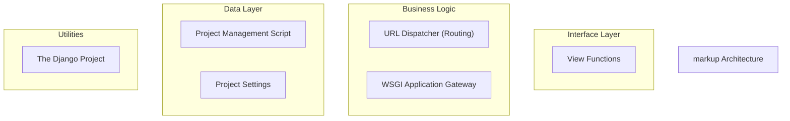
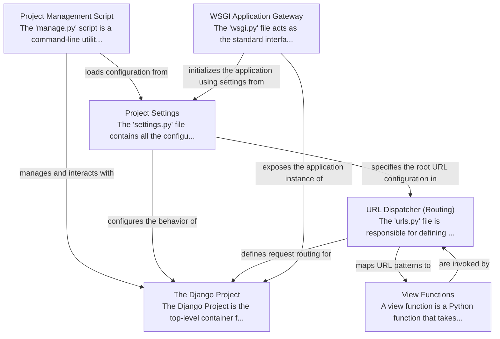

# markup Tutorial

Welcome to the comprehensive tutorial for markup. This tutorial is automatically generated from the codebase to help you understand the core concepts and implementation patterns.

## Project Overview

The Django Project is the foundational container for a web application, orchestrating various components to define its structure and behavior. It relies on the 'manage.py' script for administrative tasks, 'settings.py' for comprehensive configuration, and 'urls.py' to map web requests to specific 'view functions'. The 'wsgi.py' file acts as the gateway, enabling web servers to run the entire Django application, which is a cohesive system for building dynamic websites.

## System Architecture

## Component Relationships

## Table of Contents

1. [Chapter 1: The Django Project](chapter_01.md) - Comprehensive documentation for The Django Project following structured methodology...
2. [Chapter 2: Project Management Script](chapter_02.md) - Comprehensive documentation for Project Management Script following structured methodology...
3. [Chapter 3: Project Settings](chapter_03.md) - Comprehensive documentation for Project Settings following structured methodology...
4. [Chapter 4: View Functions](chapter_04.md) - Comprehensive documentation for View Functions following structured methodology...
5. [Chapter 5: URL Dispatcher (Routing)](chapter_05.md) - Comprehensive documentation for URL Dispatcher (Routing) following structured methodology...
6. [Chapter 6: WSGI Application Gateway](chapter_06.md) - Comprehensive documentation for WSGI Application Gateway following structured methodology...

## How to Use This Tutorial

1. **Start with Chapter 1** to understand the foundational concepts
2. **Follow the sequence** - each chapter builds upon previous concepts
3. **Practice with code examples** - every chapter includes practical examples
4. **Refer to diagrams** - use architecture diagrams for visual understanding
5. **Cross-reference concepts** - chapters link to related topics

## Tutorial Features

- **Progressive Learning**: Concepts are introduced in logical order
- **Code Examples**: Every chapter includes practical, executable code
- **Visual Diagrams**: Mermaid diagrams illustrate complex relationships
- **Cross-References**: Easy navigation between related concepts
- **Beginner-Friendly**: Written for newcomers to the codebase

## Contributing

This tutorial is auto-generated from the codebase. To improve it:
1. Update the source code documentation
2. Add more detailed comments to key functions
3. Regenerate the tutorial using the documentation system

---

*Generated using AI-powered codebase analysis*
