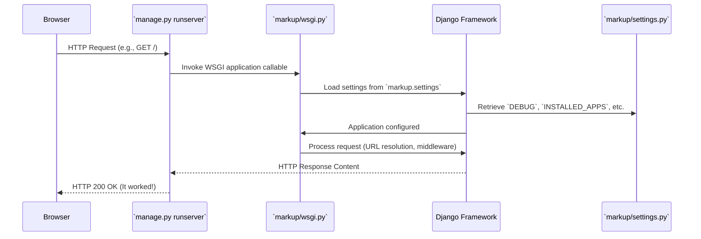

# Chapter 1: Django Project

This is the inaugural chapter of our `markup` tutorial series. Here, we lay the essential groundwork by exploring the *Django Project*, the fundamental building block of any Django web application.

---

## Problem & Motivation

Imagine building a complex web application like a social media platform, an e-commerce site, or even a simple blog. Such applications are rarely a single, monolithic piece of code. They typically involve:
*   Global configurations (database connections, security settings, time zones).
*   Multiple distinct functionalities (user authentication, product catalog, payment processing, blog posts).
*   Shared resources (static files, templates).
*   A unified way for web servers to communicate with the application.

Without a well-defined top-level organizational unit, managing these diverse components becomes chaotic. How would you ensure all parts of your application use the same database, or how would a web server know where to send incoming requests? This is the problem the Django Project elegantly solves.

The Django Project serves as the **master container** for your entire web application. It provides the necessary structure to unify all configurations, define the application's overall behavior, and host individual, reusable Django applications (often called "apps"). For our `markup` project, it will be the overarching entity that holds all our future blog-related apps (like `posts`, `comments`, `users`) and their global settings. It is the absolute first step in bringing any Django idea to life.

---

## Core Concept Explanation

At its heart, a **Django Project** is the blueprint and foundation for your web application. Think of it as the entire *house* you're building. This "house" comes with a main entrance, a central utility control panel, and the foundational structure to hold various rooms.

Each "room" in this house would be a separate, self-contained Django *Application* (which we'll explore in future chapters). For instance, one room might be your `blog` functionality, another for `user management`, and yet another for `contact forms`. The Django Project is what ties all these rooms together into a cohesive dwelling, providing shared resources and a unified address.

Key elements associated with a Django Project include:
*   `manage.py`: A command-line utility that interacts with your project.
*   The project's main package: A Python package (often named the same as your project) that contains essential files like `settings.py`, `urls.py`, `wsgi.py`, and `asgi.py`.
*   `settings.py`: This file holds all the project-wide configuration, from database connections and security keys to installed apps and static file locations.
*   `urls.py`: This file acts as the main "table of contents" for your website, defining how URLs are routed to different parts of your application.
*   `wsgi.py`: The entry point for web servers to interact with your Django application, adhering to the Web Server Gateway Interface standard.

The project provides the necessary context and environment for all your Django applications to run harmoniously, ensuring they share common configurations and can interact seamlessly.

---

## Practical Usage Examples

Let's put theory into practice by creating our `markup` project. Our goal is to set up the basic structure for a web application.

First, ensure you have Django installed in a virtual environment. If you don't, you can do so by running:

```bash
python -m venv .venv
source .venv/bin/activate
pip install Django
```
*(Explanation: These commands create a virtual environment named `.venv`, activate it, and then install Django within it, keeping your global Python environment clean.)*

Now, let's create the Django Project:

```bash
django-admin startproject markup .
```
*(Explanation: `django-admin` is Django's command-line utility. `startproject` tells it to create a new project. `markup` is the name of our project. The `.` at the end tells Django to create the project files in the current directory, rather than creating an extra `markup` directory. This is a common practice for clean project roots.)*

After running the command, your project directory will look something like this:

```
markup/
├── manage.py
└── markup/
    ├── __init__.py
    ├── asgi.py
    ├── settings.py
    ├── urls.py
    └── wsgi.py
```
*(Explanation: The outer `markup/` is your project's root. `manage.py` is directly inside it. The inner `markup/` is the actual Python package for your project, containing configuration files.)*

You can now start Django's development server to see your project in action:

```bash
python manage.py runserver
```
*(Explanation: `manage.py` is the script that lets you interact with your project. `runserver` is a command that starts a lightweight development web server, allowing you to view your application locally.)*

You should see output similar to this:

```
Watching for file changes with StatReloader
Performing system checks...

System check identified no issues (0 silenced).

You have 18 unapplied migration(s). Your project may not work properly until you apply the migrations for app(s): admin, auth, contenttypes, sessions.
Run 'python manage.py migrate' to apply them.
November 11, 2023 - 10:00:00
Django version 4.2, using settings 'markup.settings'
Starting development server at http://127.0.0.1:8000/
Quit the server with CONTROL-C.
```
*(Explanation: The output confirms the server is running on `http://127.0.0.1:8000/`. The migration warning is normal for a fresh project and will be addressed later. If you open that URL in your browser, you'll see Django's "It worked!" page, indicating your project is successfully set up.)*

---

## Internal Implementation Walkthrough

When you execute `django-admin startproject markup .`, several key actions occur:

1.  **Directory Creation**: Django creates the outer `markup/` directory (if `.` wasn't used, it would create `markup/markup/`).
2.  **`manage.py` Generation**: It places the `manage.py` script directly into the project root. This script is crucial as it automatically sets up the `DJANGO_SETTINGS_MODULE` environment variable to point to your project's `settings.py` (e.g., `markup.settings`).
3.  **Project Package Creation**: An inner Python package, also named `markup/`, is created. This package is recognized by Python due to the `__init__.py` file it contains.
4.  **Configuration File Population**: Within this inner `markup/` package, Django generates several essential files:
    *   `settings.py`: A Python file containing all the default configurations for your Django project. This includes `SECRET_KEY`, `DEBUG` mode, `ALLOWED_HOSTS`, `INSTALLED_APPS` (a list of all activated Django applications), database configurations (`DATABASES`), middleware, template settings, static and media file configurations.
    *   `urls.py`: This file defines the root URL patterns for your project. It's the first place Django looks to match an incoming HTTP request's URL. By default, it includes patterns for the Django admin interface.
    *   `wsgi.py`: This file provides a callable `application` object that compliant web servers (like Gunicorn, uWSGI) use to communicate with your Django application. It stands for Web Server Gateway Interface.
    *   `asgi.py`: Similar to `wsgi.py`, but designed for asynchronous Python applications, suitable for frameworks like Django Channels or HTTP/2. It stands for Asynchronous Server Gateway Interface.

Let's visualize a simplified request flow within our newly created project when `manage.py runserver` is active:


*(Explanation: When your browser makes a request, `manage.py runserver` intercepts it. It then invokes the WSGI application defined in `markup/wsgi.py`. This WSGI application, in turn, initializes the Django framework, loading all necessary configurations from `settings.py` before processing the request and returning a response.)*

A glimpse into the default `settings.py`:

```python
# markup/settings.py
...
SECRET_KEY = 'django-insecure-...' # KEEP THIS SECRET!
DEBUG = True
ALLOWED_HOSTS = []

INSTALLED_APPS = [
    'django.contrib.admin',
    'django.contrib.auth',
    'django.contrib.contenttypes',
    'django.contrib.sessions',
    'django.contrib.messages',
    'django.contrib.staticfiles',
]
...
```
*(Explanation: `SECRET_KEY` is for security. `DEBUG = True` enables detailed error pages (only for development!). `ALLOWED_HOSTS` lists domains your site can serve. `INSTALLED_APPS` lists the Django applications (including Django's own built-in ones like admin and authentication) that are active in your project.)*

And the default `urls.py`:

```python
# markup/urls.py
from django.contrib import admin
from django.urls import path

urlpatterns = [
    path('admin/', admin.site.urls),
]
```
*(Explanation: `urlpatterns` is a list where you define your URL patterns. By default, Django includes a single `path` entry for the administrative interface at `/admin/`.)*

---

## System Integration

The Django Project acts as the central hub, integrating with almost every other abstraction in the Django ecosystem:

*   **Project and Django Apps**: The most fundamental integration. A Django project *contains* and *manages* multiple independent Django applications. You declare which applications are active within your project using the `INSTALLED_APPS` setting in `settings.py`. These apps provide specific functionalities (e.g., `blog`, `users`, `ecommerce`).
*   **Project and Settings**: The `settings.py` file, residing within the project package, dictates the global behavior, database connections, authentication backends, and more, for all applications and components within that project. Any application installed in the project inherits these settings.
*   **Project and URL Dispatcher**: The `urls.py` file at the project root is the primary entry point for Django's URL dispatcher. It can directly define URL patterns or, more commonly, include URL patterns from individual Django applications using `django.urls.include`. This creates a hierarchical routing system for your entire web application.
*   **Project and WSGI/ASGI Applications**: The `wsgi.py` (and `asgi.py`) files define how external web servers communicate with your Django project. They expose the Django application callable that servers use to forward requests, thereby making your entire project accessible over HTTP.
*   **Project and Management Commands**: The `manage.py` script is directly tied to the project. It provides a consistent interface to run various management commands (like `runserver`, `makemigrations`, `migrate`, `createsuperuser`) that operate on the context of the specific Django project it belongs to.

You can learn more about these integrated components in their respective chapters:
*   [Django Management Command](chapter_02.md)
*   [Settings Configuration](chapter_03.md)
*   [WSGI Application](chapter_04.md)
*   [URL Dispatcher](chapter_06.md)

---

## Best Practices & Tips

*   **Meaningful Naming**: Choose a descriptive name for your project that reflects its purpose. Avoid generic names like `myproject` if possible. `markup` for our tutorial is perfectly descriptive of its instructional purpose.
*   **Virtual Environments**: **Always** use a virtual environment for your Django projects. This isolates your project's dependencies from your system's global Python packages, preventing conflicts and ensuring reproducibility.
*   **Project Layout (`.` vs. no `.` in `startproject`)**: The `django-admin startproject myproject .` command places `manage.py` and the inner `myproject/` package directly in your current directory. This is often preferred for simpler project root structures, making `manage.py` easily accessible. If you omit the `.` it will create `myproject/myproject/` structure.
*   **Keep `settings.py` Clean**: While `settings.py` holds crucial configurations, avoid hardcoding sensitive information (like API keys or passwords) directly into it, especially in version control. Use environment variables or separate configuration files for production settings.
*   **Security**: Always keep your `SECRET_KEY` truly secret, especially in production. Never commit it to public repositories.
*   **One Project, Multiple Apps**: A Django project is designed to host multiple small, reusable Django *applications*. Resist the urge to put all your code into a single massive app. This promotes modularity, maintainability, and reusability.

---

## Chapter Conclusion

In this chapter, we've explored the foundational concept of a **Django Project**. We learned that it's the top-level container for our entire web application, providing structure, configuration, and a unified environment for all our Django applications. We successfully created our `markup` project and understood the purpose of its core files like `manage.py`, `settings.py`, and `urls.py`, and even ran our first development server.

The Django Project, through `manage.py`, gives us the entry point to interact with our application. This `manage.py` script isn't just for starting the server; it's a gateway to a whole suite of powerful utilities known as Django Management Commands. In the next chapter, we will dive deeper into these commands, understanding how they streamline various development and administrative tasks within our Django project.

**Next Chapter: [Django Management Command](chapter_02.md)**