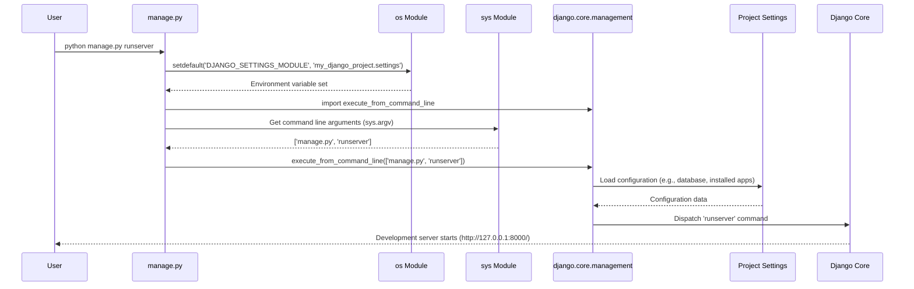

# Chapter 2: Django Management Command

In the [previous chapter on the Django Project](chapter_01.md), we established that a Django project is the foundational container for your web application. It's where all your settings, configurations, and applications reside. But once you have this container, how do you interact with it? How do you tell it to start a development server, create database tables, or manage users? This is where the Django Management Command comes into play, acting as your primary interface with the project.

---

### Problem & Motivation

Imagine building a complex application without any direct tools to manage its operations. You'd be manually writing Python scripts for every single administrative task: starting a server, running tests, applying database changes, or creating new users. This approach is not only tedious and error-prone but also lacks standardization, making collaboration difficult.

The core problem addressed by the Django Management Command is the need for a **unified and standardized way to perform administrative tasks** within a Django project. Without it, developers would spend invaluable time scripting basic operations rather than focusing on core application logic. For our "markup" project, this utility is indispensable. For instance, to simply see our application run in development, we need a command to launch a local server. This utility solves that exact problem, providing a consistent entry point for all project-related operations.

---

### Core Concept Explanation

The Django Management Command system is primarily accessed via a Python script named `manage.py`, located at the root of every Django project. Think of `manage.py` as your project's personal assistant; it's a command-line utility that provides a consistent interface to interact with your Django project. It bundles a wide array of administrative tasks, from running the development server to database migrations, testing, and more.

`manage.py` effectively wraps the `django-admin` utility, but it does so in a project-specific way. While `django-admin` is a generic Django command-line tool, `manage.py` automatically sets up the `DJANGO_SETTINGS_MODULE` environment variable to point to your project's settings file. This means when you use `manage.py`, Django already knows which project it's working with, saving you the hassle of specifying settings every time. It's the central hub for all project-specific operations, ensuring that any command you run is executed in the correct project context.

At its heart, `manage.py` uses Django's `execute_from_command_line` function. This function parses the command-line arguments (like `runserver`, `migrate`, etc.) and dispatches them to the appropriate Django internal logic or custom management commands you might define. It provides a robust and extensible framework for managing your application throughout its lifecycle, from initial setup to deployment and maintenance.

---

### Practical Usage Examples

Let's look at how we use `manage.py` to perform common tasks, solving our motivating problem of interacting with the project effortlessly.

#### 1. Running the Development Server

The most common use case is starting Django's lightweight development server, which allows you to view your application in a web browser.

```bash
python manage.py runserver
```
This command starts a local server, usually at `http://127.0.0.1:8000/`. You can then open your web browser and navigate to this address to see your Django application in action. This is crucial for developing and testing your project locally.

#### 2. Making Database Migrations

When you define or change your project's models (database structure), you need to tell Django to prepare the necessary database schema changes.

```bash
python manage.py makemigrations
```
This command inspects your models and creates new migration files in your application's `migrations` directory. These files are like instructions for the database on how to update its structure to match your Python models.

#### 3. Applying Database Migrations

After `makemigrations` creates the migration files, you need to apply them to your actual database to update its schema.

```bash
python manage.py migrate
```
This command reads the migration files and executes the necessary SQL commands to modify your database. This is how your Python models become actual tables and fields in your database.

#### 4. Creating a Superuser

For administrative tasks within the Django admin interface, you'll need an administrative user account.

```bash
python manage.py createsuperuser
```
This interactive command prompts you for a username, email, and password, then creates a superuser account that has full access to the Django administration site. This is essential for managing content and users once your project is running.

---

### Internal Implementation Walkthrough

Let's dive into the core of `manage.py` by examining the `main` function provided, which is the entry point for all management commands.

```python
# my_django_project/manage.py
def main():
    # 1. Sets the DJANGO_SETTINGS_MODULE environment variable
    os.environ.setdefault('DJANGO_SETTINGS_MODULE', 'my_django_project.settings')
    try:
        # 2. Imports the core management utility
        from django.core.management import execute_from_command_line
    except ImportError as exc:
        # Error handling if Django isn't found
        raise ImportError(
            "Couldn't import Django. Are you sure it's installed and "
            "available on your PYTHONPATH environment variable? Did you "
            "forget to activate a virtual environment?"
        ) from exc
    # 3. Executes the command
    execute_from_command_line(sys.argv)
```

1.  **Setting the Settings Module**: The first critical line, `os.environ.setdefault('DJANGO_SETTINGS_MODULE', 'my_django_project.settings')`, ensures that Django knows which project's settings to use. `setdefault` means it will set this environment variable only if it hasn't been set already. This is crucial because your project's `settings.py` file contains all the configurations Django needs to operate.
2.  **Importing `execute_from_command_line`**: Next, it attempts to import `execute_from_command_line` from `django.core.management`. This is Django's central function for parsing command-line arguments and dispatching them to the correct management command handler. The `try-except` block elegantly handles cases where Django might not be installed or accessible, providing helpful debugging advice.
3.  **Executing the Command**: Finally, `execute_from_command_line(sys.argv)` is called. `sys.argv` is a list of command-line arguments passed to the script (e.g., `['manage.py', 'runserver']`). This function takes these arguments, identifies the command (`runserver` in this example), and executes the corresponding logic provided by Django or any custom commands you've added.

Here's a simplified sequence of what happens when you run `python manage.py runserver`:



---

### System Integration

The `manage.py` script is deeply integrated with the overall Django project structure.

*   **Reliance on [Django Project](chapter_01.md)**: `manage.py` is inherently part of a Django project. It cannot exist or function meaningfully outside of a project's root directory, as its primary purpose is to manage *that specific project*.
*   **Dependency on [Settings Configuration](chapter_03.md)**: As seen in its internal implementation, `manage.py` explicitly loads your project's settings via `os.environ.setdefault('DJANGO_SETTINGS_MODULE', 'my_django_project.settings')`. This means all commands executed through `manage.py` operate within the context of the configurations defined in `settings.py`, affecting everything from database connections to installed apps and static file handling.
*   **Interaction with [Views](chapter_07.md)**: When you run `python manage.py runserver`, the server it launches is responsible for handling incoming HTTP requests, which are then routed by the [URL Dispatcher](chapter_06.md) to your defined [Views](chapter_07.md). Thus, `manage.py` provides the runtime environment for your views to be served to users.
*   **Connection to [Python Package Initialization](chapter_08.md)**: Custom management commands can be created within your Django apps, which are standard Python packages. `manage.py` discovers and makes these commands available, extending its utility beyond Django's built-in commands.

---

### Best Practices & Tips

*   **Always use `manage.py` for project-specific commands**: While `django-admin` can run some commands, `manage.py` ensures your commands always use *your project's settings*. This prevents subtle configuration errors.
*   **Use virtual environments**: Always activate your project's Python [virtual environment](https://docs.python.org/3/library/venv.html) before running `manage.py` commands. This ensures you're using the correct Django version and dependencies installed for your project.
*   **Explore available commands**: Run `python manage.py help` to see a list of all built-in commands. For details on a specific command, use `python manage.py help <command_name>` (e.g., `python manage.py help runserver`).
*   **Create custom management commands**: For repetitive or project-specific administrative tasks not covered by built-in commands, consider writing your own custom management commands. This keeps your project's admin logic organized and accessible through the `manage.py` interface.
*   **Common Pitfalls**:
    *   **Not activating a virtual environment**: You might run into `ImportError` if Django isn't globally installed or if you have conflicting package versions.
    *   **Incorrect `DJANGO_SETTINGS_MODULE`**: If you manually override this environment variable, `manage.py` might point to the wrong settings file, leading to unexpected behavior. Stick to the default setup unless you know exactly what you're doing.

---

### Chapter Conclusion

The `manage.py` script is more than just a file; it's the **command center** for your Django project. It empowers developers to efficiently manage, operate, and troubleshoot their applications through a standardized command-line interface. From launching the development server to managing database schema, `manage.py` is an indispensable tool that abstracts away much of the underlying complexity of project administration. Understanding its role and how it leverages your project's settings is fundamental to working effectively with Django.

Now that we understand how to interact with our project using `manage.py`, our next step is to delve into the very core of what `manage.py` relies on for its operations: the project's configurations. This brings us to the crucial topic of [Settings Configuration](chapter_03.md).