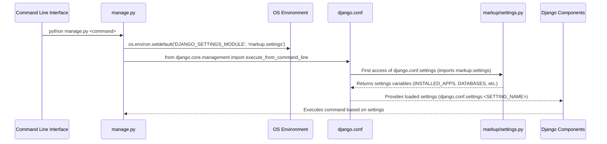

# Chapter 3: Settings Configuration

In the previous chapter, we explored the utility of the `manage.py` script as our primary command-line interface for interacting with our "markup" project, performing various administrative tasks such as starting the development server or managing database migrations. The power of these commands, however, is deeply rooted in how our project is configured. This is where **Settings Configuration** comes into play, providing the blueprint for every operation and interaction within our Django application.

---

### Problem & Motivation

Imagine building a complex application without a central control panel. How would you tell it which database to connect to, which modules to load, or whether it's running in a development or production environment? Without a clear, unified way to define these parameters, the project would quickly become disorganized, inflexible, and prone to errors.

This is the very problem `settings.py` solves in our "markup" project. It acts as the single source of truth for all project-wide configurations. It's crucial because it dictates everything from security protocols and database connections to installed applications and static file locations. Without `settings.py`, your Django project wouldn't know how to run, rendering `manage.py` commands ineffective, as they rely on these very settings to execute correctly.

Consider a practical use case: You're developing a new feature that requires a new Django app and needs to connect to a PostgreSQL database. How do you inform your project about this new app and the database connection details? `settings.py` provides the exact mechanism for this, allowing you to seamlessly integrate new components and configure your project's operational environment.

---

### Core Concept Explanation

The `settings.py` file is essentially a plain Python module that contains all the configuration variables for your Django project. Think of it as the brain or the central nervous system of your "markup" web application. When Django starts up, it looks for this file to understand how it should behave. Every crucial decision, from what features are available to how security is handled, is influenced by the values defined here.

At its heart, `settings.py` is comprised of Python variables, each serving a specific purpose. For instance, `INSTALLED_APPS` is a list of all Django applications active in your project, while `DATABASES` defines connection parameters for your database. Other critical settings include `SECRET_KEY` for cryptographic signing, `DEBUG` for toggling development mode, and `ALLOWED_HOSTS` for specifying the domain names your Django project can serve.

These settings are not just static values; they can be dynamic, allowing you to define different configurations for various environments (e.g., development, testing, production). This modularity and centralization prevent redundant configurations and provide a clear, hierarchical structure for managing your project's operational parameters. Understanding `settings.py` is fundamental to developing, deploying, and maintaining any Django application.

---

### Practical Usage Examples

Let's walk through how to configure our "markup" project using `settings.py` to address our motivating use case: adding a new app and configuring a database.

First, when you create a Django project, a basic `settings.py` is generated. Here's a simplified view:

```python
# markup/settings.py
import os

BASE_DIR = os.path.dirname(os.path.dirname(os.path.abspath(__file__)))

SECRET_KEY = 'your_super_secret_key' # Keep this secret!
DEBUG = True
ALLOWED_HOSTS = []

INSTALLED_APPS = [
    'django.contrib.admin',
    'django.contrib.auth',
    # ... other default apps
]

DATABASES = {
    'default': {
        'ENGINE': 'django.db.backends.sqlite3',
        'NAME': os.path.join(BASE_DIR, 'db.sqlite3'),
    }
}
# ... more settings
```
This initial setup defines basic paths, a placeholder `SECRET_KEY`, enables debug mode, and configures a default SQLite database. It's a functional starting point for any Django project.

Now, to add a new app (let's call it `features`) and register it with our project, we simply append it to the `INSTALLED_APPS` list:

```python
# markup/settings.py (snippet)
INSTALLED_APPS = [
    'django.contrib.admin',
    'django.contrib.auth',
    'django.contrib.contenttypes',
    'django.contrib.sessions',
    'django.contrib.messages',
    'django.contrib.staticfiles',
    'features', # Our new app!
]
```
After adding `'features'` to `INSTALLED_APPS`, Django becomes aware of this new application and will include its models, templates, and other components when running management commands like `makemigrations` or `migrate`.

Next, let's configure our project to use a PostgreSQL database instead of SQLite. We modify the `DATABASES` dictionary:

```python
# markup/settings.py (snippet)
DATABASES = {
    'default': {
        'ENGINE': 'django.db.backends.postgresql',
        'NAME': 'mydatabase',
        'USER': 'mydatabaseuser',
        'PASSWORD': 'mypassword',
        'HOST': 'localhost',
        'PORT': '', # leave empty for default
    }
}
```
This snippet configures the default database connection to use PostgreSQL. Remember to install `psycopg2` (e.g., `pip install psycopg2-binary`) for PostgreSQL support. These settings tell Django how to connect to, authenticate with, and interact with your chosen database.

Finally, for security and proper operation in a production environment, you'd configure `DEBUG` and `ALLOWED_HOSTS`:

```python
# markup/settings.py (snippet)
SECRET_KEY = os.environ.get('DJANGO_SECRET_KEY', 'default-safe-key-for-dev')
DEBUG = os.environ.get('DJANGO_DEBUG', 'True') == 'True'
ALLOWED_HOSTS = ['yourdomain.com', 'www.yourdomain.com', 'localhost', '127.0.0.1']
```
Here, `SECRET_KEY` and `DEBUG` are fetched from environment variables, which is a best practice for security. `ALLOWED_HOSTS` specifies which host headers Django will respond to, preventing certain types of web attacks.

---

### Internal Implementation Walkthrough

When you execute a Django management command, such as `python manage.py runserver`, a specific sequence of events unfolds to load and apply your project settings.

1.  **`manage.py` Initialization**: The `manage.py` script is the first point of entry. It sets up the Python path and, crucially, defines the `DJANGO_SETTINGS_MODULE` environment variable. This variable tells Django where to find your project's settings file. By default, for a project named `markup`, this would be `markup.settings`.

    ```python
    # manage.py (simplified snippet)
    #!/usr/bin/env python
    import os
    import sys

    if __name__ == '__main__':
        os.environ.setdefault('DJANGO_SETTINGS_MODULE', 'markup.settings')
        try:
            from django.core.management import execute_from_command_line
        except ImportError as exc:
            # ... error handling ...
        execute_from_command_line(sys.argv)
    ```
    This line `os.environ.setdefault('DJANGO_SETTINGS_MODULE', 'markup.settings')` is critical. It ensures that Django knows exactly which Python module to import for configuration.

2.  **Settings Loading by `django.conf`**: Once `DJANGO_SETTINGS_MODULE` is set, the `django.conf.settings` object comes into play. This is a proxy object that lazily loads the settings module defined by `DJANGO_SETTINGS_MODULE` the first time any setting is accessed.

3.  **Module Import**: `django.conf.settings` imports your `markup/settings.py` file as a regular Python module. All variables defined in `settings.py` (e.g., `INSTALLED_APPS`, `DATABASES`, `SECRET_KEY`) become attributes of the `django.conf.settings` object.

4.  **Configuration Application**: After the settings are loaded, Django components throughout your project (e.g., the ORM, the URL resolver, the templating engine) access these values directly from `django.conf.settings` to configure their behavior.

This process ensures that all parts of your Django project operate under a consistent and centrally defined configuration.


This diagram illustrates how `manage.py` initiates the loading of settings via the environment, which is then processed by `django.conf` to expose the configuration to all other Django components.

---

### System Integration

The `settings.py` file is deeply integrated into almost every part of a Django project, serving as the foundational layer for its operations.

-   **With [Django Management Command](chapter_02.md)**: As seen, `manage.py` explicitly loads `settings.py`. Commands like `makemigrations` use `INSTALLED_APPS` and `DATABASES`, while `runserver` uses `DEBUG` and `ALLOWED_HOSTS`. Any command that interacts with your project's features depends on these configurations.

-   **With [WSGI Application](chapter_04.md)**: For deployment, the `wsgi.py` file also needs to know which settings to load. It typically contains `os.environ.setdefault('DJANGO_SETTINGS_MODULE', 'markup.settings')`, ensuring your deployed application uses the correct production settings.
    ```python
    # markup/wsgi.py (snippet)
    import os
    from django.core.wsgi import get_wsgi_application

    os.environ.setdefault('DJANGO_SETTINGS_MODULE', 'markup.settings')

    application = get_wsgi_application()
    ```
    This snippet ensures that when a WSGI server (like Gunicorn or uWSGI) loads your application, it uses the specified settings.

-   **With [URL Dispatcher](chapter_06.md)**: Settings like `STATIC_URL` and `MEDIA_URL` are crucial for configuring how Django serves static and media files. The URL dispatcher might use these values to route requests to the correct file serving views.

-   **With [Views](chapter_07.md)**: While generally discouraged for business logic, views can access settings if needed, for example, to check `settings.DEBUG` to alter behavior or retrieve an API key.
    ```python
    # An example view (not recommended for general use)
    from django.conf import settings
    from django.http import HttpResponse

    def my_view(request):
        if settings.DEBUG:
            message = "Debug mode is ON!"
        else:
            message = "Debug mode is OFF."
        return HttpResponse(message)
    ```
    This demonstrates direct access to settings variables within a view.

-   **With [Python Package Initialization](chapter_08.md)**: The `__init__.py` files of your apps can sometimes rely on settings being loaded for initial setup, though this is less common for core settings.

The flow of data and configuration from `settings.py` permeates the entire Django application, ensuring consistency and proper operation across all components.

---

### Best Practices & Tips

To leverage `settings.py` effectively and securely, consider these best practices:

-   **Environment Variables for Sensitive Data**: Never hardcode sensitive information like `SECRET_KEY` or database passwords directly in `settings.py` if the file is committed to version control. Instead, use environment variables.
    ```python
    # Good practice for SECRET_KEY
    import os
    SECRET_KEY = os.environ.get('DJANGO_SECRET_KEY', 'insecure-fallback-for-dev')
    ```
    This allows `SECRET_KEY` to be injected at runtime, making your code safer.

-   **Separate Settings for Environments**: For projects with different development, testing, and production needs, create separate settings files.
    ```
    markup/
    ├── settings/
    │   ├── __init__.py
    │   ├── base.py
    │   ├── development.py
    │   └── production.py
    └── manage.py
    ```
    In `manage.py` or your WSGI configuration, you can then set `DJANGO_SETTINGS_MODULE` to `markup.settings.development` or `markup.settings.production` accordingly. In `development.py` and `production.py`, you'd typically import from `base.py` and override specific settings.
    ```python
    # settings/development.py
    from .base import *
    DEBUG = True
    ALLOWED_HOSTS = ['localhost', '127.0.0.1']
    # DATABASES might be SQLite for development
    ```

-   **`DEBUG = False` in Production**: Always set `DEBUG = False` for production environments. Leaving `DEBUG = True` exposes sensitive information, such as detailed error messages, which can be a security risk. When `DEBUG = False`, `ALLOWED_HOSTS` becomes mandatory.

-   **Order of `INSTALLED_APPS`**: The order of applications in `INSTALLED_APPS` can sometimes matter, especially if apps override templates or static files from earlier apps. Generally, put core Django apps first, then third-party apps, then your project's apps.

-   **Keep `settings.py` Clean**: Avoid adding complex logic or business logic directly into `settings.py`. It should primarily be a configuration file. For reusable logic, create separate utility modules.

---

### Chapter Conclusion

We've covered the vital role of `settings.py` as the configuration hub for our "markup" project. From defining database connections and installed applications to managing security-critical variables, `settings.py` dictates the fundamental behavior of our Django application. We've seen how it solves the problem of decentralized configuration, enables flexibility through environment-specific settings, and how its values are accessed throughout the project. Understanding its internal loading mechanism and adopting best practices for security and maintainability are crucial steps in building robust Django applications.

With a solid grasp of how our project is configured, we're now ready to delve into how Django applications interact with the web server. The next chapter will explore the **WSGI Application**, understanding its role in serving our configured Django project.

Continue to: [WSGI Application](chapter_04.md)