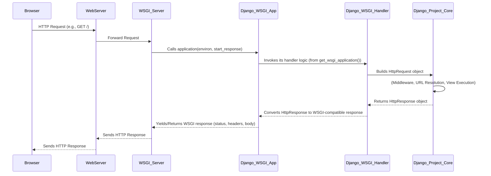

# Chapter 4: WSGI Application

In the previous chapter, we explored the crucial role of the [Settings Configuration](chapter_03.md) (`settings.py`) in defining the operational parameters and overall behavior of our Django project. We learned how this file acts as the control center, dictating everything from database connections to security keys. However, for a Django project to be accessible over the web, there needs to be a standardized way for web servers to communicate with our Python application. This is precisely where the WSGI Application comes into play.

---

### Problem & Motivation

Imagine you've built a fantastic Django application with all your settings perfectly configured. Now, how does a user's web browser, through a web server like Nginx or Apache, actually *talk* to your Python code? Without a common language or interface, every web server would need custom logic to understand and execute your Django application. This would lead to a chaotic and inefficient ecosystem where deploying Python web applications would be a constant struggle.

The core problem is bridging the gap between a generic web server (which primarily understands HTTP requests and responses) and a specific Python web application (which operates on Python objects and logic). This abstraction is crucial for the "markup" project because it provides the fundamental entry point for all incoming web requests. It's the gatekeeper that allows your project, with all its configured settings, to receive and respond to user interactions over the internet.

Consider a user trying to access `http://your-domain.com/posts/latest/`. The web server receives this request. How does it know to hand it over to your Django project? And how does your Django project process it and return the correct HTML? The WSGI Application is the answer, providing a clear contract for this interaction.

---

### Core Concept Explanation

WSGI stands for **Web Server Gateway Interface**. It's not a server, a module, or an API framework; it's a **specification** – a set of rules that defines a standard interface between web servers and Python web applications. Think of it as a universal plug-and-socket design for Python web development. If a web server knows how to "plug" into a WSGI application, and your Python application knows how to "fit" the WSGI socket, they can communicate seamlessly.

For our "markup" Django project, the `wsgi.py` file contains the WSGI application object. This object is a simple Python callable (like a function or a class instance with a `__call__` method) that accepts two arguments:
1.  `environ`: A dictionary containing CGI-style environment variables and HTTP request metadata.
2.  `start_response`: A callable provided by the web server, which the application uses to send HTTP status and response headers.

Django automatically generates a `wsgi.py` file when you create a new project. This file provides the `application` callable that acts as the entry point for all web requests, directing them into Django's request processing pipeline. It essentially tells the web server, "Here's how you hand me a request, and here's how I'll give you back a response." This standardization allows Django applications to be deployed with a variety of WSGI-compatible web servers and application servers (like Gunicorn, uWSGI, or Apache with mod_wsgi) without requiring any changes to Django's core code.

---

### Practical Usage Examples

When you run `python manage.py runserver`, Django uses an internal development server that understands WSGI. In a production environment, you'd typically use a dedicated WSGI server. Let's look at the standard `wsgi.py` file found in your Django project:

```python
# markup/markup/wsgi.py
"""
WSGI config for markup project.

It exposes the WSGI callable as a module-level variable named ``application``.

For more information on this file, see
https://docs.djangoproject.com/en/stable/howto/deployment/wsgi/
"""

import os

from django.core.wsgi import get_wsgi_application

# Point to the settings file for this project
os.environ.setdefault('DJANGO_SETTINGS_MODULE', 'markup.settings')

# This is the actual WSGI application callable
application = get_wsgi_application()
```
*Explanation*: This `wsgi.py` file first imports `os` and `get_wsgi_application` from Django. Crucially, `os.environ.setdefault('DJANGO_SETTINGS_MODULE', 'markup.settings')` tells Django *which* settings file to use. Finally, `application = get_wsgi_application()` retrieves the actual WSGI application instance. This `application` variable is what a WSGI server looks for and calls.

Consider a simple request for the root URL `/`. Here's how it interacts with the `application` callable:

```python
# Conceptual example of a WSGI server calling our application
# This code is NOT part of your Django project, but illustrates how a WSGI server works.

import io

# Assume 'application' is imported from markup.wsgi
# from markup.wsgi import application

# Mock WSGI application for demonstration
def mock_django_application(environ, start_response):
    if environ['PATH_INFO'] == '/':
        status = '200 OK'
        headers = [('Content-type', 'text/html')]
        start_response(status, headers)
        return [b"<h1>Welcome to Markup!</h1>"]
    else:
        status = '404 Not Found'
        headers = [('Content-type', 'text/plain')]
        start_response(status, headers)
        return [b"Page not found."]

# Simplified 'environ' dictionary for a GET request to /
mock_environ = {
    'REQUEST_METHOD': 'GET',
    'PATH_INFO': '/',
    'SERVER_NAME': 'localhost',
    'SERVER_PORT': '8000',
    # ... other environment variables
}

# Simplified 'start_response' callable
response_status = ""
response_headers = []
def mock_start_response(status, headers):
    global response_status, response_headers
    response_status = status
    response_headers = headers
    return io.BytesIO().write # This return value is often ignored by simple servers

# Call the application
response_body_iterable = mock_django_application(mock_environ, mock_start_response)

print(f"Status: {response_status}")
print(f"Headers: {response_headers}")
print(f"Body: {b''.join(response_body_iterable).decode()}")
```
*Expected Output*:
```
Status: 200 OK
Headers: [('Content-type', 'text/html')]
Body: <h1>Welcome to Markup!</h1>
```
*Explanation*: This example demonstrates the fundamental interaction. A WSGI server would construct the `environ` dictionary with details from the HTTP request. It would then provide its own `start_response` function. When `application(environ, start_response)` is called (our `mock_django_application` for illustration), it processes the request. It uses `start_response` to send the HTTP status and headers, and then returns an iterable (like a list) of byte strings representing the response body.

---

### Internal Implementation Walkthrough

The `application` variable in `wsgi.py` is an instance returned by `django.core.wsgi.get_wsgi_application()`. This function essentially constructs and returns Django's core WSGI handler.

When a WSGI server receives an HTTP request, it translates that request into the `environ` dictionary (containing request method, path, headers, etc.) and provides a `start_response` callable. It then calls the `application` object with these two arguments:

1.  **Server Calls `application(environ, start_response)`**: The WSGI server executes the `application` callable.
2.  **Django's `WSGIHandler` is Invoked**: Inside `get_wsgi_application()`, Django creates an instance of `django.core.handlers.wsgi.WSGIHandler`. This handler is responsible for taking the `environ` dictionary and `start_response` callable and turning them into Django's internal `HttpRequest` and `HttpResponse` objects.
3.  **Request Setup**: The `WSGIHandler` processes the `environ` to construct an `HttpRequest` object, which encapsulates all details of the incoming request. This includes parsing headers, query parameters, request body, etc.
4.  **Middleware Processing**: The `HttpRequest` object then passes through a chain of [Middleware](https://docs.djangoproject.com/en/stable/topics/http/middleware/) (concept not yet covered in detail, but vital). Each middleware can modify the request or response, or even short-circuit the processing.
5.  **URL Resolution**: The request proceeds to the [URL Dispatcher](chapter_06.md), which attempts to match the requested URL (`PATH_INFO` from `environ`) to a defined URL pattern in your `urls.py`.
6.  **View Execution**: If a match is found, the associated [View](chapter_07.md) function or class method is executed, receiving the `HttpRequest` object and any captured URL parameters.
7.  **Response Generation**: The view returns an `HttpResponse` object.
8.  **Middleware Processing (Response)**: The `HttpResponse` object then travels back through the middleware chain in reverse order, allowing middleware to modify the response before it's sent back to the client.
9.  **Response Conversion**: The `WSGIHandler` converts the `HttpResponse` object back into a status string, a list of header tuples, and an iterable of byte strings suitable for the `start_response` callable and the WSGI server.
10. **Server Receives Response**: The WSGI server uses the `start_response` function to send HTTP status and headers, and then iterates over the returned response body to send the actual content back to the client.

Here's a simplified sequence diagram illustrating the flow:



---

### System Integration

The WSGI Application is the critical bridge connecting the external world (web servers) to the internal workings of your Django project.

*   **Connects to [Settings Configuration](chapter_03.md)**: The line `os.environ.setdefault('DJANGO_SETTINGS_MODULE', 'markup.settings')` in `wsgi.py` explicitly links the WSGI application to your project's `settings.py` file. Without this, Django wouldn't know which configurations to load for the application.
*   **Feeds the [HTTP Request Object](chapter_05.md)**: The incoming HTTP request data, encapsulated in the `environ` dictionary by the WSGI server, is used by Django's `WSGIHandler` to construct the `HttpRequest` object. This object is the cornerstone for all subsequent processing within Django.
*   **Receives from Web Servers**: It acts as the "application" side of the server-gateway interface, ready to accept connections from WSGI-compatible web servers like Gunicorn, uWSGI, or mod_wsgi.
*   **Outputs to Web Servers**: It provides a standard output format (status, headers, iterable body) that these servers understand and can convert back into an HTTP response for the client.

Essentially, the WSGI application is the first piece of *your* Django code that a web server interacts with, acting as the designated entry point for all web traffic that your project needs to handle.

---

### Best Practices & Tips

*   **Use a Production WSGI Server**: Never use `manage.py runserver` in production. It's a development server only. For production, deploy your "markup" project with a robust WSGI server like Gunicorn (recommended for most Python projects), uWSGI, or Apache with `mod_wsgi`. These servers are designed for performance, security, and stability.
*   **Environment Variables for Settings**: While `wsgi.py` hardcodes `DJANGO_SETTINGS_MODULE`, it's common practice in production to load sensitive settings (like `SECRET_KEY`, database credentials) using environment variables (e.g., `os.environ.get('SECRET_KEY')` in `settings.py`). This enhances security and flexibility.
*   **Understand the `application` Callable**: Remember that the `application` variable in `wsgi.py` is just a standard Python callable. You can even wrap it with custom logic if needed, though this is rare for most Django projects.
    ```python
    # Example: Wrapping the default Django WSGI application
    # markup/markup/wsgi.py

    import os
    from django.core.wsgi import get_wsgi_application

    os.environ.setdefault('DJANGO_SETTINGS_MODULE', 'markup.settings')

    _application = get_wsgi_application() # Get Django's original application

    def application(environ, start_response):
        # You could add custom logic here before or after Django processes the request
        # For example, logging all requests or modifying environ
        print(f"Incoming request for: {environ.get('PATH_INFO')}")
        response = _application(environ, start_response)
        # You could also process the response here before it's sent back
        return response
    ```
    *Explanation*: This advanced pattern shows how you can intercept the WSGI call to `application` to add custom logic, like logging, before Django's internal `WSGIHandler` takes over.
*   **Security Considerations**: Ensure your WSGI server is properly configured with security in mind (e.g., running with appropriate user permissions, protected by a reverse proxy like Nginx).

---

### Chapter Conclusion

The WSGI Application, encapsulated in your `wsgi.py` file, is the essential bridge that transforms raw HTTP requests from a web server into a format your Django project can understand and process. It's a critical component that enables your "markup" project to communicate with the outside world, acting as the initial entry point for all web traffic. By providing a standardized interface, WSGI allows Django applications to be flexible and deployable across various server environments.

Understanding WSGI is fundamental to deploying and scaling your Django applications effectively. With the `application` callable as our starting point, the next logical step is to delve into how Django represents and processes the actual request coming into this application. This leads us to the [HTTP Request Object](chapter_05.md), which is the primary way Django encapsulates all the details of an incoming web request.

---
[HTTP Request Object](chapter_05.md)