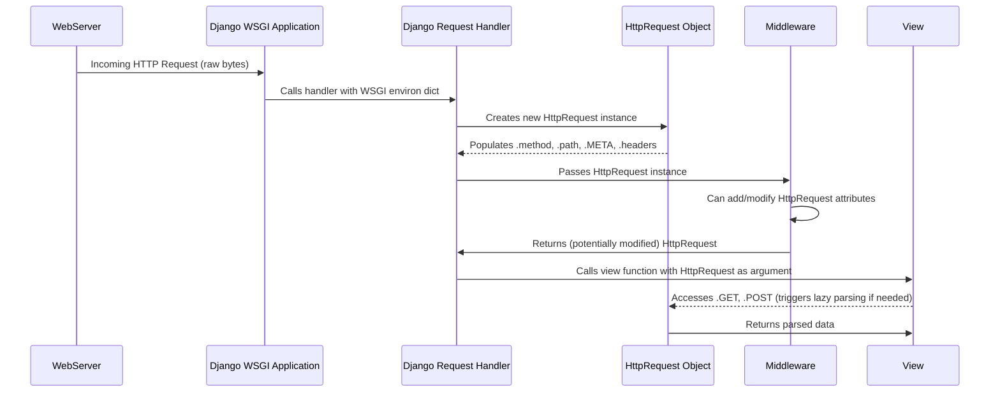

# Chapter 5: HTTP Request Object

Having understood how the [WSGI Application](chapter_04.md) serves as the bridge between a web server and our Django project, processing raw requests and preparing the environment, the next crucial step is for Django to interpret that environment. This interpretation leads us directly to the **HTTP Request Object**.

---

## Problem & Motivation

Imagine a busy restaurant kitchen. Orders come in from many tables, sometimes for food, sometimes just for water, sometimes with special instructions. The kitchen needs a clear, structured way to understand *each specific order* – what dish, what modifications, who placed it, and whether it's a new order or a change to an existing one. Without this structure, chaos would ensue.

In the world of web applications, every interaction a user has with our "markup" project, from typing a URL into their browser to clicking a submit button on a form, generates an **HTTP Request**. This request is essentially a digital "order" from the client (browser) to our server. It contains vital information: what resource is being asked for (e.g., `/products/123/`), how it's being asked for (e.g., `GET` to retrieve, `POST` to send data), any additional headers (like browser type, authentication tokens), and potentially submitted data (like form fields).

The problem is that the raw data from the WSGI environment is a complex dictionary of strings, not easily digestible for application logic. Django needs to transform this raw, fragmented information into a single, cohesive, and easy-to-use entity. This is precisely what the **HTTP Request Object** solves. It's the standardized "order form" that encapsulates all the client's intentions, allowing our Django application to react intelligently and build an appropriate response. Without it, processing user input and routing requests would be incredibly cumbersome and error-prone.

---

## Core Concept Explanation

At the heart of handling any client-server interaction in Django lies the **`HttpRequest` object**. For every single web request that reaches our Django application, Django meticulously constructs an instance of this `HttpRequest` class. Think of it as a comprehensive dossier or a passport that contains *everything* Django needs to know about the client's current interaction.

This `HttpRequest` object isn't just a simple container; it's an intelligent abstraction that parses and organizes the raw incoming request data into easily accessible attributes. Instead of sifting through obscure WSGI environment variables, our Django code can simply access `request.method` to know if it's a `GET` or `POST` request, `request.GET` for URL query parameters, or `request.POST` for data submitted via an HTML form. This standardization significantly simplifies application development, allowing developers to focus on business logic rather than low-level request parsing.

The `HttpRequest` object acts as the primary input for Django's view functions and middleware. It carries the request throughout the processing pipeline, ensuring that every component has access to the complete context of the client's demand. It's the central piece of information that dictates how the application should behave for a specific user interaction, from authentication checks to database queries and ultimately, rendering a response.

---

## Practical Usage Examples

Let's illustrate how to interact with the `HttpRequest` object within a typical Django view to address our motivating use case of understanding what the user wants. We'll use a simple Django view (which we'll explore more deeply in a later chapter) to demonstrate.

Suppose a user visits `/greet/?name=Alice` or submits a form with a `username` field.

### Example 1: Accessing GET Parameters

When a user visits a URL like `http://localhost:8000/greet/?name=Alice&city=NewYork`, the data after the `?` are called *GET parameters* or *query strings*. The `HttpRequest` object makes these easily accessible.

```python
# In a Django app's views.py
from django.http import HttpResponse

def greet_user(request):
    # Check if 'name' parameter exists in the URL query string
    if 'name' in request.GET:
        user_name = request.GET['name'] # Access the 'name' parameter value
        greeting = f"Hello, {user_name}!"
    else:
        greeting = "Hello, anonymous user!"

    return HttpResponse(greeting)
```
In this snippet, `request.GET` is a dictionary-like object that holds all the URL query parameters. We can access values using dictionary-style keys. It's safer to use `.get()` to provide a default value if the key might not exist.

```python
# Safer way to access GET parameters
def greet_user_safe(request):
    user_name = request.GET.get('name', 'Guest') # 'Guest' is the default if 'name' isn't provided
    city = request.GET.get('city') # Will be None if 'city' isn't provided

    if city:
        greeting = f"Hello, {user_name} from {city}!"
    else:
        greeting = f"Hello, {user_name}!"

    return HttpResponse(greeting)
```
Using `request.GET.get('key', default_value)` is a best practice as it prevents `KeyError` if a parameter is optional.

### Example 2: Handling POST Data (Form Submission)

When a user submits an HTML form with `method="POST"`, the data is sent in the request body. `request.POST` handles this data.

First, an example HTML form:
```html
<!-- In an HTML template -->
<form method="post" action="/submit-form/">
     <!-- Django's security token -->
    <input type="text" name="username" placeholder="Your Username">
    <input type="password" name="password" placeholder="Your Password">
    <button type="submit">Submit</button>
</form>
```

Now, the Django view to process this form:
```python
# In a Django app's views.py
from django.http import HttpResponseRedirect
from django.shortcuts import render

def handle_form_submission(request):
    if request.method == 'POST': # Check if the request is a POST request
        username = request.POST.get('username') # Get data from the form field named 'username'
        password = request.POST.get('password') # Get data from the form field named 'password'

        if username and password:
            # Process the data (e.g., save to database, authenticate user)
            print(f"User '{username}' submitted password: '{password}'")
            return HttpResponseRedirect('/success/') # Redirect after successful POST
        else:
            return HttpResponse("Username and password are required.", status=400)
    else:
        # If it's a GET request, just render the form
        return render(request, 'my_form_template.html')
```
Here, `request.method` tells us the HTTP method used. `request.POST` is another dictionary-like object for form data. Using `request.POST.get()` is again crucial for robustness. Django's `HttpResponseRedirect` is often used after successful POST requests to prevent double submissions.

### Example 3: Inspecting Request Headers and Body

The `HttpRequest` object also provides access to headers and the raw request body.

```python
# In a Django app's views.py
from django.http import HttpResponse

def debug_request(request):
    output = []
    output.append(f"HTTP Method: {request.method}")
    output.append(f"Path: {request.path}")
    output.append(f"Is AJAX? {request.headers.get('X-Requested-With') == 'XMLHttpRequest'}")

    # Accessing specific headers
    user_agent = request.headers.get('User-Agent', 'Unknown')
    output.append(f"User Agent: {user_agent}")

    # Accessing raw request body (e.g., for JSON or XML APIs)
    if request.body:
        output.append(f"Raw Body: {request.body.decode('utf-8')}")

    return HttpResponse("<br>".join(output))
```
`request.headers` is a dictionary-like object for all HTTP headers. `request.body` contains the raw content of the HTTP request body as bytes. It's often decoded to a string if it's text-based (like JSON).

---

## Internal Implementation Walkthrough

When the [WSGI Application](chapter_04.md) hands over the raw request environment, Django's core machinery springs into action to construct the `HttpRequest` object. This process ensures that by the time our view code is executed, a fully parsed and standardized object is ready for use.

1.  **WSGI Environment Reception**: The WSGI server (e.g., Gunicorn, uWSGI) calls the Django WSGI application, passing it the `environ` dictionary (containing request details) and a `start_response` callable.

2.  **`WSGIRequest` Creation**: Django's `django.core.handlers.wsgi.WSGIHandler` is the entry point. It takes the `environ` dictionary and uses it to instantiate a `WSGIRequest` object. `WSGIRequest` is a subclass of `HttpRequest`, adding WSGI-specific parsing.

3.  **Basic Attribute Population**: The `WSGIRequest` constructor immediately populates basic attributes directly from the `environ` dictionary:
    *   `request.method` (from `environ['REQUEST_METHOD']`)
    *   `request.path` (from `environ['PATH_INFO']`)
    *   `request.META` (a dictionary holding all WSGI environment variables and HTTP headers prefixed with `HTTP_`)
    *   `request.headers` (a more user-friendly, case-insensitive access to HTTP headers, built from `request.META`)

4.  **Lazy Parsing for `GET` and `POST`**: `request.GET` and `request.POST` are not populated immediately. They are *lazy-loaded*. This means Django only parses the query string or the request body when you first try to access `request.GET` or `request.POST`. This optimization saves resources if your view doesn't need to access these parameters.
    *   **`request.GET`**: When accessed, Django parses `environ['QUERY_STRING']` into a `QueryDict`.
    *   **`request.POST`**: When accessed (and `request.method` is `POST`, `PUT`, or `PATCH`), Django reads the request body from `environ['wsgi.input']`, parses it according to the `Content-Type` header (e.g., `application/x-www-form-urlencoded`, `multipart/form-data`), and populates another `QueryDict`.
    *   **`request.FILES`**: If the `Content-Type` is `multipart/form-data` and contains file uploads, `request.FILES` is populated similarly.

5.  **Middleware Processing**: After the `HttpRequest` object is created, it's passed through Django's middleware chain. Middleware can inspect, modify, or even add new attributes to the `request` object before it reaches the view.

Here's a simplified sequence diagram of how the `HttpRequest` object comes to life:



---

## System Integration

The `HttpRequest` object is a central pillar in the Django request/response cycle, acting as the primary input for several core components:

1.  **From WSGI Application**: As discussed, the [WSGI Application](chapter_04.md) is responsible for receiving the raw HTTP request from the web server and converting it into a standard Python environment dictionary. Django's internal handlers then use this dictionary to construct the `HttpRequest` object. It's the first step in translating network protocol data into application-level understanding.

2.  **To URL Dispatcher**: Once the `HttpRequest` object is created, it's immediately handed over to the [URL Dispatcher](chapter_06.md). The dispatcher uses `request.path` (and sometimes `request.method`) to match the incoming URL against the configured URL patterns (`urls.py`). This is how Django determines *which view function* should handle the specific request.

3.  **To Views**: The most direct interaction with `HttpRequest` is within Django's [Views](chapter_07.md). Every view function or method receives the `HttpRequest` object as its first argument. Views then use this object to:
    *   Determine the request method (`GET`, `POST`).
    *   Extract parameters from the URL (`request.GET`).
    *   Retrieve form data (`request.POST`).
    *   Access uploaded files (`request.FILES`).
    *   Read HTTP headers (`request.headers`).
    *   Manage user sessions (`request.session`) and authentication (`request.user`).
    *   Ultimately, views use this information to perform logic and construct an `HttpResponse` object.

4.  **With Middleware**: Django's middleware components (e.g., `AuthenticationMiddleware`, `SessionMiddleware`, `CsrfViewMiddleware`) sit between the request handler and the view. They can inspect the `HttpRequest` object, add new attributes to it (like `request.user` or `request.session`), or even return an `HttpResponse` directly, short-circuiting the request before it reaches the view.

The `HttpRequest` object is the common thread, ensuring that a consistent and complete representation of the client's request is available throughout Django's processing pipeline, from the moment it enters the application until the response is generated.

---

## Best Practices & Tips

Working with the `HttpRequest` object effectively is key to building robust and secure Django applications.

*   **Always use `.get()` for dictionary-like access**: When accessing `request.GET`, `request.POST`, `request.FILES`, or `request.session`, prefer `request.GET.get('key', default_value)` over `request.GET['key']`. This prevents `KeyError` exceptions if the key is not present, making your code more resilient.

    ```python
    # Bad practice (can raise KeyError)
    # user_id = request.GET['id']

    # Good practice
    user_id = request.GET.get('id', None) # Default to None if 'id' is not present
    ```

*   **Sanitize and Validate User Input**: Data from `request.GET` and `request.POST` comes directly from the client. Never trust this data implicitly. Always sanitize it (e.g., remove harmful characters) and validate it (e.g., ensure it's the correct type, within expected range) before using it, especially when interacting with databases or rendering HTML. Django Forms are an excellent tool for this.

*   **Understand HTTP Methods (GET vs. POST)**:
    *   Use `GET` for requests that *retrieve* data and have no side effects (i.e., making the same request multiple times should yield the same result and not change server state). Example: fetching a blog post.
    *   Use `POST` for requests that *submit* data and may have side effects (e.g., creating a new resource, updating data). Example: submitting a form to create a new user.
    *   Always check `request.method` to ensure you're handling the correct type of request for your view's purpose.

*   **Redirect after POST**: After successfully processing a `POST` request that modifies data, it's a best practice to return an `HttpResponseRedirect` to a new URL (often a "success" page or the original page). This prevents users from accidentally re-submitting data if they refresh the page (the "double-submit problem").

    ```python
    # After processing POST data
    # return HttpResponse("Success!") # Bad practice: refresh can re-POST
    from django.http import HttpResponseRedirect
    # return HttpResponseRedirect('/success-page/') # Good practice
    ```

*   **Don't modify `HttpRequest` directly in views**: While you can theoretically add attributes to `request` (e.g., `request.my_custom_data = 'foo'`), it's generally discouraged in views. Middleware is the appropriate place to add custom data to the request object, ensuring consistency across your application.

*   **Leverage `request.session` and `request.user`**: For managing user state across multiple requests and handling authentication, `request.session` (provided by `SessionMiddleware`) and `request.user` (provided by `AuthenticationMiddleware`) are powerful features built into Django. We will delve into these in later chapters, but be aware that they are attributes of the `HttpRequest` object.

---

## Chapter Conclusion

The `HttpRequest` object is fundamental to every Django application, serving as the detailed, structured representation of an incoming web request. From its creation out of the raw WSGI environment to its use in discerning HTTP methods, extracting parameters, and carrying essential information through middleware to your view functions, it acts as the primary conduit for client-server communication within the "markup" project.

Understanding how to effectively interact with `request.GET`, `request.POST`, and other attributes of this object is crucial for processing user input, managing application state, and ultimately, generating dynamic web content. It allows our application to intelligently respond to the diverse demands of web clients.

As we move forward, the `HttpRequest` object becomes the central piece of information that the **URL Dispatcher** uses to decide which part of our application should handle the incoming request.

Onwards to [URL Dispatcher](chapter_06.md), where we'll see how Django routes these rich `HttpRequest` objects to the correct destination!