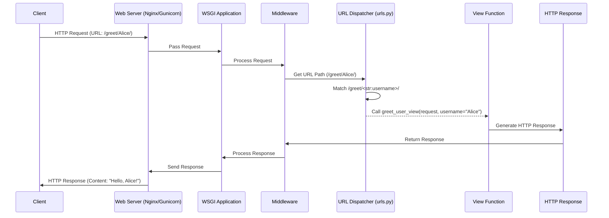

# Chapter 6: URL Dispatcher

In the previous chapter, we explored the [HTTP Request Object](chapter_05.md) and understood how Django encapsulates all incoming client data into a convenient object. This `request` object represents the raw communication from the browser or client. However, a web application doesn't just receive requests; it needs to know *what to do* with them. This is where the URL Dispatcher comes into play, acting as the intelligent router that directs each request to its appropriate handler.

---

### Problem & Motivation

Imagine building a large building with many different departments – a reception, an accounting office, a sales floor, and an engineering lab. When a visitor arrives, they don't just walk into any random room; they go to the specific department that can address their needs. In a web application, this "visitor" is the incoming [HTTP Request Object](chapter_05.md), and the "departments" are the different pieces of Python code (called *views*) designed to handle specific tasks, like showing a user profile, displaying a product list, or processing a form submission.

Without a central traffic controller, your web application would have no way to connect a specific web address (URL) like `/products/electronics/` to the Python code responsible for listing electronic products. The problem the URL dispatcher solves is precisely this: **how do we map human-readable URLs to the specific functions or classes that will generate a response?** In our "markup" project, this is crucial for providing a navigable, functional website where each address correctly serves its intended content or performs its designated action.

For example, if a user navigates to `yourdomain.com/about/`, the dispatcher needs to know that this URL should be handled by the `about_page` function. If they go to `yourdomain.com/blog/2023/10/my-first-post/`, it needs to map that to a `blog_detail` function and extract `2023`, `10`, and `my-first-post` as arguments.

---

### Core Concept Explanation

The **URL Dispatcher** in Django is the mechanism that takes an incoming HTTP request's URL path and determines which *view* function or class should process it. It does this by comparing the URL against a list of predefined patterns, known as **URL patterns** or **URL routes**. This list is typically defined in a Python file named `urls.py`.

Think of the URL dispatcher as a receptionist with a detailed directory. When a request (visitor) comes in, the receptionist (dispatcher) looks at the requested address (URL path) and cross-references it with their directory (the `urlpatterns` list in `urls.py`). Once a match is found, the receptionist directs the visitor to the corresponding office (the *view* function) and might even pass along specific details (like an ID number from the URL) relevant to their visit.

Each URL pattern consists of a regular expression or a path string that matches a part of the URL, and the view function or class that should be called when that pattern is matched. Django processes these patterns in order, from top to bottom, stopping at the first match it finds. If no pattern matches the incoming URL, Django returns an HTTP 404 (Not Found) error. This structured mapping is fundamental to how Django applications route traffic and execute logic.

---

### Practical Usage Examples

Let's illustrate how to set up a basic URL dispatcher in our "markup" project. We'll define a simple view first, and then map URLs to it.

First, create a simple view in an app (e.g., `my_app/views.py`):

```python
# my_app/views.py
from django.http import HttpResponse

def home_page_view(request):
    """
    A simple view that returns a greeting.
    """
    return HttpResponse("Hello from the Home Page!")

def about_page_view(request):
    """
    Returns an About Us page.
    """
    return HttpResponse("Welcome to the About Us page of 'markup'!")

def greet_user_view(request, username):
    """
    Greets a user by their provided username.
    """
    return HttpResponse(f"Hello, {username}!")
```
*Explanation*: These are basic Python functions that take a `request` object and return an `HttpResponse`. They represent the "destinations" for our URL dispatcher.

Next, we define our URL patterns in the project's root `urls.py` (e.g., `markup/urls.py`):

```python
# markup/urls.py
from django.contrib import admin
from django.urls import path
from my_app.views import home_page_view, about_page_view, greet_user_view # Import views

urlpatterns = [
    path('admin/', admin.site.urls),
    path('', home_page_view), # Maps the root URL to home_page_view
    path('about/', about_page_view), # Maps /about/ to about_page_view
    path('greet/<str:username>/', greet_user_view), # Maps /greet/John/ to greet_user_view
]
```
*Explanation*:
*   `from django.urls import path`: We import `path`, which is the primary way to define URL patterns.
*   `urlpatterns = []`: This is a Python list where we define all our URL patterns.
*   `path('admin/', admin.site.urls)`: This is a built-in pattern to include Django's admin interface.
*   `path('', home_page_view)`: This maps the empty path (the root of your website, e.g., `yourdomain.com/`) to our `home_page_view` function.
*   `path('about/', about_page_view)`: This maps the `/about/` URL to our `about_page_view`.
*   `path('greet/<str:username>/', greet_user_view)`: This is an example of passing arguments. `<str:username>` captures a string from the URL and passes it as the `username` argument to `greet_user_view`.

To further organize, it's common practice to include app-specific `urls.py` files:

```python
# my_app/urls.py (create this file in your 'my_app' directory)
from django.urls import path
from . import views # Import views from the same app

urlpatterns = [
    path('', views.home_page_view, name='home'), # Root of this app
    path('about/', views.about_page_view, name='about'),
    path('greet/<str:username>/', views.greet_user_view, name='greet_user'),
]
```
*Explanation*: This `urls.py` defines patterns *specific to `my_app`*. Note the `name='home'` part; this allows you to refer to URL patterns by name, which is very useful for generating URLs dynamically in templates or other views.

Now, modify the project's root `urls.py` to include `my_app/urls.py`:

```python
# markup/urls.py (updated)
from django.contrib import admin
from django.urls import path, include # Import 'include'
# No need to import my_app views directly anymore

urlpatterns = [
    path('admin/', admin.site.urls),
    path('', include('my_app.urls')), # Includes URL patterns from my_app
    # Note: If you want /about/ to be at /my-app/about/, you'd do:
    # path('my-app/', include('my_app.urls')),
]
```
*Explanation*:
*   `from django.urls import include`: We import `include`, which allows us to reference another `urls.py` file.
*   `path('', include('my_app.urls'))`: This tells Django that any URL that matches the empty path (i.e., any URL) should then be handed off to `my_app.urls` for further matching. In this setup, `/about/` would be matched by `my_app.urls`.
*   If we used `path('my-app/', include('my_app.urls'))`, then `/my-app/about/` would be matched.

---

### Internal Implementation Walkthrough

When an [HTTP Request Object](chapter_05.md) arrives at your Django application (via the [WSGI Application](chapter_04.md)), the URL dispatcher is one of the first components to act. Here's a simplified step-by-step look at what happens:

1.  **Request Reception**: The web server (e.g., Gunicorn, Nginx) passes the incoming HTTP request to Django's [WSGI Application](chapter_04.md).
2.  **Middleware Processing**: Before URL dispatching, Django's middleware chain might process the request (e.g., handling sessions, authentication).
3.  **URL Resolver Instantiation**: Django takes the requested URL path (e.g., `/about/` or `/greet/Alice/`) from the `request` object. It then uses the `ROOT_URLCONF` setting (defined in `settings.py`) to locate the project's primary `urls.py` file.
4.  **Pattern Matching**: The URL dispatcher iterates through the `urlpatterns` list defined in `urls.py` from top to bottom.
    *   For each `path()` entry, it attempts to match the URL path against the pattern specified.
    *   If an `include()` is encountered, Django effectively "delegates" the rest of the URL path to the included `urls.py` file, and the matching process continues within that file's `urlpatterns`.
5.  **Match Found**:
    *   Once a pattern successfully matches the URL path, Django stops iterating.
    *   Any captured values from the URL (like `username` in `<str:username>`) are extracted.
    *   The associated view function or method (e.g., `home_page_view` or `greet_user_view`) is identified.
6.  **View Invocation**: Django calls the identified view, passing it the `request` object and any captured arguments from the URL (e.g., `username='Alice'`).
7.  **Response Generation**: The view then executes its logic, potentially interacts with a database, and ultimately returns an [HTTP Response](chapter_05.md) object.
8.  **Middleware (Post-View) & Final Response**: The response object might pass back through the middleware chain for final processing before being sent back to the client.

Here's a simplified sequence diagram:



*Explanation*: The diagram illustrates the flow from a client request through the web server, Django's WSGI application, middleware, and finally to the URL dispatcher. The dispatcher's core job is to find the right view function based on the URL and then invoke it, passing the request and any extracted arguments.

---

### System Integration

The URL Dispatcher is a central piece of the "markup" project's request-response cycle, acting as a crucial link between the incoming request and the logic that processes it.

*   **Receives from [HTTP Request Object](chapter_05.md)**: The dispatcher's primary input is the URL path extracted from the `request` object. Without a properly constructed `request` object, the dispatcher would have no path to match.
*   **Delegates to [Views](chapter_07.md)**: Once a URL pattern is matched, the dispatcher's direct output is the invocation of a *view*. The view is the next step in the processing chain, responsible for generating the actual content. The dispatcher hands off the `request` object and any URL-captured arguments to the view.
*   **Configured via [Settings Configuration](chapter_03.md)**: The `ROOT_URLCONF` setting in `settings.py` tells Django where to find the main URL configuration for the project (e.g., `markup.urls`). This crucial setting guides the dispatcher to its configuration files.
*   **Part of the [Django Project](chapter_01.md)**: The `urls.py` file lives within the project structure, often with app-specific `urls.py` files included. This hierarchical organization is part of the overall project structure.

The URL dispatcher effectively bridges the gap between the raw HTTP request and the application's business logic, ensuring that requests are routed efficiently and correctly to their handlers.

---

### Best Practices & Tips

1.  **Organize URLs with `include()`**: For larger projects, it's best to have a root `urls.py` that includes app-specific `urls.py` files. This keeps your URL configurations modular and easier to manage.
2.  **Name Your URL Patterns**: Always provide a `name` argument to your `path()` patterns (e.g., `path('about/', views.about_page_view, name='about')`). This allows you to refer to URLs by name using Django's `` template tag or `reverse()` function, which makes your code more robust to URL changes.
3.  **Use Namespaces for Apps**: If you have multiple apps with similarly named URL patterns (e.g., `home` in both `blog` and `store` apps), use namespaces to avoid conflicts.
    ```python
    # markup/urls.py
    from django.urls import path, include

    urlpatterns = [
        path('blog/', include('blog.urls', namespace='blog')),
        path('store/', include('store.urls', namespace='store')),
    ]
    # In template: <a href="">Blog Home</a>
    ```
4.  **Order Matters**: Django processes `urlpatterns` from top to bottom, stopping at the first match. Place more specific patterns *before* more general ones to prevent unintended matches.
    *   Bad: `path('<str:slug>/', detail_view)` followed by `path('about/', about_view)`. `/about/` would match the slug pattern.
    *   Good: `path('about/', about_view)` followed by `path('<str:slug>/', detail_view)`.
5.  **Keep `urls.py` Clean**: Avoid putting complex logic directly in `urls.py`. Its purpose is solely for mapping URLs to views.
6.  **Use `path()` over `re_path()` when possible**: `path()` is simpler and more readable for most common URL patterns. `re_path()` (which uses regular expressions) is more powerful but should be reserved for complex cases that `path()` cannot handle.
7.  **Common Pitfall: Trailing Slashes**: Be mindful of Django's `APPEND_SLASH` setting (default `True`). If a URL like `/about` is requested, and `APPEND_SLASH` is `True`, Django will redirect it to `/about/`. Ensure your patterns match what Django expects after any redirection.

---

### Chapter Conclusion

The URL Dispatcher is the unsung hero of navigation within your "markup" project. It provides the essential routing intelligence that connects incoming web requests to the specific pieces of code designed to handle them. By understanding how to define URL patterns, organize them with `include()`, and leverage named URLs, you gain powerful control over your application's structure and user experience. This central traffic controller ensures that every request finds its way to the correct view, enabling a dynamic and responsive web application.

With a firm grasp of how URLs are dispatched, we are now ready to dive deeper into the destinations themselves: the [Views](chapter_07.md). In the next chapter, we will explore how these Python functions or classes receive the `request` object and arguments from the URL dispatcher and generate the actual web content that users see.