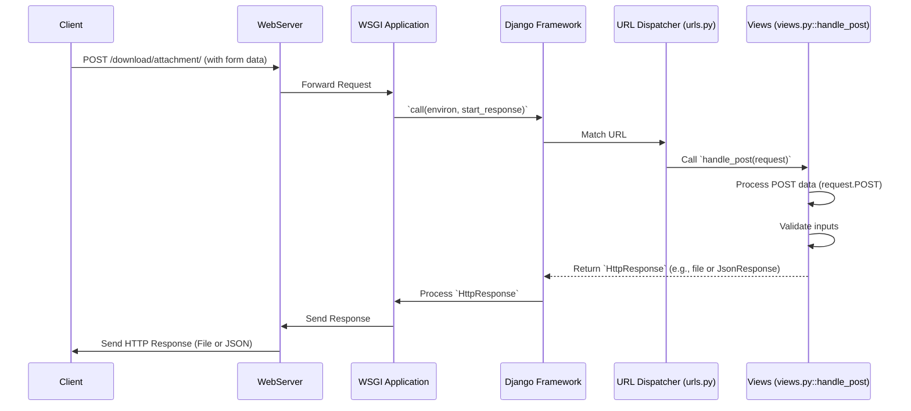

# Chapter 7: Views

In the previous chapter, [URL Dispatcher](chapter_06.md), we explored how Django intelligently routes incoming web requests to specific handlers based on their URL patterns. This routing mechanism acts as the project's traffic controller, directing requests to the correct destination. But what happens once a request arrives at its designated stop? This is where **Views** come into play.

---

### Problem & Motivation

Imagine a user wants to interact with your web application – perhaps they're submitting a form, downloading a file, or simply requesting a web page. The [URL Dispatcher](chapter_06.md) successfully identified that `/download/file/` should be handled by a specific piece of code. However, the dispatcher's job ends at routing; it doesn't *implement* the logic for downloading the file.

This is the core problem **Views** solve. They are the actual workers of your Django application, containing the specific instructions on how to respond to an incoming [HTTP Request Object](chapter_05.md). Without views, your application would know *where* to send requests, but not *what to do* with them. In our "markup" project, views are crucial for defining how our application processes user input, interacts with data, and ultimately generates the content that the user sees or receives. For instance, handling a POST request to securely provide a user with a downloadable attachment based on their input requires a dedicated view.

---

### Core Concept Explanation

At its heart, a **View** in Django is a Python function or a class method that takes an `HttpRequest` object as its primary argument and is responsible for returning an `HttpResponse` object. Think of a view as the *brain* of a specific URL endpoint.

When a user's browser sends a request to your Django application, the following general flow occurs:
1.  The web server (e.g., Gunicorn, Apache) receives the request and passes it to the [WSGI Application](chapter_04.md).
2.  The [WSGI Application](chapter_04.md) forwards the request to Django.
3.  Django's [URL Dispatcher](chapter_06.md) inspects the URL and finds the corresponding view.
4.  The dispatcher calls this view, passing it an `HttpRequest` object containing all details of the incoming request (headers, method, body, etc.).
5.  The view then executes its logic: it might read data from a database, process form submissions, interact with other services, or simply fetch static content.
6.  Finally, the view constructs an `HttpResponse` object (e.g., a simple HTML page, JSON data, a file download, or a redirect) and returns it.
7.  This `HttpResponse` is then sent back through the Django stack, the WSGI application, the web server, and ultimately to the user's browser.

In essence, views bridge the gap between incoming web requests and the application's business logic, acting as the central processing unit for user interactions.

---

### Practical Usage Examples

Let's illustrate how a view function in our "markup" project handles a specific request. We'll use the `handle_post` function to demonstrate processing a POST request for a file download.

First, ensure your `urls.py` (which we discussed in the [URL Dispatcher](chapter_06.md) chapter) maps a URL pattern to this view:

```python
# my_django_project/my_django_project/urls.py
from django.contrib import admin
from django.urls import path
from . import views # Import our views module

urlpatterns = [
    path('admin/', admin.site.urls),
    path('download/attachment/', views.handle_post, name='download_attachment'), # Our new URL pattern
]
```
This snippet tells Django that any POST request to `/download/attachment/` should be handled by the `handle_post` function located in our project's `views.py` file.

Now, let's look at the `handle_post` view itself:

```python
# my_django_project/my_django_project/views.py
from django.http import JsonResponse, HttpResponse
from pathlib import Path

def handle_post(request):
    """
    Handles POST requests to get a downloadable attachment.
    Expects 'subdir' and 'filename' in the POST data.
    """
    if request.method == 'POST':
        # Get data from the request body (POST data)
        subdir = request.POST.get('subdir')
        filename = request.POST.get('filename')

        # Basic validation
        if not filename:
            return JsonResponse({'error': 'filename is a required field.'}, status=400)

        # In a real scenario, we'd find the file, read it, and return it.
        # For simplicity, we'll simulate an error.
        if filename == 'non_existent.txt':
             return JsonResponse({'error': 'File not found.'}, status=404)

        # Simulate success for a valid file request
        if filename == 'document.pdf':
            # Create a dummy file response
            response = HttpResponse("Dummy PDF content", content_type='application/pdf')
            response['Content-Disposition'] = f'attachment; filename="{filename}"'
            return response

    # If it's not a POST request, return a method not allowed error
    return JsonResponse({'error': 'Invalid method. Use POST.'}, status=405)
```
This `handle_post` function demonstrates several key view concepts:
1.  It takes `request` as an argument, which is the [HTTP Request Object](chapter_05.md).
2.  It checks `request.method` to ensure it's a POST request.
3.  It accesses submitted data via `request.POST.get()`.
4.  It performs basic validation.
5.  It constructs and returns a `JsonResponse` for errors or a `HttpResponse` with appropriate headers for a successful file download.

If a user sends a POST request with `filename='document.pdf'`, they would receive a response indicating a file download. If `filename` is missing or invalid, they would receive a JSON error message.

---

### Internal Implementation Walkthrough

Let's trace the journey of a POST request to `/download/attachment/` and see how our `handle_post` view fits into the larger system.

#### Request Flow Sequence



1.  **Client Initiates Request**: A user submits a form or makes an API call (e.g., using JavaScript) to `POST /download/attachment/` with `subdir` and `filename` in the request body.
2.  **Web Server & WSGI**: The web server receives this request and, through the [WSGI Application](chapter_04.md), hands it over to Django.
3.  **Django's Request Object**: Django parses the raw HTTP request data into a user-friendly [HTTP Request Object](chapter_05.md). This object now contains details like `request.method = 'POST'`, and `request.POST` holding the submitted form data.
4.  **URL Dispatcher**: The [URL Dispatcher](chapter_06.md) (configured in `urls.py`) receives the request. It matches the path `/download/attachment/` to our `views.handle_post` function.
5.  **View Execution**: The `handle_post` function is called, and Django passes the `request` object to it.
    *   Inside `handle_post`, the first line `if request.method == 'POST':` checks the HTTP method. This is critical for security and correct handling, as this view is designed specifically for POST requests.
    *   `request.POST.get('subdir')` and `request.POST.get('filename')` are used to safely extract data from the submitted form.
    *   Validation checks if `filename` is provided. If not, a `JsonResponse` with a `400 Bad Request` status is immediately returned.
    *   If `filename` is `document.pdf`, a dummy `HttpResponse` representing a file download is created.
    *   If `filename` is `non_existent.txt`, a `JsonResponse` with `404 Not Found` is returned.
    *   If the method isn't POST, a `405 Method Not Allowed` `JsonResponse` is returned.
6.  **Response Back**: The `HttpResponse` (or `JsonResponse`) generated by `handle_post` is returned to Django, which then processes it, passes it back through the WSGI application, and finally, the web server sends the complete HTTP response to the client.

---

### System Integration

Views are highly integrated with almost every other core abstraction in a Django project:

*   **[URL Dispatcher](chapter_06.md)**: This is the most direct integration. The dispatcher *points* to views, making them the target of all routed requests. Without the dispatcher, views would never be invoked.
*   **[HTTP Request Object](chapter_05.md)**: Views explicitly receive and interact with the `HttpRequest` object to get all incoming request data (method, headers, body, query parameters, user information). This object is the view's primary input.
*   **[WSGI Application](chapter_04.md)**: The WSGI application is the bridge that allows the web server to communicate with Django. It's the layer that ultimately passes the `HttpRequest` to Django (which then hands it to the URL dispatcher and finally to the view) and sends back the `HttpResponse` generated by the view.
*   **[Settings Configuration](chapter_03.md)**: Views can implicitly rely on settings. For example, database connections, static file URLs, or security configurations defined in `settings.py` influence how views retrieve data, serve content, or handle authentication.
*   **Templates (Not yet covered)**: While not a dedicated chapter yet, many views render HTML using Django's templating system. The view will pass data to a template, which then generates the final HTML `HttpResponse`.

---

### Best Practices & Tips

*   **Keep Views Thin**: Views should primarily act as orchestrators. Their main job is to call other components (e.g., models for data, forms for validation, services for business logic) and then render a response. Avoid putting complex business logic directly into your views. This promotes reusability and testability.
*   **Function-Based Views (FBV) vs. Class-Based Views (CBV)**:
    *   **FBVs** (like `handle_post`) are simple Python functions, excellent for straightforward logic.
    *   **CBVs** provide a more extensible way to handle web requests, offering reusable methods (like `get()`, `post()`) that correspond to HTTP verbs, and mixins for common patterns (e.g., authentication, form handling). As your project grows, consider CBVs for more complex or repetitive view logic.
*   **Error Handling**: Always consider edge cases and potential errors. As seen in `handle_post`, return appropriate HTTP status codes (e.g., 400 for bad request, 404 for not found, 500 for server error) with helpful messages, often as JSON responses for APIs.
*   **Security**: Views are often the entry point for user input. Always sanitize and validate all incoming data to prevent security vulnerabilities like SQL injection or cross-site scripting (XSS). Django's ORM and form systems help with this.
*   **Don't Repeat Yourself (DRY)**: If you find yourself writing similar logic across multiple views (e.g., authentication checks, common data fetching), consider using decorators, mixins (for CBVs), or custom functions/classes to abstract this common functionality.
*   **Meaningful Naming**: Name your views clearly, reflecting their purpose (e.g., `handle_post`, `ProductDetailView`, `UserRegistration`).

---

### Chapter Conclusion

Views are the workhorses of your Django application, translating incoming web requests into meaningful actions and responses. They receive the [HTTP Request Object](chapter_05.md) routed by the [URL Dispatcher](chapter_06.md), process the data using your application's logic, and generate an appropriate `HttpResponse`. By understanding how to write clear, concise, and secure views, you unlock the full potential of your "markup" project to interact dynamically with users.

With a solid grasp of views, we've now covered the core flow of an incoming request from the URL to its processing. Next, we'll delve into how Python packages are initialized, providing context for how Django itself loads and configures its components, including our `views.py` file.

Continue to: [Python Package Initialization](chapter_08.md)