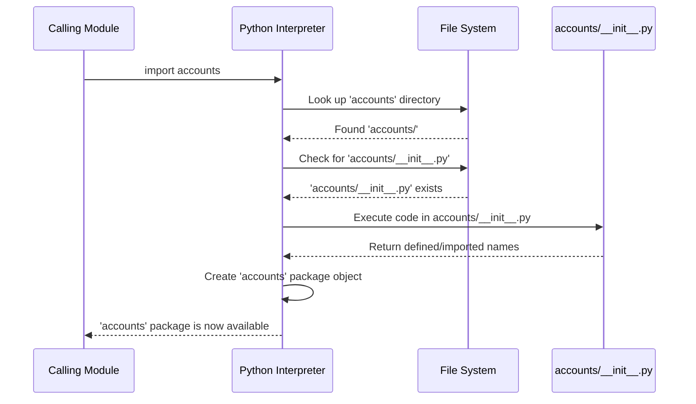

# Chapter 8: Python Package Initialization

Having explored how [Views](chapter_07.md) process incoming requests and generate responses, we've seen the functional core of handling web interactions. But how are these views, along with models, URLs, and other components, organized into a coherent structure that Python can recognize and import? This brings us to the crucial concept of Python package initialization, governed by the `__init__.py` file.

---

### Problem & Motivation

In a Django project like "markup", we organize our code into "apps" – self-contained modules for specific functionalities (e.g., users, products, authentication). Python needs a clear signal to recognize a directory as a "package" so that its contents (like `views.py`, `models.py`, `urls.py`) can be imported using standard Python `import` statements. Without this mechanism, Python would treat these directories as ordinary folders, unable to resolve their internal modules.

The `__init__.py` file solves this fundamental problem by explicitly marking a directory as a Python package. It's essential for structuring our "markup" project because it allows us to logically group related code, manage dependencies within an app, and make components easily discoverable and importable across the entire Django project. For instance, when we declare an app in `INSTALLED_APPS` within our [Settings Configuration](chapter_03.md), Python needs to be able to locate and load that app as a package.

---

### Core Concept Explanation

The `__init__.py` file is a special Python file that serves a critical role in Python's module system. When Python encounters a directory containing an `__init__.py` file, it treats that directory as a *package*. This means that the modules (other `.py` files) and sub-packages within that directory can be imported using relative or absolute import paths. If a directory does not contain an `__init__.py` file, Python will not recognize it as a package, and you won't be able to import modules from it in the standard way.

While `__init__.py` can be an empty file, its presence alone is sufficient to declare a directory as a package. However, it can also contain Python code that gets executed *only once* when the package is first imported. This makes it a powerful place for package-level initialization, defining what names are exposed when the package is imported (using `__all__`), or setting up package-wide configurations. For example, an `__init__.py` file might import common utilities from submodules, making them directly accessible from the package namespace, simplifying subsequent imports for developers.

The concept is vital for the "markup" project's structure. Each Django app within the project is a Python package, and the `__init__.py` file at its root is what makes it a discoverable and usable app. This file enables the Django framework to find your app's models, views, and other components, allowing the framework to build the complete web application framework based on your definitions.

---

### Practical Usage Examples

Let's illustrate how `__init__.py` enables package imports within a typical Django app. Imagine we have an `accounts` app.

First, consider the basic structure of a new Django app, like `accounts`, after running `python manage.py startapp accounts`:

```
myproject/
├── manage.py
├── myproject/
│   └── ...
└── accounts/
    ├── __init__.py  # This file makes 'accounts' a package
    ├── admin.py
    ├── apps.py
    ├── models.py
    ├── tests.py
    └── views.py
```
*Explanation*: The presence of `__init__.py` inside the `accounts` directory tells Python: "This `accounts` directory is a package." This is the simplest, and most common, usage where the file can even be empty.

Now, let's say our `accounts` app has a utility file `accounts/utils.py`:

```python
# accounts/utils.py
def get_user_full_name(user):
    """Returns the full name of a user."""
    return f"{user.first_name} {user.last_name}"

def generate_username_suggestion(email):
    """Generates a simple username from an email."""
    return email.split('@')[0]
```
*Explanation*: This `utils.py` file contains two helpful functions.

If we want to make `get_user_full_name` directly available when someone imports the `accounts` package, we can modify `accounts/__init__.py`:

```python
# accounts/__init__.py
from .utils import get_user_full_name

# Optionally define __all__ to control what's exposed
__all__ = ['get_user_full_name']
```
*Explanation*: By adding `from .utils import get_user_full_name` to `__init__.py`, we "lift" this function into the `accounts` package's top-level namespace.

Now, from anywhere else in the Django project, we can import it like this:

```python
# myproject/some_other_module.py (or another app's views.py)
from accounts import get_user_full_name
# OR from accounts.utils import get_user_full_name # This also works

# ... then use it
# full_name = get_user_full_name(some_user_object)
```
*Explanation*: Instead of needing `from accounts.utils import get_user_full_name`, we can simply use `from accounts import get_user_full_name`, making the API of the `accounts` package cleaner and more convenient for other developers. This shows how `__init__.py` can customize the package's public interface.

---

### Internal Implementation Walkthrough

When Python encounters an `import` statement, it follows a specific sequence to resolve the requested module or package. Let's trace what happens when you `import accounts`:

1.  **Locate Package**: Python searches its `sys.path` for a directory named `accounts`.
2.  **Discover `__init__.py`**: Upon finding the `accounts` directory, Python checks for the presence of `accounts/__init__.py`. If this file exists, Python registers `accounts` as a package. If it doesn't exist, an `ImportError` would typically be raised.
3.  **Execute `__init__.py`**: If `accounts/__init__.py` is found, Python executes its content *once*. Any code within this file, such as imports (`from .utils import get_user_full_name`) or variable assignments, is processed during this step. The results of this execution populate the `accounts` package's namespace.
4.  **Package Object Creation**: A package object (a module object) is created for `accounts`. This object now holds all names defined or imported in `accounts/__init__.py`.
5.  **Return Package Object**: The package object is then returned for use in your `import` statement.

This process can be visualized with a sequence diagram:



For the "markup" project, this means that when Django's app loading mechanism (which eventually uses Python's `importlib` for discovery) tries to load an app like `accounts`, it relies on the presence and content of `accounts/__init__.py` to correctly identify, initialize, and integrate the app into the project.

---

### System Integration

The `__init__.py` file is a foundational component that underpins how a [Django Project](chapter_01.md) organizes its various parts into discrete applications.

1.  **App Discovery by Django**: When you add an app to `INSTALLED_APPS` in `myproject/settings.py` (our [Settings Configuration](chapter_03.md)), Django needs to find that app. It uses Python's module import system, which, in turn, depends on `__init__.py` to recognize the app's directory as a package. Without `__init__.py`, Django wouldn't be able to `import myapp` and load its configurations (from `apps.py`), models, or other components.

    ```mermaid
    graph TD
        A[settings.py (INSTALLED_APPS)] --> B(Python's Import System);
        B --> C[App Directory (e.g., accounts/)];
        C --> D{Presence of __init__.py?};
        D -- Yes --> E[App recognized as Python Package];
        D -- No --> F[ImportError / App not found];
        E --> G[Django loads app components: Views, Models, URLs];
    ```

2.  **Organizing Views and URLs**: Within an app, `__init__.py` facilitates internal imports. For example, your [URL Dispatcher](chapter_06.md) (`urls.py`) might need to import [Views](chapter_07.md) from `views.py` within the same app:
    ```python
    # accounts/urls.py
    from django.urls import path
    from . import views # Relies on accounts/__init__.py making 'views' accessible

    urlpatterns = [
        path('login/', views.login_view, name='login'),
    ]
    ```
    Here, `from . import views` works because `accounts` is a package (due to `__init__.py`), and `views.py` is a module within it.

3.  **Cross-App Imports**: It enables seamless imports across different parts of the "markup" project. If your `orders` app needs to interact with user profiles from the `accounts` app, the `__init__.py` in `accounts` allows you to simply `from accounts.models import UserProfile` or `from accounts import get_user_full_name` (if exposed in `__init__.py`).

In essence, `__init__.py` is the unsung hero that enables Python to understand the hierarchical structure of your Django project, allowing modules and sub-packages to be found and loaded correctly, forming the cohesive web application framework that is "markup".

---

### Best Practices & Tips

*   **Keep `__init__.py` Minimal**: For most Django apps, an empty `__init__.py` is perfectly fine and often preferred. Avoid putting complex logic or heavy processing directly into `__init__.py`, as it gets executed every time the package is imported.
*   **Use for Controlled Exposure**: If you have frequently used functions or classes in submodules (like `utils.py`), you can import them into `__init__.py` to make them directly accessible from the package root, as shown in the examples. This simplifies imports for consumers of your package.
*   **Leverage `__all__`**: If you're importing names into `__init__.py` to expose them, consider defining a `__all__` list. This explicitly states what names are considered part of the package's public API when a client does `from mypackage import *`.
    ```python
    # myapp/__init__.py
    from .utils import helper_function
    from .models import MyModel

    __all__ = ['helper_function', 'MyModel'] # Defines what `from myapp import *` includes
    ```
*   **Avoid Circular Imports**: Be careful when importing modules within `__init__.py`. Importing `module_A` which in turn imports `module_B`, and `module_B` then imports `module_A` can lead to circular import issues and `ImportError`s. Design your package structure to minimize such dependencies.
*   **Don't Overuse for Initialization**: While `__init__.py` can run initialization code, for Django apps, the `apps.py` file (specifically the `AppConfig` class's `ready()` method) is the recommended place for app-specific startup logic. This ensures that the Django environment is fully set up before your code runs.

---

### Chapter Conclusion

This chapter has demystified the `__init__.py` file, revealing its fundamental role in Python's package system and, consequently, in the architecture of our "markup" Django project. We've learned that `__init__.py` is the signal Python needs to treat a directory as a package, enabling structured imports and logical organization of our codebase. From facilitating app discovery by Django to simplifying cross-module imports, its unassuming presence is crucial for the seamless operation and extensibility of our web application framework.

By understanding `__init__.py`, you now have a complete picture of how a Django project's various components are not just built but also discovered and interconnected. This knowledge cements your understanding of the core abstractions that define how a Django application is configured, executed, and interacts with web requests, from the high-level project organization all the way down to specific view logic and server communication.