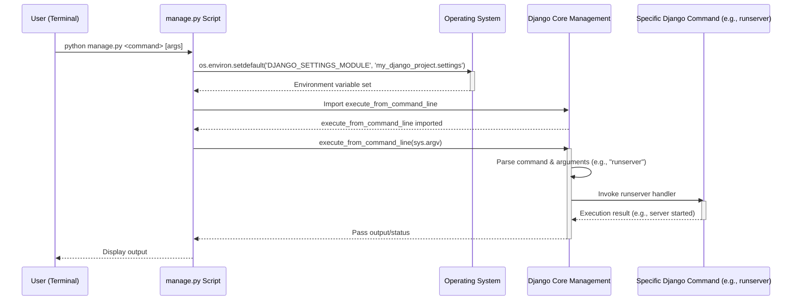

# Chapter 1: Project Management Utility

This is the first chapter in our journey through the "markup" project documentation. We begin by exploring the foundational tool that empowers developers to interact with and manage their Django web application: the `manage.py` script.

---

### Problem & Motivation

Developing a sophisticated web application like "markup" involves many moving parts: a web server, a database, user authentication, data models, and various utility scripts. Without a centralized control point, managing these components can quickly become cumbersome and error-prone. Imagine having to manually configure environment variables, start a server, or apply database changes for every small adjustment. This scattered approach hinders productivity and introduces inconsistencies, making it difficult for both new and experienced developers to contribute effectively.

The `manage.py` script directly addresses this challenge by providing a unified, project-specific command-line interface (CLI). It acts as the primary gateway for all administrative tasks, abstracting away the underlying complexities of Django's operational environment. For our "markup" project, `manage.py` is crucial because it ensures that all developers interact with the project in a standardized way, facilitating seamless collaboration and maintaining the integrity of the application's lifecycle.

For instance, a common and critical use case is starting the development web server. Instead of manually configuring server processes, `manage.py` allows us to spin up a fully functional server with a single, simple command, which will be our guiding example throughout this chapter.

---

### Core Concept Explanation

At its heart, `manage.py` is Django's built-in command-line utility for administering project-specific tasks. It's automatically generated when you create a new Django project (e.g., `django-admin startproject my_django_project`) and resides in your project's root directory. Think of it as the project's **control panel** or a universal remote for your Django application.

The script's primary role is to set up the necessary Django environment, ensuring that your project's settings, applications, and configurations are correctly loaded. Once the environment is initialized, `manage.py` dispatches commands to Django's core management utilities, which then execute the requested actions. This design allows Django to provide a wide array of built-in commands (like `runserver`, `makemigrations`, `migrate`, `createsuperuser`, `startapp`) while also offering a straightforward mechanism for developers to create custom management commands tailored to their project's unique needs.

For the "markup" project, `manage.py` is the initial entry point for most interactions. It encapsulates the crucial step of defining where Django should find the project's `settings.py` file, which dictates how the entire application behaves—from database connections to available URLs. Understanding `manage.py` is fundamental to navigating and operating any Django project.

---

### Practical Usage Examples

Let's explore how to use `manage.py` to perform essential tasks for our "markup" project, focusing on our motivating use case: starting the development server.

First, navigate to your project's root directory in your terminal, where `manage.py` is located.

#### Starting the Development Server

The most frequent command you'll use is `runserver`. This fires up a local web server, allowing you to view and interact with your application in a web browser.

```bash
python manage.py runserver
```

**Explanation:** This command tells `manage.py` to execute the `runserver` command. By default, it starts the server on `http://127.0.0.1:8000/`.

**Expected Output:**

```
Watching for file changes with StatReloader
Performing system checks...

System check identified no issues (0 silenced).

You have 18 unapplied migration(s). Your project may not work properly until you apply the migrations for app(s): admin, auth, contenttypes, sessions.
Run 'python manage.py migrate' to apply them.
August 09, 2023 - 10:30:00
Django version 4.2.4, using settings 'my_django_project.settings'
Starting development server at http://127.0.0.1:8000/
Quit the server with CONTROL-C.
```

#### Creating Database Migrations

Another common task is managing your database schema. When you make changes to your models (e.g., add a new field), you need to create migration files.

```bash
python manage.py makemigrations
```

**Explanation:** This command scans your project for changes in your Django models and generates Python files (migrations) that describe these changes. These files are then used to update your database schema.

#### Viewing Available Commands

Not sure what commands are available? `manage.py` can provide a list.

```bash
python manage.py help
```

**Explanation:** This command displays a comprehensive list of all built-in Django management commands, along with any custom commands you might have added to your project. It's a great way to discover functionality.

---

### Internal Implementation Walkthrough

Let's delve into the internal workings of `manage.py` by examining its `main` function, which is the entry point for its execution. The provided code snippet from `my_django_project/manage.py` illustrates this process.

```python
# my_django_project/manage.py
import os
import sys

def main():
    # 1. Set the DJANGO_SETTINGS_MODULE environment variable
    os.environ.setdefault('DJANGO_SETTINGS_MODULE', 'my_django_project.settings')
    try:
        # 2. Import Django's core management utility
        from django.core.management import execute_from_command_line
    except ImportError as exc:
        # 3. Handle ImportError if Django isn't found
        raise ImportError(
            "Couldn't import Django. Are you sure it's installed and "
            "available on your PYTHONPATH environment variable? Did you "
            "forget to activate a virtual environment?"
        ) from exc
    # 4. Execute the command provided on the command line
    execute_from_command_line(sys.argv)

if __name__ == '__main__':
    main()
```

Here's a step-by-step breakdown of what happens when you run `python manage.py <command>`:

1.  **Set the `DJANGO_SETTINGS_MODULE`**:
    ```python
    os.environ.setdefault('DJANGO_SETTINGS_MODULE', 'my_django_project.settings')
    ```
    This is a critical first step. Before Django can do anything, it needs to know where to find your project's settings. This line sets an environment variable pointing to `my_django_project.settings`. This tells Django, "Hey, when you need to know about database connections, installed apps, or URL configurations, look in this file!"

2.  **Import Django's Core Management Utility**:
    ```python
    from django.core.management import execute_from_command_line
    ```
    After establishing where the settings are, `manage.py` attempts to import `execute_from_command_line` from `django.core.management`. This function is Django's central dispatcher for all management commands. It's responsible for parsing the command-line arguments and calling the appropriate handler.

3.  **Handle `ImportError`**:
    ```python
    except ImportError as exc:
        raise ImportError(...)
    ```
    This `try-except` block is a safeguard. If Django isn't installed in your environment or if your `PYTHONPATH` isn't configured correctly, the `ImportError` will be caught, and a helpful message will be displayed, guiding you to troubleshoot common issues like missing installations or inactive virtual environments.

4.  **Execute the Command**:
    ```python
    execute_from_command_line(sys.argv)
    ```
    Finally, `manage.py` hands over control to `execute_from_command_line`. It passes `sys.argv` (which contains all command-line arguments, including `manage.py` itself and the command you typed, e.g., `runserver`). This function then takes over, parses the command, finds the corresponding Django management command (e.g., `django.core.management.commands.runserver`), and executes it.

This sequence of operations ensures that every command run through `manage.py` operates within the correct Django project context.



---

### System Integration

The `manage.py` utility is the linchpin that connects a developer's interaction with the Django project's internal structure. It acts as the initial configuration layer that enables all other Django abstractions to function correctly.

1.  **Settings (`my_django_project.settings`)**: As seen in the implementation, `manage.py` explicitly loads the project's settings module. This module is paramount, as it defines:
    *   `INSTALLED_APPS`: Which Django applications are part of the project.
    *   `DATABASES`: How to connect to the project's database.
    *   `ROOT_URLCONF`: The primary URL configuration file (e.g., `my_django_project.urls`) that Django should use to route incoming requests. This connection is crucial for the [URL Routing Configuration](chapter_03.md) chapter.

2.  **URL Routing (`my_django_project.urls`)**: By setting `ROOT_URLCONF` in `settings.py`, `manage.py` implicitly prepares the ground for how web requests will be handled. While `manage.py` doesn't directly process web requests, it ensures that when the development server (started via `runserver`) receives a request, it knows exactly where to look for the URL patterns that map requests to specific views.

3.  **Request Handlers (Views)**: Ultimately, the path defined in the URL configuration will point to Python functions or classes known as views, which are responsible for processing web requests and generating responses. `manage.py` facilitates this by making sure the entire Django environment, including all installed apps and their associated views, is available when the server starts. We will explore this further in the [Request Handlers (Views)](chapter_02.md) chapter.

In essence, `manage.py` establishes the foundational context within which all other Django components, from URL routing to data models and views, are loaded and operate.

---

### Best Practices & Tips

To make the most of `manage.py` in your "markup" project, consider these best practices:

*   **Always Use a Virtual Environment**: Before running any `manage.py` command, ensure you've activated your Python virtual environment. This isolates your project's dependencies and prevents conflicts with other Python projects on your system.
    ```bash
    # Example: Activating a virtual environment
    source venv/bin/activate
    ```
*   **Keep `manage.py` in the Project Root**: `manage.py` should always reside in the top-level directory of your Django project, alongside your main project folder (e.g., `my_django_project`). This is its expected location for correct operation.
*   **Understand `DJANGO_SETTINGS_MODULE`**: Be aware that the `DJANGO_SETTINGS_MODULE` environment variable is critical. If you have multiple settings files (e.g., `settings_dev.py`, `settings_prod.py`), you might need to adjust this variable or pass it directly when running `manage.py` commands.
    ```bash
    # Example: Using a specific settings file
    DJANGO_SETTINGS_MODULE=my_django_project.settings_dev python manage.py runserver
    ```
*   **Explore `help` for Commands**: Whenever you're unsure about a command's options or usage, append `--help` to it.
    ```bash
    python manage.py runserver --help
    ```
    This provides detailed documentation for that specific command.
*   **Custom Management Commands**: For project-specific tasks that aren't covered by Django's built-in commands, consider creating your own [custom management commands](https://docs.djangoproject.com/en/stable/howto/custom-management-commands/). This keeps your project's utilities organized and accessible via the `manage.py` interface.

---

### Chapter Conclusion

In this chapter, we've gained a comprehensive understanding of `manage.py`, the indispensable project management utility for our "markup" Django application. We've seen how it solves the problem of decentralized project administration by providing a unified command-line interface. From starting the development server to managing database migrations, `manage.py` streamlines essential development tasks. We delved into its internal mechanics, understanding how it sets up the Django environment and dispatches commands, and examined its crucial role in integrating with the project's settings, URL configurations, and views.

As we move forward, remember that `manage.py` is your constant companion in Django development. Having established this foundational understanding, our next step is to explore how web requests, once received by our `manage.py`-started server, are processed by the application. This brings us directly to the concept of Request Handlers.

Let's proceed to the next chapter to understand how our "markup" project actively processes incoming web requests: [Request Handlers (Views)](chapter_02.md)