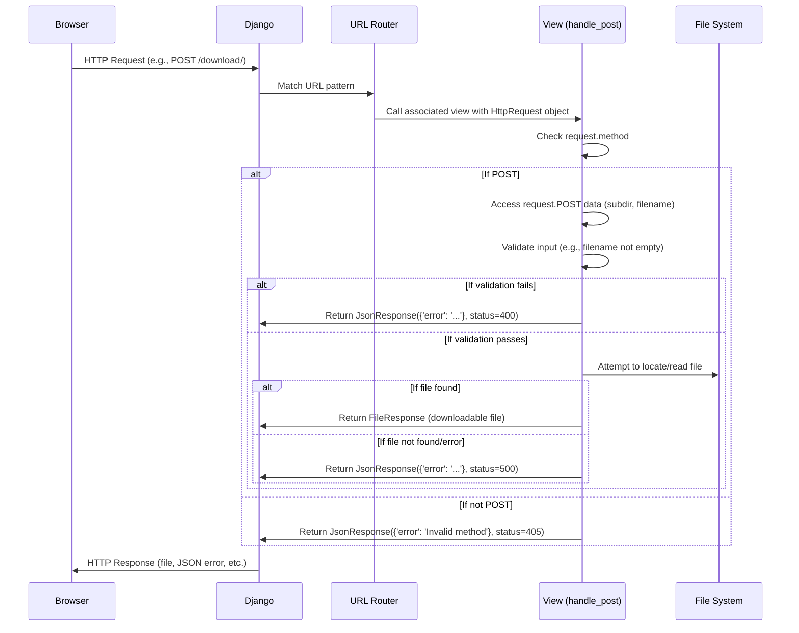

# Chapter 2: Request Handlers (Views)

Welcome back! In the [previous chapter](chapter_01.md), we explored the `manage.py` script, the heart of our project's administrative utilities. We saw how it enables us to start the development server and prepare our environment. Now that our project can run, the next logical step is to understand how it actually *responds* to web requests. This brings us to the crucial concept of Request Handlers, or "Views" as they are known in Django.

---

### Problem & Motivation

Imagine a user types `www.yourproject.com/download/file` into their browser and presses Enter. How does our Django application know what to do with this request? How does it figure out which piece of Python code should execute to process the request, retrieve the specified file, and send it back to the user? Without a clear mechanism to handle these incoming requests, our web application would be a static collection of files, unable to interact dynamically with users.

This is precisely the problem that Request Handlers solve. In the `markup` project, we need a way to receive requests, inspect their content (like which file to download or which form data was submitted), perform necessary operations (like fetching a file from the server), and then construct a meaningful response (like the file itself or an error message). Views are the dedicated components that encapsulate this core logic, making our application dynamic and interactive. For instance, a common scenario in `markup` might involve a user uploading a file or requesting a specific document. A view would be responsible for receiving that upload or locating and serving the requested document.

---

### Core Concept Explanation

At its core, a **Request Handler**, or **View** in Django, is a Python function or class that takes an incoming web request (represented by a `HttpRequest` object) and returns a web response (represented by a `HttpResponse` object). Think of a view as a specialized postal worker: it receives mail (the request), reads the contents and destination, performs the necessary actions (like fetching something from a shelf), and then sends back a reply (the response).

Every time a user's browser sends a request to our Django application, Django's URL dispatcher (which we'll cover in the next chapter) looks for a matching URL pattern and, upon finding one, calls the corresponding view. This view then takes over. It has access to all the information about the request, such as the HTTP method (GET, POST), any submitted data, and user information. Based on this, the view executes its business logic – it might query a database, perform calculations, or interact with the file system – and ultimately constructs an `HttpResponse` containing the data to be sent back to the user. This response could be an HTML page, JSON data, a redirect instruction, or even a file download.

---

### Practical Usage Examples

Let's look at a practical example from the `markup` project: a view designed to handle `POST` requests for downloadable attachments. This view, `handle_post`, is located in `my_django_project/my_django_project/views.py`.

Here's how a view starts, by checking the HTTP method:

```python
# my_django_project/my_django_project/views.py
from django.http import JsonResponse
from pathlib import Path

def handle_post(request):
    """
    Handles POST requests to get a downloadable attachment.
    """
    if request.method == 'POST':
        # Logic for POST request goes here
        pass # Placeholder for now
    return JsonResponse({'error': 'Invalid method'}, status=405)
```

**Explanation:** The `handle_post` function takes one argument, `request`, which is an instance of `HttpRequest`. This `request` object contains all information about the incoming web request. The first thing we do is check `request.method` to ensure we only process `POST` requests. If it's not a `POST`, we return a `JsonResponse` with a `405 Method Not Allowed` status.

Inside the `POST` block, we access the data sent by the user:

```python
# my_django_project/my_django_project/views.py (inside handle_post)
    if request.method == 'POST':
        local_volume_path = Path("/root/my_django_project/files")
        subdir = request.POST['subdir']
        filename = request.POST['filename']

        if filename is None or filename == '':
            return JsonResponse({'error': 'filename is a required field.'}, status=400)
        # ... more code for processing and returning file ...
```

**Explanation:** When dealing with `POST` requests, data submitted by the user is typically available in `request.POST` (for form data) or `request.body` (for raw data like JSON). Here, we expect `subdir` and `filename` as fields within the `POST` data. We then perform a basic validation: if `filename` is missing or empty, we immediately return a `JsonResponse` with a `400 Bad Request` status, indicating that the request was malformed.

Although the full file serving logic isn't shown, the general flow involves:
1.  Constructing the full file path using `local_volume_path`, `subdir`, and `filename`.
2.  Checking if the file exists and is accessible.
3.  If found, reading the file and packaging it into an `HttpResponse` with appropriate headers for download.
4.  If an error occurs during file processing, catching exceptions and returning an error `JsonResponse` with a `500 Internal Server Error` status.

This simple example demonstrates how a view receives input, performs basic validation, and prepares a response, even if it's just an error message.

---

### Internal Implementation Walkthrough

Let's trace the journey of a request through our Django application, focusing on the view's role:



1.  **Request Initiation:** A user's browser sends an HTTP request to our `markup` Django application.
2.  **URL Routing (Chapter 3):** Django's URL dispatcher, configured in `urls.py`, intercepts this request. It compares the request's URL path against a list of defined patterns.
3.  **View Invocation:** Once a matching URL pattern is found, Django identifies the associated view function (like our `handle_post` function in `my_django_project/my_django_project/views.py`) and calls it, passing an `HttpRequest` object as an argument.
4.  **View Processing:**
    *   Inside the `handle_post` view, the `request.method` is checked.
    *   If it's a `POST` request, the view accesses the `request.POST` dictionary to retrieve submitted form data, such as `subdir` and `filename`.
    *   Basic validation ensures that required fields are present.
    *   The view then performs its core logic: in this case, it would try to construct a file path and serve the file (though the full file serving code isn't shown, this is where it would happen).
    *   If any errors occur (e.g., file not found, permission issues), the view catches them.
5.  **Response Generation:** The view constructs an appropriate `HttpResponse` object. This could be a `JsonResponse` containing an error message (as seen in our example snippets), or a `FileResponse` object containing the actual file data for download.
6.  **Response Transmission:** Django receives this `HttpResponse` object from the view and sends it back to the user's browser.

This cycle ensures that every incoming request is processed methodically by a dedicated piece of logic (the view) and results in a structured response.

---

### System Integration

Views are central to how our `markup` project functions, acting as the bridge between incoming web requests and the application's core logic. Their integration with other components is critical:

*   **URL Routing Configuration ([URL Routing Configuration](chapter_03.md)):** Views are directly linked to URL patterns. The `urls.py` files define which view should be called for a specific URL path. Without proper URL routing, views would never be accessible. This creates a clear separation: URLs define *where* to go, and views define *what* to do.
*   **Project Management Utility ([Project Management Utility](chapter_01.md)):** The `manage.py` script, especially its `runserver` command, is essential for starting the development server that listens for incoming requests. Once `runserver` is active, Django's request-response cycle (including views) can begin.
*   **Models (not covered yet):** While not directly shown in the `handle_post` example, most views interact with Django's Object-Relational Mapper (ORM) and models to fetch or save data to the database. For `markup`, this would involve retrieving information about documents, users, or tags.
*   **Templates (not covered yet):** For views that render HTML pages, they often use Django's template engine to combine data with predefined HTML structures, producing dynamic web pages.

**Data Flow Example:**
```mermaid
graph LR
    A[Browser] -- HTTP Request --> B(Django Server)
    B --> C{URL Router}
    C -- Matches /download/ --> D[handle_post View]
    D -- Accesses request.POST --> E[Request Data]
    D -- Interacts with --> F[File System / Database (hypothetical)]
    F --> D
    D -- Returns HttpResponse --> G(Django Server)
    G --> A
```

---

### Best Practices & Tips

*   **Keep Views Lean (Fat Models, Thin Views):** Views should primarily delegate complex business logic to other components (like service layers, managers, or directly to models). Their main role is to receive the request, call the appropriate logic, and return the response. This makes views easier to test and maintain.
*   **Handle Different HTTP Methods:** Design views to explicitly handle the HTTP methods they expect (e.g., `GET`, `POST`, `PUT`, `DELETE`). Django provides decorators like `@require_http_methods` for class-based views or explicit `if request.method == 'POST':` checks for function-based views.
*   **Return Appropriate HTTP Status Codes:** Always return meaningful HTTP status codes (e.g., `200 OK`, `201 Created`, `400 Bad Request`, `404 Not Found`, `500 Internal Server Error`). This is crucial for API clients and debugging.
*   **Use Django's Shortcuts:** Leverage Django's built-in functions like `render()` for HTML templates, `redirect()` for redirection, and `JsonResponse()` for JSON responses. They simplify common view tasks.
*   **Error Handling:** Implement robust error handling (`try...except`) within your views to gracefully manage unexpected situations, as seen in the `handle_post` example's use of a `500` status for internal errors.
*   **Security:** Always sanitize and validate user input (`request.POST`, `request.GET`) to prevent common web vulnerabilities like SQL injection and Cross-Site Scripting (XSS).

---

### Chapter Conclusion

Views are the workhorses of any Django application, acting as the direct responders to user interactions. We've learned that they are Python functions or classes responsible for processing incoming `HttpRequest` objects and returning `HttpResponse` objects. The `handle_post` example from our `markup` project demonstrated how a view can receive `POST` data, perform basic validation, and return structured responses, even for errors. By keeping views lean, handling methods correctly, and integrating them thoughtfully with other project components, we build robust and maintainable web applications.

With a solid understanding of how views process requests, the next logical step is to see how Django decides *which* view to call for a given URL. This will be the focus of our next chapter, where we dive into Django's powerful URL routing mechanism.

[URL Routing Configuration](chapter_03.md)