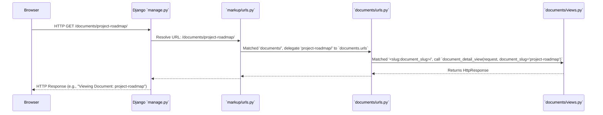

# Chapter 3: URL Routing Configuration

In the previous chapter, [Request Handlers (Views)](chapter_02.md), we explored how Django's 'Views' define the business logic for processing web requests and generating responses. However, a crucial piece of the puzzle remains: *How does Django know which View to execute when a user accesses a particular URL?* This is where **URL Routing Configuration** comes into play. It acts as the traffic controller, directing incoming web requests to the appropriate handlers based on their URL patterns.

---

### Problem & Motivation

Imagine building a web application with various functionalities: a homepage, an about page, a contact form, and several article pages, each with a unique ID. Without a structured way to map URLs to specific Python code, Django wouldn't know if `/about/` should display information about the project or if `/articles/123/` should fetch article number 123 from the database. This ambiguity would make it impossible to build a functional web application.

The core problem URL routing solves is the **disambiguation and delegation of incoming HTTP requests**. It provides a clear, configurable mechanism to define exactly which piece of code—a View function or class—is responsible for handling a particular web address. For our "markup" project, this is fundamental. Every user interaction, from visiting the home page to submitting a form, starts with a URL, and URL routing is the system that translates that URL into an action within our Django application.

Consider a concrete use case for the "markup" project: A user wants to view a specific document or article. They navigate to a URL like `/documents/my-first-document-slug/`. Without URL routing, Django wouldn't know that `/documents/<slug:document_slug>/` should be handled by a `document_detail` view that retrieves and displays the content of that specific document. This chapter will walk through configuring our project to handle such patterns efficiently.

---

### Core Concept Explanation

**URL Routing Configuration** in Django is the process of defining patterns that match parts of a web address (the URL) and then linking those patterns to specific [Request Handlers (Views)](chapter_02.md). This mapping is primarily managed within `urls.py` files. When a request arrives, Django iterates through these patterns until it finds a match, then calls the associated view.

At its heart, URL routing relies on the `urlpatterns` list, typically found in `urls.py` files. This list contains instances of `path()` or `re_path()`, which are functions that take a URL pattern, a view function, and optionally a name for the URL. The `path()` function is generally preferred for simple, modern URL patterns, while `re_path()` allows for more complex regular expression-based matching.

Django applications are modular, and so is their URL configuration. A main `urls.py` file at the project level (e.g., `markup/urls.py`) acts as the root dispatcher. This root file typically uses the `include()` function to delegate URL matching to individual Django applications within the project (e.g., `articles/urls.py`, `users/urls.py`). This hierarchical approach promotes organization and reusability, allowing each app to manage its own set of URLs independently.

When a user types a URL into their browser, Django's URL resolver takes over. It first consults the project's root `urls.py`. If a pattern matches, it might `include()` an app's `urls.py`, passing the remainder of the URL to that app for further resolution. This continues until a final `path()` or `re_path()` entry is matched, leading directly to a specific view. Parameters captured from the URL (like a document slug or an article ID) are then passed as arguments to that view, enabling dynamic content delivery.

---

### Practical Usage Examples

Let's implement the motivating use case: displaying a document based on its slug.

First, we define a simple view in an imaginary `documents` app. Let's assume we have an app called `documents` and its `views.py` looks like this:

```python
# documents/views.py
from django.http import HttpResponse

def document_detail_view(request, document_slug):
    """
    Handles requests for a specific document by its slug.
    """
    return HttpResponse(f"<h1>Viewing Document: {document_slug}</h1>")
```
*This view is a simple placeholder that would, in a real application, retrieve content from a database based on the `document_slug`.*

Next, we create an `urls.py` file within our `documents` app (`documents/urls.py`) to map specific URL patterns to this view:

```python
# documents/urls.py
from django.urls import path
from . import views

urlpatterns = [
    path('<slug:document_slug>/', views.document_detail_view, name='document_detail'),
]
```
*Here, we define a `path()` that expects a slug. The `<slug:document_slug>` part captures a URL segment as a string (like `my-first-document`) and passes it to the `document_detail_view` as the `document_slug` argument. We also give it a `name` for reverse lookup.*

Finally, we integrate this app-level URL configuration into the project's root `urls.py` (`markup/urls.py`):

```python
# markup/urls.py
from django.contrib import admin
from django.urls import path, include

urlpatterns = [
    path('admin/', admin.site.urls),
    path('documents/', include('documents.urls')), # Include app URLs
    path('', include('core.urls')), # Assuming a 'core' app for homepage
]
```
*This `urlpatterns` list at the project root maps requests starting with `/documents/` to the `documents.urls` file. Requests to `/admin/` go to Django's admin site, and requests to the root `/` might go to a `core` app.*

With these configurations, if a user navigates to `http://localhost:8000/documents/my-example-doc/`, Django will:
1. Match `/documents/` in `markup/urls.py`.
2. Delegate the remaining part of the URL (`my-example-doc/`) to `documents/urls.py`.
3. In `documents/urls.py`, it matches `<slug:document_slug>/` to `my-example-doc/`.
4. The `document_detail_view` function is called with `request` and `document_slug='my-example-doc'`.

This modular approach ensures that each application within our "markup" project manages its own routes, making the system scalable and easy to maintain.

---

### Internal Implementation Walkthrough

When Django receives an HTTP request, the URL routing mechanism springs into action. Let's trace the journey of a request like `http://localhost:8000/documents/project-roadmap/`:

1.  **Request Reception:** The Django development server (started via `python manage.py runserver`) or a production WSGI server receives the HTTP request from the user's browser.

2.  **Root URL Resolution:** Django's URL resolver starts by looking at the `urlpatterns` list defined in your project's main `markup/urls.py` file. It compares the incoming URL (`/documents/project-roadmap/`) against each pattern in `urlpatterns` sequentially.

    ```python
    # markup/urls.py snippet
    urlpatterns = [
        # ...
        path('documents/', include('documents.urls')),
        # ...
    ]
    ```

3.  **Pattern Match and Inclusion:** The URL resolver finds a match with `path('documents/', include('documents.urls'))`. The `include()` function signals that a part of the URL has been matched (`/documents/`), and the *remainder* of the URL (`project-roadmap/`) should now be handed off to the `urlpatterns` defined in `documents/urls.py`.

4.  **App-Level URL Resolution:** Django then loads `documents/urls.py` and attempts to match the remaining URL segment (`project-roadmap/`) against its `urlpatterns`.

    ```python
    # documents/urls.py snippet
    urlpatterns = [
        path('<slug:document_slug>/', views.document_detail_view, name='document_detail'),
    ]
    ```

5.  **Parameter Capture:** The pattern `<slug:document_slug>/` successfully matches `project-roadmap/`. The `slug:` converter ensures that `project-roadmap` is treated as a string suitable for a slug and captures it. This captured value is assigned to a keyword argument named `document_slug`.

6.  **View Invocation:** Once a match is found, Django invokes the associated view function: `views.document_detail_view`. It passes the `HttpRequest` object as the first argument (`request`) and all captured keyword arguments (in this case, `document_slug='project-roadmap'`) as subsequent arguments.

7.  **Response Generation:** The `document_detail_view` executes its logic, uses the `document_slug` to potentially fetch data, and finally returns an `HttpResponse` object.

8.  **Response Transmission:** Django takes this `HttpResponse` and sends it back through the server to the user's browser, completing the request-response cycle.

Here's a simplified sequence diagram illustrating this flow:


*This diagram shows how the request is progressively resolved, passing through the project-level URL configuration to the app-level, and finally triggering the correct view.*

---

### System Integration

URL Routing Configuration is one of the most fundamental abstractions in the "markup" project, forming a tight coupling with [Request Handlers (Views)](chapter_02.md). Without URL routing, Views would be isolated functions, inaccessible to web requests.

-   **Views (`chapter_02.md`):** The most direct integration is with Views. Each `path()` or `re_path()` entry in `urls.py` points directly to a View function or class method. The router is responsible for extracting parameters from the URL (e.g., `<int:pk>`, `<slug:slug>`) and passing them as arguments to the View, allowing the View to process dynamic data.

    ```mermaid
    graph TD
        A[Incoming URL] --> B(URL Router Configuration);
        B -- Extracts Params --> C(Request Handler / View);
        C -- Generates Content --> D(HTTP Response);
    ```
    *This flow demonstrates the direct relationship between a URL, the router, and the view.*

-   **Project Management Utility (`chapter_01.md`):** While not directly interacting with URL configuration files, the `manage.py` script orchestrates the entire application. When you run `python manage.py runserver`, it's `manage.py` that starts the development server, which then uses the configured URL routing to direct requests. The `manage.py` script also aids in setting up app structures where `urls.py` files typically reside.

-   **Templates (Implicit):** Although not explicitly covered in previous chapters, URL routing often works in conjunction with templates. Views render templates, and within templates, developers frequently use Django's `` tag to dynamically generate URLs based on their assigned names in `urls.py`. This ensures that links within the application remain robust even if URL patterns change. For example:

    ```html
    <!-- In a Django template -->
    <a href="">View Document</a>
    ```
    *This snippet shows how a named URL (`document_detail`) is used in a template to create a link without hardcoding the path.*

The URL routing system acts as the central switchboard, connecting external requests to internal application logic and ensuring that every component of the "markup" project can find and communicate with each other through well-defined web addresses.

---

### Best Practices & Tips

To maintain a robust, scalable, and easy-to-manage URL routing configuration for the "markup" project, consider these best practices:

1.  **Use `include()` for App Modularity:** Always use `django.urls.include()` to delegate URL configuration to individual Django apps. This keeps your project's root `urls.py` clean and ensures that each app remains self-contained.
    ```python
    # Good: Modular
    path('products/', include('products.urls')),

    # Bad: All URLs in one file
    # path('products/list/', views.product_list),
    ```

2.  **Name Your URLs:** Always provide a `name` argument to `path()` or `re_path()`. This allows you to refer to URLs symbolically using `` in templates or `reverse('name')` in Python code, making your application more resilient to URL pattern changes.
    ```python
    # Good: Named URL
    path('documents/<slug:document_slug>/', views.document_detail_view, name='document_detail'),

    # Bad: Unnamed URL (harder to reference dynamically)
    # path('documents/<slug:document_slug>/', views.document_detail_view),
    ```

3.  **Keep URL Patterns Simple and Readable:** Design URL patterns that are intuitive and easy to understand. Avoid overly complex regular expressions where `path()` with converters would suffice.
    ```python
    # Good: Clear path
    path('users/<int:user_id>/profile/', views.user_profile),

    # Bad: Overly complex regex for a simple case
    # re_path(r'^users/(?P<user_id>[0-9]+)/profile/$', views.user_profile),
    ```

4.  **Use Path Converters:** Leverage Django's built-in path converters (`str`, `int`, `slug`, `uuid`, `path`) as much as possible. They provide basic validation and make your `urls.py` more readable than raw regular expressions. Define custom converters if needed for specific data types.

5.  **Consistency in Trailing Slashes:** Decide on a convention for trailing slashes (e.g., always include them or always omit them) and stick to it. Django can enforce this behavior via `APPEND_SLASH` setting and `CommonMiddleware`. Consistency avoids duplicate content issues for SEO and improves user experience.

6.  **Avoid Hardcoding URLs:** Never hardcode URLs directly in your templates or Python code. Always use `` or `reverse()` for dynamic URL generation. This is crucial for maintainability.

7.  **Namespace App URLs:** If multiple apps might use the same URL name (e.g., both an `articles` app and a `products` app might have a `detail` URL), use URL namespaces to distinguish them.
    ```python
    # In markup/urls.py
    path('articles/', include('articles.urls', namespace='articles')),
    path('products/', include('products.urls', namespace='products')),

    # In template
    <a href="">Article</a>
    <a href="">Product</a>
    ```

By adhering to these practices, the "markup" project's URL routing will be robust, maintainable, and flexible, supporting the project's growth and evolution.

---

### Chapter Conclusion

This chapter has provided a comprehensive look into **URL Routing Configuration**, a cornerstone of any Django web application, including our "markup" project. We've understood its critical role in translating incoming web requests into specific actions by mapping URL patterns to [Request Handlers (Views)](chapter_02.md). We explored its core concepts, walked through practical examples of setting up `urls.py` files at both project and app levels, and traced the internal request resolution flow.

From the initial request received by the server to the final invocation of a view and generation of a response, URL routing is the invisible hand guiding the entire process. By embracing best practices like modularity with `include()`, naming URLs, and using path converters, we ensure that the "markup" project's navigation system is robust, scalable, and easy to maintain. This completes our foundational understanding of how Django applications, including "markup," process user interactions from the command line interface to handling web requests and generating dynamic content.