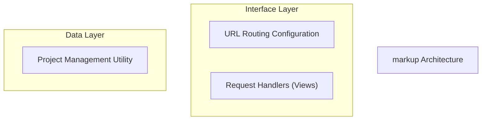
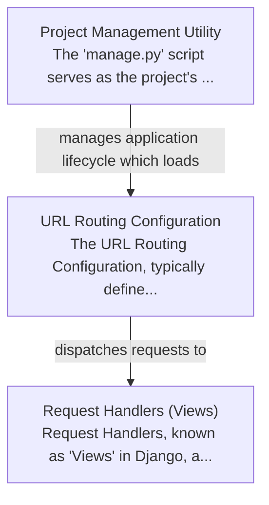

# markup Tutorial

Welcome to the comprehensive tutorial for markup. This tutorial is automatically generated from the codebase to help you understand the core concepts and implementation patterns.

## Project Overview

This project is structured as a Django web application, utilizing its core abstractions for development and operation. The 'manage.py' script serves as the primary command-line interface for project administration, including server management and environment setup. It orchestrates the loading of URL configurations which then map incoming web requests to specific Python views responsible for processing the requests and generating responses.

## System Architecture

## Component Relationships

## Table of Contents

1. [Chapter 1: Project Management Utility](chapter_01.md) - Comprehensive documentation for Project Management Utility following structured methodology...
2. [Chapter 2: Request Handlers (Views)](chapter_02.md) - Comprehensive documentation for Request Handlers (Views) following structured methodology...
3. [Chapter 3: URL Routing Configuration](chapter_03.md) - Comprehensive documentation for URL Routing Configuration following structured methodology...

## How to Use This Tutorial

1. **Start with Chapter 1** to understand the foundational concepts
2. **Follow the sequence** - each chapter builds upon previous concepts
3. **Practice with code examples** - every chapter includes practical examples
4. **Refer to diagrams** - use architecture diagrams for visual understanding
5. **Cross-reference concepts** - chapters link to related topics

## Tutorial Features

- **Progressive Learning**: Concepts are introduced in logical order
- **Code Examples**: Every chapter includes practical, executable code
- **Visual Diagrams**: Mermaid diagrams illustrate complex relationships
- **Cross-References**: Easy navigation between related concepts
- **Beginner-Friendly**: Written for newcomers to the codebase

## Contributing

This tutorial is auto-generated from the codebase. To improve it:
1. Update the source code documentation
2. Add more detailed comments to key functions
3. Regenerate the tutorial using the documentation system

---

*Generated using AI-powered codebase analysis*
