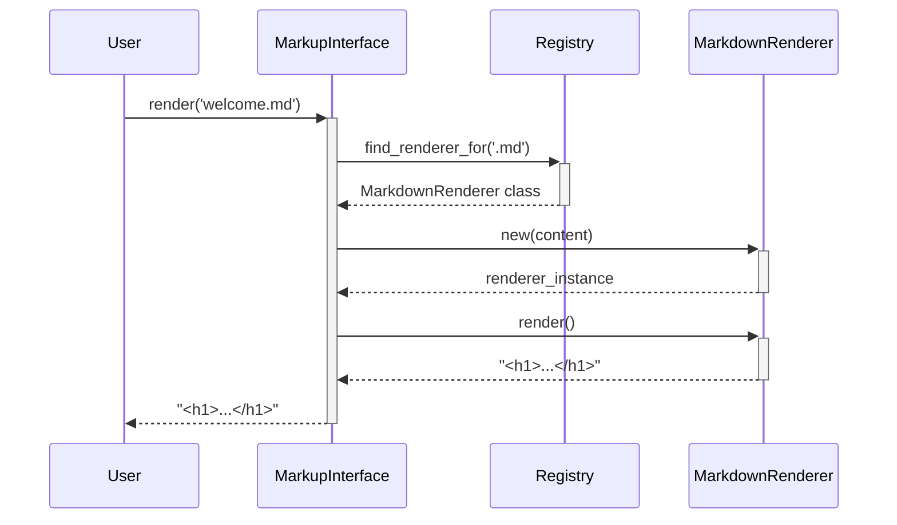

# Chapter 1: The Main Rendering Interface

Welcome to the `markup` library! This first chapter introduces the core entry point for all rendering operations: the main rendering interface. This powerful yet simple API is designed to be the only thing you need to interact with for most use cases, providing a consistent way to convert any supported markup language into HTML.

---

### Problem & Motivation

Imagine you're building a content management system, a static site generator, or even a simple note-taking app. Your users will want to write content in various formats—some prefer the simplicity of Markdown, while others need the power of AsciiDoc. Your application must handle all of them seamlessly. Without a unified system, you would need to write separate logic for each language: find a Markdown gem, find an AsciiDoc command-line tool, write code to detect the file type, and then call the correct rendering logic. This approach is brittle, hard to maintain, and difficult to extend.

The core problem is the **lack of a single, consistent way to render different markup formats**. This fragmentation forces developers to repeatedly solve the same problem of routing a file to its correct renderer. The `markup` library was created to solve this. It provides one simple method that intelligently handles the entire process, from language detection to final HTML output.

Our guiding use case for this chapter will be a developer building a simple script to convert a directory of mixed-format documentation files (`.md` and `.adoc`) into a corresponding set of `.html` files. Their goal is to do this with minimal code and without worrying about the specific rendering engine for each file type.

---

### Core Concept Explanation

The main rendering interface is exposed through the top-level `Markup` module. Think of this module as a "universal translator" for documents. You give it a document in a language it understands (like Markdown or AsciiDoc), and it gives you back a beautifully formatted HTML version. You don't need to know *how* it translates each specific language; you just trust that it will.

This design is an application of the **Facade design pattern**. The `Markup` interface acts as a simplified "front" to a more complex system. Behind this simple facade lies a sophisticated registry that maps file types to specific renderers, and a strategy system that decides whether to use a Ruby gem or an external command to perform the conversion. The facade hides all this complexity, providing you with a clean and predictable API.

The primary benefit is **abstraction**. The interface abstracts away the messy details of *which* library to use (`Redcarpet` for Markdown, `Asciidoctor` for AsciiDoc), *how* to call it, and *where* to find it. All you need to do is call a single method, `Markup.render`, and the library takes care of the rest. This makes your code cleaner, more readable, and far easier to maintain.

---

### Practical Usage Examples

Let's solve our developer's use case. The most common way to use the library is by passing a filename to the `Markup.render` method.

#### Rendering a Markdown File

First, let's render a simple Markdown file named `welcome.md`.

**Input File (`welcome.md`):**
```markdown
# Welcome!

This is a **simple** example.
```

**Ruby Code:**
```ruby
require 'markup'

html_output = Markup.render('welcome.md')
puts html_output
```
This code calls the main interface with the filename. The library automatically detects the `.md` extension, finds the correct renderer, and processes the file.

**Expected Output:**
```html
<h1>Welcome!</h1>

<p>This is a <strong>simple</strong> example.</p>
```

#### Rendering an AsciiDoc File

Now, let's render an AsciiDoc file. The beauty of the interface is that the code barely changes.

**Input File (`setup.adoc`):**
```asciidoc
= Project Setup

Follow these steps:

. Install the gem.
. Run the server.
```

**Ruby Code:**
```ruby
require 'markup'

html_output = Markup.render('setup.adoc')
puts html_output
```
Notice that we call the *exact same method*. The library inspects the `.adoc` extension and routes the request to the AsciiDoc renderer internally.

**Expected Output:**
```html
<div class="sect1">
<h2 id="_project_setup">Project Setup</h2>
<div class="sectionbody">
<div class="olist arabic">
<ol class="arabic">
<li><p>Install the gem.</p></li>
<li><p>Run the server.</p></li>
</ol>
</div>
</div>
</div>
```

#### Rendering a String

You can also render a string directly by providing the format explicitly. This is useful when the content doesn't come from a file.

```ruby
require 'markup'

markdown_string = "## Hello, World!\n\n* Item 1\n* Item 2"
html_output = Markup.render_string(:markdown, markdown_string)

puts html_output
```
Here, we explicitly tell the interface to use the `:markdown` renderer. This bypasses file-based detection.

**Expected Output:**
```html
<h2>Hello, World!</h2>

<ul>
<li>Item 1</li>
<li>Item 2</li>
</ul>
```

---

### Internal Implementation Walkthrough

So, what happens behind the scenes when you call `Markup.render('welcome.md')`? The process is a clear, step-by-step delegation of responsibility.

1.  **Entry Point**: The call starts at the `Markup.render` method, the public-facing facade.
2.  **Language Detection**: The interface first inspects the filename `welcome.md`. It extracts the file extension, `.md`, to identify the markup language.
3.  **Registry Lookup**: It then queries the [Markup Language Registry](chapter_03.md) to find the renderer associated with the `:markdown` symbol.
4.  **Renderer Instantiation**: The registry returns the class responsible for rendering Markdown, for example, `Markup::MarkdownRenderer`. The interface creates an instance of this class.
5.  **Delegation**: The main interface calls the `render` method on the `Markup::MarkdownRenderer` instance, passing the file's content to it.
6.  **Strategy Execution**: The `MarkdownRenderer` uses its configured [Rendering Strategy](chapter_04.md)—perhaps a gem-based strategy using `Redcarpet`—to perform the actual conversion to HTML.
7.  **Return Value**: The resulting HTML is passed all the way back up the chain and returned to the original caller.

This entire interaction can be visualized with the following sequence diagram:



This clean separation of concerns ensures that the main interface remains simple, while the complexity of adding new languages or changing rendering engines is managed within other dedicated components.

---

### System Integration

The Main Rendering Interface is the central hub of the `markup` library. It directly interacts with several other key components:

-   **[The Markup Language Registry](chapter_03.md)**: The interface is completely dependent on the registry to find the correct renderer for a given file type. It acts as a client to the registry's lookup service.
-   **[Specific Language Renderers](chapter_05.md)**: Once a renderer is identified, the interface delegates the entire rendering task to it. It relies on each renderer to conform to a [Generic Renderer Contract](chapter_06.md).
-   **[The Command-Line Tool](chapter_02.md)**: The command-line tool, which we will explore next, is essentially a thin wrapper around this programmatic interface. It parses command-line arguments and uses them to call `Markup.render`.

The data flow is simple: a filename or string enters the `Markup` module, which orchestrates the lookup and delegation, and final HTML comes out.

---

### Best Practices & Tips

-   **Prefer Filenames Over Strings**: Whenever possible, pass a filename to `Markup.render` instead of reading the file and passing its content to `render_string`. Some renderers may use the file's path to resolve relative links or includes.
-   **Handle Failures Gracefully**: If no renderer is found for a given file type, `Markup.render` will return `nil`. Always check the return value to ensure you don't encounter errors when processing the output.
    ```ruby
    html = Markup.render('unsupported.txt')
    if html.nil?
      puts "Could not render file: format not supported."
    else
      # process html
    end
    ```
-   **Avoid Caching at This Level**: The interface is designed to be stateless. If you need caching for performance, implement it in your own application code that calls the interface. This keeps the library simple and predictable.
-   **Check for Supported Formats**: Before attempting to render, you can check if a format is supported using `Markup.supported?('.md')`, which prevents unnecessary rendering attempts.

---

### Chapter Conclusion

You have now learned about the most important component of the `markup` library: the main rendering interface. It serves as a simple, powerful facade that hides the internal complexity of language detection and rendering. By providing a single, unified API (`Markup.render`), it makes your code cleaner, more maintainable, and easier to read.

We've seen how it solves the real-world problem of handling multiple markup formats and walked through both practical examples and the internal step-by-step process. With this foundation, you are ready to use the library for any basic rendering task.

In the next chapter, we will see how this same power can be harnessed directly from your shell. We will explore how to use the project's executable to perform conversions without writing any Ruby code.

**Next**: [Chapter 2: The Command-Line Tool](chapter_02.md)