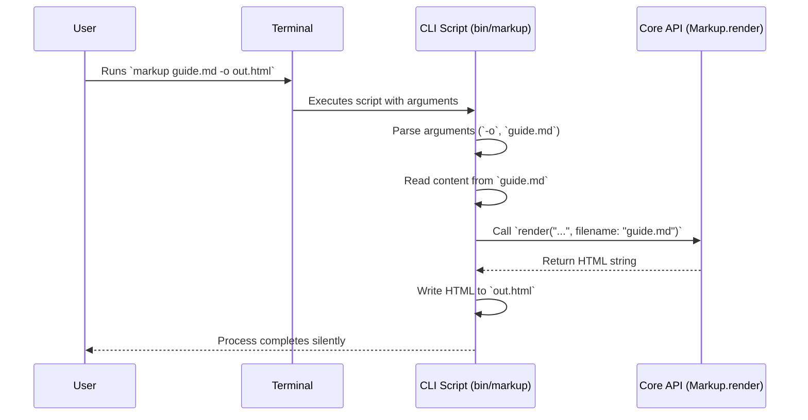

# Chapter 2: The Command-Line Tool

In [Chapter 1: The Main Rendering Interface](chapter_01.md), we explored the core Ruby API for the `markup` library. We saw how `Markup.render` provides a simple, powerful entry point for developers to convert markup into HTML within their applications. However, not every interaction with our library will happen through Ruby code.

This chapter introduces the command-line tool, an executable script that brings the full power of the `markup` library directly to your terminal.

---

### Problem & Motivation

Imagine you're a technical writer, a developer documenting a project, or even a student taking notes. You've just finished writing a detailed `README.md` file and want to quickly preview how it will look as an HTML page before pushing it to a repository. Opening a Ruby console and writing a script just to render one file is cumbersome and interrupts your workflow.

This is the problem the command-line tool (CLI) solves. It provides a direct, script-free way to interact with the rendering engine. The primary motivation is to make the library **immediately useful** to a broader audience, including those who may not be Ruby developers. It transforms the library from a developer-only component into a general-purpose utility for anyone working with markup files.

Our guiding use case for this chapter will be simple: **A user wants to convert a file named `guide.md` into `guide.html` using a single terminal command.**

### Core Concept Explanation

The `markup` command-line tool is an executable script that acts as a user-friendly wrapper around the core library. Think of it like the dashboard of a car. The `Markup.render` API from Chapter 1 is the complex engine, full of power and potential. The command-line tool is the steering wheel, accelerator, and brake—simple controls that let you use the engine without needing to be a mechanic.

When you run a command like `markup guide.md`, several things happen behind the scenes:
1.  **Argument Parsing**: The tool first reads the arguments you provided (`guide.md`). It understands special instructions, called "flags" or "options" (like specifying an output file with `-o`).
2.  **Input Reading**: It reads the content from the specified source, which can be a file or even data piped directly into the command.
3.  **Core API Invocation**: It then passes this content and the filename to the `Markup.render` method we learned about in the previous chapter. The filename is crucial, as it allows the library to auto-detect the markup language.
4.  **Output Writing**: Finally, it takes the returned HTML and prints it to a destination, which is typically your terminal screen (standard output) or a file you specify.

This design keeps the CLI simple and focused. Its only job is to handle user input and output, delegating the complex rendering logic to the core library.

---

### Practical Usage Examples

Let's solve our user's problem: converting `guide.md` to `guide.html`.

#### Quick Start: Rendering a File

The most common use case is rendering a file and saving the output to a new file. We use the `>` character, a standard shell operator that "redirects" the command's screen output into a file.

First, let's create our input file, `guide.md`:

```markdown
# Project Guide

This is a simple guide for the `markup` project.

-   Easy to use
-   Extensible
```

Now, run the command in your terminal:

```bash
markup guide.md > guide.html
```

**Explanation:**
*   `markup`: This is the name of our executable command.
*   `guide.md`: This is the input file we want to render.
*   `>`: This is the shell redirection operator.
*   `guide.html`: This is the file where the output will be saved.

The command will produce a new file, `guide.html`, containing the rendered HTML:

```html
<h1>Project Guide</h1>
<p>This is a simple guide for the <code>markup</code> project.</p>
<ul>
<li>Easy to use</li>
<li>Extensible</li>
</ul>
```

#### Specifying an Output File with a Flag

Instead of using shell redirection (`>`), you can use the built-in `--output` (or `-o`) flag for a more explicit command.

```bash
markup guide.md -o guide.html
```

**Explanation:**
This command achieves the exact same result as the previous one. The `-o` flag is often clearer for beginners and can be more reliable in complex scripts.

#### Rendering from Standard Input

The tool is also designed to work with standard Unix pipes (`|`). This allows you to chain commands together. For instance, you can `echo` a string of Markdown and pipe it directly to the `markup` tool.

```bash
echo "**Hello, World!**" | markup
```

**Explanation:**
*   `echo "**Hello, World!**"`: This command prints the string to standard output.
*   `|`: The pipe operator takes the output from the `echo` command and uses it as the input for the `markup` command.

This will print the rendered HTML directly to your terminal:

```html
<p><strong>Hello, World!</strong></p>
```

---

### Internal Implementation Walkthrough

So, how does running `markup` in the terminal actually work? Let's trace the process step-by-step. The logic resides primarily in the `bin/markup` executable file.

1.  **Argument Parsing**: The script first uses Ruby's built-in `OptionParser` library to define and parse command-line arguments like `-o` for output and `-h` for help. This step identifies the input source and output destination.

2.  **Reading Input**: Based on the parsed arguments, the script determines where to get the markup content.
    *   If a filename is provided (e.g., `guide.md`), it reads the contents of that file.
    *   If no filename is provided, it assumes the content is being piped in and reads from standard input (`$stdin`).

3.  **Invoking the Core API**: This is the most crucial step. The script calls `Markup.render`, passing the content it just read. It also wisely passes the original filename, which is essential for the [Markup Language Registry](chapter_03.md) to select the correct renderer.

4.  **Writing Output**: Finally, the script takes the HTML string returned by `Markup.render` and writes it.
    *   If an output file was specified with `-o`, it writes to that file.
    *   Otherwise, it prints the HTML to standard output (`$stdout`), which is why you see it in your terminal or can redirect it with `>`.

This entire flow can be visualized with a sequence diagram:



### System Integration

The Command-Line Tool is the highest-level abstraction in the `markup` project, serving as the primary entry point for end-users. Its relationship with other components is simple but vital:

*   **[The Main Rendering Interface](chapter_01.md)**: The CLI is a direct *client* of this interface. It doesn't contain any rendering logic itself; it simply collects input from the user and passes it to `Markup.render`. This separation of concerns is a key architectural strength.

*   **[Markup Language Registry](chapter_03.md)**: The CLI doesn't interact with the registry directly, but it enables it. By passing the *filename* to the main rendering interface, it provides the critical piece of information the registry needs to look up the appropriate renderer. Without the filename context from the CLI, the system wouldn't know whether to use the Markdown or AsciiDoc renderer.

---

### Best Practices & Tips

*   **Always Use File Extensions**: The CLI relies on file extensions like `.md`, `.adoc`, or `.textile` to select the right renderer. Using correct extensions ensures your files are rendered as expected without any extra configuration.

*   **Redirect or Specify Output**: A common beginner mistake is to run `markup myfile.md` and be surprised when a wall of HTML floods the terminal. Remember to either redirect the output with `> myfile.html` or use the `-o myfile.html` flag.

*   **Combine with Other Tools**: Embrace the power of the shell. You can combine `markup` with other commands. For example, you can concatenate multiple files and render them as a single document:
    ```bash
    cat chapter1.md chapter2.md | markup > book.html
    ```
    *Note: This simple example doesn't add any separation between the files, but it demonstrates the principle of piping.*

*   **Troubleshooting: "Unsupported file type"**: If you see this error, it means you've provided a file with an extension that hasn't been registered. We'll cover how to add new renderers in the [Markup Language Registry](chapter_03.md) chapter.

*   **Troubleshooting: "command not found: markup"**: This typically means the `bin` directory of the project is not in your system's `PATH`. Ensure you've followed the installation instructions correctly.

### Chapter Conclusion

We've learned that the command-line tool provides a simple, powerful, and script-free way to use the `markup` library. It acts as a clean bridge between the user's terminal and the core rendering engine, handling argument parsing, I/O, and delegating the real work to the main interface. It makes our library accessible and useful right out of the box.

The magic of the CLI's automatic language detection hinges on a crucial component: a system that maps file types to their corresponding renderers. In the next chapter, we will pull back the curtain on this system and explore the heart of the library's extensibility.

Next: **[Chapter 3: Markup Language Registry](chapter_03.md)**