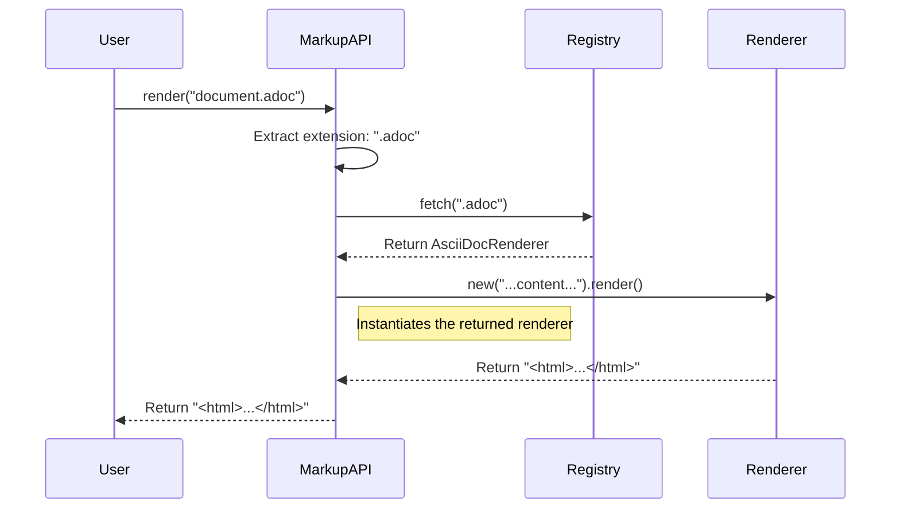

# Chapter 3: Markup Language Registry

In the previous chapter, we explored [The Command-Line Tool](chapter_02.md), which provides a simple way to render files from your terminal. When you run a command like `markup render document.md`, the tool needs to know *how* to handle a `.md` file. Should it use a Markdown processor? What about a `.adoc` file? This chapter introduces the central component that answers these questions: the Markup Language Registry.

---

### Problem & Motivation

Imagine our project only supported Markdown. The core rendering logic might have a simple `if` statement: "if the filename ends with `.md`, use the Markdown renderer." This works, but it's incredibly rigid. What happens when we want to add support for AsciiDoc? We'd have to modify the core logic with an `elsif`. What about Textile, or ReStructuredText? The code would become a long, messy chain of conditionals, making it difficult to maintain and extend.

This approach tightly couples the rendering engine to the specific languages it supports. Every time a developer wants to add a new language, they must edit the central rendering function, increasing the risk of introducing bugs. We need a way to decouple the *knowledge* of which renderer to use from the *action* of rendering.

The solution is a central directory or "registry." Instead of hardcoding the logic, the main renderer simply asks the registry: "I have a file with a `.adoc` extension. Which tool should I use?" The registry looks up `.adoc` and provides the correct renderer. This design makes our system pluggable. To add a new language, we simply define its renderer and register it in one place, without touching the core rendering engine at all.

### Core Concept Explanation

The **Markup Language Registry** is the heart of the `markup` library's configuration. Think of it as a dictionary or a phonebook for renderers. The "names" in this phonebook are file extensions (like `.md`, `.adoc`), and the "phone numbers" are the specific renderer implementations responsible for processing that language.

At its core, the registry is a simple key-value map.
*   **Keys**: The file extensions (e.g., `".md"`, `".markdown"`, `".adoc"`) that identify a markup language.
*   **Values**: The renderer class or object that knows how to convert that specific markup into HTML.

This registry serves as the single source of truth for all supported languages. When the main rendering interface receives a file, it extracts the extension, looks it up in the registry, and retrieves the corresponding renderer. If the extension isn't found, the system knows the language is unsupported.

This architecture provides immense flexibility. Adding a new language becomes a two-step process: create a renderer and register its file extension. There's no need to modify the existing, battle-tested rendering logic. This "open for extension, closed for modification" principle is a cornerstone of robust software design.

---

### Practical Usage Examples

Let's walk through a practical example: adding support for a new markup language, `Textile`.

#### 1. Inspecting the Default Registry

First, let's see what languages are supported out of the box. The `Markup::Registry` class holds this information.

```ruby
# lib/markup.rb
require 'markup/registry'
require 'markup/renderers/markdown_renderer'

# Default registration
Markup::Registry.register(".md", Markup::Renderers::MarkdownRenderer)
Markup::Registry.register(".markdown", Markup::Renderers::MarkdownRenderer)
```
*   **Explanation**: By default, the library registers two extensions, `.md` and `.markdown`, and maps them both to the `MarkdownRenderer`.

You can query the registry to find a renderer for a given extension.

```ruby
# Check for Markdown support
renderer_class = Markup::Registry.fetch(".md")
puts renderer_class.name
```
*   **Expected Output**:
    ```
    Markup::Renderers::MarkdownRenderer
    ```
*   **Explanation**: The `fetch` method looks up the extension and returns the associated renderer class.

#### 2. Defining a New Renderer

Before we can register `Textile`, we need a renderer for it. For this example, we'll create a simple placeholder class.

```ruby
# lib/markup/renderers/textile_renderer.rb
module Markup
  module Renderers
    class TextileRenderer
      def render(text)
        # In a real scenario, this would convert Textile to HTML
        "<h1>Rendered from Textile:</h1><p>#{text}</p>"
      end
    end
  end
end
```
*   **Explanation**: This class defines a `render` method, fulfilling the basic renderer contract. We'll explore this contract further in [The Generic Renderer Contract](chapter_06.md).

#### 3. Registering the New Language

Now, let's add our new `TextileRenderer` to the central registry. This is typically done in an initialization file.

```ruby
# config/initializers/markup.rb
require 'markup/renderers/textile_renderer'

Markup::Registry.register(".textile", Markup::Renderers::TextileRenderer)
```
*   **Explanation**: The `register` method adds a new entry to the map, associating the `.textile` extension with our new renderer.

#### 4. Verifying the Registration

Let's confirm our new language is recognized.

```ruby
# Verify Textile support
renderer_class = Markup::Registry.fetch(".textile")
puts renderer_class.name
```
*   **Expected Output**:
    ```
    Markup::Renderers::TextileRenderer
    ```
*   **Explanation**: The registry now successfully resolves the `.textile` extension to our custom renderer. The system is now ready to process Textile files without any changes to its core logic.

---

### Internal Implementation Walkthrough

The internal mechanism of the registry is straightforward but powerful. It is typically implemented as a class that encapsulates a hash table, providing a safe and clear interface for adding and retrieving renderers.

Let's trace the journey of a rendering request to see how the registry fits in. This process usually lives within the main `Markup.render` method, which we first saw in [The Main Rendering Interface](chapter_01.md).



**Step-by-Step Breakdown:**

1.  **Request**: The `User` calls the `MarkupAPI.render` method with a filename.
2.  **Extension Extraction**: The API first determines the file's extension. For `document.adoc`, this is `.adoc`.
3.  **Registry Lookup**: It then calls `Registry.fetch(".adoc")`, asking the registry for the appropriate renderer.
4.  **Renderer Retrieval**: The `Registry` looks up `.adoc` in its internal hash and returns the `AsciiDocRenderer` class.
5.  **Instantiation & Execution**: The `MarkupAPI` receives the class, creates a new instance of it, and calls its `render` method, passing in the file's content.
6.  **Return HTML**: The `AsciiDocRenderer` does its job and returns the final HTML.
7.  **Final Response**: The `MarkupAPI` passes this HTML back to the `User`.

This entire process is orchestrated without the `MarkupAPI` needing to know anything about AsciiDoc itself. Its only dependency is on the `Registry` and the common interface shared by all renderers.

---

### System Integration

The `Registry` is a central hub that connects several key components of the project:

*   **[The Main Rendering Interface](chapter_01.md)**: This is the primary *consumer* of the registry. It relies entirely on the registry to resolve file extensions to renderer classes. It's the component that performs the lookup.
*   **[The Command-Line Tool](chapter_02.md)**: As a user-facing wrapper around the main interface, the CLI is an *indirect consumer*. Its ability to handle different file types is a direct result of the registry's configuration.
*   **[Rendering Strategies: Commands vs. Gems](chapter_04.md)**: The renderers themselves, which are the *values* stored in the registry, are built using different strategies. The registry doesn't care *how* a renderer works, only that it can be retrieved via an extension.

The registry acts as the glue, allowing the high-level API to remain blissfully ignorant of the low-level rendering details, which fosters a clean, decoupled architecture.

### Best Practices & Tips

*   **Register All Common Extensions**: If a language has multiple common extensions (e.g., `.md`, `.markdown`), register all of them to point to the same renderer for a better user experience.
*   **Avoid Overwriting Core Renderers**: Be cautious when registering an extension that is already in use. While you can overwrite the default Markdown renderer with a custom one, do so intentionally in a clear configuration entry point.
*   **Namespace Custom Renderers**: When creating your own renderers, place them in a dedicated module (e.g., `MyCompany::Renderers`) to avoid naming conflicts with future additions to the core library.
*   **Common Pitfall**: A common mistake is creating a new renderer class but forgetting to call `Markup::Registry.register`. If the renderer isn't registered, the system will not be able to find and use it, resulting in an "unsupported file type" error.

---

### Chapter Conclusion

The Markup Language Registry is a simple yet vital component that makes our project extensible and maintainable. By acting as a central directory for mapping file extensions to renderers, it decouples language detection from the core rendering logic. This allows developers to easily add support for new languages without modifying the system's core.

Now that we understand how the system *chooses* a renderer, it's time to explore the different ways a renderer can be built. Are they powered by external command-line tools or self-contained Ruby gems? The next chapter delves into this very topic.

**Next**: [Rendering Strategies: Commands vs. Gems](chapter_04.md)