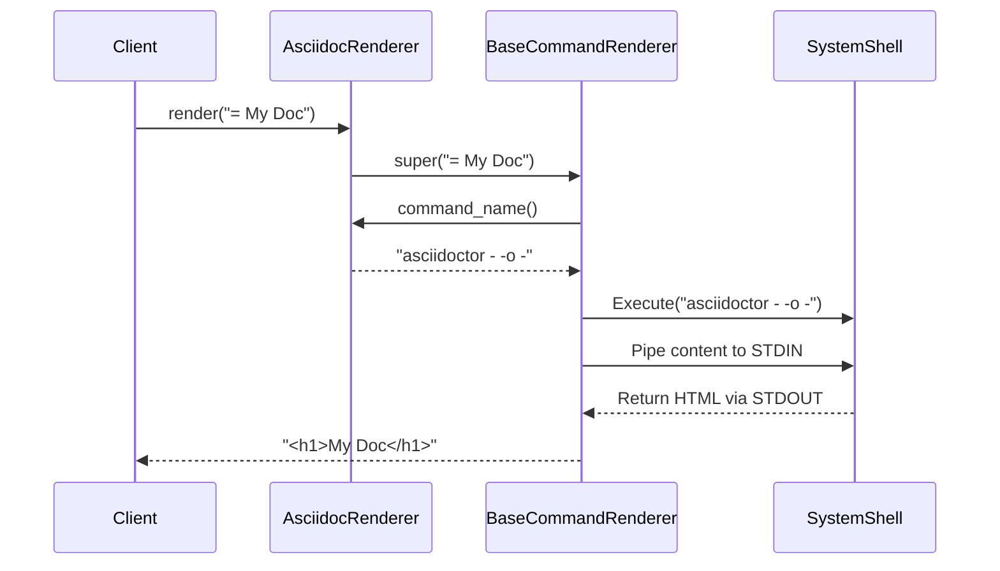

# Chapter 4: Rendering Strategies: Commands vs. Gems

In the previous chapter, we explored the [Markup Language Registry](chapter_03.md), the system's central directory that maps file types to specific renderer classes. Once the registry tells us *which* class to use for a given markup language, the next logical question is: how does that class actually perform the rendering?

This chapter dives into the core mechanics of rendering. We'll uncover the two fundamental strategies the `markup` library employs: executing an external command-line tool or leveraging a native Ruby gem. Understanding these two approaches is key to appreciating the project's flexibility and power.

---

### Problem & Motivation

Different markup languages come with different ecosystems. For some, like AsciiDoc, the official and most robust renderer is a command-line interface (CLI) tool. For others, like Markdown, there are numerous high-quality, high-performance libraries available as Ruby gems. A rigid system that only supports one of these methods would severely limit the languages we could support and the quality of the rendering we could offer.

The core problem is this: **How can we create a unified system that can seamlessly use both external programs and internal libraries without complicating the main rendering interface?** We need to abstract away the *how* of the rendering process, so the rest of the application doesn't need to care whether it's talking to a gem like `kramdown` or a command like `pandoc`.

Imagine we want our library to render Markdown using the `redcarpet` gem for speed and AsciiDoc using the standard `asciidoctor` command for full feature compliance. Without a common abstraction, our code would be filled with `if/else` statements, special cases, and duplicated logic for handling subprocesses and library calls. This would be brittle, hard to maintain, and difficult to extend. This chapter introduces the architectural pattern that elegantly solves this exact problem.

### Core Concept Explanation

To solve this, the `markup` project employs the **Strategy Pattern**, a classic software design pattern. The idea is simple: define a family of interchangeable algorithms and encapsulate each one in its own class. Our "algorithm" is the process of converting markup to HTML. The two primary strategies we've implemented are:

1.  **The Gem Strategy**: This approach uses a Ruby gem directly within the application's process. The renderer class will `require` the necessary library, instantiate a rendering object, and call a method to perform the conversion. This is often simpler to manage as dependencies are handled by Bundler, and it avoids the overhead of starting a new system process.

2.  **The Command Strategy**: This approach delegates the rendering work to an external command-line tool installed on the system. The renderer class is responsible for constructing the correct command, passing the markup content to it (usually via `STDIN`), and capturing its output (`STDOUT`). This is perfect for leveraging powerful, mature tools written in other languages without having to reimplement their logic.

Both strategies are designed to be "black boxes" from the perspective of the main system. They each expose an identical, simple `render(content)` method. The [Main Rendering Interface](chapter_01.md) can treat a `MarkdownRenderer` (using a gem) and an `AsciidocRenderer` (using a command) in exactly the same way. It just calls `render`, and the strategy handles the rest.

This separation of concerns is the cornerstone of the system's extensibility. To add support for a new language, you simply choose the best tool for the job—a gem or a command—and create a new renderer class that inherits from the appropriate base strategy class.

---

### Practical Usage Examples

To make this concrete, let's look at how we would define renderers for Markdown (using a gem) and AsciiDoc (using a command). These examples inherit from two base classes, `BaseGemRenderer` and `BaseCommandRenderer`, which contain the core logic for each strategy.

#### Gem-Based Rendering: Markdown

Here, we'll create a `MarkdownRenderer` that uses the `redcarpet` gem. It only needs to specify which gem to load and how to invoke it.

```ruby
# Renders Markdown using the 'redcarpet' gem.
class MarkdownRenderer < BaseGemRenderer
  def render(content)
    # 1. Ensure the gem is available
    require 'redcarpet'

    # 2. Configure and run the renderer
    markdown = Redcarpet::Markdown.new(Redcarpet::Render::HTML)
    markdown.render(content)
  end
end
```

**Explanation:**
This class inherits all the foundational logic from `BaseGemRenderer`. Its sole responsibility is to implement the `render` method by loading the `redcarpet` gem, creating a new renderer instance, and calling its `render` method. It's simple, direct, and self-contained.

#### Command-Based Rendering: AsciiDoc

Now, let's create an `AsciidocRenderer` that uses the external `asciidoctor` command. It just needs to define which command to run.

```ruby
# Renders AsciiDoc using the 'asciidoctor' command-line tool.
class AsciidocRenderer < BaseCommandRenderer
  def command_name
    # Define the command to execute
    "asciidoctor - -o -"
  end
end
```

**Explanation:**
This class inherits from `BaseCommandRenderer`. Instead of implementing a complex `render` method, it only needs to provide the `command_name`. The ` - -o -` part tells `asciidoctor` to read from standard input and write the resulting HTML to standard output. The base class will handle the complex parts: running the process, piping the content, and capturing the output.

---

### Internal Implementation Walkthrough

So what magic is happening inside `BaseGemRenderer` and `BaseCommandRenderer`? Let's trace the execution flow for each.

#### The `BaseCommandRenderer` Flow

When `render(content)` is called on a class like our `AsciidocRenderer`, the `BaseCommandRenderer` takes over and performs these steps:

1.  **Get Command**: It calls the `command_name` method on the subclass (`AsciidocRenderer`) to get the string `"asciidoctor - -o -"`.
2.  **Open Subprocess**: It uses a Ruby standard library like `Open3` to execute this command in a new shell process.
3.  **Pipe Content**: It writes the `content` string to the new process's standard input (`STDIN`).
4.  **Capture Output**: It reads everything the process writes to its standard output (`STDOUT`) and standard error (`STDERR`).
5.  **Error Handling**: If the process exits with a non-zero status code (indicating an error), the base class raises a custom `RenderingError`, including any messages from `STDERR` for easier debugging.
6.  **Return HTML**: If successful, it returns the captured `STDOUT` content, which is the rendered HTML.

The interaction looks like this:



#### The `BaseGemRenderer` Flow

The gem-based strategy is more direct, as it all happens within the same Ruby process. When `render(content)` is called on our `MarkdownRenderer`:

1.  **Require Gem**: The implementation first calls `require 'gem_name'` to load the library. The `BaseGemRenderer` could provide helper methods to wrap this in a `begin...rescue LoadError` block to give a friendly error message if the gem isn't installed.
2.  **Instantiate and Render**: It creates an instance of the gem's main rendering class and calls its `render` method, passing along the `content`.
3.  **Return HTML**: It returns the HTML string produced by the gem.

This flow is simpler because it avoids process management, but it relies on the gem being well-behaved and available in the project's `Gemfile`.

### System Integration

These rendering strategies are the bridge between the high-level API and the low-level rendering tools. Here’s how they fit into the overall architecture:

1.  A user calls `Markup.render(file: "document.md")` via [The Main Rendering Interface](chapter_01.md).
2.  The interface consults the [Markup Language Registry](chapter_03.md) to find the right renderer for the `.md` extension. The registry returns the `MarkdownRenderer` class.
3.  The main interface instantiates `MarkdownRenderer` and calls its `render` method.
4.  Because `MarkdownRenderer` inherits from `BaseGemRenderer`, it executes the gem-based strategy, loads `redcarpet`, and returns the HTML.

Crucially, the main interface never needs to know that `MarkdownRenderer` uses a gem. If we later decided to switch to a command-based tool like `pandoc`, we would only need to change `MarkdownRenderer` to inherit from `BaseCommandRenderer` and define a `command_name`. The rest of the system would work without any changes. This entire system relies on all renderers, regardless of strategy, conforming to [The Generic Renderer Contract](chapter_06.md).

---

### Best Practices & Tips

Choosing the right strategy for a new markup language is an important design decision. Here are some guidelines:

*   **Favor Gem Strategy for Simplicity**: If a well-maintained and feature-complete Ruby gem exists, it's often the best choice. It simplifies dependency management (just add it to the `Gemfile`) and avoids system-level dependencies.
*   **Use Command Strategy for Power**: For languages with a canonical, feature-rich tool written in another language (like `pandoc` or `asciidoctor`), wrapping the command is the most robust approach. It ensures you get 100% feature compatibility without reimplementing anything.
*   **Handle External Dependencies Gracefully**: When using the `CommandStrategy`, your renderer should check if the command exists on the system `PATH` and provide a clear error message if it doesn't.
*   **Avoid Shell Injection**: Never construct commands by directly inserting user-provided content into the command string. Use libraries like `Open3` that allow you to pass arguments safely, or ensure rigorous sanitization. The `BaseCommandRenderer` should provide this safety layer.
*   **Manage Gem Dependencies**: For the `GemStrategy`, wrap the `require` call in a `begin/rescue LoadError` block to guide users to install the necessary gem if it's missing.

### Chapter Conclusion

In this chapter, we established the two foundational rendering strategies that power the `markup` library: using native Ruby gems and wrapping external command-line tools. By abstracting these two methods behind a common interface using the Strategy Pattern, we've created a system that is robust, flexible, and easy to extend.

You now understand the architectural backbone of how rendering is performed. With this foundation in place, we are ready to explore the concrete implementations that build on these strategies.

In the next chapter, we will examine the actual code for several [Specific Language Renderers](chapter_05.md), seeing these strategies in action for languages like Markdown, AsciiDoc, and more.