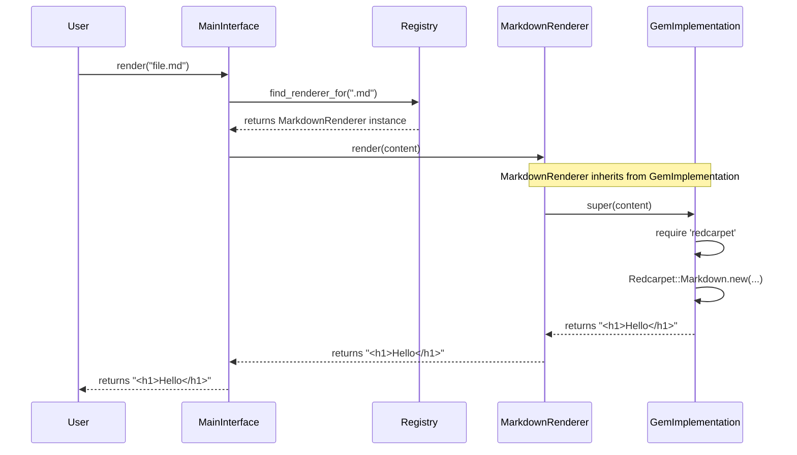

# Chapter 5: Specific Language Renderers

In the previous chapter, we explored the two foundational rendering approaches in the `markup` library: `CommandImplementation` and `GemImplementation`. These classes provide the abstract logic for *how* to render content but lack the specific details for any particular language. We established the blueprints, but now it's time to build the actual workers.

This chapter dives into the concrete classes that put those blueprints into action. These **Specific Language Renderers** are the heart of the system's extensibility, providing the "last mile" implementation for converting formats like Markdown, AsciiDoc, and RDoc into HTML.

---

### Problem & Motivation

The `markup` library promises to render *various* markup languages, but so far, we've only discussed general strategies. A strategy alone is not enough. For example, the `CommandImplementation` knows how to execute a command-line tool, but it doesn't know *which* tool to run. Should it execute `pandoc`, `asciidoctor`, or `redcarpet`? Similarly, the `GemImplementation` knows how to use a Ruby gem, but it is unaware of whether it should `require 'kramdown'` or `require 'commonmarker'`.

This is the problem that Specific Language Renderers solve: they bridge the gap between abstract strategy and concrete implementation. They provide the specific, language-dependent details required to perform a conversion. Without them, our flexible architecture would be unusable, as the system would have no knowledge of how to handle a `.md` or `.adoc` file.

As a guiding use case, let's consider how we would add support for two popular languages:
1.  **Markdown**, using the popular `redcarpet` gem.
2.  **AsciiDoc**, using the standard `asciidoctor` command-line tool.

These two examples will perfectly illustrate how specific renderers are built upon the two strategies we've already learned about.

### Core Concept Explanation

A **Specific Language Renderer** is a simple Ruby class responsible for rendering a single markup language. Its primary job is to inherit from one of the two base strategy classes (`CommandImplementation` or `GemImplementation`) and provide the configuration details that the parent class needs to function.

Think of the strategy classes as generic job descriptions. `GemImplementation` is like a job description for an "In-House Specialist," while `CommandImplementation` is for a "Third-Party Contractor." These descriptions outline the general workflow but don't name the actual person or company.

A specific renderer, like `MarkdownRenderer`, is the resume of an applicant applying for that job. It says, "I am an In-House Specialist for Markdown. To do my job, you need to hire the expert named 'Redcarpet'." Similarly, an `AsciiDocRenderer` says, "I am a Third-Party Contractor for AsciiDoc. The contractor you need to call is 'asciidoctor'."

By inheriting from a strategy class, the specific renderer automatically gains all the logic for file I/O, error handling, and the core rendering process. Its only responsibility is to supply the missing details: the name of the command or the necessary gem and class information. This design keeps the specific renderers incredibly lightweight, focused, and easy to create.

---

### Practical Usage Examples

Let's implement the renderers for our motivating use case: Markdown and AsciiDoc. These examples show how little code is needed to add support for a new language.

#### 1. Creating a Gem-Based Renderer for Markdown

To support Markdown using the `redcarpet` gem, we create a class that inherits from `Markup::GemImplementation` and provides the gem's details.

```ruby
# lib/markup/markdown.rb
require 'markup/gem_implementation'

module Markup
  class Markdown < GemImplementation
    def initialize
      @gem_name = 'redcarpet'
      @renderer_class = 'Redcarpet::Markdown'
    end
  end
end
```
**Explanation:**
*   We inherit from `GemImplementation` to gain all the logic for handling gem-based rendering.
*   In the `initialize` method, we set two instance variables:
    *   `@gem_name`: The name of the gem to `require`.
    *   `@renderer_class`: The full class name (as a string) that will be instantiated to perform the rendering.

#### 2. Creating a Command-Based Renderer for AsciiDoc

For AsciiDoc, we'll use the `asciidoctor` command. This requires inheriting from `Markup::CommandImplementation` and specifying the command name.

```ruby
# lib/markup/asciidoc.rb
require 'markup/command_implementation'

module Markup
  class AsciiDoc < CommandImplementation
    def initialize
      @command = 'asciidoctor -o - -'
    end
  end
end
```
**Explanation:**
*   We inherit from `CommandImplementation` to get the command-execution logic for free.
*   We set `@command` to the exact command string to execute. The arguments `-o - -` tell Asciidoctor to write the HTML output to standard output and read the source content from standard input, which is exactly what our `CommandImplementation` expects.

#### 3. Registering the New Renderers

Once these classes are defined, the final step is to tell the system about them in the `[Markup Language Registry](chapter_03.md)`. This maps file extensions to our new renderer classes.

```ruby
# config/registry.rb
Markup::Registry.register('md', 'markdown', Markup::Markdown.new)
Markup::Registry.register('adoc', 'asciidoc', Markup::AsciiDoc.new)
```
**Explanation:**
*   `register('md', 'markdown', ...)` tells the registry that files ending in `.md` or identified as `markdown` should be handled by an instance of our `Markup::Markdown` class.
*   The same logic applies to `.adoc` files and our `Markup::AsciiDoc` class. With these lines, our new languages are fully integrated into the system.

---

### Internal Implementation Walkthrough

What happens when you ask the library to render a Markdown file? The process involves a clean chain of delegation, where each object does its small part.

1.  The `[The Main Rendering Interface](chapter_01.md)` receives a request.
2.  It consults the `[Markup Language Registry](chapter_03.md)` and finds that `.md` files are handled by a `Markup::Markdown` instance.
3.  It calls the `render` method on the `Markup::Markdown` instance.
4.  Since `Markup::Markdown` doesn't have its own `render` method, it delegates the call up to its parent, `Markup::GemImplementation`.
5.  `Markup::GemImplementation`'s `render` method executes. It uses the `@gem_name` (`'redcarpet'`) and `@renderer_class` (`'Redcarpet::Markdown'`) provided by the `Markup::Markdown` instance to load the gem, create a renderer object, and process the text.
6.  The resulting HTML is returned all the way back to the original caller.

This interaction can be visualized with a sequence diagram:



This diagram shows how the `MarkdownRenderer` acts as a data provider for the `GemImplementation`, which contains the actual rendering logic.

### System Integration

Specific Language Renderers are the crucial link between the project's high-level abstractions and its low-level strategies. They don't operate in isolation but connect several key components:

*   **[Markup Language Registry](chapter_03.md)**: The registry's entire purpose is to store and provide access to instances of these specific renderer classes. It acts as a phonebook, and the specific renderers are the entries.
*   **[Rendering Strategies: Commands vs. Gems](chapter_04.md)**: Every specific renderer *must* inherit from one of the two strategy classes. This inheritance is the core mechanism that gives them their rendering power without boilerplate code.
*   **[The Main Rendering Interface](chapter_01.md)**: The main interface is the consumer of these classes. It uses the registry to find the right renderer and then calls `render` on it, kicking off the entire process.

The data flow is simple and unidirectional:
**Main Interface → Registry → Specific Renderer → Rendering Strategy → HTML Output**

---

### Best Practices & Tips

*   **One Class, One Language**: A specific renderer should only ever be responsible for a single markup language. This adheres to the Single Responsibility Principle and keeps the classes simple and maintainable.
*   **Prefer Gems When Possible**: If a stable and well-maintained Ruby gem exists for a markup language, it's generally better to use `GemImplementation`. This avoids the performance overhead of shelling out to an external command and makes dependency management easier.
*   **Keep Renderers "Dumb"**: The specific renderer's job is to provide configuration, not logic. All complex logic should reside in the parent strategy classes. Avoid adding custom methods or complex logic to your specific renderer classes.
*   **Test in Isolation**: When adding a new renderer, you can easily test it directly without involving the rest of the system. Simply instantiate it (`my_renderer = Markup::MyNewRenderer.new`) and call its `render` method.

### Chapter Conclusion

We have now seen how the `markup` project becomes truly functional and extensible. Specific Language Renderers are the concrete, hardworking classes that turn our abstract strategies into a practical, multi-language rendering engine. By creating simple classes that inherit from a base strategy and provide a few configuration details, we can easily add support for any number of markup formats.

With a clear understanding of the abstract strategies and the concrete renderers that use them, one final question remains: how do we guarantee that all renderers, regardless of their strategy, behave in a predictable and consistent way? To ensure this, we need a formal set of rules—a contract.

In the next chapter, we will explore this contract and the generic interface that all renderers must adhere to.

Next: **[The Generic Renderer Contract](chapter_06.md)**