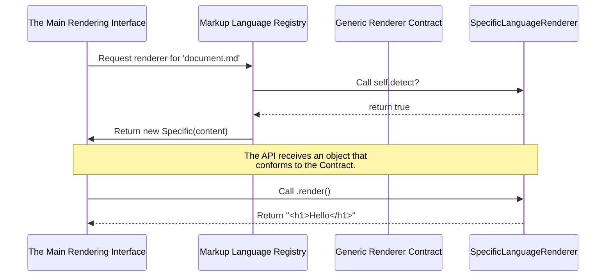

# Chapter 6: The Generic Renderer Contract

In the previous chapter on [Specific Language Renderers](chapter_05.md), we explored the concrete classes responsible for converting individual markup languages like Markdown and RDoc into HTML. We saw that each one handles the unique details of its language. Now, we will take a step back to examine the foundational blueprint they all share: the generic contract that makes the entire system work together seamlessly.

---

### Problem & Motivation

Imagine a system without a contract. The Markdown renderer might have a method called `generate_html`, the AsciiDoc renderer might use `convert_to_web`, and a future Textile renderer could use `process_textile`. When the main rendering engine receives a file, it would need a complex set of `if/elsif` statements to figure out which specific method to call for which object. This would be brittle, hard to maintain, and a nightmare to extend.

Every time a new renderer is added, this central logic would have to be modified. This violates the Open/Closed Principle, which states that software entities should be open for extension but closed for modification. We need a way to add new renderers without ever touching the core rendering logic.

This is the problem the Generic Renderer Contract solves. It acts as a standardized agreement that every renderer must sign. It guarantees that no matter how a renderer works internally—whether it uses a gem or a command-line tool—it will always expose the same public methods. This allows the main system to treat all renderers interchangeably, like interchangeable parts in a machine.

### Core Concept Explanation

The Generic Renderer Contract is an **abstract base class**. Think of it not as a functional tool itself, but as a template or a blueprint. You would never use the blueprint for a house to live in; you use it to build an actual house. Similarly, you never use the Generic Renderer Contract directly to render a document; you use it to build a specific renderer (like a `MarkdownRenderer`).

This contract enforces a consistent structure by defining a set of methods that any inheriting class *must* implement. The two most important methods in this contract are:

1.  `render`: The instance method that takes the source content and returns the final HTML string.
2.  `detect?`: A class method that checks if the renderer is usable in the current environment (e.g., is the required gem installed? Is the necessary command-line tool available in the system's `PATH`?).

By defining this common interface, the contract decouples the high-level rendering system from the low-level rendering implementations. The [Main Rendering Interface](chapter_01.md) doesn't need to know *how* Markdown is rendered; it only needs to know that it can call the `.render` method on whatever renderer object the [Markup Language Registry](chapter_03.md) provides. This is the key to the project's architectural flexibility and extensibility.

---

### Practical Usage: Implementing the Contract

Since the contract is abstract, the most practical way to understand it is to see how a new, custom renderer would implement it. Let's create a very simple "Preformatted Text Renderer" that just wraps any given text in `<pre>` HTML tags.

#### Step 1: Define the Class and Inherit from the Contract

First, we create our new renderer class and make it a subclass of the abstract contract, which we'll call `Markup::Renderer::Base`.

```ruby
# lib/markup/renderer/preformatted_text_renderer.rb
require 'markup/renderer/base'

class PreformattedTextRenderer < Markup::Renderer::Base
  # Implementation will go here
end
```
**Explanation**: By inheriting from `Markup::Renderer::Base`, our new class promises to follow the rules defined in the contract.

#### Step 2: Implement the `detect?` Method

The registry needs a way to know if this renderer is available. For our simple case, it's always available, so we just return `true`. A real-world renderer would check for a gem or command here.

```ruby
class PreformattedTextRenderer < Markup::Renderer::Base
  def self.detect?
    true # This renderer has no external dependencies
  end
end
```
**Explanation**: The `detect?` method allows the [Markup Language Registry](chapter_03.md) to automatically discover and validate this renderer at startup.

#### Step 3: Implement the `render` Method

This is the core logic. The contract requires a `render` method that returns the final HTML. Our implementation will be simple.

```ruby
class PreformattedTextRenderer < Markup::Renderer::Base
  # ... detect? method from above ...

  def render
    "<pre>#{@content}</pre>"
  end
end
```
**Explanation**: The base class constructor (`initialize`) will have already stored the document's text in an instance variable named `@content`. Our `render` method simply uses this variable to produce the output.

With these few lines of code, we have a fully compliant renderer that can be registered and used by the system just like any other, all thanks to the guidance provided by the Generic Renderer Contract.

### Internal Implementation Walkthrough

The Generic Renderer Contract is more than just a list of required methods; it provides a shared structure. Let's look at how the abstract base class (`lib/markup/renderer/base.rb`) is designed.

#### The `Base` Class Structure

A simplified version of the base class might look like this:

```ruby
# lib/markup/renderer/base.rb
module Markup
  module Renderer
    class Base
      attr_reader :content

      def initialize(filename, content)
        @filename = filename
        @content = content
      end

      def self.detect?
        raise NotImplementedError
      end

      def render
        raise NotImplementedError
      end
    end
  end
end
```
**Explanation**:
*   **`initialize(filename, content)`**: The constructor stores the source content, making it available to all subclasses as `@content`.
*   **`detect?` and `render`**: These methods raise a `NotImplementedError`. This is a deliberate design choice. It forces any developer creating a new renderer to provide their own implementation. If they forget, the program will crash with a clear error message, preventing incomplete renderers from being used.

### System Integration

The Generic Renderer Contract is the central hub that connects the system's major components. It allows them to communicate without needing to know each other's internal details.



**How the components interact:**

1.  **[The Main Rendering Interface](chapter_01.md)**: It relies on the contract to guarantee that any object it gets from the registry will have a `.render` method. It is completely decoupled from the specific renderer classes.
2.  **[Markup Language Registry](chapter_03.md)**: It manages a list of classes that *adhere* to the contract. It uses the contract's `detect?` method to determine which renderers are active and which one to use for a given file type.
3.  **[Specific Language Renderers](chapter_05.md)**: These classes are the *concrete implementations* of the contract. They fulfill the "promise" made by the abstract base class by providing the actual rendering logic.

---

### Best Practices & Tips

*   **Stick to the Contract**: When creating a new renderer, implement only the methods defined by the contract. Do not introduce new public methods that the core system won't know how to call.
*   **Keep `detect?` Fast and Reliable**: The `detect?` method may be called at application startup. It should be efficient and accurately reflect the renderer's availability to avoid runtime errors later. For a gem-based renderer, this usually means a simple `require` call in a `begin/rescue` block.
*   **Handle Errors Gracefully**: The `render` method in your concrete renderer should be prepared to handle malformed input. If the underlying gem or command fails, it should raise a specific exception that the main system can catch and report to the user.
*   **Don't Modify the Base Contract**: The `Base` class should remain generic. Avoid adding any logic specific to one markup language into the abstract contract itself.

### Chapter Conclusion

The Generic Renderer Contract is the architectural cornerstone of the `markup` project. It establishes a simple yet powerful pattern that ensures consistency, promotes modularity, and makes the entire system incredibly easy to extend. By defining a clear, common interface for all renderers, it allows developers to add support for new markup languages without ever touching the project's core code.

You have now completed the journey through the `markup` library's architecture. From the high-level [Main Rendering Interface](chapter_01.md) and [Command-Line Tool](chapter_02.md) to the inner workings of the [Registry](chapter_03.md), [Rendering Strategies](chapter_04.md), and [Specific Renderers](chapter_05.md), you have seen how these components, governed by the contract, work in harmony to create a robust and flexible system.