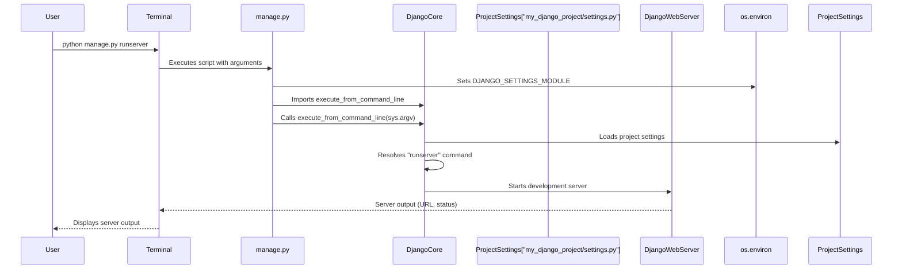

# Chapter 1: Project Management Command

Welcome to the first chapter of our comprehensive "markup" project documentation! In this section, we lay the groundwork for understanding how to interact with a Django project, focusing on its central command-line utility.

---

### Problem & Motivation

Developing a web application, especially one as feature-rich as a Django project, involves numerous administrative tasks. Imagine having to manually configure a web server, set up database tables, or create new application modules every time you wanted to add a feature or test your code. This would be incredibly cumbersome, error-prone, and inefficient. Without a centralized, consistent way to manage these operations, developers would spend more time on setup and less on actual development.

This is precisely the problem the **Project Management Command** solves. It provides a single entry point for all administrative actions within your Django project. It's the primary tool you'll use daily to bring your project to life, manage its components, and prepare it for deployment. For our "markup" project, this command will be essential for tasks like running our development server to see our changes instantly or managing our database schema as our application evolves.

Let's consider a concrete use case: You've just started developing our "markup" project, and you want to see your website in action. How do you start a local web server to view your work in a browser? The Project Management Command provides a straightforward, standard way to do exactly that, allowing you to focus on building features rather than wrestling with server configurations.

---

### Core Concept Explanation

At the heart of every Django project lies a special Python script named `manage.py`. This script is the **Project Management Command** itself. Think of `manage.py` as the ultimate remote control for your Django application. Instead of flipping various switches or plugging in different wires, you simply use `manage.py` followed by a specific command to perform a desired action.

When you run a command like `python manage.py runserver`, `manage.py` does several crucial things:
1.  **Sets up the Django Environment**: It ensures that your project's settings are loaded, making all your configurations available to the commands.
2.  **Locates the Command**: It identifies the specific administrative command you've requested (e.g., `runserver`) from Django's built-in commands or any custom commands you might have added.
3.  **Executes the Command**: It then runs the logic associated with that command, performing the desired operation, such as starting a local development server or applying database migrations.

This centralized approach makes interacting with your Django project predictable and powerful. It standardizes tasks like:
*   `runserver`: Starting a local web server for development.
*   `makemigrations`: Generating database schema changes.
*   `migrate`: Applying those schema changes to your database.
*   `startapp`: Creating a new reusable Django application within your project.
*   `createsuperuser`: Creating an administrative user for your site.

By abstracting away the complexity of these operations behind simple, consistent commands, `manage.py` allows developers to manage their projects efficiently, regardless of the underlying intricacies.

---

### Practical Usage Examples

Let's put the Project Management Command into action to solve our motivating use case: starting the development server.

First, navigate to the root directory of your Django project, where the `manage.py` file is located.

```bash
cd my_django_project/ # Replace with your project's root directory
ls
```
Expected output (showing `manage.py`):
```
manage.py  my_django_project/  # ... other files and folders
```
This confirms you are in the correct directory.

Now, to start the development server, you'll use the `runserver` command:

```bash
python manage.py runserver
```
After executing this command, you'll see output similar to this:
```
Watching for file changes with StatReloader
Performing system checks...

System check identified no issues (0 silenced).

You have 18 unapplied migration(s). Your project may not work properly until you apply the migrations for app(s): admin, auth, contenttypes, sessions.
Run 'python manage.py migrate' to apply them.
August 08, 2024 - 14:30:00
Django version 5.0, using settings 'my_django_project.settings'
Starting development server at http://127.0.0.1:8000/
Quit the server with CONTROL-C.
```
This output tells you that Django has started a local web server, accessible in your browser at `http://127.0.0.1:8000/`. It also gives a helpful reminder about unapplied database migrations, which we'll cover in later chapters. You can now open your web browser and navigate to the provided address to see your Django project's default landing page. To stop the server, simply press `CONTROL-C` in your terminal.

The `manage.py` utility also provides a way to list all available commands and their descriptions:

```bash
python manage.py help
```
This will display a long list of commands, both built-in Django commands and any you might have added yourself. It's an excellent resource for discovering what your project can do.

To get help on a specific command, like `runserver`, you can use:

```bash
python manage.py help runserver
```
This will show you specific options and arguments for that particular command, like how to change the port number of the development server.

---

### Internal Implementation Walkthrough

The `manage.py` script, although simple in appearance, orchestrates a significant amount of Django's startup logic. Let's look at the core of our `manage.py` file for the "markup" project:

```python
# my_django_project/manage.py
#!/usr/bin/env python
import os
import sys

def main():
    """Run administrative tasks."""
    os.environ.setdefault('DJANGO_SETTINGS_MODULE', 'my_django_project.settings')
    try:
        from django.core.management import execute_from_command_line
    except ImportError as exc:
        raise ImportError(
            "Couldn't import Django. Are you sure it's installed and "
            "available on your PYTHONPATH environment variable? Did you "
            "forget to activate a virtual environment?"
        ) from exc
    execute_from_command_line(sys.argv)

if __name__ == '__main__':
    main()
```

Here's a step-by-step breakdown of what happens when you run `python manage.py <command>`:

1.  **`#!/usr/bin/env python`**: This line (the "shebang") tells your operating system to execute the script using the Python interpreter found in your environment's path.
2.  **`import os, sys`**: Essential Python modules are imported for interacting with the operating system and command-line arguments.
3.  **`def main():`**: The core logic is encapsulated within the `main` function.
4.  **`os.environ.setdefault('DJANGO_SETTINGS_MODULE', 'my_django_project.settings')`**: This is a critical step. It sets an environment variable named `DJANGO_SETTINGS_MODULE`. Its value, `'my_django_project.settings'`, tells Django *where* to find your project's configuration file. Without this, Django wouldn't know which settings to use for your project.
5.  **`from django.core.management import execute_from_command_line`**: This line attempts to import the `execute_from_command_line` function, which is the brain of Django's command-line utility. If Django isn't installed or accessible, an `ImportError` is raised, providing a helpful message.
6.  **`execute_from_command_line(sys.argv)`**: This is where the magic happens.
    *   `sys.argv` is a Python list containing all command-line arguments. For `python manage.py runserver`, `sys.argv` would be something like `['manage.py', 'runserver']`.
    *   The `execute_from_command_line` function takes these arguments, parses them, identifies the requested command (`runserver` in our example), and then dispatches the request to the appropriate command handler within Django's internal framework.

Let's visualize the flow when you run `python manage.py runserver`:



This sequence shows how `manage.py` acts as a crucial initial bootstrap, linking your command-line input to Django's powerful internal management system, which then accesses your project's configuration and executes the requested task.

---

### System Integration

The **Project Management Command** (`manage.py`) doesn't operate in isolation; it's deeply integrated into the entire Django ecosystem.

*   **Foundation for [The Django Project](chapter_02.md)**: `manage.py` is an intrinsic part of a Django project's initial structure. When you create a new project, `manage.py` is automatically generated, serving as the primary interface to that project. It's the mechanism through which you interact with all other project components.

*   **Dependent on [Project Settings](chapter_03.md)**: As seen in the internal walkthrough, `manage.py` explicitly loads your project's settings file (`my_django_project.settings`). This means that every command executed via `manage.py` operates within the context of your project's specific configurations—database connections, installed applications, static file paths, and more—defined in your [Project Settings](chapter_03.md).

*   **Interacts with [URL Routing](chapter_04.md) and [Views (Request Handlers)](chapter_05.md)**: While `manage.py` doesn't directly handle web requests, commands like `runserver` initiate the process where Django starts listening for requests. These requests are then processed by your [URL Routing](chapter_04.md) and ultimately handled by your [Views (Request Handlers)](chapter_05.md). Moreover, commands like `startapp` create the necessary directory structure and basic files for new applications, which will contain their own URL patterns and view functions.

*   **Facilitates [Web Server Gateway Interface (WSGI)](chapter_06.md) setup**: When running `manage.py runserver`, it internally uses a simplified WSGI server to serve your application. For production deployments, `manage.py` is also used for tasks like `collectstatic`, preparing your application for more robust WSGI servers like Gunicorn or uWSGI, which then communicate with your Django application via the [Web Server Gateway Interface (WSGI)](chapter_06.md).

In essence, `manage.py` is the conductor of the Django orchestra, ensuring all instruments (settings, apps, database, server) play together harmoniously according to the developer's commands.

---

### Best Practices & Tips

To get the most out of the Project Management Command and avoid common pitfalls, consider these best practices:

*   **Always Use a Virtual Environment**: Before running any `manage.py` command, activate your project's virtual environment. This ensures that you're using the correct versions of Python and Django libraries specific to your project, preventing conflicts with other projects or your system's global Python installation.
    ```bash
    # Example: Activating a virtual environment
    source venv/bin/activate
    python manage.py runserver
    ```
*   **Understand `django-admin` vs. `manage.py`**: While `manage.py` is for project-specific commands, Django also provides a global `django-admin` utility. `django-admin` can be used to perform tasks that don't necessarily require a project context, like `django-admin startproject`. However, for operations *within* your project, `manage.py` is always preferred because it automatically sets the `DJANGO_SETTINGS_MODULE` environment variable, ensuring your project's settings are correctly loaded.
*   **Explore `help` for Commands**: Don't hesitate to use `python manage.py help <command_name>` to discover available options and arguments for any command. This is invaluable for tasks like running `runserver` on a different port (`python manage.py runserver 8080`) or specifying a custom settings file (`python manage.py runserver --settings=my_django_project.dev_settings`).
*   **Use Descriptive Settings Modules**: For complex projects, you might have different settings for development, testing, and production. You can configure `manage.py` to use a specific settings file:
    ```bash
    python manage.py runserver --settings=my_django_project.settings.development
    ```
    This is an advanced pattern but powerful for managing multi-environment deployments.
*   **Backup Your Database Before Migrations**: While `makemigrations` and `migrate` are powerful, always back up your production database before running `migrate` in a live environment to prevent data loss in case of unexpected issues.

---

### Chapter Conclusion

In this chapter, we've explored the foundational role of the **Project Management Command** (`manage.py`) in any Django project. We've seen how this simple yet powerful script acts as your primary interface for administrative tasks, solving the problem of complex project management with a unified command-line utility. From starting your development server to listing available commands, `manage.py` is your gateway to interacting with Django. We delved into its internal workings, understanding how it bootstraps the Django environment and dispatches commands, and examined its crucial integration with other core Django concepts. By adopting best practices, you can leverage `manage.py` efficiently throughout your project's lifecycle.

As we move forward, remember that `manage.py` is an indispensable tool, but it operates within the broader context of **[The Django Project](chapter_02.md)** itself. In the next chapter, we'll dive deeper into what constitutes "The Django Project" structure and its fundamental components, providing the architectural context for everything we've discussed today.

[The Django Project](chapter_02.md)