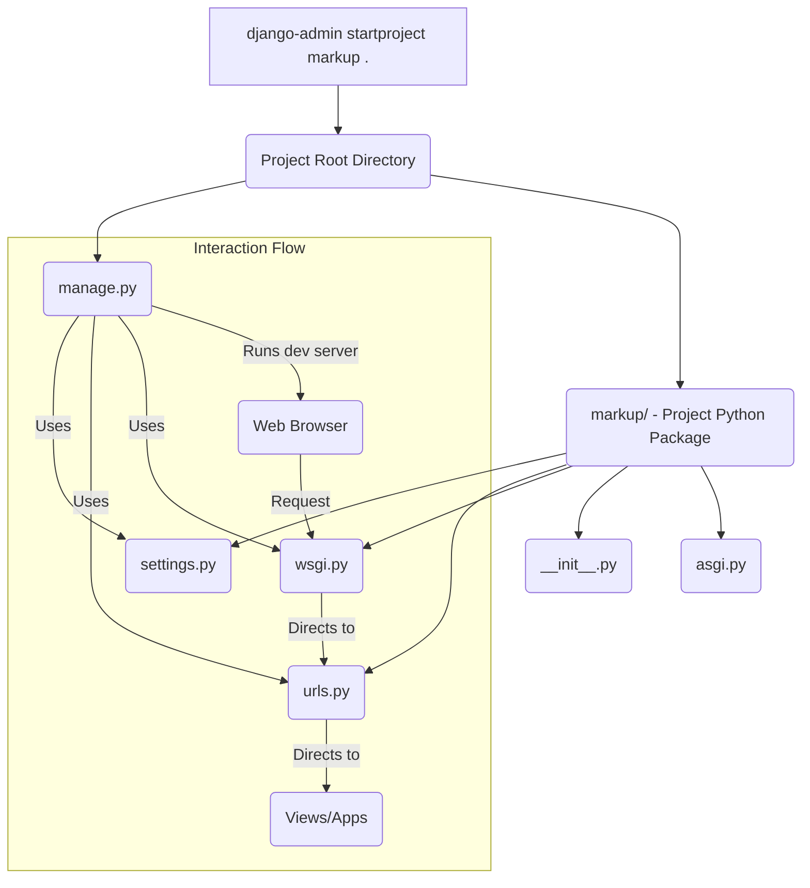

# Chapter 2: The Django Project

In the [previous chapter on Project Management Commands](chapter_01.md), we introduced `django-admin` and `manage.py` as the primary tools for interacting with a Django application. While `manage.py` is the *how*, the subject of this chapter – **The Django Project** – represents the *what* and the *where* of your entire web application. It's the foundational structure that these commands operate upon.

---

## Problem & Motivation

Imagine you're building a house. You wouldn't just start laying bricks without a blueprint, a foundation, and a designated space for the kitchen, bedrooms, and plumbing. Similarly, developing a web application, even a simple one like our "markup" project, requires a structured and organized environment. Without a clear framework, files become chaotic, configurations are scattered, and scaling becomes nearly impossible.

This is precisely the problem **The Django Project** solves. It provides the essential blueprint and foundation for your entire web application. It defines the top-level directory structure, the initial configuration files, and the entry points that Django uses to understand how your application should behave. For our "markup" project, this structure ensures that our future blog posts, user authentication, and administrative panels all have a well-defined place to reside and interact harmoniously.

A concrete example: when a user visits `www.example.com/blog/`, the Django Project's structure, particularly its URL routing mechanism, knows exactly which piece of code (a "view") should handle that request, and where to find the necessary settings to render the page correctly. Without this overarching project structure, the entire system would be a tangled mess, unable to direct traffic or manage its own configuration effectively.

---

## Core Concept Explanation

At its heart, **The Django Project** is the top-level container for a Django web application. Think of it as the overarching folder that holds *everything* related to your specific website. It's not a single file, but rather a collection of files and directories that work together to define your application's structure, behavior, and initial setup. While Django uses the term "project," it's often synonymous with your entire website or web application.

A common point of confusion for beginners is distinguishing between a "project" and an "app" in Django. A **Django Project** is the entire website, a single entity. Inside this project, you'll create one or more **Django Apps**. An "app" is a self-contained module that does one specific thing, like a blog app, an e-commerce app, or a user authentication app. Our "markup" project might eventually contain a "blog" app, a "users" app, and so on. The project ties all these disparate apps together, providing shared settings and URL routing for the entire application.

The project structure also includes critical configuration files that dictate how your Django application behaves. These include settings for your database, static file locations, security keys, and how incoming web requests are handled. It's the central nervous system that governs the interaction between all the different components of your Django application and external services.

---

## Practical Usage Examples

Let's get hands-on and create our `markup` project. This is the first step in setting up any Django application.

### Creating the Project Structure

We'll use the `django-admin` command (which `manage.py` wraps for project-specific commands) to generate the initial project structure. It's good practice to create your project in the current directory, typically within a virtual environment.

```bash
# Ensure you are in your project's root directory (e.g., 'markup_project_root/')
# where you want the manage.py file to reside.
django-admin startproject markup .
```
*Explanation*: The `django-admin startproject markup` command tells Django to create a new project named `markup`. The `.` at the end is crucial; it instructs Django to create the project files *in the current directory*, rather than creating another nested `markup` folder. This places `manage.py` directly in your root.

After running the command, your directory structure will look something like this:

```
.
├── manage.py
└── markup/
    ├── __init__.py
    ├── asgi.py
    ├── settings.py
    ├── urls.py
    └── wsgi.py
```
*Explanation*: This is the fundamental layout of your Django Project. `manage.py` is your command-line utility. The `markup/` directory is the actual Python package for your project, containing essential configuration files.

### Running the Development Server

With the project created, we can immediately run Django's built-in development server to see our new project in action.

```bash
# Make sure you are in the directory containing manage.py
python manage.py runserver
```
*Explanation*: This command starts a local web server, typically on port 8000, allowing you to access your Django application through your web browser. This server is perfect for development but not suitable for production.

Upon successful execution, you'll see output similar to this:

```
Watching for file changes with StatReloader
Performing system checks...

System check identified no issues (0 silenced).

You have 18 unapplied migration(s). Your project may not work properly until you apply the migrations for app(s): admin, auth, contenttypes, sessions.
Run 'python manage.py migrate' to apply them.
September 24, 2023 - 14:30:00
Django version 4.2.5, using settings 'markup.settings'
Starting development server at http://127.0.0.1:8000/
Quit the server with CONTROL-C.
```
*Explanation*: The server is now running. Open your web browser and navigate to `http://127.0.0.1:8000/`. You should see a celebratory "The install worked successfully! Congratulations!" page, indicating your Django Project is alive. The migration warning is normal for a fresh project and will be addressed in a later chapter.

---

## Internal Implementation Walkthrough

Let's delve into the files created by `django-admin startproject` and understand their roles within the `markup` project.


*Explanation*: This diagram illustrates how `django-admin startproject` initializes your project. It creates the `manage.py` script and the `markup/` package. Subsequently, `manage.py` interacts with the project's settings, URL configurations, and WSGI entry points to run the application, which then handles requests from a web browser.

Let's examine each component:

### `manage.py`

This is a command-line utility that interacts with your Django project. Almost every command you run in Django, such as `runserver`, `makemigrations`, `migrate`, or `createsuperuser`, will be executed through `manage.py`. It's essentially a wrapper around `django-admin` that sets the `DJANGO_SETTINGS_MODULE` environment variable to point to your project's settings file (`markup.settings`), making it project-specific.

```python
#!/usr/bin/env python
"""Django's command-line utility for administrative tasks."""
import os
import sys


def main():
    """Run administrative tasks."""
    os.environ.setdefault('DJANGO_SETTINGS_MODULE', 'markup.settings') # Key line
    try:
        from django.core.management import execute_from_command_line
    except ImportError as exc:
        raise ImportError(
            "Couldn't import Django. Are you sure it's installed and "
            "available on your PYTHONPATH environment variable? Did you "
            "forget to activate a virtual environment?"
        ) from exc
    execute_from_command_line(sys.argv)


if __name__ == '__main__':
    main()
```
*Explanation*: The crucial line `os.environ.setdefault('DJANGO_SETTINGS_MODULE', 'markup.settings')` tells Django where to find your project's configuration. This is why you run `python manage.py <command>` instead of just `django-admin <command>` when working within a specific project.

### `markup/` directory (The Project Python Package)

This directory is a Python package whose name (`markup`) is the same as your project's name. It contains all the essential configuration files that define your project's behavior.

### `markup/__init__.py`

This file is a standard Python convention. It indicates that the `markup/` directory is a Python package. When you `import markup` in another part of your code, Python looks for this file. For most Django projects, this file remains empty.

### `markup/settings.py`

This is perhaps the most critical file in your project. It contains all the configuration settings for your Django installation. This includes database connections, installed apps, static file configurations, secret keys, time zones, and much more. We will dive deep into this file in the [next chapter on Project Settings](chapter_03.md).

```python
# markup/settings.py (excerpt)
import os
from pathlib import Path

BASE_DIR = Path(__file__).resolve().parent.parent

SECRET_KEY = 'django-insecure-...' # DO NOT SHARE IN PRODUCTION!

DEBUG = True

ALLOWED_HOSTS = []

# Application definition
INSTALLED_APPS = [
    'django.contrib.admin',
    'django.contrib.auth',
    'django.contrib.contenttypes',
    'django.contrib.sessions',
    'django.contrib.messages',
    'django.contrib.staticfiles',
]
# ... many more settings
```
*Explanation*: This excerpt shows some of the initial settings. `BASE_DIR` defines the root of your project. `SECRET_KEY` is for security. `DEBUG` controls debugging mode. `INSTALLED_APPS` lists all Django's built-in applications and any custom apps you create.

### `markup/urls.py`

This file is your project's central URL dispatcher. It defines how web requests (like `http://127.0.0.1:8000/blog/`) are routed to the appropriate application logic (Django "views"). It maps URL patterns to view functions or includes other app-specific URL configurations. We will explore this in detail in the [URL Routing chapter](chapter_04.md).

```python
# markup/urls.py
from django.contrib import admin
from django.urls import path

urlpatterns = [
    path('admin/', admin.site.urls),
]
```
*Explanation*: Currently, this file only routes requests for `/admin/` to Django's built-in administration site. As you add apps and features, you'll add more `path` entries here.

### `markup/wsgi.py`

This file defines the Web Server Gateway Interface (WSGI) entry point for your application. WSGI is a standard Python interface that allows web servers (like Gunicorn or Apache with mod_wsgi) to communicate with Python web applications (like Django). When you deploy your Django project to a production server, this is the file that the web server will use to start your application. It will be covered in depth in the [Web Server Gateway Interface (WSGI) chapter](chapter_06.md).

```python
# markup/wsgi.py
import os

from django.core.wsgi import get_wsgi_application

os.environ.setdefault('DJANGO_SETTINGS_MODULE', 'markup.settings')

application = get_wsgi_application()
```
*Explanation*: Similar to `manage.py`, this sets the `DJANGO_SETTINGS_MODULE` and then provides a `wsgi_application` object that web servers can interact with.

### `markup/asgi.py` (Asynchronous Server Gateway Interface)

Similar to `wsgi.py`, this file defines the ASGI entry point. ASGI is a successor to WSGI, designed to handle both synchronous and asynchronous requests, making it suitable for modern applications requiring websockets, long-polling, and HTTP/2. While `wsgi.py` is for traditional HTTP, `asgi.py` handles a broader range of protocols. For the `markup` project, we'll primarily focus on WSGI for initial HTTP interactions, but it's good to know ASGI is there for future asynchronous needs.

```python
# markup/asgi.py
import os

from django.core.asgi import get_asgi_application

os.environ.setdefault('DJANGO_SETTINGS_MODULE', 'markup.settings')

application = get_asgi_application()
```
*Explanation*: This is the asynchronous equivalent of `wsgi.py`.

---

## System Integration

The Django Project serves as the central orchestrator for all components within our `markup` application. Its structure and configuration files are fundamental to how different parts interact:

*   **Project Management Command (`manage.py`)**: As seen, `manage.py` directly references `markup/settings.py` to understand how to operate on the project. When you run `python manage.py runserver`, it loads these settings to configure the development server, determine which apps are installed, and how to route requests. This forms a direct link between the [Project Management Command](chapter_01.md) and the Django Project's core configuration.

*   **Project Settings (`settings.py`)**: This file is the project's brain. Every installed app, database connection, static file location, security feature, and internationalization setting is defined here. Other components, including [URL Routing](chapter_04.md) and [Views](chapter_05.md), implicitly rely on `settings.py` for their operational context. For instance, the `STATIC_URL` defined in settings dictates where static assets are served from. We will explore this in detail in [Project Settings](chapter_03.md).

*   **URL Routing (`urls.py`)**: The `markup/urls.py` file is the primary dispatcher for all incoming web requests to the project. It acts as the gateway, directing requests to specific apps or [Views](chapter_05.md) based on predefined URL patterns. Without `urls.py`, the project wouldn't know how to respond to user requests. This is intricately linked with how [Views (Request Handlers)](chapter_05.md) are invoked.

*   **Web Server Gateway Interface (`wsgi.py`)**: The `wsgi.py` file is the bridge between a production web server (like Gunicorn or Apache) and the Django application itself. When a web server receives a request for your `markup` project, it passes it through the WSGI interface defined in `wsgi.py`. This mechanism ensures that the web server can effectively "talk" to your Django code, enabling it to process requests and send responses. This vital connection is elaborated upon in [Web Server Gateway Interface (WSGI)](chapter_06.md).

In essence, the Django Project structure provides the glue and context that allows `manage.py` to administer the application, `settings.py` to configure it, `urls.py` to route traffic, and `wsgi.py` to serve it to the world.

---

## Best Practices & Tips

*   **Name Your Project Meaningfully**: Choose a name that reflects the overall purpose of your website (e.g., `markup` for a content platform, `ecommerce_site` for an online store). Avoid generic names like `myproject`.
*   **Keep `manage.py` at the Root**: Always use `django-admin startproject your_project_name .` (with the dot) to ensure `manage.py` is in your project's root directory, next to the project package. This makes command execution simpler and cleaner.
*   **Understand Project vs. App**: Remember that a Django Project *contains* one or more Django Apps. The project is your entire website; apps are reusable modules that provide specific functionalities (e.g., a "blog" app, a "users" app). Strive to make your apps reusable and modular, keeping project-specific logic in the project's `settings.py` or root `urls.py`.
*   **Version Control Early**: Initialize Git (or your preferred VCS) from the project root immediately after `startproject`. This allows you to track changes from the very beginning. Add `__pycache__`, `.env`, and database files (like `db.sqlite3` if using default) to your `.gitignore`.
*   **Environment Variables for Sensitive Settings**: Never hardcode sensitive information (like `SECRET_KEY`, database credentials) directly in `settings.py` for production. Use environment variables. We'll touch on this more in the [Project Settings chapter](chapter_03.md).

---

## Chapter Conclusion

We've covered the foundational concept of **The Django Project**, understanding it as the essential top-level container for our entire `markup` web application. We walked through its creation using `django-admin startproject` and explored the purpose of each file and directory that forms its core structure, from the command-line utility `manage.py` to the WSGI entry point `wsgi.py`. This project structure isn't just arbitrary; it's a carefully designed framework that allows Django to efficiently organize, configure, and serve your web application.

Understanding the Django Project is the crucial first step in building any application with Django. It provides the canvas upon which we'll paint our features and functionalities.

In the next chapter, we will dive deep into the most influential file within this project structure: [Project Settings](chapter_03.md). This is where you configure virtually every aspect of your Django application, from database connections to security protocols.