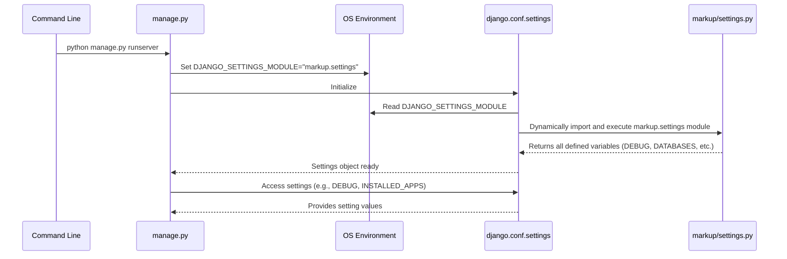

# Chapter 3: Project Settings

Our journey through the "markup" project began by understanding the foundational tool, the [Project Management Command](chapter_01.md), and then explored the overarching structure of [The Django Project](chapter_02.md) itself. Just as a building needs a blueprint to define its structure and functions, a Django project requires a central configuration hub to dictate its behavior, capabilities, and operational parameters. This chapter delves into the heart of this configuration: Project Settings.

---

### Problem & Motivation

Imagine building a complex machine without any instructions or specifications. How would you know what kind of fuel it uses, what voltage it requires, or what its safety protocols are? Similarly, a Django web application is a sophisticated system that needs a clear set of instructions to function correctly. Without a centralized configuration, every component would have to hardcode its assumptions, leading to a brittle, unmaintainable, and insecure application.

This is the problem `settings.py` solves. It provides a single, authoritative source for all project-wide configurations. For instance, our "markup" project needs to know where to store its data (e.g., in a database), which domains are permitted to serve its content, and what timezone it should operate in. These aren't details that should be scattered across different files or hardcoded into individual pieces of logic; they are fundamental properties of the entire project. `settings.py` ensures that all parts of the Django application access these critical pieces of information consistently and securely.

---

### Core Concept Explanation

At its core, **Project Settings** in Django refers to the `settings.py` file, which is a standard Python module residing within your main project directory (e.g., `markup/markup/settings.py`). This file acts as the ultimate control panel for your entire Django application. When Django starts up, it looks for this file and loads all the variables defined within it, making them accessible throughout the project.

Think of `settings.py` as the *brain* of your Django project, storing all the crucial directives that govern its operation. From defining which applications are part of your project (`INSTALLED_APPS`), to specifying how it connects to a database (`DATABASES`), managing static files, handling security (`SECRET_KEY`, `ALLOWED_HOSTS`), and even dictating time zones or language preferences—every critical piece of information that affects the project globally is centralized here. This modular approach to configuration ensures that your project remains flexible, scalable, and easy to manage, allowing you to adapt its behavior by simply modifying this one file.

---

### Practical Usage Examples

Let's illustrate how `settings.py` addresses the problem of central configuration by configuring essential aspects of our "markup" project: its database, allowed hostnames, and installed applications.

#### 1. Configuring the Database

By default, Django projects come configured to use SQLite, which is excellent for development. Let's look at the `DATABASES` setting:

```python
# markup/markup/settings.py

# ... other settings ...

DATABASES = {
    'default': {
        'ENGINE': 'django.db.backends.sqlite3',
        'NAME': BASE_DIR / 'db.sqlite3',
    }
}

# ... more settings ...
```

This code block defines the database connection.
*   `'default'` specifies this as the primary database.
*   `'ENGINE'` tells Django to use the SQLite database backend.
*   `'NAME'` indicates the path to the database file, which will be named `db.sqlite3` in your project's root directory. For more robust deployments, you would change this to PostgreSQL or MySQL.

#### 2. Specifying Allowed Hostnames

Security is paramount. The `ALLOWED_HOSTS` setting prevents HTTP Host header attacks by defining a list of host/domain names that this Django site can serve.

```python
# markup/markup/settings.py

# ... other settings ...

DEBUG = True # Set to False in production!

ALLOWED_HOSTS = ['127.0.0.1', 'localhost', '.yourdomain.com']

# ... more settings ...
```

Here, `ALLOWED_HOSTS` is a list of strings representing the host/domain names that your Django installation will serve.
*   `'127.0.0.1'` and `'localhost'` are typically used during local development.
*   `'.yourdomain.com'` is an example of how you'd list your production domain, including subdomains.

**Important Note:** When `DEBUG` is `False` (which it *must* be in production), `ALLOWED_HOSTS` *cannot* be empty. If it's empty and `DEBUG` is `False`, Django will refuse to serve requests.

#### 3. Declaring Installed Applications

Django is modular, built around "apps." The `INSTALLED_APPS` setting tells Django which applications are active in your project, allowing them to hook into Django's features.

```python
# markup/markup/settings.py

# ... other settings ...

INSTALLED_APPS = [
    'django.contrib.admin',
    'django.contrib.auth',
    'django.contrib.contenttypes',
    'django.contrib.sessions',
    'django.contrib.messages',
    'django.contrib.staticfiles',
    # 'my_custom_app', # Add your own apps here
]

# ... more settings ...
```

This list includes Django's built-in applications that provide common functionalities like authentication (`django.contrib.auth`), administration (`django.contrib.admin`), and static file handling (`django.contrib.staticfiles`). When you create your own Django app, you'll add its name to this list.

---

### Internal Implementation Walkthrough

Understanding how Django loads and uses `settings.py` reveals its elegance. It's not a magical file; it's a standard Python module.

1.  **`manage.py` and `DJANGO_SETTINGS_MODULE`**: When you execute a Django command (e.g., `python manage.py runserver`), the `manage.py` script (which is part of [The Django Project](chapter_02.md)) is the entry point. This script internally sets up the `DJANGO_SETTINGS_MODULE` environment variable. By default, this variable points to your project's `settings.py` file, e.g., `'markup.settings'`.

    ```python
    # An excerpt from manage.py (simplified)
    import os
    import sys

    def main():
        os.environ.setdefault('DJANGO_SETTINGS_MODULE', 'markup.settings')
        try:
            from django.core.management import execute_from_command_line
        except ImportError as exc:
            raise ImportError(
                "Couldn't import Django. Are you sure it's installed and "
                "available on your PYTHONPATH environment variable? Did you "
                "forget to activate a virtual environment?"
            ) from exc
        execute_from_command_line(sys.argv)

    if __name__ == '__main__':
        main()
    ```
    This snippet from `manage.py` shows how `DJANGO_SETTINGS_MODULE` is set, telling Django where to find the main configuration.

2.  **`django.conf.settings`**: Throughout your Django project, whenever code needs to access a setting (like `DEBUG` or `DATABASES`), it doesn't directly import `settings.py`. Instead, it imports `django.conf.settings`. This object is a proxy that dynamically loads the `settings.py` module identified by `DJANGO_SETTINGS_MODULE` and provides attribute-style access to all the variables defined within it.

3.  **Module Loading**: `django.conf.settings` treats your `settings.py` file like any other Python module. It executes the file, and all top-level variables become attributes of the `django.conf.settings` object. This means you can use Python logic, import other modules, and even perform calculations within `settings.py` to derive configuration values.

Here's a simplified sequence of how settings are loaded:


This diagram illustrates the flow: `manage.py` sets the environment variable, `django.conf.settings` reads it, and then imports and processes your `settings.py` file, making all its defined configurations accessible throughout the application.

---

### System Integration

The `settings.py` file is the central nervous system, deeply integrated with virtually every other component of your Django project:

*   **[URL Routing](chapter_04.md)**: The `ROOT_URLCONF` setting in `settings.py` points to the primary URL configuration module (e.g., `'markup.urls'`). This tells Django where to start looking for URL patterns to map incoming requests to views.
*   **[Views (Request Handlers)](chapter_05.md)**: Views indirectly rely on `settings.py` for almost everything. For example, database settings from `DATABASES` allow views to interact with models, `TIME_ZONE` affects how datetimes are handled, and `DEBUG` influences error reporting.
*   **[Web Server Gateway Interface (WSGI)](chapter_06.md)**: The WSGI application (`wsgi.py`) itself needs to know which settings file to use, often configured implicitly or explicitly through `DJANGO_SETTINGS_MODULE`. Settings related to static and media files (`STATIC_URL`, `STATIC_ROOT`, `MEDIA_URL`, `MEDIA_ROOT`) are critical for the WSGI server to properly serve these assets in a production environment.
*   **Database Interactions**: As shown in the examples, `DATABASES` configures how Django connects to your chosen database backend, essential for storing and retrieving application data.
*   **Security Features**: Settings like `SECRET_KEY`, `ALLOWED_HOSTS`, `CSRF_COOKIE_SECURE`, `SESSION_COOKIE_SECURE`, and `X_FRAME_OPTIONS` directly control various security mechanisms.

All these components reference `django.conf.settings` to retrieve their necessary configurations, ensuring a unified and consistent project behavior.

---

### Best Practices & Tips

Proper management of your `settings.py` is crucial for a secure, maintainable, and scalable Django project.

1.  **Never Expose `SECRET_KEY`**: This key is used for cryptographic signing. It *must* be kept secret. Never hardcode it directly in your `settings.py` in a production environment. Instead, use environment variables.

    ```python
    # markup/markup/settings.py

    import os

    # SECURITY WARNING: keep the secret key used in production secret!
    SECRET_KEY = os.environ.get('DJANGO_SECRET_KEY', 'a-very-insecure-default-key-for-development-only')
    ```
    This snippet retrieves the `SECRET_KEY` from the `DJANGO_SECRET_KEY` environment variable. If not found (e.g., during local development without setting it), it falls back to a default, but this default *must never* be used in production.

2.  **Manage `DEBUG` Carefully**:
    *   `DEBUG = True`: Enables debug mode, showing detailed error pages, logging SQL queries, and allowing introspection. *Only use in development.*
    *   `DEBUG = False`: Disables debug mode. *Must be used in production.* Requires `ALLOWED_HOSTS` to be configured.

3.  **Environment-Specific Settings**: For projects needing different configurations for development, staging, and production, avoid a single monolithic `settings.py`. Instead, structure your settings:

    ```
    markup/
    ├── markup/
    │   ├── __init__.py
    │   ├── settings/
    │   │   ├── __init__.py
    │   │   ├── base.py       # Common settings
    │   │   ├── development.py  # Dev-specific overrides
    │   │   └── production.py # Prod-specific overrides
    │   ├── urls.py
    │   └── wsgi.py
    └── manage.py
    ```
    In `base.py`, define shared settings. Then, in `development.py` and `production.py`, import from `base.py` and override specific settings.

    ```python
    # markup/markup/settings/base.py
    # ... common settings like INSTALLED_APPS, MIDDLEWARE, etc. ...
    ```

    ```python
    # markup/markup/settings/development.py
    from .base import *

    DEBUG = True
    ALLOWED_HOSTS = ['127.0.0.1', 'localhost']
    # DATABASES is fine with SQLite for development
    ```

    ```python
    # markup/markup/settings/production.py
    from .base import *

    DEBUG = False
    ALLOWED_HOSTS = ['.yourdomain.com', 'yourdomain.com'] # Replace with actual domain
    # Configure production database (e.g., PostgreSQL)
    DATABASES = {
        'default': {
            'ENGINE': 'django.db.backends.postgresql',
            'NAME': 'prod_db_name',
            'USER': 'prod_db_user',
            'PASSWORD': os.environ.get('DB_PASSWORD'),
            'HOST': 'prod_db_host',
            'PORT': '',
        }
    }
    SECRET_KEY = os.environ['DJANGO_SECRET_KEY'] # Must be present in prod
    ```
    Then, you'd set `DJANGO_SETTINGS_MODULE` to `markup.settings.development` or `markup.settings.production` accordingly.

4.  **Static Files Configuration**: Ensure `STATIC_URL`, `STATIC_ROOT`, and `STATICFILES_DIRS` are correctly configured, especially for production. This tells Django where to find and collect static assets (CSS, JS, images).

5.  **Sensitive Information**: Never commit sensitive information (database passwords, API keys, etc.) directly into your `settings.py` file or your version control system. Always use environment variables, a vault, or a dedicated configuration service.

---

### Chapter Conclusion

The `settings.py` file is the linchpin of any Django project, serving as the central nervous system that dictates its behavior, security, and integration points. We've explored its role in solving the problem of decentralized configuration, understood its core concepts as a Python module, and walked through practical examples for databases and allowed hosts. We also delved into its internal workings, showing how `manage.py` and `django.conf.settings` collaborate to load and provide configurations. Finally, we covered crucial best practices, emphasizing security and maintainability for production deployments.

With a solid understanding of how to configure our "markup" project, the next logical step is to define how incoming web requests are matched to specific parts of our application. We'll explore this crucial mechanism in the next chapter.

[URL Routing](chapter_04.md)