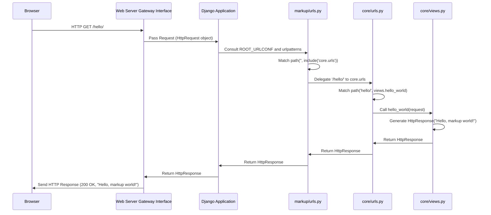

# Chapter 4: URL Routing

Welcome back to our journey through the `markup` project's architecture! In the [Previous Chapter: Project Settings](chapter_03.md), we delved into the central configuration hub of our Django project, understanding how `settings.py` dictates various behaviors, from database connections to installed applications. With our project now configured, the next logical step is to understand how incoming web requests find their way to the right piece of code within our application.

---

### Problem & Motivation

Imagine our `markup` project as a bustling office building. When a visitor arrives at the front desk, they don't just wander aimlessly; they provide a specific destination (like "the marketing department" or "Mr. Smith's office"). Without a directory or clear instructions, they'd be lost, and the office wouldn't function efficiently.

Similarly, in a web application, users request specific "pages" or "resources" by typing URLs into their browser (e.g., `www.example.com/about/`, `www.example.com/products/`). If our `markup` project doesn't have a clear way to understand these URLs and direct them to the correct section of our code that handles "about" information or "product" listings, the user will be met with an error, typically a "404 Not Found."

This is precisely the problem **URL Routing** solves. It's the critical mechanism that interprets the URL a user requests and maps it to a specific Python function or class within our Django application – what we call a **View**. For `markup`, URL routing is foundational; without it, our web application cannot respond to any user input, effectively making it a static, unresponsive collection of files. It's the traffic controller that ensures every web request is sent to the appropriate handler.

---

### Core Concept Explanation

**URL Routing** in Django is the process of matching a requested URL against a set of predefined patterns and, upon a successful match, invoking a specific *View* function or class to process the request. Think of it as a comprehensive directory for your web application. When a web request arrives, Django looks at the URL path (everything after the domain name, like `/about/`) and compares it to the patterns listed in your `urls.py` files.

The heart of Django's URL routing lies in the `urls.py` files. Every Django project has a primary `urls.py` file, usually located in the main project directory (e.g., `markup/markup/urls.py`). This file acts as the *root* URL dispatcher. From here, you can directly define URL patterns or, more commonly, include URL patterns from individual applications within your project. This modular approach keeps your routing organized and scalable.

The core component for defining these patterns is the `path()` function (or `re_path()` for regular expressions, though `path()` is preferred for simpler cases). A `path()` function takes a URL pattern, a reference to the view that should handle requests matching that pattern, and an optional name for the URL. When a request comes in, Django iterates through the `urlpatterns` list in order. The *first* pattern that matches the incoming URL is used, and its associated view is executed. This sequential evaluation is crucial to understand, as the order of your URL patterns matters.

For instance, if a user requests `/welcome/`, Django will scan the `urlpatterns` list. If it finds an entry like `path('welcome/', views.welcome_page)`, it will then call the `welcome_page` function defined in the `views.py` file, which will then generate the appropriate response for the user.

---

### Practical Usage Examples

Let's illustrate how to set up basic URL routing for our `markup` project. We'll start by defining a simple "hello world" page.

First, ensure you have an app created within your project. If not, you can create one (e.g., `core`):
```bash
python manage.py startapp core
```
This command creates a `core` directory with its own `views.py`, `models.py`, etc.

Next, we need to create a `urls.py` file inside our new `core` app.
**File: `markup/core/urls.py`**
```python
# markup/core/urls.py
from django.urls import path
from . import views

urlpatterns = [
    path('hello/', views.hello_world, name='hello_world'),
]
```
This code block defines a single URL pattern. When Django encounters `/hello/`, it will execute the `hello_world` function from our `core` app's `views.py`. The `name='hello_world'` part allows us to refer to this URL symbolically, which is a best practice for building robust links.

Now, let's create the `hello_world` view function in our `core` app's `views.py`.
**File: `markup/core/views.py`**
```python
# markup/core/views.py
from django.http import HttpResponse

def hello_world(request):
    """
    A simple view that returns an HTTP response with 'Hello, markup world!'.
    """
    return HttpResponse("Hello, markup world!")
```
This view function simply returns an `HttpResponse` containing the text "Hello, markup world!". When the `/hello/` URL is accessed, this is the content the user will see.

Finally, we need to tell our main project's `urls.py` to include the URL patterns from our `core` app. This is done using the `include()` function.
**File: `markup/markup/urls.py`**
```python
# markup/markup/urls.py
from django.contrib import admin
from django.urls import path, include # Import 'include'

urlpatterns = [
    path('admin/', admin.site.urls),
    path('', include('core.urls')), # Include URLs from our 'core' app
]
```
Here, we added `path('', include('core.urls'))`. This tells Django that for any URL that starts with an empty string (effectively, all URLs that haven't been matched yet by `admin/`), it should look for further URL patterns within the `core/urls.py` file. So, if a user goes to `http://127.0.0.1:8000/hello/`, Django will first check `admin/`, then see `''` and delegate to `core.urls`. Inside `core.urls`, it will find `hello/` and call `views.hello_world`.

To see this in action, run the development server:
```bash
python manage.py runserver
```
Then, navigate to `http://127.0.0.1:8000/hello/` in your browser. You should see "Hello, markup world!".

---

### Internal Implementation Walkthrough

When a user's web browser makes a request to a URL for our `markup` project (e.g., `http://127.0.0.1:8000/hello/`), here's a step-by-step breakdown of what happens internally:

1.  **Request Reception (WSGI)**: The `WSGI` server (which we'll cover in detail later in [Web Server Gateway Interface (WSGI)](chapter_06.md)) receives the HTTP request. It then passes this request to the Django application.

2.  **Initial Django Processing**: Django receives the request and immediately consults the `ROOT_URLCONF` setting in your `settings.py` file. This setting points to the main `urls.py` module for your project (e.g., `markup.urls`).

3.  **Root URL Dispatch**: Django loads the `urlpatterns` list defined in `markup/markup/urls.py`. It then iterates through these patterns in the order they are defined.

4.  **Pattern Matching - Project Level**:
    *   The request for `/hello/` comes in.
    *   Django first checks `path('admin/', admin.site.urls)`. `/hello/` does not match `admin/`.
    *   Django moves to `path('', include('core.urls'))`. The empty string `''` acts as a wildcard prefix. Since `/hello/` effectively starts with an empty string, this pattern matches!

5.  **Delegation to App URLs (`include`)**: Because `include('core.urls')` was matched, Django now "delegates" the rest of the URL path (`hello/`) to the `core` app's `urls.py`. It loads `markup/core/urls.py`.

6.  **Pattern Matching - App Level**:
    *   Django loads the `urlpatterns` from `markup/core/urls.py`.
    *   It checks `path('hello/', views.hello_world, name='hello_world')`.
    *   The remaining part of the URL, `hello/`, perfectly matches this pattern.

7.  **View Invocation**: Upon a successful match, Django now knows exactly which view function to call: `core.views.hello_world`. It constructs an `HttpRequest` object containing all details about the incoming request and passes it as an argument to this view function.

8.  **Response Generation**: The `hello_world` view function executes, generates an `HttpResponse` object (in our case, `HttpResponse("Hello, markup world!")`), and returns it.

9.  **Response Transmission**: Django takes the `HttpResponse` object from the view and sends it back through the `WSGI` server to the user's web browser.

Here's a simplified sequence diagram illustrating this flow:



---

### System Integration

URL Routing is a central component that acts as a bridge between several other critical parts of the `markup` project:

*   **[Project Settings](chapter_03.md)**: The `ROOT_URLCONF` setting in `settings.py` explicitly tells Django where to find the main URL configuration for the project. Without this setting, Django wouldn't know where to start looking for URL patterns.
*   **[Views (Request Handlers)](chapter_05.md)**: The ultimate destination of a successfully routed URL is a View. Views are Python functions or classes that contain the actual logic to process a web request and return a response. URL routing's entire purpose is to correctly identify and invoke the appropriate View based on the incoming URL. The output of a View is then returned to the user.
*   **[Web Server Gateway Interface (WSGI)](chapter_06.md)**: WSGI is the interface that allows a web server to communicate with Django. It's the very first point of contact for an incoming HTTP request, which then hands off the request to Django, initiating the URL routing process.
*   **Django Applications**: By using the `include()` function, URL routing promotes modularity. It allows different Django applications (like our `core` app) to define and manage their own URL patterns independently, making the `markup` project easier to scale and maintain.

In essence, URL routing sits squarely in the middle of the request-response cycle, taking the raw request provided by WSGI, using configuration from Project Settings to find the right path, and ultimately directing the flow to the specific View that will generate the final response.

---

### Best Practices & Tips

To ensure your `markup` project's URL routing is robust, maintainable, and user-friendly, consider these best practices:

*   **Use `include()` for Modularity**: Always use `include()` to delegate URL patterns to individual Django apps. This keeps your project's `urls.py` clean and makes your apps self-contained and reusable.
*   **Name Your URLs (`name` argument)**: Always provide a `name` argument to your `path()` functions (e.g., `path('hello/', views.hello_world, name='hello_world')`). This allows you to refer to URLs by their name rather than hardcoding their paths. If you ever change a URL path, you only need to update it in `urls.py`, and any references using `` in templates or `reverse('hello_world')` in Python code will automatically update.
*   **Keep URLs Clean and Descriptive**: Design user-friendly URLs that are easy to remember and understand (e.g., `/products/detail/42/` instead of `/p/id?42`). This improves user experience and SEO.
*   **Avoid Trailing Slashes (Consistent Behavior)**: Django by default appends a trailing slash if a URL is accessed without one (e.g., `/about` redirects to `/about/`). Ensure consistency in your URL definitions and consider `APPEND_SLASH = True` in `settings.py`.
*   **Order Matters**: Remember that Django processes `urlpatterns` sequentially. Place more specific patterns *before* more general ones to avoid accidental matches.
*   **Use `path()` over `re_path()` when possible**: For most common URL patterns, `path()` is simpler and more readable than `re_path()` (which uses regular expressions). Only resort to `re_path()` when `path()`'s syntax is insufficient for complex pattern matching.

---

### Chapter Conclusion

In this chapter, we've unravelled the critical role of **URL Routing** in our `markup` project. We've seen how it acts as the project's internal navigation system, translating cryptic web addresses into actionable commands for our application. We covered the motivation behind routing, the core concepts of `urls.py`, `path()`, and `include()`, and walked through practical examples to bring our "Hello, markup world!" to life. Furthermore, we delved into the internal mechanics of how Django processes a URL and integrated this understanding with other key components like Project Settings and WSGI.

Mastering URL routing is fundamental to building any dynamic Django application. With a solid understanding of how requests are mapped to views, we are now perfectly positioned to explore the very functions and classes that handle these requests. In the upcoming chapter, we will dive deep into **Views**, understanding how they process requests, interact with data, and ultimately generate the responses that users see.

Get ready to write your first powerful request handlers in our next section: [Views (Request Handlers)](chapter_05.md).