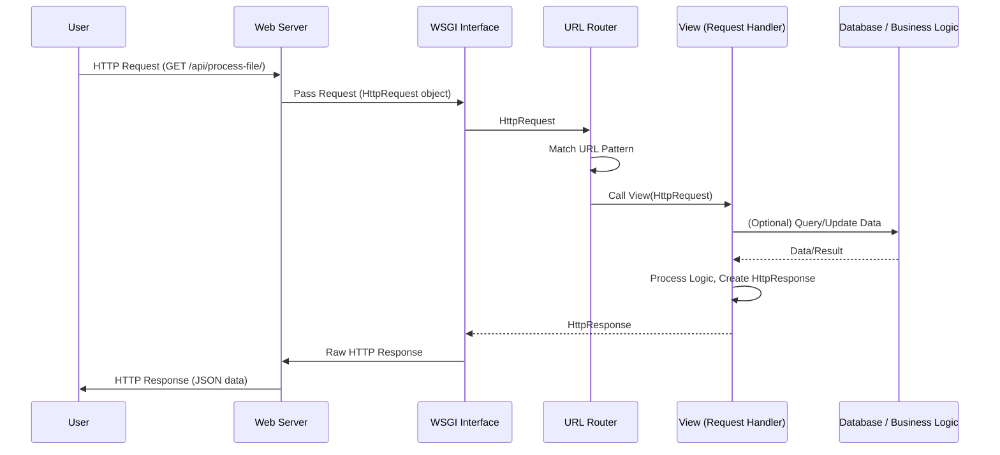

# Chapter 5: Views (Request Handlers)

In the previous chapter, [URL Routing](chapter_04.md), we learned how Django maps specific web addresses to particular handlers within our application. We established that when a user visits a certain URL, Django's URL dispatcher finds the corresponding entry and directs the request. But where does that request go next? What actually *does* something with the request and generates a response to send back to the user? This is precisely where **Views (Request Handlers)** come into play.

---

### Problem & Motivation

Imagine building an interactive website. It's not enough to just display static HTML pages. Users need to log in, submit forms, upload files, search for information, or trigger actions that update data. How does our web application process user input, interact with a database, or generate content that changes dynamically based on the request?

The problem is that once a URL is identified, we need a dedicated piece of Python code to execute the specific logic required for that URL. For instance, if a user goes to `/products/123/`, the application needs to fetch product 123's details from a database. If they fill out a "contact us" form, the application needs to process the form data, perhaps send an email, and then respond with a "Thank You" message.

Views provide the solution by acting as the primary request handlers in Django. They are the heart of your application's logic, responsible for receiving an incoming web request, understanding its purpose, performing necessary operations (like interacting with your data layer), and finally constructing an appropriate web response to send back to the user's browser. For our `markup` project, this means that every time a user requests a page, submits data, or asks for a file, a View will be the component that handles that specific interaction.

---

### Core Concept Explanation

At its simplest, a **View** in Django is a Python function or a class method that takes an `HttpRequest` object as its first argument and returns an `HttpResponse` object. Think of it as the brain of your web application for a specific URL. When a request arrives, Django's URL router picks the right View, feeds it the request, and the View then decides what to do.

Views are responsible for three main things:
1.  **Processing Request Data**: They can inspect the incoming `HttpRequest` object to get information about the request, such as the HTTP method (GET, POST), GET/POST parameters, headers, cookies, and even the user making the request.
2.  **Executing Business Logic**: Based on the request, a View will perform the necessary operations. This might involve querying a database, interacting with external APIs, performing calculations, or saving user input.
3.  **Constructing an `HttpResponse`**: After executing its logic, the View must create an `HttpResponse` object. This response can be a simple HTML page, JSON data, a redirect to another URL, a downloadable file, or even an image. The `HttpResponse` is then sent back to the client's browser.

In essence, Views bridge the gap between a user's action (a web request) and the application's reaction (a web response). They encapsulate the specific behavior associated with each URL, allowing for dynamic and interactive web experiences.

---

### Practical Usage Examples

Let's illustrate how Views work with practical examples. We'll start with a very basic view and then move towards incorporating aspects of the provided `handle_post` function.

#### 1. A Simple "Hello, World!" View

First, let's create a very basic view that simply returns a text response.
You would typically define views in a `views.py` file within your Django app. For the `markup` project, let's assume we have a `my_django_project` app and create `my_django_project/my_django_project/views.py`.

```python
# my_django_project/my_django_project/views.py
from django.http import HttpResponse

def welcome_view(request):
    """
    A simple view that returns a "Hello, Django!" message.
    """
    return HttpResponse("Hello, Django from the markup project!")
```
*Explanation*: This simple function `welcome_view` takes a `request` object (which Django automatically provides) and returns an `HttpResponse` containing plain text.

To make this view accessible, you would link it in your `urls.py`:
```python
# my_django_project/my_django_project/urls.py
from django.contrib import admin
from django.urls import path
from . import views # Import our views module

urlpatterns = [
    path('admin/', admin.site.urls),
    path('', views.welcome_view), # Map the root URL to our welcome_view
]
```
*Explanation*: We've added a `path('', views.welcome_view)` entry, telling Django that when someone visits the root URL (`/`), it should call `views.welcome_view`.

#### 2. Handling POST Requests and JSON Responses

Now, let's look at a more complex example inspired by the `handle_post` function. This view processes data submitted via a POST request and returns a JSON response, which is common for API endpoints or AJAX interactions.

```python
# my_django_project/my_django_project/views.py
from django.http import HttpResponse, JsonResponse
from pathlib import Path # Required for file path manipulation

# ... (welcome_view definition above) ...

def handle_post_data(request):
    """
    Handles POST requests, expecting 'subdir' and 'filename' parameters.
    Returns JSON response based on request method or missing data.
    """
    if request.method == 'POST':
        # Access POST data using request.POST dictionary-like object
        subdir = request.POST.get('subdir')
        filename = request.POST.get('filename')

        if not filename: # Check if filename is empty or None
            return JsonResponse({'error': 'filename is a required field.'}, status=400)
        
        # In a real scenario, you'd process the file path,
        # e.g., security checks, file existence, read file.
        # For simplicity, we'll just acknowledge the received data.
        return JsonResponse({
            'message': 'Data received successfully!',
            'subdir': subdir,
            'filename': filename
        }, status=200)

    # If the request is not POST, return an error.
    return JsonResponse({'error': 'Invalid method'}, status=405)
```
*Explanation*:
- We import `JsonResponse` for sending JSON data and `Path` for handling file system paths (though `Path` is used conceptually here, the actual file logic is omitted for brevity and focus on View mechanics).
- The `handle_post_data` view checks `request.method`. If it's `POST`, it retrieves `subdir` and `filename` from `request.POST`.
- It performs a basic validation for `filename`.
- If valid, it returns a `JsonResponse` with a success message and the received data, setting the HTTP status to `200 OK`.
- If `filename` is missing, it returns an error `JsonResponse` with `400 Bad Request`.
- If the method is not `POST`, it returns a `JsonResponse` with `405 Method Not Allowed`.

To integrate this view into your URL patterns:
```python
# my_django_project/my_django_project/urls.py
from django.contrib import admin
from django.urls import path
from . import views

urlpatterns = [
    path('admin/', admin.site.urls),
    path('', views.welcome_view),
    path('api/process-file/', views.handle_post_data), # New path for our POST handler
]
```
*Explanation*: Now, any `POST` request to `/api/process-file/` will be handled by `views.handle_post_data`.

---

### Internal Implementation Walkthrough

When you make a request to a Django application, a sequence of events leads to your View being executed. Let's trace this flow:

#### Request-Response Cycle via Views

1.  **The Web Request**: A user's browser sends an HTTP request (e.g., GET `/`, POST `/api/process-file/`) to your Django application, typically through a web server (like Nginx or Apache).
2.  **WSGI Gateway**: The web server passes this request to Django via the [Web Server Gateway Interface (WSGI)](chapter_06.md). WSGI translates the raw HTTP request into a Python `HttpRequest` object.
3.  **Middleware Processing**: Before reaching the URL router, the `HttpRequest` object might pass through various middleware components (e.g., security, session management).
4.  **URL Routing**: Django's URL Resolver (as discussed in [URL Routing](chapter_04.md)) takes the URL from the `HttpRequest` and tries to match it against the patterns defined in your `urls.py` files.
5.  **View Selection**: Once a match is found, the associated View (function or class method) is identified.
6.  **View Execution**: Django calls the selected View, passing the `HttpRequest` object as its first argument (and any URL-captured parameters as subsequent arguments).
7.  **Logic and `HttpResponse` Generation**: Inside the View, your Python code executes. It performs its tasks and then constructs an `HttpResponse` object. This object encapsulates the content (HTML, JSON, file), status code (200, 404, 500), and headers to be sent back.
8.  **Middleware Processing (Response)**: The `HttpResponse` object then passes back through middleware components (e.g., compression, caching) before being sent out.
9.  **WSGI Translation**: The WSGI interface translates the `HttpResponse` object back into a raw HTTP response.
10. **Response to Client**: The web server sends this HTTP response back to the user's browser.

Here's a simplified sequence diagram illustrating this flow:



This cycle highlights that Views are the central point where your application's logic interacts with the web request.

---

### System Integration

Views are deeply integrated into the entire Django ecosystem, acting as the bridge between several components:

*   **[URL Routing](chapter_04.md)**: This is the most direct connection. URL patterns explicitly point to specific View functions or class methods. Without URL routing, Views would be inaccessible.
*   **[Web Server Gateway Interface (WSGI)](chapter_06.md)**: WSGI is responsible for translating the raw web server requests into Django's `HttpRequest` objects and then translating Django's `HttpResponse` objects back into a format the web server can send to the client. Views operate on the `HttpRequest` and produce the `HttpResponse` that WSGI handles.
*   **Project Settings**: Views often implicitly rely on project settings. For example, `DEBUG` settings might change error page behavior, `STATIC_URL` or `MEDIA_URL` might be used when constructing URLs for static files, and `INSTALLED_APPS` dictates which apps (and their views) are available.
*   **Models (not yet covered)**: While not detailed in previous chapters, Views are typically where you interact with your Django models (your database abstraction layer) to retrieve, create, update, or delete data. This is part of the "Business Logic" step in the sequence diagram.
*   **Templates (not yet covered)**: For rendering dynamic HTML pages, Views often use Django's template system to combine data with HTML structures.

---

### Best Practices & Tips

*   **Keep Views "Thin"**: Views should primarily act as coordinators. They should receive the request, delegate complex business logic to separate service layers or helper functions, and then construct the response. Avoid putting too much complex logic directly inside your view functions.
*   **Use Class-Based Views (CBVs)**: For common patterns (like displaying a list of items, showing details, creating, updating, or deleting items), Django provides powerful Class-Based Views. They reduce boilerplate code and promote reusability. For instance, `ListView`, `DetailView`, `CreateView`, `UpdateView`, `DeleteView`.
*   **Handle Different HTTP Methods**: Design your views to correctly respond to different HTTP methods (GET, POST, PUT, DELETE). For example, a GET request might display a form, while a POST request would process its submission.
*   **Return Appropriate HTTP Status Codes**: Always return meaningful HTTP status codes (e.g., `200 OK`, `201 Created`, `400 Bad Request`, `404 Not Found`, `500 Internal Server Error`). This helps clients (and developers) understand the outcome of a request.
*   **Error Handling**: Implement robust error handling. Catch exceptions and return appropriate error responses, often with `JsonResponse` and a 4xx or 5xx status code.
*   **Security**: Be mindful of security. Django provides built-in protections against common vulnerabilities like CSRF (Cross-Site Request Forgery) and SQL injection (when using the ORM). Ensure you're utilizing these features correctly.
*   **Naming Conventions**: Use clear and descriptive names for your view functions (e.g., `product_list`, `user_profile_detail`).

---

### Chapter Conclusion

Views are the cornerstone of dynamic behavior in your Django project. They are the Python functions or classes that spring into action once a URL is routed, taking the incoming `HttpRequest` and carefully crafting an `HttpResponse`. We've seen how they process user input, execute application logic, and return various types of responses, from simple text to structured JSON data. By understanding Views, you've unlocked the ability to make your `markup` project truly interactive and responsive to user actions.

In the next chapter, we will delve into the **[Web Server Gateway Interface (WSGI)](chapter_06.md)**, the crucial component that facilitates the communication between your Django application (and its Views) and the external web server, ensuring that all those carefully crafted `HttpRequest` and `HttpResponse` objects can travel back and forth seamlessly.