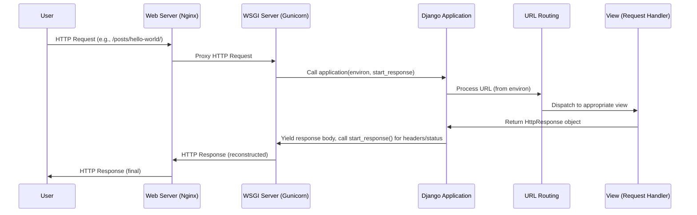

# Chapter 6: Web Server Gateway Interface (WSGI)

Having explored how [Views (Request Handlers)](chapter_05.md) generate responses based on incoming web requests, a crucial question emerges: how does a generic web server like Nginx or Apache actually *talk* to our Python-based Django application? The answer lies in the Web Server Gateway Interface, or WSGI. While views define the "what" of your application's logic, WSGI defines the "how" of its communication with the outside world.

---

### Problem & Motivation

Imagine you've built a fantastic Django application with intricate [URL Routing](chapter_04.md) and powerful [Views (Request Handlers)](chapter_05.md). Now, you want users to access it via a web browser. A browser sends an HTTP request to a web server (e.g., Apache, Nginx). This web server understands HTTP, but it doesn't inherently know how to execute Python code or interact with a Django project. There's a fundamental communication gap: the web server speaks HTTP, and your Django application speaks Python.

This problem is precisely what WSGI solves. Without a standardized interface, every web server would need a custom way to integrate with every Python web framework, leading to endless compatibility issues and development overhead. WSGI provides a clean, universal bridge, allowing any compliant web server to communicate with any compliant Python web application. For our `markup` project, WSGI is the indispensable layer that enables our carefully crafted Django application to actually serve web pages to users, translating raw HTTP requests into a format Django understands, and Django's Python responses back into HTTP.

---

### Core Concept Explanation

The Web Server Gateway Interface (WSGI) is a specification that describes a simple and universal interface between web servers and Python web applications or frameworks. It's not a server, nor is it a framework; it's merely a contract that defines how a "server" (or gateway) and an "application" (or framework) should interact. Think of WSGI as a standardized universal adapter plug: if your web server has a WSGI-compatible outlet, and your Python application has a WSGI-compatible plug, they can connect and communicate seamlessly, regardless of their internal workings.

At its heart, WSGI defines a callable Python object (often a function or an instance with a `__call__` method) that represents the application. This callable accepts two arguments:
1.  `environ`: A dictionary containing CGI-like environment variables, HTTP headers, and other request data.
2.  `start_response`: A callable that the application uses to send HTTP status and response headers to the server.

The application then returns an iterable that yields the response body. This simple contract decouples web servers from web frameworks, promoting interoperability and flexibility. For Django, the `wsgi.py` file in your project is where this callable `application` object is defined, serving as the entry point for all incoming web requests that are proxied through a WSGI server.

---

### Practical Usage Examples

In a Django project, you'll find a `wsgi.py` file within your main project directory. This file contains the WSGI application callable that WSGI-compatible servers use to interact with your Django project.

Let's look at the typical structure of `markup/markup/wsgi.py`:

```python
# markup/markup/wsgi.py
import os

from django.core.wsgi import get_wsgi_application

# Sets the default Django settings module for the 'markup' project.
os.environ.setdefault('DJANGO_SETTINGS_MODULE', 'markup.settings')

# This is the WSGI callable. It wraps your Django application.
application = get_wsgi_application()
```
The `os.environ.setdefault` line tells Django which settings file to use. The `get_wsgi_application()` function provided by Django returns the actual WSGI callable that hooks into your Django project.

To run your `markup` project using a production-ready WSGI server like Gunicorn, you would typically navigate to your project's root directory (the one containing `manage.py`) and execute a command similar to this:

```bash
gunicorn markup.wsgi:application --bind 0.0.0.0:8000
```
This command tells Gunicorn to serve the `application` callable found in `markup/wsgi.py`.
- `markup.wsgi`: Refers to the Python module `wsgi.py` inside the `markup` package.
- `:application`: Specifies the callable object named `application` within that module.
- `--bind 0.0.0.0:8000`: Instructs Gunicorn to listen for requests on all available network interfaces on port 8000.

After running this command, Gunicorn (the WSGI server) will be running and listening for requests. Any HTTP request sent to `http://localhost:8000/` (or your server's IP) will be received by Gunicorn, which then forwards it to your Django application via the WSGI interface.

---

### Internal Implementation Walkthrough

When a user's web browser makes a request to your `markup` project, a series of steps involving the WSGI interface ensures that the request is processed by Django and a response is returned.

Let's trace the journey of a request:

1.  **Client Request**: A user opens their browser and navigates to `http://yourwebsite.com/posts/hello-world/`.
2.  **Web Server (e.g., Nginx) Receives Request**: The request first hits the web server (e.g., Nginx, Apache). Nginx is typically configured to serve static files directly and proxy dynamic requests to a WSGI server.
3.  **Web Server Proxies to WSGI Server**: Nginx, realizing it's a dynamic request for the Django application, forwards (proxies) the request to the WSGI server (e.g., Gunicorn), usually listening on a specific internal port (e.g., `localhost:8000`).
4.  **WSGI Server Prepares Environment**: Gunicorn receives the raw HTTP request. It parses the request, extracts information like URL path, HTTP headers, request method, and query parameters, and packages all this into a Python dictionary called `environ` (as defined by the WSGI spec). It also prepares a `start_response` callable.
5.  **WSGI Server Calls Django's `application`**: Gunicorn then calls the `application` callable defined in your `markup/wsgi.py` file, passing it the `environ` dictionary and the `start_response` callable.
    ```python
    # Simplified conceptual call within Gunicorn
    response_body_iterable = application(environ, start_response)
    ```
6.  **Django Processes Request**: Inside Django's `get_wsgi_application()` wrapper:
    *   The `environ` dictionary is used to construct a `HttpRequest` object, which encapsulates all the request details in a Django-friendly manner.
    *   [URL Routing](chapter_04.md) is performed to match the request path to a specific [View (Request Handler)](chapter_05.md).
    *   The chosen view executes its logic, interacts with models/database if necessary, and ultimately returns a `HttpResponse` object.
7.  **Django Returns Response**: Django's `HttpResponse` object is then translated back into a WSGI-compliant iterable. The response status (e.g., `200 OK`) and HTTP headers are passed to the `start_response` callable. The response body is yielded as an iterable of byte strings.
8.  **WSGI Server Sends Response**: Gunicorn receives the status, headers, and body from the Django application. It reconstructs the raw HTTP response.
9.  **WSGI Server Returns to Web Server**: Gunicorn sends this complete HTTP response back to the initial web server (Nginx).
10. **Web Server Returns to Client**: Nginx then sends the HTTP response back to the user's browser.

Here's a simplified sequence diagram illustrating this flow:



The `wsgi.py` file effectively bridges the gap, allowing Django's powerful request/response cycle to be executed by standard web servers.

---

### System Integration

The `wsgi.py` file is the crucial entry point that integrates your entire Django `markup` project with any WSGI-compatible web server.

-   **Connecting to [The Django Project](chapter_02.md)**: The `wsgi.py` file directly lives within and is part of your main Django project structure. It's the designated contact point for external servers to reach your project. Without it, the "project" as a collection of files and logic would remain inaccessible to the web.

-   **Leveraging [Project Settings](chapter_03.md)**: The line `os.environ.setdefault('DJANGO_SETTINGS_MODULE', 'markup.settings')` is vital. It tells Django where to find all the configuration defined in your [Project Settings](chapter_03.md), such as `INSTALLED_APPS`, database connections, `SECRET_KEY`, and more. This ensures that when the WSGI server calls your application, Django is correctly configured.

-   **Enabling [URL Routing](chapter_04.md) and [Views (Request Handlers)](chapter_05.md)**: Once the `application` callable is invoked, it's Django's turn. The incoming request (encapsulated in the `environ` dictionary) is transformed into Django's `HttpRequest` object. This allows Django to then consult its [URL Routing](chapter_04.md) patterns to find the correct [View (Request Handler)](chapter_05.md) to process the request. The view then generates a `HttpResponse` object, which WSGI then translates back to the web server. Essentially, WSGI is the *delivery mechanism* that brings requests to your routing system and takes responses back from your views.

In summary, WSGI provides the standardized handshake protocol that stitches together the server-side infrastructure with your Django application, making all other internal Django mechanisms (settings, URLs, views) available to the world.

---

### Best Practices & Tips

1.  **Use a Production-Ready WSGI Server**: Never use Django's built-in `manage.py runserver` for production. It's designed for development convenience and lacks the security, performance, and robustness required for live applications. Always use a dedicated WSGI server like Gunicorn, uWSGI, or mod_wsgi (for Apache).
    ```bash
    # Incorrect for production:
    python manage.py runserver

    # Correct for production:
    gunicorn markup.wsgi:application --workers 3 --timeout 30
    ```
2.  **Separate Static and Media Files**: While Django's development server can serve static and media files, in production, your web server (Nginx or Apache) should handle these directly. Configure your web server to serve `/static/` and `/media/` URLs from their respective directories, bypassing Django and the WSGI server entirely. This significantly reduces the load on your Python application.
3.  **Environment Variables for Settings**: For sensitive information (like `SECRET_KEY`, database credentials, API keys) in your [Project Settings](chapter_03.md), use environment variables instead of hardcoding them. Your WSGI server configuration can then load these variables before starting the Django application.
    ```python
    # In markup/settings.py
    import os
    SECRET_KEY = os.environ.get('DJANGO_SECRET_KEY', 'your-fallback-secret-key-for-dev')
    ```
    Then, when starting Gunicorn, you might set the variable:
    ```bash
    DJANGO_SECRET_KEY='your-really-secret-key' gunicorn markup.wsgi:application
    ```
4.  **Monitoring and Logging**: Ensure your WSGI server is configured for proper logging. This is crucial for debugging production issues and monitoring application health. Integrate with your system's logging infrastructure (e.g., systemd journal, custom log files).
5.  **Understand WSGI Server Workers**: WSGI servers like Gunicorn use "workers" to handle requests concurrently. The number of workers affects how many requests your application can handle simultaneously. Tune this based on your server's CPU cores and memory, usually `(2 * CPU_CORES) + 1`.

---

### Chapter Conclusion

The Web Server Gateway Interface (WSGI) is the unsung hero that allows your Django `markup` project to interact with the world. It provides the essential communication standard, bridging the gap between web servers and Python web applications. By defining a clear, callable interface, WSGI enables the sophisticated logic of your [Views (Request Handlers)](chapter_05.md) and the structure provided by [URL Routing](chapter_04.md) to be exposed as a functional website. Understanding WSGI is fundamental to deploying and maintaining any Django application in a production environment, ensuring efficient and robust communication between the underlying server infrastructure and your Python code. This chapter concludes our journey through the core components of a Django project, from management commands and project structure to settings, routing, views, and finally, the crucial gateway to the web.