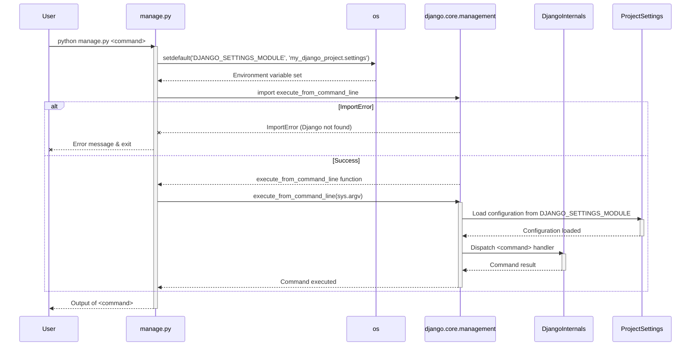

# Chapter 1: Project Management Script

Welcome to the first chapter of our "markup" project tutorial! This chapter lays the groundwork for understanding how we interact with our Django application on a day-to-day basis. As this is our starting point, there's no previous chapter to transition from, but we'll build steadily from here.

---

### Problem & Motivation

Developing a web application involves many tasks beyond just writing business logic. You need to run a development server to see your changes, manage your database, create administrative users, and package your application for deployment. Without a unified tool, these tasks would require manually executing complex Python scripts, remembering obscure command-line arguments, or directly interacting with various Django internals. This approach would be tedious, error-prone, and a significant barrier for developers.

The *markup* project, like any Django application, requires a consistent and straightforward way for developers to perform these administrative and operational duties. We need a single entry point that centralizes project management, making common tasks accessible and predictable. Our primary motivating use case for this chapter is the most fundamental: launching a local development server to see our application in action as we build it.

---

### Core Concept Explanation

At the heart of every Django project lies `manage.py`, the **Project Management Script**. Think of `manage.py` as your project's personal assistant or a universal remote control. It's a command-line utility that bundles together a wide array of Django's administrative and utility functions into a single, easy-to-use interface. Instead of needing to know the intricate details of how to start a server or apply database changes, you simply tell `manage.py` what you want to do.

This script ensures that Django's management commands are executed within the correct project context, primarily by setting the `DJANGO_SETTINGS_MODULE` environment variable to point to your project's `settings.py` file. This is crucial because `settings.py` contains all the configurations (database connections, installed apps, security keys) that Django needs to operate correctly. Without `manage.py`, or without correctly setting this environment variable, Django wouldn't know how to find its configurations, leading to errors and an inoperable application. It acts as the primary interface for developers and administrators to interact with their Django project.

---

### Practical Usage Examples

Let's dive into some practical examples to see `manage.py` in action, focusing on our motivating use case: starting the development server.

To begin, ensure you are in your project's root directory where `manage.py` resides.

#### 1. Running the Development Server

The most common command you'll use is `runserver`. This starts a lightweight web server on your local machine, allowing you to view your application in a web browser.

```bash
python manage.py runserver
```

**Explanation:** This command tells `manage.py` to execute the `runserver` subcommand. You'll typically see output indicating the server has started, often at `http://127.0.0.1:8000/`. You can then open this URL in your browser.

#### 2. Specifying a Port

If port 8000 is already in use, or you need to run multiple development servers, you can specify a different port:

```bash
python manage.py runserver 8080
```

**Explanation:** By adding `8080` after `runserver`, you instruct the server to bind to port `8080` instead of the default `8000`.

#### 3. Making Database Migrations

When you define or change your database models (which will be covered later), you need to tell Django to create or update the corresponding database tables.

```bash
python manage.py makemigrations
```

**Explanation:** This command inspects your models and creates a "migration file" that describes the changes needed for your database. It doesn't apply them yet.

#### 4. Applying Database Migrations

After `makemigrations` creates the migration files, you apply them to your database using the `migrate` command.

```bash
python manage.py migrate
```

**Explanation:** This command reads the migration files and applies the necessary changes to your database. This is how your Python code's database model definitions translate into actual database tables and fields.

#### 5. Creating a Superuser

For administrative tasks, you'll often need a superuser account to access Django's built-in administration panel.

```bash
python manage.py createsuperuser
```

**Explanation:** This interactive command prompts you for a username, email, and password, then creates an administrative user with full permissions.

---

### Internal Implementation Walkthrough

Let's examine the `main` function found in your project's `manage.py` script. This small piece of code is the entry point for all `manage.py` commands.

```python
# my_django_project/manage.py

import os
import sys

def main():
    # 1. Set the DJANGO_SETTINGS_MODULE environment variable
    os.environ.setdefault('DJANGO_SETTINGS_MODULE', 'my_django_project.settings')
    try:
        # 2. Import Django's core management utility
        from django.core.management import execute_from_command_line
    except ImportError as exc:
        # 3. Handle ImportError (Django not installed/found)
        raise ImportError(
            "Couldn't import Django. Are you sure it's installed and "
            "available on your PYTHONPATH environment variable? Did you "
            "forget to activate a virtual environment?"
        ) from exc
    # 4. Execute the command
    execute_from_command_line(sys.argv)

if __name__ == '__main__':
    main()
```

Here's a step-by-step breakdown of what happens when you run `python manage.py <command>`:

1.  **Setting the Settings Module:**
    ```python
    os.environ.setdefault('DJANGO_SETTINGS_MODULE', 'my_django_project.settings')
    ```
    This line is critical. It tells Django where to find your project's primary configuration file, `settings.py`. Without this, Django wouldn't know how to connect to your database, what applications are installed, or how to handle security settings. `setdefault` ensures that if `DJANGO_SETTINGS_MODULE` is already set (e.g., in your environment), it won't be overridden.

2.  **Importing Django's Management Utility:**
    ```python
    from django.core.management import execute_from_command_line
    ```
    The script attempts to import `execute_from_command_line` from Django's core management module. This function is Django's heavy lifter; it parses the command-line arguments (like `runserver`, `migrate`, etc.) and dispatches them to the appropriate Django internal functions.

3.  **Handling `ImportError`:**
    ```python
    except ImportError as exc:
        raise ImportError(...) from exc
    ```
    This `try-except` block catches a common issue: if Django is not installed or not accessible in the current Python environment (e.g., you forgot to activate your virtual environment), importing `django.core.management` will fail. The `ImportError` provides helpful guidance to the user on how to resolve this.

4.  **Executing the Command:**
    ```python
    execute_from_command_line(sys.argv)
    ```
    Finally, `execute_from_command_line` is called with `sys.argv`. `sys.argv` is a list of command-line arguments passed to the Python script. For `python manage.py runserver`, `sys.argv` would typically be `['manage.py', 'runserver']`. Django's utility then takes these arguments, identifies the command (`runserver`), and executes its corresponding logic.

Here's a simplified sequence diagram illustrating the flow:



---

### System Integration

The `manage.py` script serves as the initial gateway to almost all other Django components. Its primary integration points are:

1.  **Project Settings ([Project Settings](chapter_02.md)):** The most direct connection. By setting `DJANGO_SETTINGS_MODULE`, `manage.py` dictates which configuration file Django will use for the current execution. This `settings.py` file is paramount, as it defines everything from database connections to security keys and the list of installed applications. All subsequent actions initiated through `manage.py` (like `runserver` or `migrate`) will implicitly rely on these settings.

2.  **Django Application Components:** Commands like `makemigrations` interact with your application's models, `runserver` initiates the development web server that uses the [Web Server Interface (WSGI)](chapter_03.md), and `shell` provides an interactive Python console with your project environment loaded. `manage.py` ensures that all these components are accessed and managed within the correct project context.

3.  **Third-Party Applications:** Many Django third-party libraries also provide their own `manage.py` subcommands, extending its functionality. This unified approach makes managing external tools seamless within your project.

Essentially, `manage.py` sets up the environment and then hands off control to the specific Django (or third-party) module responsible for the requested action, always ensuring that the correct project settings are in play.

---

### Best Practices & Tips

*   **Always Activate Your Virtual Environment:** Before running any `manage.py` command, make sure your Python virtual environment is activated. This ensures that the correct Django version and project dependencies are used, preventing `ImportError` and other dependency-related issues.
*   **Explore Commands with `help`:** If you're unsure what commands are available or how to use a specific command, use the `help` subcommand:
    ```bash
    python manage.py help
    python manage.py help <command_name> # e.g., python manage.py help runserver
    ```
    This is an invaluable resource for discovering new functionalities and understanding command options.
*   **Avoid Modifying `manage.py` Directly:** For most projects, you should never need to change the `manage.py` file. Its purpose is to bootstrap the Django environment. If you need custom commands, Django provides mechanisms to create them as part of your applications.
*   **Understand Your `settings.py`:** The `manage.py` script is a gateway, but `settings.py` is the map. A solid understanding of your project's settings will make debugging and configuration much easier.
*   **Use Descriptive Commit Messages:** When making changes that impact `manage.py` commands (e.g., new models requiring migrations), ensure your version control commit messages reflect these changes.

---

### Chapter Conclusion

In this chapter, we've explored the fundamental role of `manage.py` as the central command-line utility for our "markup" project. We learned that it provides a unified interface for administrative tasks, from running the development server to managing databases. We dissected its internal workings, understanding how it sets the project context and dispatches commands, and saw how it integrates with other core Django components, particularly `settings.py`. By mastering `manage.py`, you gain powerful control over your Django project.

Our journey continues by diving deeper into the configurations that `manage.py` relies upon. Next, we will explore the pivotal role of `settings.py` and how it dictates the behavior and characteristics of our entire Django application.

[Project Settings](chapter_02.md)