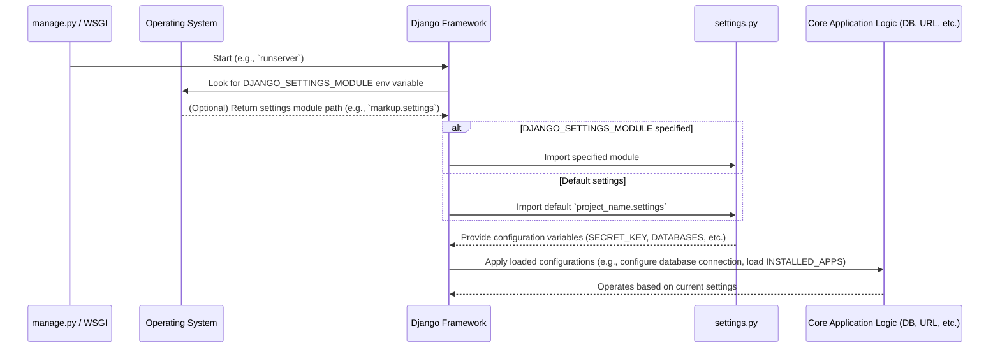

# Chapter 2: Project Settings

Welcome back to the "markup" project documentation! In the previous chapter, we explored the foundational role of the [Project Management Script](chapter_01.md), `manage.py`, as our primary command-line interface for interacting with our Django application. It's the utility that brings our project to life, but for it to know *how* to operate—what database to connect to, which applications to include, or how to handle security—it needs a clear set of instructions. This is where our project settings come into play.

---

### Problem & Motivation

Imagine building a house without a blueprint or a project without a plan. You'd likely face chaos, inconsistency, and security vulnerabilities. Similarly, a web application requires a centralized "control panel" to define its operational parameters. Without such a mechanism, every component would need to hardcode its configurations—database credentials, server addresses, security keys—leading to a brittle, unmaintainable, and highly insecure system.

This is precisely the problem `settings.py` solves for our "markup" project. It acts as the single source of truth for all global configurations, providing a structured and secure way to manage crucial aspects like database connections, installed applications, and security policies. For instance, consider setting up a database: instead of scattering connection details across various files, `settings.py` centralizes this information, allowing the entire application to reliably connect to the correct data store and ensuring easy modification when moving between development and production environments.

---

### Core Concept Explanation

At its heart, `settings.py` is a standard Python module that contains configuration variables for your Django project. When Django starts, it loads this module, making all its variables available to the rest of your application. Think of it as the project's brain, dictating how different parts should behave and interact.

This file defines everything from fundamental security keys to the list of applications your project utilizes. Key sections you'll frequently encounter include:

*   **`SECRET_KEY`**: A unique, secret string used for cryptographic signing. *Crucial for security*.
*   **`DEBUG`**: A boolean that turns debug mode on or off. `True` provides detailed error pages (useful for development), `False` enables production-ready error handling.
*   **`ALLOWED_HOSTS`**: A list of strings representing the host/domain names that this Django site can serve. *Important for security in production*.
*   **`INSTALLED_APPS`**: A tuple of strings identifying all Django applications that are activated in this project.
*   **`MIDDLEWARE`**: A list of middleware classes, which are frameworks for processing requests and responses globally.
*   **`DATABASES`**: A dictionary defining all the database connections available to your project.
*   **`STATIC_URL`** and **`STATICFILES_DIRS`**: Paths for serving static files like CSS, JavaScript, and images.

Each variable plays a vital role in customizing your project's behavior, allowing you to tailor it to specific requirements, manage security, and adapt to different deployment scenarios.

---

### Practical Usage Examples

Let's illustrate how `settings.py` is used to address our motivating use case: configuring the database and making other common adjustments.

Upon project creation, Django sets up a default SQLite database. You'll find a `DATABASES` dictionary configured as follows:

```python
# markup/settings.py (excerpt)

DATABASES = {
    'default': {
        'ENGINE': 'django.db.backends.sqlite3',
        'NAME': BASE_DIR / 'db.sqlite3',
    }
}
```
This snippet tells Django to use SQLite, storing the database file named `db.sqlite3` in your project's base directory. `BASE_DIR` is a Python `pathlib` object pointing to your project's root.

Now, imagine we want to switch to a PostgreSQL database, a more robust choice for production environments. We would update the `DATABASES` entry:

```python
# markup/settings.py (excerpt)

DATABASES = {
    'default': {
        'ENGINE': 'django.db.backends.postgresql',
        'NAME': 'mydjangodb',
        'USER': 'mydjangoappuser',
        'PASSWORD': 'strong_password',
        'HOST': 'localhost',
        'PORT': '5432',
    }
}
```
By modifying this dictionary, we've instructed our entire Django project to connect to a PostgreSQL database named `mydjangodb` running on `localhost` at port `5432` with specific credentials. This single change propagates throughout the application without altering any other code.

Another common task is to manage the `DEBUG` setting. For development, it's typically `True` to get detailed error messages:

```python
# markup/settings.py (excerpt)

DEBUG = True
```
When deploying to production, it's critical to set `DEBUG` to `False` to prevent sensitive information from being exposed in error pages:

```python
# markup/settings.py (excerpt)

DEBUG = False
```
When `DEBUG` is `False`, you must also define `ALLOWED_HOSTS` for security. This list specifies the domain names that your Django application will serve.

```python
# markup/settings.py (excerpt)

ALLOWED_HOSTS = ['example.com', 'www.example.com', '192.168.1.10']
```
This configuration ensures that your application only responds to requests coming from these specific hosts, protecting against HTTP Host header attacks.

Finally, whenever you create a new Django app within your project (e.g., `blog` app), you must register it in `INSTALLED_APPS` so Django recognizes and includes it:

```python
# markup/settings.py (excerpt)

INSTALLED_APPS = [
    'django.contrib.admin',
    'django.contrib.auth',
    # ... other default apps
    'myapp', # Your custom app
]
```
Adding `'myapp'` to this tuple makes its models, views, and templates available to the rest of the project.

---

### Internal Implementation Walkthrough

When you execute a Django command via `manage.py` (like `runserver`) or when a web server processes an incoming request through the [Web Server Interface (WSGI)](chapter_03.md), the first significant step Django takes is to load your project's settings.

Here's a simplified sequence of how Django processes your `settings.py` file:



1.  **Initialization**: When `manage.py` is invoked, or the WSGI server starts, Django's core bootstrap process begins.
2.  **Locating Settings**: Django looks for the `DJANGO_SETTINGS_MODULE` environment variable. If set, it attempts to import that Python module. Otherwise, it defaults to `your_project_name.settings` (e.g., `markup.settings`).
3.  **Loading Module**: The `settings.py` file is treated as a standard Python module. Django executes its code, and all variables defined within it become attributes of a special global settings object (usually `django.conf.settings`).
4.  **Applying Configuration**: Once loaded, these configuration variables are used throughout the Django framework. For example:
    *   The `DATABASES` dictionary is used to establish database connections.
    *   `INSTALLED_APPS` dictates which app-specific configurations (like models and admin interfaces) should be loaded.
    *   `DEBUG` and `ALLOWED_HOSTS` influence how HTTP requests are processed and errors are handled.

It's important to note that sensitive information like `SECRET_KEY` and database passwords should *never* be hardcoded directly into `settings.py` in a production environment. Instead, they should be loaded from environment variables using Python's `os` module or a dedicated configuration management library.

```python
# markup/settings.py (secure excerpt)
import os
from pathlib import Path

# Build paths inside the project like this: BASE_DIR / 'subdir'.
BASE_DIR = Path(__file__).resolve().parent.parent

# Quick-start development settings - unsuitable for production
# See https://docs.djangoproject.com/en/stable/howto/deployment/checklist/

SECRET_KEY = os.environ.get('DJANGO_SECRET_KEY', 'a-very-insecure-default-key-for-dev')

DEBUG = os.environ.get('DJANGO_DEBUG', 'True') == 'True'

ALLOWED_HOSTS = os.environ.get('DJANGO_ALLOWED_HOSTS', '127.0.0.1,localhost').split(',')

# ... other settings
```
This approach demonstrates how environment variables provide a secure and flexible way to manage differing settings between development and production.

---

### System Integration

The `settings.py` file is the central nervous system of our "markup" project, connecting to virtually every other component:

*   **[Project Management Script](chapter_01.md) (`manage.py`)**: This script uses `settings.py` to understand which database to migrate, which development server to run, and which installed apps to inspect.
*   **[Web Server Interface (WSGI)](chapter_03.md) (`wsgi.py`)**: When a web server (like Gunicorn or Apache/Nginx with mod_wsgi) starts your Django application, it loads `wsgi.py`, which in turn configures the `DJANGO_SETTINGS_MODULE` environment variable, ensuring the correct settings are used to serve incoming HTTP requests.
*   **[URL Dispatcher](chapter_04.md) (`urls.py`)**: While `urls.py` defines URL patterns, some patterns might be conditionally included or configured based on `settings.py` (e.g., enabling the Django Admin interface requires `'django.contrib.admin'` in `INSTALLED_APPS`).
*   **View Functions ([View Function](chapter_05.md))**: View functions often access settings directly (e.g., `from django.conf import settings; settings.DEBUG`) to alter behavior based on the current environment.
*   **Installed Applications**: Every app listed in `INSTALLED_APPS` relies on the core settings for its operation, such as database connectivity, caching, or template directories.
*   **Database Backend**: The `DATABASES` setting directly configures how Django's ORM connects to your chosen database system.

The data flow is consistently from `settings.py` outwards: configurations defined in this file influence the behavior and capabilities of all other parts of the Django project.

---

### Best Practices & Tips

*   **Environment Variables for Sensitive Data**: *Always* store `SECRET_KEY`, database credentials, API keys, and other sensitive information outside your codebase. Use environment variables (as shown above) or a dedicated secret management system. Never commit these directly to version control.
*   **Separate Settings for Environments**: For larger projects, it's common to have separate settings files for different environments (e.g., `settings/development.py`, `settings/production.py`). You can use `DJANGO_SETTINGS_MODULE` to point to the correct one or use a library like `django-environ`.
*   **`ALLOWED_HOSTS` in Production**: When `DEBUG` is `False`, `ALLOWED_HOSTS` *must* be correctly configured. Failure to do so will result in `DisallowedHost` errors, preventing your application from serving requests.
*   **`DEBUG = False` in Production**: Never deploy with `DEBUG = True`. It exposes detailed error messages, including sensitive configuration information, to the public.
*   **Meaningful `INSTALLED_APPS` Order**: While not always critical, the order of apps in `INSTALLED_APPS` can sometimes matter, especially if apps override templates or static files from earlier apps in the list.
*   **Consistent Naming**: Stick to Django's standard variable names for consistency and easier debugging.

---

### Chapter Conclusion

This chapter has provided a comprehensive look at `settings.py`, the nerve center of our "markup" project. We've understood its critical role in centralizing configuration, securing sensitive data, and guiding the overall behavior of the application. From defining database connections to managing installed applications and setting security policies, `settings.py` is the blueprint that dictates how our Django project operates.

We also delved into practical examples, demonstrating how to modify key settings, and walked through the internal mechanism of how Django loads and applies these configurations. Understanding its direct interaction with almost every other Django component highlights its foundational importance.

As our web application processes requests, it first interacts with the web server. How these requests are then handed over to our Django application is the next crucial step. In the upcoming chapter, we'll explore the [Web Server Interface (WSGI)](chapter_03.md), the bridge that allows our web server to communicate with our Django project, ultimately leveraging the configurations we've just discussed.