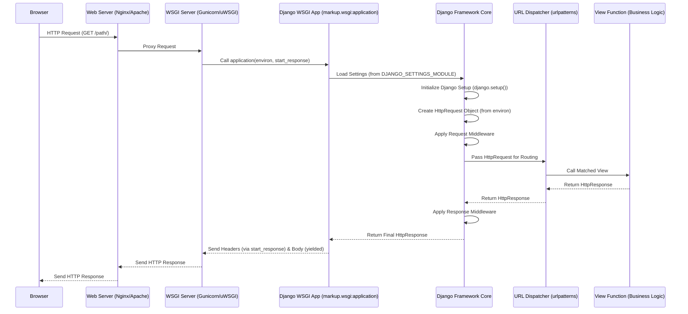

# Chapter 3: Web Server Interface (WSGI)

Having meticulously configured our Django project's global settings in the [Project Settings](chapter_02.md) chapter, we now turn our attention to how these settings are brought to life when an external web server interacts with our application. The `wsgi.py` file acts as the critical entry point, bridging the gap between the outside world and our finely tuned Django machinery.

---

### Problem & Motivation

Imagine a sophisticated Python web application, built with Django, that needs to serve dynamic content to users. On the other side, we have highly efficient web servers like Nginx or Apache, which excel at handling raw HTTP requests, serving static files, and managing network connections. The fundamental problem is that these web servers "speak" HTTP and filesystem paths, while our Django application "speaks" Python and understands its own framework-specific structures. There's no inherent way for a generic web server to directly execute Python code or understand Django's request-response cycle.

This is where the Web Server Gateway Interface (WSGI) comes into play. It solves the critical problem of providing a *standardized interface* for web servers to communicate with Python web applications. Without WSGI, every Python framework would need to implement its own specific adapters for different web servers, leading to immense complexity and fragmentation. In our `markup` project, WSGI is indispensable because it's the *very first piece of our Django application* that gets invoked when an HTTP request arrives, setting the stage for all subsequent processing, including loading our project settings and eventually routing the request.

Consider a user typing `https://www.our-markup-app.com/dashboard/` into their browser. An Nginx web server might receive this request. How does Nginx know to hand it over to our Python Django application, and how does Django receive the request in a structured format it can understand? The `wsgi.py` file, adhering to the WSGI standard, provides the answer by acting as the universal translator and initial bootstrap for our Django application.

---

### Core Concept Explanation

The **Web Server Gateway Interface (WSGI)** is not a web server, nor is it a web framework. Instead, it's a **specification** defined by PEP 3333 that describes a simple, universal interface between web servers and Python web applications or frameworks. Think of it as a contract or a common language that both sides agree to speak.

The WSGI specification defines two primary components:

1.  **WSGI Server**: This component implements the "server" side of the WSGI specification. It listens for HTTP requests (often forwarded by a traditional web server like Nginx or Apache), parses them, and then calls the WSGI application. Examples include Gunicorn, uWSGI, and mod_wsgi (for Apache).
2.  **WSGI Application**: This component implements the "application" side of the WSGI specification. It's a Python callable (a function or an object with a `__call__` method) that accepts two arguments:
    *   `environ`: A dictionary containing all the HTTP request variables (headers, method, path, etc.).
    *   `start_response`: A callable provided by the WSGI server that the application uses to send HTTP status and response headers back to the client.

In essence, a WSGI Server acts as a universal adapter plug. It can take input from any standard web server and plug it into any WSGI-compliant Python application. For our `markup` project, Django includes a built-in WSGI application callable within its `wsgi.py` file. This callable is responsible for initializing the Django framework and preparing it to handle requests as per the WSGI standard. This elegant separation ensures that our Django application remains agnostic to the specific web server used, promoting flexibility and portability.

---

### Practical Usage Examples

Every Django project, including `markup`, comes with a `wsgi.py` file, typically located inside the main project directory (`markup/markup/wsgi.py`). This file contains the essential WSGI application callable that our web server will interact with.

Let's look at the default `wsgi.py` content:

```python
# markup/markup/wsgi.py
import os

from django.core.wsgi import get_wsgi_application

# CRITICAL: This line tells Django which settings file to use.
# 'markup.settings' refers to the markup/settings.py file.
os.environ.setdefault('DJANGO_SETTINGS_MODULE', 'markup.settings')

# The 'application' callable is the WSGI application object.
# This is what WSGI servers (like Gunicorn) will call.
application = get_wsgi_application()
```

#### Explanation:

1.  `import os`: Imports Python's built-in `os` module, which provides a way to interact with the operating system, including environment variables.
2.  `from django.core.wsgi import get_wsgi_application`: This imports a specific function from Django's core WSGI utilities. This function is designed to return a WSGI application callable that handles the entire Django request/response cycle.
3.  `os.environ.setdefault('DJANGO_SETTINGS_MODULE', 'markup.settings')`: This is a crucial line. It sets an environment variable named `DJANGO_SETTINGS_MODULE` to the string `'markup.settings'`. This tells Django exactly which Python module contains its project-wide configuration. If this environment variable isn't set (e.g., in a production environment), Django wouldn't know where to find your `settings.py` file. The `setdefault` method ensures that if the environment variable is *already* set externally, it won't be overridden.
4.  `application = get_wsgi_application()`: This line calls the `get_wsgi_application()` function. It returns a WSGI-compliant callable object. This object, named `application`, is the actual WSGI application that a WSGI server (like Gunicorn) will interact with to start processing requests.

#### Running with a WSGI Server

While Django's development server (`python manage.py runserver`) includes its own lightweight WSGI server, for production or more robust testing, you'd use a dedicated WSGI server. A popular choice is Gunicorn.

First, ensure Gunicorn is installed:
```bash
pip install gunicorn
```

Now, you can run your Django application using Gunicorn, pointing it to your WSGI application file:

```bash
# From your project's root directory (where manage.py is)
gunicorn markup.wsgi:application --bind 0.0.0.0:8000
```

#### Expected Behavior:

After executing the `gunicorn` command:
*   Gunicorn will start up, listening for requests on port `8000` on all available network interfaces (`0.0.0.0`).
*   It will load your `markup/wsgi.py` file and obtain the `application` callable.
*   If you then open your web browser and navigate to `http://localhost:8000` (or the IP address of your server followed by `:8000`), Gunicorn will receive your browser's HTTP request.
*   Gunicorn will then call Django's `application` callable, initiating the Django request-response cycle, eventually serving the content of your Django application (e.g., the default Django welcome page or any custom view you've set up).

---

### Internal Implementation Walkthrough

When a WSGI server like Gunicorn receives an HTTP request and calls the `application` callable from your `markup/wsgi.py` file, a series of internal steps occur within Django to process that request.

1.  **WSGI Server Invocation**: The WSGI server (e.g., Gunicorn) acts as the intermediary. It receives the raw HTTP request, parses its details (headers, path, method, body, etc.), and packages this information into the standard `environ` dictionary. It then calls the `application` callable, passing `environ` and a `start_response` function.

2.  **Django Initialization**:
    *   The `application` object, which is returned by `django.core.wsgi.get_wsgi_application()`, is essentially an instance of `django.core.handlers.wsgi.WSGIHandler`.
    *   When this `WSGIHandler` instance is called, it first ensures that Django's global settings have been loaded. This is where the `DJANGO_SETTINGS_MODULE` environment variable (which we set in `wsgi.py`) becomes vital. Django uses this to find and load the settings defined in our `markup/settings.py` file. This includes database configurations, installed apps, middleware, and much more, as discussed in [Project Settings](chapter_02.md).
    *   If settings haven't been loaded yet, `django.setup()` is called, which performs Django's essential startup routines (e.g., loading app configurations, connecting signals).

3.  **Request Object Creation**: The `WSGIHandler` then takes the data from the `environ` dictionary and constructs a comprehensive `HttpRequest` object. This object encapsulates all the details of the incoming request in a Python-friendly format, making it easy for subsequent Django components to work with.

4.  **Middleware Processing (Initial Phase)**: The `HttpRequest` object then begins its journey through Django's middleware stack. Middleware are hooks that can process requests before they hit the URL dispatcher and responses before they're sent back.

5.  **Routing to URL Dispatcher**: After initial middleware processing, the `HttpRequest` object is passed to Django's [URL Dispatcher](chapter_04.md). This is where Django matches the request's URL path against the defined URL patterns (`urlpatterns`) to determine which specific view function should handle the request.

6.  **View Execution & Response Generation**: Once the URL dispatcher identifies the correct view, it's called with the `HttpRequest` object. The view function executes its business logic, interacts with the database, and eventually returns an `HttpResponse` object.

7.  **Middleware Processing (Final Phase)**: The `HttpResponse` object then travels back through the middleware stack, allowing middleware to modify it (e.g., add headers, compress content) before it's sent back to the WSGIHandler.

8.  **Sending the Response**: Finally, the `WSGIHandler` takes the `HttpResponse` object, extracts the HTTP status code and headers, and uses the `start_response` callable (provided by the WSGI server) to send them. It then yields the response body in chunks, which the WSGI server collects and sends back to the client.

This entire flow can be visualized as follows:



This diagram illustrates how the WSGI application acts as the initial bridge, allowing the web server to hand off requests to Django in a standardized way, triggering the entire Django request-response cycle.

---

### System Integration

The Web Server Interface (WSGI) is the critical initial point where our `markup` project integrates with the outside world, specifically with any external web server. Its role is pivotal in tying together several key components of our application:

*   **Integration with [Project Settings](chapter_02.md)**:
    The `wsgi.py` file directly depends on the `DJANGO_SETTINGS_MODULE` environment variable. This variable, typically set to `'markup.settings'`, explicitly tells Django *where* to find all its global configurations defined in `markup/settings.py`. Without this link, the Django framework wouldn't know which database to connect to, which applications are installed, what security keys to use, or any other fundamental configuration. The WSGI application effectively bootstraps the Django environment using these settings.

*   **Integration with [URL Dispatcher](chapter_04.md)**:
    Once the WSGI application has successfully received an HTTP request, initialized Django, and transformed the raw request data into a `HttpRequest` object, its immediate next step is to hand this object over to the [URL Dispatcher](chapter_04.md). The WSGI layer doesn't concern itself with *what* specific code should handle a given URL path; its job is to get the request *into* the Django system. The URL Dispatcher then takes over, using the `HttpRequest` object's path to find the appropriate view function or class-based view. This clear separation of concerns ensures that the WSGI layer focuses solely on communication and initial setup, while routing logic is handled by the URL Dispatcher.

#### Data Flow and Interaction Patterns:

1.  **External Request Ingress**: An HTTP request arrives at a web server (e.g., Nginx).
2.  **WSGI Server Proxy**: The web server, typically configured as a reverse proxy, forwards this request to a WSGI server (e.g., Gunicorn).
3.  **WSGI Application Activation**: The WSGI server invokes the `application` callable defined in `markup/wsgi.py`. This callable is responsible for:
    *   Loading Django settings from `markup/settings.py` (via `DJANGO_SETTINGS_MODULE`).
    *   Creating a `HttpRequest` object from the raw request data.
4.  **Internal Django Processing**: The `HttpRequest` object is then passed through Django's internal middleware stack and eventually to the [URL Dispatcher](chapter_04.md) for routing.
5.  **Response Egress**: After a view function processes the request and generates an `HttpResponse`, this response flows back through the middleware, then back to the WSGI application, and finally to the WSGI server, which sends it back to the original web server and then to the client.

This structured interaction ensures that the different responsibilities of handling an HTTP request are cleanly separated, with WSGI serving as the essential and standardized gateway.

---

### Best Practices & Tips

To leverage WSGI effectively in your `markup` project, especially as it grows and moves into production, consider these best practices:

*   **Never Use `runserver` in Production**: Django's `python manage.py runserver` is explicitly for development purposes. It's not built for security, performance, or reliability required in a production environment. Always use a robust, production-ready WSGI server like Gunicorn, uWSGI, or mod_wsgi for deployment.
*   **Use a Dedicated Web Server (Nginx/Apache) as a Reverse Proxy**: For public-facing applications, it's standard practice to place a full-fledged web server like Nginx or Apache in front of your WSGI server. Nginx can handle static files, SSL termination, load balancing, caching, and serve as a reverse proxy to forward dynamic requests to your WSGI server. This offloads many common web server tasks from your Python application.
*   **Manage `DJANGO_SETTINGS_MODULE` Carefully**: The `DJANGO_SETTINGS_MODULE` environment variable is crucial. In development, it often points to `your_project.settings`. In production, you might have `your_project.settings.production` or similar. Ensure your WSGI server (Gunicorn, uWSGI) is configured to set this environment variable correctly based on your deployment environment. Using tools like `django-environ` or `python-decouple` can help manage environment variables cleanly.
*   **Monitor Your WSGI Server**: Keep an eye on your WSGI server's logs and resource usage (CPU, memory). Misconfigured worker processes (too few or too many) can severely impact performance. WSGI servers often provide metrics on request handling, which are invaluable for performance tuning.
*   **Security Considerations**: Your `wsgi.py` file should never be directly exposed to the internet. The web server (e.g., Nginx) acts as the public interface, while the WSGI server and your Django application typically run behind it on an internal network address. Ensure appropriate file permissions for your project directory and `wsgi.py`.
*   **Understand Concurrency**: WSGI servers handle concurrency by running multiple worker processes or threads. For example, Gunicorn's `--workers` parameter determines how many Django application instances are run simultaneously. Choose a suitable number of workers based on your server's CPU cores and memory, and the nature of your application's workload (I/O-bound vs. CPU-bound).

By adhering to these practices, you can ensure that the WSGI layer of your `markup` project is robust, performant, and secure, providing a stable foundation for your Django application.

---

### Chapter Conclusion

In this chapter, we've explored the fundamental role of the Web Server Gateway Interface (WSGI) in our `markup` project. We learned that WSGI provides the essential, standardized bridge between generic web servers and our Django application, allowing HTTP requests to be translated into a format Django can understand. The `wsgi.py` file is the crucial entry point, responsible for bootstrapping the Django environment by loading our project's [Project Settings](chapter_02.md) and creating the initial `HttpRequest` object. We dissected its contents, demonstrated how to run it with a production-grade WSGI server like Gunicorn, and walked through the internal flow of a request from the browser all the way into the Django framework. Finally, we covered best practices to ensure a robust and scalable deployment.

With the incoming HTTP request now successfully processed by the WSGI application and transformed into a Django `HttpRequest` object, the next logical step is to determine *what specific part of our application logic* should handle this request. This pivotal routing decision is the responsibility of the URL Dispatcher, which we will delve into in the next chapter.

[URL Dispatcher](chapter_04.md)