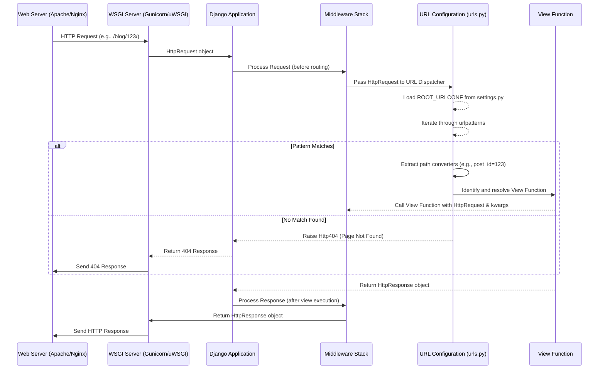

# Chapter 4: URL Dispatcher

Welcome back to our journey through the "markup" project's core components! In the previous chapter, we explored the [Web Server Interface (WSGI)](chapter_03.md), understanding how your Django application communicates with the web server to receive incoming HTTP requests. WSGI acts as the initial handshake, passing the raw request to Django. But once Django receives a request, how does it know *which* part of your code should handle it? This is where the **URL Dispatcher** comes into play.

---

### Problem & Motivation

Imagine a bustling city with many destinations – an administrative office, a blog post, an "about us" page, or a user profile. When a taxi (an HTTP request) arrives, it has a specific destination (a URL path, like `/admin/`, `/posts/123/`, or `/about/`). Without a clear map and a traffic controller, that taxi wouldn't know where to go. It might end up at the wrong place, or worse, get lost entirely.

In our "markup" project, this problem translates to: how does Django determine which specific *function* or *class* within your application should execute when a user visits a certain web address? A user navigating to `/admin/` expects to see the Django administration interface, while a visit to `/posts/5/` should display the fifth blog post. Without a robust routing mechanism, all requests would either hit a default, non-specific handler, or simply result in a "Page Not Found" error.

The **URL Dispatcher** solves this by providing a centralized, configurable system to map distinct URLs to their corresponding Python code – specifically, to "view functions" or "view classes" – ensuring that every incoming request is directed to the correct piece of business logic. It's the essential traffic controller that guides requests through the application, making sure the right code is executed for the right web address.

---

### Core Concept Explanation: The Traffic Controller for URLs

The **URL Dispatcher** in Django is the mechanism that takes an incoming URL from an HTTP request and decides which part of your Django application (a "view function" or "view class") should process it. Think of it as the central routing system for your web application.

At its heart, the URL dispatcher maintains a list of "URL patterns." Each pattern is like a rule that says: "If the URL looks like X, then execute Y." When a request comes in, Django iterates through these patterns, trying to find the first one that matches the incoming URL path. Once a match is found, Django knows exactly which view function to call, passing along any dynamic information extracted from the URL (like a post ID).

This approach provides several key benefits:
*   **Decoupling:** Your view functions don't need to know the specific URLs they respond to; the URL dispatcher handles that mapping.
*   **Flexibility:** You can easily change URLs without modifying your core logic.
*   **Organization:** It promotes a clear separation of concerns, making your project easier to understand and maintain.

For our "markup" project, the URL dispatcher is crucial for guiding incoming HTTP requests, whether they're for managing administrative tasks, accessing specific blog posts, or rendering static pages. It's the first significant step in the request processing pipeline after the request is received via WSGI, directly preceding the execution of the business logic in a view function.

---

### Practical Usage Examples: Defining Our Routes

In Django, URL patterns are defined in Python files, typically named `urls.py`. Your project will have a main `urls.py` file, and individual applications can also have their own `urls.py` files to keep things organized.

Let's look at how we'd set up some basic URL patterns for our "markup" project.

First, ensure your project's main `urls.py` includes the necessary imports:

```python
# markup/urls.py
from django.contrib import admin
from django.urls import path, include

urlpatterns = [
    # ... more patterns will go here
]
```
*Here, we import `admin` for the admin site, `path` for defining URL patterns, and `include` for modularizing our URLs.*

#### Example 1: Integrating the Django Admin

One of the most common first patterns is for the Django administration interface.

```python
# markup/urls.py (excerpt)
from django.contrib import admin
from django.urls import path

urlpatterns = [
    path('admin/', admin.site.urls),
]
```
*This pattern maps the URL `/admin/` to Django's built-in administration site. When a request comes for `/admin/...`, it's handed off to Django's admin URL patterns.*

#### Example 2: A Simple Static Page

Let's imagine we have an `about` view function (which we'll define in the next chapter) that displays information about our project.

```python
# markup/urls.py (excerpt)
from django.urls import path
from . import views # Assuming views.py is in the same directory

urlpatterns = [
    # ... existing patterns
    path('about/', views.about, name='about'),
]
```
*Here, a request to `/about/` will trigger the `about` function located in `markup/views.py`. The `name='about'` argument provides a convenient identifier for this URL pattern, allowing us to refer to it symbolically instead of hardcoding the URL string.*

#### Example 3: Dynamic Content with Path Converters

For blog posts or other content with unique IDs, we need dynamic URLs. Django's path converters allow us to capture parts of the URL.

```python
# markup/urls.py (excerpt)
from django.urls import path
from . import views

urlpatterns = [
    # ... existing patterns
    path('posts/<int:post_id>/', views.post_detail, name='post_detail'),
]
```
*When a user visits `/posts/123/`, this pattern matches. The `<int:post_id>` part captures `123` as an integer and passes it as an argument named `post_id` to the `views.post_detail` function. This allows the view to fetch the specific post.*

#### Example 4: Modularizing with `include()`

For larger projects, it's best to define URL patterns within individual applications. Let's say we have an application named `blog`.

First, create an `urls.py` inside your `blog` app (`blog/urls.py`):

```python
# blog/urls.py
from django.urls import path
from . import views

urlpatterns = [
    path('', views.post_list, name='post_list'),
    path('<int:post_id>/', views.post_detail, name='post_detail'),
]
```
*This `urls.py` defines patterns *relative* to its own base. `''` matches the root of where it's included, and `<int:post_id>/` handles individual posts.*

Now, include this in your project's main `urls.py`:

```python
# markup/urls.py (excerpt)
from django.urls import path, include

urlpatterns = [
    # ... existing patterns
    path('blog/', include('blog.urls')),
]
```
*Now, if a request comes for `/blog/`, it's handed off to the `blog.urls` file. So, `/blog/` will be handled by `blog.views.post_list`, and `/blog/123/` will be handled by `blog.views.post_detail` with `post_id=123`.*

---

### Internal Implementation Walkthrough: How Requests are Routed

When an HTTP request arrives at your Django application (via WSGI, as discussed in the previous chapter), a series of steps unfold to determine which view function should handle it.

1.  **Request Reception**: The WSGI server (e.g., Gunicorn) receives an HTTP request and, using the WSGI callable provided by `wsgi.py`, forwards it to the Django application.

2.  **Middleware Processing (Initial)**: The request first passes through Django's middleware chain. Middleware components can inspect or modify the request before it even hits the URL dispatcher.

3.  **URL Configuration Loading**: Django consults the `ROOT_URLCONF` setting in your `settings.py` file. This setting specifies the Python module where your main URL patterns are defined (e.g., `'markup.urls'`). Django loads this module to get the `urlpatterns` list.

4.  **Pattern Matching**: The core of the URL dispatcher's job begins here. Django takes the requested URL path (e.g., `/blog/123/`) and iterates through the `urlpatterns` list, attempting to match the path against each pattern.
    *   If a `path()` entry is encountered, Django compares the path segment to the pattern string.
    *   If an `include()` entry is found, Django strips off the matched portion of the URL and passes the *remainder* of the URL to the included `urls.py` file, recursively applying the matching process.

5.  **View Resolution**: Once a pattern successfully matches the incoming URL path, Django identifies the associated view function (e.g., `blog.views.post_detail`). Any captured values from the URL (like `post_id`) are extracted.

6.  **Middleware Processing (Final)**: Before calling the view function, the request passes through the middleware chain again, allowing other middleware components to act on the request or even the identified view.

7.  **View Execution**: Finally, the identified view function is called. It receives the `HttpRequest` object and any keyword arguments captured from the URL (e.g., `post_id=123`). This function contains the actual business logic to generate a response.

This entire process ensures that every request is efficiently and accurately directed to its intended handler.


*This sequence diagram illustrates the flow of an HTTP request from the web server through the WSGI interface, Django's middleware, the URL dispatcher, and finally to the view function before returning a response.*

---

### System Integration: Connecting the Pieces

The URL Dispatcher doesn't operate in isolation; it's a critical link in the chain that connects various parts of your "markup" project.

*   **Receives from [Web Server Interface (WSGI)](chapter_03.md)**: The WSGI handler is the direct upstream component. It passes the raw `HttpRequest` object to Django, which then routes it using the URL dispatcher. The dispatcher relies on the WSGI layer to correctly parse and deliver the incoming request details.

*   **Guided by [Project Settings](chapter_02.md)**: The `ROOT_URLCONF` setting within your `settings.py` file tells Django *where* to find the main list of URL patterns (`urlpatterns`). This crucial setting acts as the entry point for the URL dispatcher.

*   **Dispatches to [View Function](chapter_05.md)**: The primary purpose of the URL dispatcher is to identify and invoke the correct view function or class. Once a URL pattern matches, the dispatcher is responsible for calling the associated view and passing any extracted URL parameters to it. This forms the direct connection to your application's business logic.

*   **Interacts with Middleware**: As seen in the internal walkthrough, Django's middleware stack intercepts requests *before* and *after* URL dispatching. This allows middleware to perform actions like authentication, session management, or custom request/response processing based on the URL or the resolved view.

*   **Reverse URL Lookups**: The URL dispatcher also provides a powerful feature for "reverse" lookups. Using the `name` argument in `path()` (e.g., `name='post_detail'`), you can generate URLs dynamically based on the name and any required arguments. This means you never have to hardcode URLs in your templates or Python code, leading to more maintainable applications.

```mermaid
graph TD
    A[Web Server] --> B(WSGI Interface);
    B --> C{Django Application};
    C --> D(Middleware Stack);
    D --> E(URL Dispatcher);
    E -- Uses --> F[settings.py (ROOT_URLCONF)];
    E -- Matches URL to --> G[urls.py (urlpatterns)];
    G -- Dispatches to --> H(View Function);
    H --> I[Business Logic];
    I --> J[HttpResponse];
    J --> D;
    D --> C;
    C --> B;
    B --> A;
```
*This diagram shows how the URL Dispatcher sits between the middleware and the view functions, utilizing `settings.py` and `urls.py` to correctly route requests.*

---

### Best Practices & Tips

To leverage the URL dispatcher effectively in your "markup" project and avoid common pitfalls, consider these best practices:

*   **Use `name` arguments for Reverse Lookups**: Always provide a `name` argument for your `path()` patterns (e.g., `path('about/', views.about, name='about')`). This allows you to refer to URLs symbolically using `` in templates or `reverse('about')` in Python code. This makes your code more maintainable, as you can change the URL path without updating every reference.

    ```python
    # Bad: hardcoding URLs
    # <a href="/about/">About Us</a>

    # Good: using reverse lookup
    # <a href="">About Us</a>
    ```

*   **Modularize URLs with `include()`**: For larger projects with multiple applications, use `include()` to delegate URL routing to each app's `urls.py` file. This keeps your project's main `urls.py` clean and organized.

    ```python
    # markup/urls.py
    from django.urls import path, include

    urlpatterns = [
        path('admin/', admin.site.urls),
        path('blog/', include('blog.urls')), # Delegate to blog app
    ]
    ```

*   **Use Path Converters for Dynamic URLs**: Leverage Django's built-in path converters (`<int:pk>`, `<str:slug>`, `<uuid:id>`, etc.) for clear and concise dynamic URL patterns.

    ```python
    # myapp/urls.py
    path('articles/<int:year>/<str:slug>/', views.article_detail, name='article_detail'),
    ```

*   **Order Matters**: Django processes `urlpatterns` in the order they appear. Place more specific patterns *before* more general ones to ensure the correct pattern is matched. For example, `path('posts/new/', ...)` should come before `path('posts/<int:post_id>/', ...)`.

*   **Avoid Trailing Slashes in `path()`**: Unless you have a specific reason, avoid putting a trailing slash in the `path()` argument itself. Django's `APPEND_SLASH` setting (which is `True` by default) handles adding a trailing slash if necessary, making your URLs consistent.

*   **Keep `urls.py` Clean**: Avoid putting complex logic directly into `urls.py`. Its sole purpose should be mapping URLs to views. Any business logic belongs in the view functions themselves.

*   **Troubleshooting `Page Not Found (404)`**: If you get a 404, check your `urlpatterns` for typos, incorrect paths, or missing `include()` calls. Django's 404 page in debug mode is very helpful, showing which URL patterns were tried and failed.

*   **Troubleshooting `NoReverseMatch`**: This error occurs when Django can't find a URL pattern matching the name you provided to `reverse()` or ``. Double-check the `name` argument in your `path()` call and ensure you're passing the correct keyword arguments for dynamic URLs.

By following these guidelines, you'll build a robust, scalable, and easy-to-manage URL routing system for your "markup" project.

---

### Chapter Conclusion

In this chapter, we've thoroughly explored the **URL Dispatcher**, a cornerstone component of any Django application, including our "markup" project. We've seen how it acts as the project's traffic controller, mapping incoming web addresses to specific view functions, ensuring that HTTP requests are routed to the correct business logic handlers.

We started by understanding the problem of routing requests and how the URL dispatcher provides an elegant solution. We then delved into practical examples, demonstrating how to define URL patterns, integrate the admin, handle static pages, and manage dynamic content with path converters. The internal walkthrough provided insight into how Django processes requests from WSGI, through middleware, to pattern matching and view resolution. Finally, we examined its crucial integration with other project components like `settings.py` and the impending view functions, and discussed essential best practices for building a robust and maintainable routing system.

With a solid grasp of the URL dispatcher, we are now perfectly positioned to understand what happens *after* a URL is successfully matched. The next logical step is to dive into the **View Function** itself, which is the Python callable that actually receives the request and generates an HTTP response.

Let's move on to the next chapter to see how these routed requests are handled: [View Function](chapter_05.md).