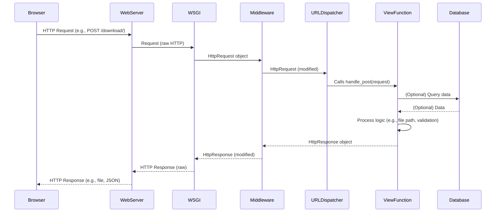

# Chapter 5: View Function

---

**Transition from Previous Chapter:**

In the [URL Dispatcher](chapter_04.md) chapter, we learned how Django's URLconf system effectively acts as a traffic controller, mapping incoming web addresses to specific handlers. However, merely routing a request isn't enough; we need a component that can actually *process* that request, perform necessary business logic, and generate a meaningful response. This is precisely where the **View Function** comes into play. It's the destination for a URL-matched request, providing the concrete implementation that dictates how your application responds to user interactions.

---

### Problem & Motivation

When a user interacts with a web application, they typically send an HTTP request (e.g., navigating to a page, submitting a form, clicking a button). This request needs to be received, understood, and acted upon. The core problem is: how does a Django application define the specific actions to take for each incoming request, considering different HTTP methods (GET, POST, PUT, DELETE) and parameters?

In the "markup" project, this is crucial for tasks such as handling administrative uploads, retrieving global configurations, or processing user-submitted data. For instance, if a user needs to upload a document or submit a form to trigger a backend process, we need a dedicated piece of code that can receive this data, validate it, interact with other parts of the system (like the file system in our `handle_post` example), and then communicate the outcome back to the user.

Consider a use case where an administrator wants to upload a file to a specific subdirectory on the server. The client-side application sends a `POST` request containing the `subdir` and `filename`. Our Django application needs a mechanism to receive this `POST` data, verify its validity, construct a path to the file, and potentially perform file system operations, finally returning a success or error message. The View Function serves as this essential mechanism, encapsulating the logic for these interactions.

### Core Concept Explanation

At its heart, a **View Function** in Django is a simple Python callable (either a function or a method of a class) that takes an `HttpRequest` object as its first argument and is responsible for returning an `HttpResponse` object. It acts as the bridge between the raw HTTP request from the web server and your application's business logic.

When the [URL Dispatcher](chapter_04.md) successfully matches an incoming URL pattern to a specific view function, Django calls that function, passing along a wealth of information about the request in the `HttpRequest` object. This object contains details like the HTTP method (`GET`, `POST`), request parameters, user information, and headers. The view function then uses this information to perform its designated task – it might query a database, process form data, interact with external APIs, or simply render an HTML template.

After executing its logic, the view function must construct an `HttpResponse` object. This object represents what will be sent back to the client's web browser. Django provides various types of response objects, such as `HttpResponse` for plain text or HTML, `JsonResponse` for structured data, and `RedirectResponse` for sending the user to a different URL. The flexibility of view functions allows developers to define precisely how the application reacts to different requests, making them a fundamental building block of any Django project.

---

### Practical Usage Examples

Let's explore how a view function handles an incoming request using the provided `handle_post` function from the `my_django_project/my_django_project/views.py` file, focusing on the use case of handling a file download request.

First, every view function must accept an `request` object. This object holds all the details of the incoming HTTP request. A common first step is to check the HTTP method to ensure the view is handling the correct type of request.

```python
# my_django_project/my_django_project/views.py

from django.http import JsonResponse
from pathlib import Path

def handle_post(request):
    # Check if the request method is POST
    if request.method == 'POST':
        # ... logic for POST requests will go here ...
        pass
    
    # If it's not a POST request, return an error
    return JsonResponse({'error': 'Invalid method'}, status=405)
```
*Explanation*: This snippet shows the basic structure. The `if request.method == 'POST':` line is a standard way to differentiate between various HTTP methods, ensuring that our file handling logic only runs when a POST request is received. If any other method (like GET) is used, an error response indicating "Method Not Allowed" (status 405) is returned immediately.

Next, within the `POST` block, we access the data sent by the client. For POST requests, this data is typically found in `request.POST`, which is a dictionary-like object.

```python
# my_django_project/my_django_project/views.py (continued)

def handle_post(request):
    if request.method == 'POST':
        """Get a downloadable attachment given path to a file"""
        local_volume_path = Path("/root/my_django_project/files")
        
        # Extract data from the POST request body
        subdir = request.POST.get('subdir') # Use .get() for safer access
        filename = request.POST.get('filename')

        # Basic validation for filename
        if not filename: # Checks for None or empty string
            return JsonResponse({'error': 'filename is a required field.'}, status=400)
    
    return JsonResponse({'error': 'Invalid method'}, status=405)
```
*Explanation*: Here, we retrieve the `subdir` and `filename` parameters that were sent as part of the POST request. Using `request.POST.get('key')` is generally safer than `request.POST['key']` because it prevents a `KeyError` if the key is not present, returning `None` instead. A simple validation check ensures that a `filename` is provided, returning a "Bad Request" (status 400) if it's missing.

Finally, the view function performs its core logic and returns an appropriate `JsonResponse`. The full example might involve constructing the file path, checking its existence, and then serving the file, or returning an error if something goes wrong.

```python
# my_django_project/my_django_project/views.py (continued)

import os
from django.http import FileResponse, JsonResponse, Http404
from pathlib import Path

def handle_post(request):
    if request.method == 'POST':
        local_volume_path = Path("/root/my_django_project/files")
        subdir = request.POST.get('subdir')
        filename = request.POST.get('filename')

        if not filename:
            return JsonResponse({'error': 'filename is a required field.'}, status=400)

        try:
            # Construct the full file path safely
            target_path = local_volume_path / subdir / filename
            target_path.resolve(strict=True) # Check if path exists and is secure

            if not os.path.exists(target_path) or not os.path.isfile(target_path):
                raise Http404("File not found.")

            # Serve the file for download
            return FileResponse(open(target_path, 'rb'), as_attachment=True, filename=filename)

        except Http404 as e:
            return JsonResponse({'error': str(e)}, status=404)
        except Exception as e:
            # Catch any other unexpected errors during file processing
            return JsonResponse({'error': f'Server error: {e}'}, status=500)

    return JsonResponse({'error': 'Invalid method'}, status=405)
```
*Explanation*: This expanded example demonstrates a more complete flow. After validation, it attempts to construct a secure `target_path` using `pathlib` for robustness. It then explicitly checks if the file exists using `os.path.exists` and `os.path.isfile`. If the file is found, `FileResponse` is used to send the file as an attachment for download. Comprehensive error handling with `try...except` blocks ensures that specific issues (like file not found via `Http404`) and general server errors result in informative `JsonResponse` objects with appropriate HTTP status codes (404 for Not Found, 500 for Internal Server Error).

---

### Internal Implementation Walkthrough

When an HTTP request arrives at your Django application, a series of steps lead to the execution of a view function and the generation of a response.

1.  **Request Reception**: The web server (e.g., Gunicorn, Apache, Nginx) receives an HTTP request and forwards it to Django via the [Web Server Interface (WSGI)](chapter_03.md). The WSGI handler converts the raw HTTP request into an `HttpRequest` object.
2.  **Middleware Processing**: Django's middleware layers (like `SessionMiddleware`, `AuthenticationMiddleware`) process the `HttpRequest` object, potentially adding information (e.g., user, session data) or modifying the request before it reaches the URL dispatcher.
3.  **URL Dispatching**: The `HttpRequest` object is then passed to the [URL Dispatcher](chapter_04.md). This component iterates through the `urlpatterns` defined in your project's `urls.py` and app-specific `urls.py` files, attempting to match the requested URL with a pattern.
4.  **View Function Call**: Once a matching URL pattern is found, the URL dispatcher extracts any captured parameters from the URL (e.g., `pk`, `slug`) and calls the associated view function. The `HttpRequest` object is passed as the first argument, followed by any captured URL parameters (as keyword arguments).
5.  **Business Logic Execution**: Inside the view function, the application's core logic is executed. This involves:
    *   Inspecting the `HttpRequest` object for method, headers, GET/POST data, etc.
    *   Performing validation on input data.
    *   Interacting with the database (via Django's ORM), file system, or external services.
    *   Processing data and preparing the output.
6.  **Response Generation**: The view function constructs an `HttpResponse` object (or a subclass like `JsonResponse`, `FileResponse`). This object contains the content (e.g., HTML, JSON, file bytes) and HTTP headers (e.g., `Content-Type`, `Status Code`) to be sent back to the client.
7.  **Middleware Processing (Response)**: The generated `HttpResponse` object then travels back through the middleware layers, which can modify the response (e.g., add cookies, compress content) before it's sent to the web server.
8.  **Response Transmission**: Finally, the web server receives the `HttpResponse` object from the WSGI handler and sends the HTTP response back to the client's browser.

Here's a simplified sequence diagram illustrating this flow:



---

### System Integration

View functions are the central integration point for various components within a Django project, orchestrating the flow of data and logic.

*   **Integration with [URL Dispatcher](chapter_04.md)**: This is the most direct integration. The `urlpatterns` in your `urls.py` files explicitly map URL patterns to specific view functions. For example:

    ```python
    # my_django_project/my_django_project/urls.py
    from django.urls import path
    from . import views

    urlpatterns = [
        path('download/', views.handle_post, name='download_file'),
        # ... other URL patterns
    ]
    ```
    This configuration tells Django that any request to `/download/` should be handled by the `handle_post` function defined in `my_django_project/my_django_project/views.py`.

*   **Integration with [Project Settings](chapter_02.md)**: View functions often depend on settings defined in `settings.py`. For example, a view might need to know the `MEDIA_ROOT` path for file uploads, or `DEBUG` status to provide more detailed error messages.

    ```python
    from django.conf import settings
    # ... inside a view function
    if settings.DEBUG:
        # Provide more detailed error logging or response
        pass
    ```

*   **Integration with Models (not explicitly covered yet, but essential)**: In most real-world applications, view functions interact heavily with Django's Object-Relational Mapper (ORM) to retrieve, create, update, or delete data from the database. The view acts as the coordinator between the request and the data layer.

*   **Integration with Templates (not explicitly covered yet, but essential)**: For views that render HTML pages, they often use Django's template engine to combine data with HTML structures. The `render` shortcut function is commonly used for this.

*   **Middleware**: As described in the implementation walkthrough, views are surrounded by middleware, which can preprocess the `HttpRequest` and post-process the `HttpResponse`.

This interconnectedness makes view functions the core business logic handlers, enabling them to leverage the full power of the Django framework.

---

### Best Practices & Tips

To write robust, maintainable, and efficient view functions, consider the following best practices:

*   **Keep Views "Thin"**: Adhere to the "Fat Models, Thin Views" philosophy. Complex business logic, database queries, and data manipulation should reside in your models or dedicated service layers, not directly in the view. The view's primary role is to coordinate these operations, receive input, and return an appropriate response.
*   **Handle HTTP Methods Explicitly**: Always check `request.method` and handle different HTTP methods (GET, POST, PUT, DELETE) explicitly. This makes your views predictable and robust.
    ```python
    def my_view(request):
        if request.method == 'GET':
            # Handle display logic
            pass
        elif request.method == 'POST':
            # Handle submission logic
            pass
        else:
            return JsonResponse({'error': 'Method not allowed'}, status=405)
    ```
*   **Validate Input Data**: Never trust user input. Always validate data received from `request.GET`, `request.POST`, or `request.body`. Django Forms are an excellent way to handle complex validation.
*   **Return Appropriate HTTP Status Codes**: Use correct HTTP status codes in your responses (e.g., 200 OK, 201 Created, 204 No Content, 400 Bad Request, 403 Forbidden, 404 Not Found, 405 Method Not Allowed, 500 Internal Server Error). This provides clear feedback to clients and helps with API design.
*   **Use Django Shortcuts**: Leverage Django's built-in shortcuts like `render()`, `get_object_or_404()`, and `redirect()` to simplify common view tasks and reduce boilerplate code.
*   **Security Considerations**: Be mindful of security risks. Always sanitize user input to prevent XSS attacks, use `csrf_protect` (or Django's default CSRF protection for forms) for POST requests, and properly handle user permissions.
*   **Error Handling**: Implement `try...except` blocks for operations that might fail (e.g., file system access, external API calls) and return informative error responses with appropriate status codes, logging the full exception for debugging.
*   **Use Class-Based Views for Reusability**: For common patterns like displaying a list of objects, displaying a single object, or handling forms, Django's Class-Based Views (CBVs) provide a more reusable and organized approach compared to function-based views.

---

### Chapter Conclusion

We have now explored the vital role of **View Functions** within the "markup" project, understanding that they are the primary responders to incoming HTTP requests. From their fundamental structure to their intricate integration with other Django components like the [URL Dispatcher](chapter_04.md) and [Project Settings](chapter_02.md), view functions are where the application's business logic truly comes alive. We've seen how they parse requests, execute specific actions, and construct tailored responses, acting as the critical link between user interaction and server-side processing.

By following best practices for designing "thin" views, handling HTTP methods correctly, and implementing robust error handling, developers can create applications that are both powerful and maintainable. This chapter concludes our initial journey through the core request-response cycle of a Django application. While we've focused on the mechanics of processing and responding to requests, a complete application often needs to present data dynamically and store information persistently. Therefore, our next steps would typically delve into how Django interacts with databases through its ORM and how it generates dynamic HTML content using templates.