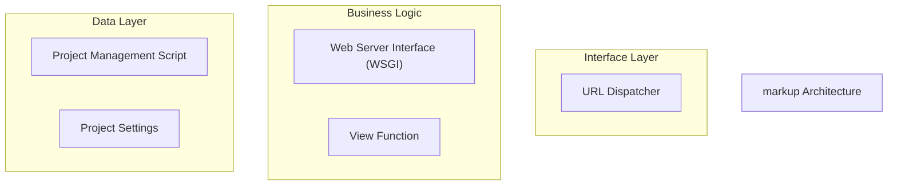
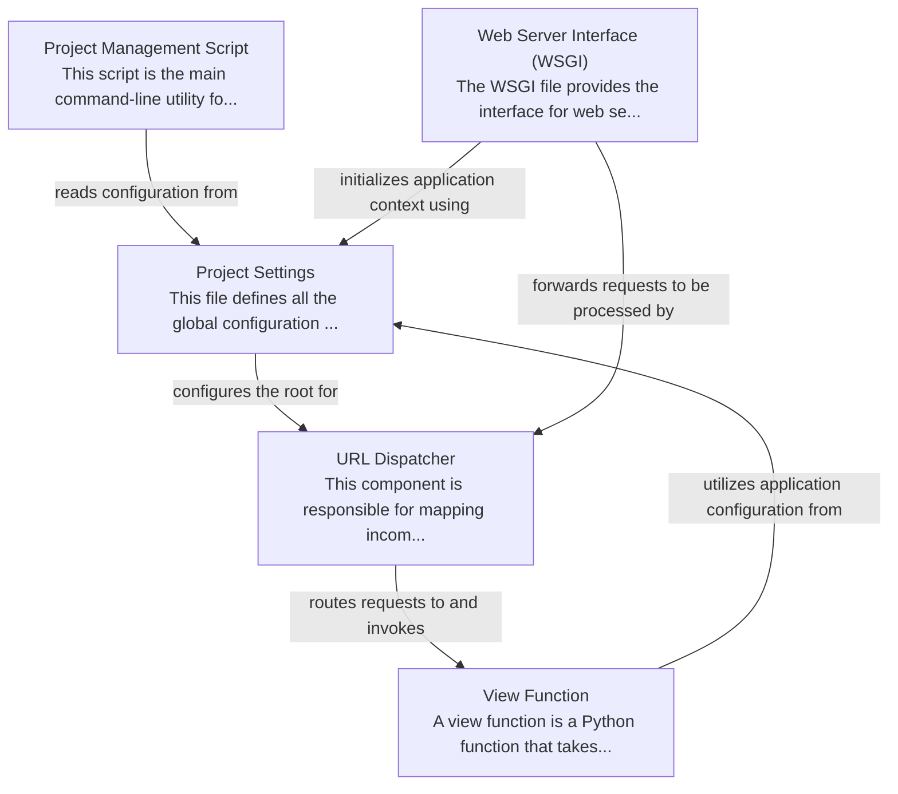

# markup Tutorial

Welcome to the comprehensive tutorial for markup. This tutorial is automatically generated from the codebase to help you understand the core concepts and implementation patterns.

## Project Overview

This analysis describes the interaction between fundamental components of a Django web application.
It outlines how administrative tasks are managed, global configurations are applied, and HTTP requests are processed
from the web server through routing to specific business logic handlers.

## System Architecture

## Component Relationships

## Table of Contents

1. [Chapter 1: Project Management Script](chapter_01.md) - Comprehensive documentation for Project Management Script following structured methodology...
2. [Chapter 2: Project Settings](chapter_02.md) - Comprehensive documentation for Project Settings following structured methodology...
3. [Chapter 3: Web Server Interface (WSGI)](chapter_03.md) - Comprehensive documentation for Web Server Interface (WSGI) following structured methodology...
4. [Chapter 4: URL Dispatcher](chapter_04.md) - Comprehensive documentation for URL Dispatcher following structured methodology...
5. [Chapter 5: View Function](chapter_05.md) - Comprehensive documentation for View Function following structured methodology...

## How to Use This Tutorial

1. **Start with Chapter 1** to understand the foundational concepts
2. **Follow the sequence** - each chapter builds upon previous concepts
3. **Practice with code examples** - every chapter includes practical examples
4. **Refer to diagrams** - use architecture diagrams for visual understanding
5. **Cross-reference concepts** - chapters link to related topics

## Tutorial Features

- **Progressive Learning**: Concepts are introduced in logical order
- **Code Examples**: Every chapter includes practical, executable code
- **Visual Diagrams**: Mermaid diagrams illustrate complex relationships
- **Cross-References**: Easy navigation between related concepts
- **Beginner-Friendly**: Written for newcomers to the codebase

## Contributing

This tutorial is auto-generated from the codebase. To improve it:
1. Update the source code documentation
2. Add more detailed comments to key functions
3. Regenerate the tutorial using the documentation system

---

*Generated using AI-powered codebase analysis*
