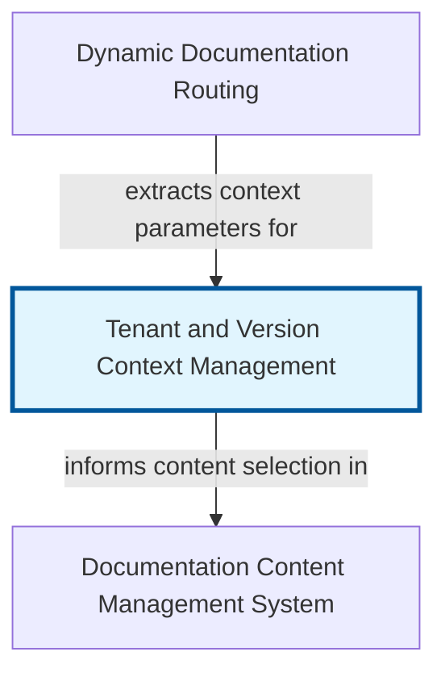

# Tenant and Version Context Management

In modern web applications, it's common to serve multiple organizations or users, each with their own isolated data and settings—a concept known as multi-tenancy. Furthermore, applications often evolve, requiring the ability to maintain and display different documentation or application states (versions) simultaneously. The "Tenant and Version Context Management" abstraction is designed to address these challenges by providing a robust mechanism to identify and manage the 'current' tenant and the 'active' documentation or application version being viewed by a user.

This abstraction acts as a central switchboard, ensuring that every request, every data query, and every rendered piece of UI correctly reflects the perspective of the designated tenant and the chosen version. Without it, developers would have to manually pass tenant IDs and version numbers through every function call, leading to brittle, error-prone, and unmaintainable code. By encapsulating this context, the system can dynamically adapt its behavior, serving tenant-specific content, applying relevant business rules, and enabling seamless version switching.

Ultimately, this abstraction is foundational for building scalable, multi-tenant applications with a rich versioning strategy. It decouples the core business logic from the concerns of 'who' is viewing and 'what' version they are viewing, promoting cleaner architecture, enhanced data isolation, and a more flexible user experience. It's crucial for delivering personalized and accurate content, whether it's product documentation, a dashboard, or configuration settings.


## Architecture



## Code Examples

### 1. Setting the Context via Middleware (Python/Flask)

This example demonstrates how server-side middleware (using Flask's 'before_request' hook) intercepts incoming requests to determine the current tenant and desired documentation version. It typically extracts this information from request headers, URL parameters, or a user's session. Once identified, it sets this context in a request-local storage, making it accessible throughout the lifespan of the request without needing to explicitly pass it around. This is a common pattern for 'request-scoped' data.

The example uses 'threading.local' as a simple way to store request-specific context in a multi-threaded server environment, ensuring that each request's context is isolated.


```python
import threading
from flask import Flask, request, g

app = Flask(__name__)

# A simple request-scoped context store
# In a real app, this might be a more robust request context object
_request_context = threading.local()

def set_context(tenant_id, version):
    _request_context.tenant_id = tenant_id
    _request_context.version = version

def get_current_tenant_id():
    return getattr(_request_context, 'tenant_id', 'default_tenant')

def get_current_version():
    return getattr(_request_context, 'version', 'latest')

@app.before_request
def before_request_hook():
    # Extract tenant and version from request (e.g., headers, URL, session)
    tenant_id = request.headers.get('X-Tenant-Id')
    version = request.args.get('version') or request.headers.get('X-Doc-Version')

    if tenant_id:
        set_context(tenant_id, version)
    else:
        # Fallback to default or raise error if tenant is mandatory
        set_context('default_tenant', version or 'latest')

    # Store context in Flask's request global object 'g' for convenience
    # 'g' is specific to Flask, other frameworks have similar concepts
    g.tenant_id = get_current_tenant_id()
    g.version = get_current_version()

@app.route('/')
def home():
    return f"Hello from Tenant: {g.tenant_id}, Version: {g.version}"

if __name__ == '__main__':
    app.run(debug=True)

```

### 2. Accessing the Context in Application Logic (Python)

Once the tenant and version context has been set (e.g., by middleware as in the previous example), application services and data access layers can easily retrieve this information without needing it passed as an explicit argument. This example shows a 'DocumentationService' that uses the globally accessible context to fetch content specific to the current tenant and the active documentation version.

This approach significantly simplifies function signatures and prevents "prop drilling" of context variables throughout the codebase. The service implicitly knows which tenant and version it's operating for.


```python
# Assuming _request_context and related functions from Example 1 are available
import threading

_request_context = threading.local() # Re-declare or import if in separate file

def get_current_tenant_id():
    return getattr(_request_context, 'tenant_id', 'default_tenant')

def get_current_version():
    return getattr(_request_context, 'version', 'latest')

class DocumentationRepository:
    def get_docs_by_criteria(self, tenant_id, version, category):
        print(f"Fetching docs for tenant '{tenant_id}', version '{version}', category '{category}'")
        # Simulate database call or file system access
        # In a real scenario, this would query a database table
        # like 'docs_content' WHERE 'tenant_id' = :tenant_id AND 'version' = :version
        if tenant_id == 'acme_corp' and version == 'v2.0' and category == 'features':
            return {"title": "Acme Features v2.0", "content": "Advanced features for Acme Corp."}
        elif tenant_id == 'default_tenant' and version == 'latest' and category == 'introduction':
            return {"title": "Introduction to Our Product", "content": "Welcome!"}
        return None

class DocumentationService:
    def __init__(self, doc_repo: DocumentationRepository):
        self.doc_repo = doc_repo

    def get_features_documentation(self):
        current_tenant = get_current_tenant_id()
        current_version = get_current_version()
        return self.doc_repo.get_docs_by_criteria(current_tenant, current_version, 'features')

    def get_introduction_documentation(self):
        current_tenant = get_current_tenant_id()
        current_version = get_current_version()
        return self.doc_repo.get_docs_by_criteria(current_tenant, current_version, 'introduction')

# Simulate a request context being set
def simulate_request(tenant_id, version):
    _request_context.tenant_id = tenant_id
    _request_context.version = version
    print(f"\n--- Simulating Request for Tenant: '{tenant_id}', Version: '{version}' ---")
    doc_repo = DocumentationRepository()
    doc_service = DocumentationService(doc_repo)

    features_doc = doc_service.get_features_documentation()
    if features_doc:
        print(f"Found features doc: {features_doc['title']}")
    else:
        print("No features documentation found.")

    intro_doc = doc_service.get_introduction_documentation()
    if intro_doc:
        print(f"Found intro doc: {intro_doc['title']}")
    else:
        print("No introduction documentation found.")

simulate_request('acme_corp', 'v2.0')
simulate_request('default_tenant', 'latest')
simulate_request('globex_inc', 'v1.0') # Will likely get no specific doc

```

### 3. Client-Side Context Switching (TypeScript/React)

This example shows how a user might interact with a UI component to switch the active documentation version. Typically, this involves updating the URL (e.g., via a query parameter or path segment), which then triggers a new server request or client-side routing. The server-side middleware (from Example 1) would then pick up this updated URL parameter to set the new version context for subsequent server-rendered content or API calls.

The React component uses its state to manage the currently selected version and updates the browser's URL history when a new version is chosen, reflecting the change to the user and signaling the server.


```typescript
import React, { useState, useEffect } from 'react';

interface VersionSwitcherProps {
  availableVersions: string[];
  currentVersion: string;
  onVersionChange: (newVersion: string) => void;
}

const VersionSwitcher: React.FC<VersionSwitcherProps> = ({
  availableVersions,
  currentVersion,
  onVersionChange
}) => {
  const [selectedVersion, setSelectedVersion] = useState(currentVersion);

  useEffect(() => {
    setSelectedVersion(currentVersion);
  }, [currentVersion]);

  const handleChange = (event: React.ChangeEvent<HTMLSelectElement>) => {
    const newVersion = event.target.value;
    setSelectedVersion(newVersion);
    onVersionChange(newVersion);
  };

  return (
    <div style={{ padding: '20px', border: '1px solid #ccc', borderRadius: '8px' }}>
      <h3>Switch Documentation Version</h3>
      <select value={selectedVersion} onChange={handleChange}>
        {availableVersions.map((version) => (
          <option key={version} value={version}>
            {version}
          </option>
        ))}
      </select>
      <p>Currently viewing version: <strong>{selectedVersion}</strong></p>
    </div>
  );
};

// --- Example Usage in a main App component ---
const App: React.FC = () => {
  // In a real app, 'initialVersion' would come from server-rendered props or URL parsing
  const getVersionFromUrl = () => {
    const params = new URLSearchParams(window.location.search);
    return params.get('version') || 'latest';
  };

  const [appVersion, setAppVersion] = useState(getVersionFromUrl());
  const availableVersions = ['v1.0', 'v1.1', 'v2.0', 'latest'];

  const handleVersionChange = (newVersion: string) => {
    // Update the URL to reflect the new version
    const url = new URL(window.location.href);
    url.searchParams.set('version', newVersion);
    window.history.pushState({}, '', url.toString());

    // In a real application, this might also trigger a re-fetch of content
    // or a full page reload depending on how the application is structured.
    setAppVersion(newVersion); // Update client-side state
    console.log(`Navigating to version: ${newVersion}. Server will pick this up.');
  };

  return (
    <div>
      <h1>My Multi-Versioned Documentation App</h1>
      <VersionSwitcher
        availableVersions={availableVersions}
        currentVersion={appVersion}
        onVersionChange={handleVersionChange}
      />
      {/* Display content based on 'appVersion' - this would usually be fetched from server */}
      <div style={{ marginTop: '20px' }}>
        <h2>Documentation for current version ({appVersion})</h2>
        <p>
          This content would dynamically load based on the '{appVersion}' and the current tenant.
        </p>
      </div>
    </div>
  );
};

export default App;

```

## Implementation

Implementing Tenant and Version Context Management typically involves defining a clear strategy for context storage and propagation. On the server-side, context is often stored in 'request-scoped' objects or thread-local storage, ensuring that each incoming request operates with its own isolated context. Middleware or request interceptors are responsible for extracting the tenant identifier and version from HTTP headers, URL parameters, or authentication tokens, and then populating this context. This centralizes the logic and prevents business services from having to explicitly deal with context extraction.

For client-side interactions, especially concerning version switching, the context is usually managed via URL parameters or routing configurations. When a user selects a new version, the application updates the URL, triggering a client-side route change or a full page reload. This updated URL then informs the server-side context management system about the desired version for subsequent requests. Careful consideration must be given to security, ensuring that a user cannot access another tenant's data by simply manipulating the tenant ID, which requires robust access control built on top of this context.


## Related Concepts

- Multi-tenancy

- Request Context

- API Versioning

- Access Control (Authorization)

- Data Partitioning

- Middleware

- Feature Flags
