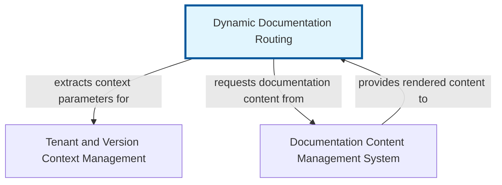

# Dynamic Documentation Routing

The 'Dynamic Documentation Routing' abstraction is a core component for managing documentation in complex environments where content varies by tenant and by version. It provides a robust and flexible mechanism to map incoming URL requests to the correct documentation page, whether it's for 'tenant-A' using 'version 1.0' of the docs, or 'tenant-B' on 'version 2.1'.

At its heart, this system leverages Next.js's powerful dynamic routing capabilities, specifically catch-all routes, to interpret variable segments within a URL path. These segments typically represent the tenant identifier, the documentation version, and the specific page path. Once the URL components are parsed, the system then intelligently retrieves and renders the corresponding MDX (Markdown with JSX) content.

This abstraction creates a highly scalable and maintainable documentation platform. It eliminates the need for manually creating separate routes for every tenant or version, streamlining content updates and ensuring that users always access the correct, context-specific documentation without complex redirects or duplicate content management.


## Architecture



## Code Examples

### Next.js Catch-All Route for Documentation

This example demonstrates the foundational Next.js catch-all route using the 'app' directory, which is crucial for 'Dynamic Documentation Routing'. The '[[...slug]]' segment in the file path 'app/[[...slug]]/page.tsx' tells Next.js to capture all path segments after the base URL into a single array named 'slug'. This 'slug' array will contain the 'tenant', 'version', and then the subsequent path to the documentation page. The 'generateStaticParams' function is used to pre-render a set of common paths during build time (Static Site Generation), enhancing performance. In a real application, this function would fetch all possible tenant/version/page combinations from your content source.


```typescript
// app/[[...slug]]/page.tsx
import { notFound } from 'next/navigation';
import { readMdxFile, getAllDocSlugs } from '@/lib/docs'; // Assume these exist

// Define all possible static paths for pre-rendering
export async function generateStaticParams() {
  const docSlugs = await getAllDocSlugs(); // e.g., [['tenant-A', 'v1.0', 'getting-started'], ['tenant-B', 'v2.0', 'features']]
  return docSlugs.map(slug => ({ slug }));
}

interface DocPageProps {
  params: {
    slug?: string[]; // The catch-all slug array: [tenant, version, ...pagePath]
  };
}

export default async function DocPage({ params }: DocPageProps) {
  const { slug = [] } = params;

  if (slug.length < 3) {
    // Minimum slug: [tenant, version, pageName]
    // Or handle as a generic landing page, or redirect
    notFound();
  }

  const [tenant, version, ...pagePathSegments] = slug;
  const pagePath = pagePathSegments.join('/');

  // Fetch MDX content based on tenant, version, and pagePath
  const mdxContent = await readMdxFile(tenant, version, pagePath);

  if (!mdxContent) {
    notFound();
  }

  // Assume 'MdxRenderer' is a component that processes and renders MDX content
  // This would typically involve 'next-mdx-remote' or similar
  return (
    <article className="doc-content">
      <h1>{mdxContent.frontmatter.title}</h1>
      <MdxRenderer source={mdxContent.content} />
    </article>
  );
}

```

### Content Resolution Logic Example

This example shows a simplified version of the 'readMdxFile' and 'getAllDocSlugs' functions, which are critical for the dynamic routing system. The 'readMdxFile' function takes the parsed 'tenant', 'version', and 'pagePath' from the URL and constructs a file system path to locate the correct MDX file. It then reads and parses this file, extracting both its frontmatter (metadata) and its content. The 'getAllDocSlugs' function is responsible for recursively scanning your documentation content directory to find all available MDX files and generate the corresponding 'slug' arrays needed for Next.js's 'generateStaticParams'. This ensures all pages are discoverable and can be pre-rendered.


```typescript
// lib/docs.ts (Simplified example)
import fs from 'fs/promises';
import path from 'path';
import matter from 'gray-matter'; // For parsing frontmatter

const DOCS_ROOT = path.join(process.cwd(), 'docs-content');

interface MdxFile {
  content: string;
  frontmatter: Record<string, any>;
}

/**
 * Reads and parses an MDX file based on tenant, version, and page path.
 */
export async function readMdxFile(
  tenant: string,
  version: string,
  pagePath: string
): Promise<MdxFile | null> {
  try {
    const filePath = path.join(DOCS_ROOT, tenant, version, `${pagePath}.mdx`);
    const fileContent = await fs.readFile(filePath, 'utf-8');
    const { content, data: frontmatter } = matter(fileContent);
    return { content, frontmatter };
  } catch (error) {
    console.error(`Failed to read MDX file for ${tenant}/${version}/${pagePath}:', error);
    return null;
  }
}

/**
 * Recursively scans the docs-content directory to find all possible slugs.
 * For generating static paths.
 */
export async function getAllDocSlugs(): Promise<string[][]> {
  const slugs: string[][] = [];

  async function walk(currentPath: string, segments: string[]) {
    const entries = await fs.readdir(currentPath, { withFileTypes: true });

    for (const entry of entries) {
      if (entry.isDirectory()) {
        await walk(path.join(currentPath, entry.name), [...segments, entry.name]);
      } else if (entry.isFile() && entry.name.endsWith('.mdx')) {
        const fileName = entry.name.replace(/\.mdx$/, '');
        // We assume first two segments are tenant and version
        // e.g., ['tenant-A', 'v1.0', 'getting-started']
        if (segments.length >= 2) { // Ensure at least tenant and version are present
           slugs.push([...segments, fileName]);
        }
      }
    }
  }

  // Start walking from the DOCS_ROOT
  await walk(DOCS_ROOT, []);
  return slugs;
}

// Example directory structure for 'docs-content':
// docs-content/
// ├── tenant-A/
// │   ├── v1.0/
// │   │   ├── getting-started.mdx
// │   │   └── features/
// │   │       └── advanced.mdx
// │   └── v2.0/
// │       └── new-features.mdx
// └── tenant-B/
//     └── v1.0/
//         └── onboarding.mdx

```

## Implementation

Implementing Dynamic Documentation Routing requires careful consideration of content structure and retrieval logic. Organize your MDX files in a clear, hierarchical manner, typically 'docs-content/{tenant-id}/{version-id}/{page-path}.mdx'. This structure directly maps to the URL segments, simplifying the content resolution process. For instance, a file at 'docs-content/acme/v2.0/features/advanced.mdx' would correspond to the URL path '/acme/v2.0/features/advanced'.

Leverage Next.js's 'generateStaticParams' (for the 'app' directory) to pre-generate all possible documentation paths during build time. This ensures fast page loads as pages are served as static HTML, and significantly reduces server load. For content retrieval, abstract your file system or CMS interactions into dedicated utility functions. These functions should handle reading MDX files, parsing frontmatter, and converting MDX content into a renderable format (e.g., using 'next-mdx-remote' or a custom MDX compiler). Implement robust error handling, such as redirecting to a 404 page if a specific tenant, version, or page cannot be found. Consider strategies for version fallback (e.g., if a page is missing in 'v2.1', check 'v2.0' or 'latest') and tenant-specific overrides to provide flexibility. Caching content, especially when sourcing from external APIs, is also crucial for performance.


## Related Concepts

- Next.js Dynamic Routing

- MDX (Markdown with JSX)

- Static Site Generation (SSG)

- Multi-Tenancy Architecture

- Content Management System (CMS) Integration

- URL Path Parsing and Resolution

- Version Control for Content

- Frontmatter (YAML in Markdown)
