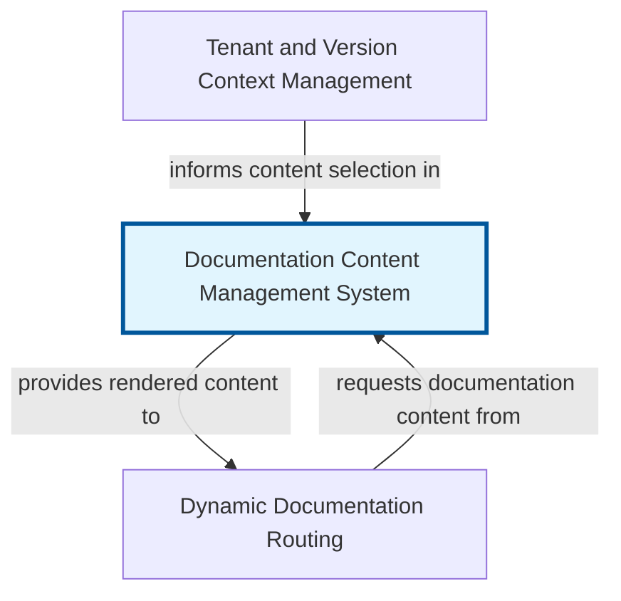

# Chapter 3: The Documentation Content Management System (DCMS)

The Documentation Content Management System (DCMS) is a core abstraction responsible for turning raw documentation files into renderable web content. Imagine you have a collection of articles, guides, and tutorials written in a special format called MDX. The DCMS acts as the intelligent engine that reads these files, understands their structure, extracts important information, and prepares them for display on your website.

Its primary goal is to streamline the documentation workflow. Authors can focus on writing content using MDX's powerful combination of Markdown and React components, without needing to worry about the underlying technical process of how that content gets to the browser. The DCMS handles all the heavy lifting: locating files within the 'content/docs' directory, parsing their content, integrating custom UI components, and organizing essential metadata for features like site navigation.

By centralizing content processing, the DCMS ensures consistency, improves performance through optimized rendering, and provides a robust framework for managing all documentation assets. It's the bridge that connects your static content files to the dynamic web application.


## Architecture



## Code Examples

### Example 1: An MDX Documentation File ('my-guide.mdx')

This example shows a typical MDX file as it would exist in your 'content/docs' directory. It includes 'frontmatter' (metadata at the top), standard Markdown syntax, and a custom React component ('Note') for enhanced content. The DCMS reads this file, parses the 'frontmatter' to extract information like the 'title' and 'description', and then processes the MDX body to make it renderable as a React component.


```mdx
---
title: 'Getting Started with X'
description: 'A comprehensive guide to setting up X.'
category: 'Setup'
order: 1
---

# Welcome to X!

This guide will walk you through the initial setup process.

<Note type="info">
  Always refer to the latest documentation for breaking changes.
</Note>

## Installation

First, install the necessary dependencies:

```bash
npm install your-package

For more details, visit our [official website](https://example.com).

```

### Example 2: A Custom React Component for MDX ('Note.tsx')

This is an example of a simple React component that can be used directly within your MDX files, as shown in the previous example. The DCMS is configured to recognize and correctly render these components. This allows documentation authors to embed interactive elements, styled blocks, or complex UI components right within their Markdown content, greatly enhancing the quality and interactivity of the documentation.


```typescript
import React from 'react';

interface NoteProps {
  type?: 'info' | 'warning' | 'danger';
  children: React.ReactNode;
}

const Note: React.FC<NoteProps> = ({ type = 'info', children }) => {
  let borderColor;
  let bgColor;

  switch (type) {
    case 'warning':
      borderColor = 'border-yellow-400';
      bgColor = 'bg-yellow-50';
      break;
    case 'danger':
      borderColor = 'border-red-400';
      bgColor = 'bg-red-50';
      break;
    case 'info':
    default:
      borderColor = 'border-blue-400';
      bgColor = 'bg-blue-50';
      break;
  }

  return (
    <div className={`p-4 border-l-4 ${borderColor} ${bgColor} my-4 rounded`}>
      {children}
    </div>
  );
};

export default Note;

```

### Example 3: Fetching and Rendering Documentation in a Next.js Page

This code snippet demonstrates how a Next.js page might use the DCMS to fetch and render a specific documentation article. The 'getStaticProps' function (running on the server at build time) calls a DCMS utility function (e.g., 'getDocBySlug') which reads the MDX file, parses it, and transforms it into a renderable component or serializable props. The 'DocPage' component then receives these props and renders the content. Note the use of 'MdxContent' which is the output of the MDX compilation, acting as a React component.


```typescript
// pages/docs/[...slug].tsx
import { GetStaticProps, GetStaticPaths } from 'next';
import { MDXRemote, MDXRemoteSerializeResult } from 'next-mdx-remote';
import { serialize } from 'next-mdx-remote/serialize';
import path from 'path';
import fs from 'fs';
import matter from 'gray-matter';
import { provideMdxComponents } from '../../components/mdx-components'; // Our custom MDX components

interface DocPageProps {
  source: MDXRemoteSerializeResult;
  frontMatter: { [key: string]: any };
}

// In a real application, these functions would be part of the DCMS abstraction
const DOCS_DIRECTORY = path.join(process.cwd(), 'content', 'docs');

export async function getStaticPaths(): Promise<ReturnType<GetStaticPaths>> {
  // This function retrieves all possible documentation paths from the content directory
  const files = fs.readdirSync(DOCS_DIRECTORY);
  const paths = files
    .filter(file => file.endsWith('.mdx'))
    .map(file => ({
      params: {
        slug: file.replace(/\.mdx$/, '').split('/') // Create slug from filename
      }
    }));

  return {
    paths,
    fallback: false, // Indicate that any path not returned by getStaticPaths should result in a 404
  };
}

export const getStaticProps: GetStaticProps<DocPageProps> = async ({ params }) => {
  // This function fetches the content for a specific documentation page
  const { slug } = params as { slug: string[] };
  const filePath = path.join(DOCS_DIRECTORY, `${slug.join('/')}.mdx`);
  const source = fs.readFileSync(filePath, 'utf8');

  // Use 'gray-matter' to parse frontmatter and content
  const { content, data } = matter(source);
  // Use 'next-mdx-remote' to serialize MDX content into a renderable format
  const mdxSource = await serialize(content, {
    mdxOptions: {
      remarkPlugins: [], // Add remark plugins here for advanced Markdown processing
      rehypePlugins: [], // Add rehype plugins here for HTML processing
    },
    scope: data, // Expose frontmatter data to MDX components if needed
  });

  return {
    props: {
      source: mdxSource, // Serialized MDX content
      frontMatter: data, // Frontmatter metadata
    },
  };
};

const DocPage: React.FC<DocPageProps> = ({ source, frontMatter }) => {
  // Provide custom components to MDXRemote for rendering
  const components = provideMdxComponents();

  return (
    <div className="prose max-w-none p-8">
      <h1 className="text-4xl font-bold mb-4">{frontMatter.title}</h1>
      <p className="text-lg text-gray-600 mb-8">{frontMatter.description}</p>
      {/* Render the MDX content using MDXRemote */}
      <MDXRemote {...source} components={components} />
    </div>
  );
};

export default DocPage;

```

## Implementation

The DCMS implementation typically involves several key steps and utilizes powerful libraries. First, it uses Node.js's 'fs' module to read the raw MDX file content from the 'content/docs' directory. Next, libraries like 'gray-matter' are employed to parse the file's 'frontmatter' – the YAML or TOML metadata block at the top of the MDX file – separating it from the main content. This metadata is crucial for navigation, SEO, and other display purposes.

The core of the DCMS is the MDX compiler, often '@mdx-js/mdx' or 'next-mdx-remote' in a Next.js context. This compiler transforms the MDX content into a JavaScript module (or a serializable object like 'MDXRemoteSerializeResult' for 'next-mdx-remote') that can be rendered as a React component. During this compilation, it maps any custom components declared in the MDX file (e.g., '<Note>') to their actual React implementations defined elsewhere in the codebase. The DCMS also often incorporates remark and rehype plugins to extend Markdown's capabilities, such as adding syntax highlighting, creating table of contents, or processing images. For performance, a caching mechanism can be implemented to store processed MDX content, avoiding recompilation on every request.


## Related Concepts

- Markdown

- MDX (Markdown with JSX)

- Frontmatter

- Content Management System (CMS)

- Static Site Generation (SSG)

- Server-Side Rendering (SSR)

- React Components

- File System API

- Remark and Rehype Plugins
