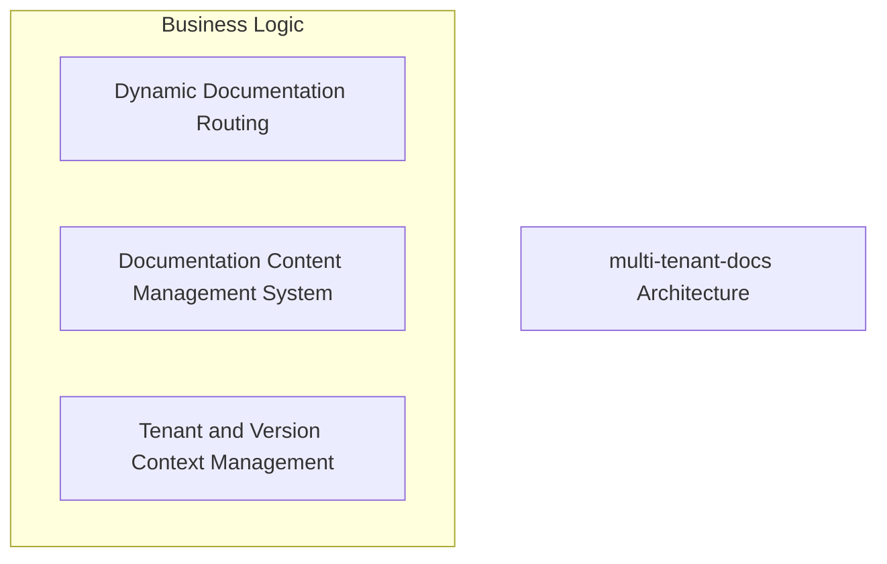
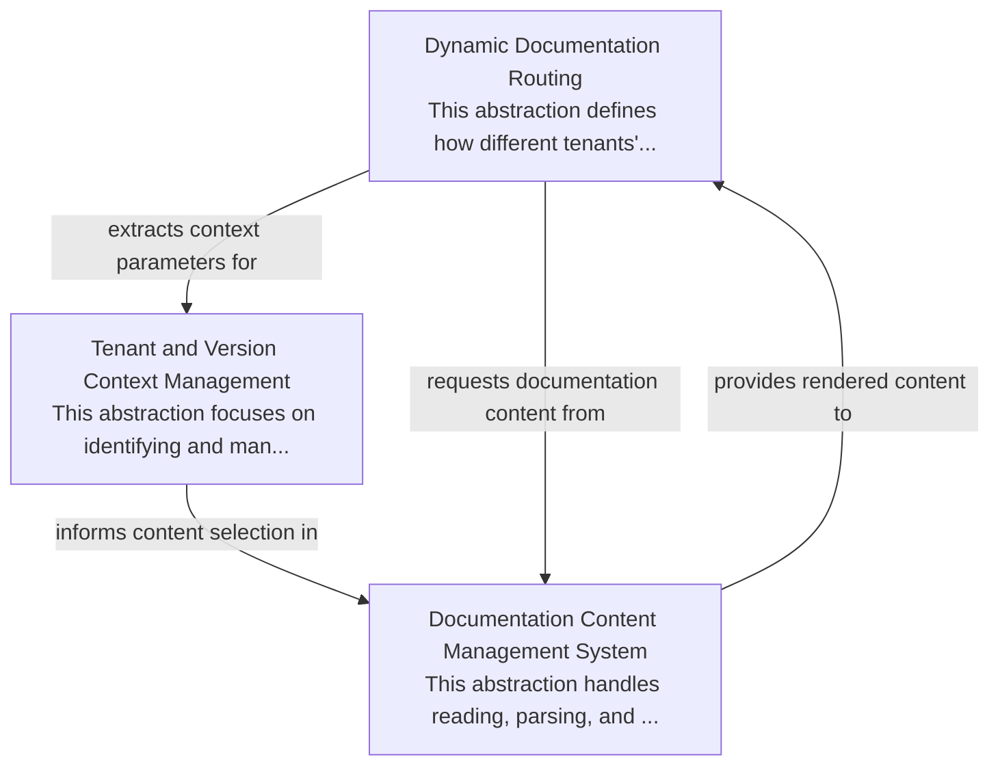

# multi-tenant-docs Tutorial

Welcome to the comprehensive tutorial for multi-tenant-docs. This tutorial is automatically generated from the codebase to help you understand the core concepts and implementation patterns.

## Project Overview

The 'multi-tenant-docs' project delivers a dynamic documentation platform capable of serving content for multiple tenants and versions. It integrates Next.js routing to map URLs to specific documentation, a content management system to process MDX files, and context management to maintain the active tenant and version, ensuring the correct content is always presented. This architecture provides flexibility for content delivery and user experience across different documentation instances.

## System Architecture

## Component Relationships

## Table of Contents

1. [Tenant and Version Context Management](chapter_01.md) - In modern web applications, it's common to serve multiple organizations or users, each with their own isolated data and settings—a concept known as multi-tenancy.
2. [Dynamic Documentation Routing](chapter_02.md) - The 'Dynamic Documentation Routing' abstraction is a core component for managing documentation in complex environments where content varies by tenant and by version.
3. [Chapter 3: The Documentation Content Management System (DCMS)](chapter_03.md) - The Documentation Content Management System (DCMS) is a core abstraction responsible for turning raw documentation files into renderable web content.

## How to Use This Tutorial

1. Start with Chapter 1 to understand the foundational concepts
2. Each chapter builds upon previous concepts
3. Code examples are provided throughout to illustrate key points
4. Refer to the architecture diagrams for visual understanding
5. Each chapter includes relevant architectural diagrams showing how the component fits into the overall system

## Contributing

This tutorial is auto-generated. To improve it, please update the source code documentation and regenerate.
