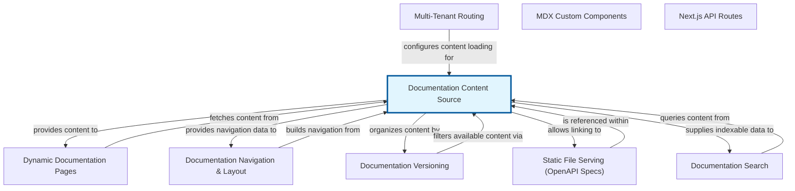

# The Documentation Content Source

This abstraction serves as the central repository and manager for all documentation content within our system. Its core responsibility is to systematically load, parse, and index every MDX documentation file along with its accompanying 'meta.json' data. By doing so, it transforms raw file-system content into a structured, accessible format, ready for various downstream processes.

The 'Documentation Content Source' acts as the authoritative source for all documentation pages and their associated metadata. It handles the complexities of file system interactions, MDX processing, and metadata interpretation, presenting a unified interface to the rest of the application. This ensures that components responsible for rendering pages, building navigation menus, or powering search functionality can easily retrieve the necessary information without needing to understand the underlying file structure or parsing logic.

Ultimately, this abstraction decouples the storage and format of documentation content from its consumption. It guarantees consistency in how content is accessed, provides a robust error handling mechanism for content issues, and enables efficient retrieval and navigation across the entire documentation site, making content readily available for display and interaction.


## Architecture



## Code Examples

### Loading and Indexing Documentation Content

This example demonstrates a simplified 'DocumentationContentSource' class written in TypeScript. It illustrates how such an abstraction would load MDX files and their associated 'meta.json' files from a specified base directory. The 'loadSingleDoc' method simulates reading individual file content and parsing the JSON metadata, while 'loadAllContent' orchestrates the loading for multiple predefined paths, storing the structured data in an internal map. The goal is to transform raw file data into easily accessible objects, each representing a documentation page with its content and metadata, identified by a unique path. This is crucial for making documentation content programmatically available for rendering and navigation.


```typescript
import * as fs from 'fs';
import * as path from 'path';

// Simplified type for a documentation page's metadata
interface PageMeta {
    title: string;
    description?: string;
    order?: number;
}

// Simplified type for a documentation page's content
interface DocPage {
    path: string;
    mdxSource: string; // The raw MDX content
    meta: PageMeta;
    // Potentially also 'compiledMdx' for actual rendering
}

class DocumentationContentSource {
    private contentMap: Map<string, DocPage> = new Map();
    private baseDir: string;

    constructor(baseDirPath: string) {
        this.baseDir = baseDirPath;
    }

    // A simplified method to simulate loading content for a single path
    private async loadSingleDoc(docPath: string): Promise<DocPage | null> {
        const fullPath = path.join(this.baseDir, docPath);
        const mdxFilePath = `${fullPath}.mdx`;
        const metaFilePath = path.join(fullPath, 'meta.json');

        try {
            const mdxSource = await fs.promises.readFile(mdxFilePath, 'utf-8');
            const metaContent = await fs.promises.readFile(metaFilePath, 'utf-8');
            const meta: PageMeta = JSON.parse(metaContent);

            return {
                path: docPath,
                mdxSource,
                meta,
            };
        } catch (error) {
            console.error(`Error loading doc for '${docPath}':', error);
            return null;
        }
    }

    // A method to simulate loading all documentation content
    async loadAllContent(): Promise<void> {
        // In a real scenario, this would involve recursive directory traversal
        // using a utility like 'glob' or a custom file system walker.
        // For simplicity, let's load a few hardcoded examples.
        const docPaths = [
            'getting-started',
            'api/overview',
            'api/components/button'
        ];

        for (const docPath of docPaths) {
            const page = await this.loadSingleDoc(docPath);
            if (page) {
                this.contentMap.set(docPath, page);
            }
        }
        console.log(`Loaded ${this.contentMap.size} documentation pages.`);
    }

    // Method to retrieve content by path
    getDocByPath(docPath: string): DocPage | undefined {
        return this.contentMap.get(docPath);
    }
}

// Usage example:
async function main() {
    // To run this example, you'd need to create dummy files and directories:
    // mkdir -p temp_docs/getting-started temp_docs/api/overview temp_docs/api/components
    // echo "Hello from Getting Started content." > temp_docs/getting-started.mdx
    // echo '{"title": "Getting Started", "order": 1}' > temp_docs/getting-started/meta.json
    // echo "API Overview content." > temp_docs/api/overview.mdx
    // echo '{"title": "API Overview", "order": 1}' > temp_docs/api/overview/meta.json
    // echo "Details about the Button component." > temp_docs/api/components/button.mdx
    // echo '{"title": "Button Component", "order": 1}' > temp_docs/api/components/button/meta.json

    const docsSource = new DocumentationContentSource('temp_docs');
    await docsSource.loadAllContent();

    const gettingStarted = docsSource.getDocByPath('getting-started');
    if (gettingStarted) {
        console.log('--- Getting Started Document ---');
        console.log('Path:', gettingStarted.path);
        console.log('Title:', gettingStarted.meta.title);
        console.log('MDX Source (excerpt):', gettingStarted.mdxSource.substring(0, 30) + '...');
    }

    const buttonDoc = docsSource.getDocByPath('api/components/button');
    if (buttonDoc) {
        console.log('--- Button Component Document ---');
        console.log('Path:', buttonDoc.path);
        console.log('Title:', buttonDoc.meta.title);
    }
}

main();

```

## Implementation

Implementing the 'Documentation Content Source' typically involves a multi-step process. First, a recursive file system traversal is needed to locate all '.mdx' files and their corresponding 'meta.json' files within a specified root directory. Tools like 'glob' or custom directory-walking functions can achieve this efficiently. For each discovered pair, the '.mdx' file's content is read as a string, and the 'meta.json' is parsed into a JavaScript object. These pieces of information, along with a unique identifier or path for the document, are then stored in an internal data structure, commonly a 'Map' or a tree, allowing for quick retrieval.

Key considerations include handling edge cases such as missing '.mdx' files, malformed 'meta.json', or duplicate paths, which should be logged or raise specific errors. Performance can be enhanced by implementing caching mechanisms for parsed content and metadata, especially during development, or by watching the file system for changes to trigger incremental updates. Furthermore, the actual MDX parsing (e.g., converting MDX to a format ready for rendering like JSX/JS objects) might occur either directly within this abstraction or deferred to a 'Documentation Renderer' based on the system's design. The output should always be a normalized, consistent data structure for all documentation entries.


## Related Concepts

- Documentation Renderer

- Navigation Tree Generator

- Search Indexer

- File System Abstraction

- MDX Parser

- Content Management System (CMS)
