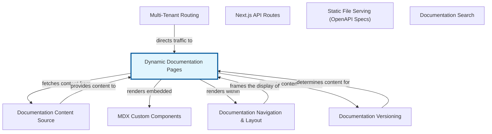

# Dynamic Documentation Pages: Building Flexible Content

The 'Dynamic Documentation Pages' abstraction is a powerful mechanism for building highly scalable and easily maintainable documentation websites. At its core, it enables a system to render specific documentation articles by dynamically matching URL paths, often referred to as 'slugs', to corresponding content files, typically in MDX format. Instead of requiring developers to manually define a route for every single documentation page, this abstraction automates the process, allowing content creators to simply add new MDX files to a designated directory, and they automatically become accessible via a logical URL.

This abstraction significantly streamlines the content creation workflow and reduces development overhead. It integrates seamlessly into larger web systems, particularly those built with modern frameworks like Next.js or Gatsby, by leveraging their dynamic routing capabilities. For instance, a URL like '/docs/getting-started/installation' would be mapped to a file such as 'content/docs/getting-started/installation.mdx', which is then fetched, processed, and displayed in the browser. This approach makes it incredibly easy to manage a growing body of documentation without constantly updating routing configurations, ensuring that the system remains flexible and adaptable as the content evolves.


## Architecture



## Code Examples

### Catch-all Route for Dynamic Pages (Next.js Example)

This example demonstrates a common pattern in frameworks like Next.js for creating dynamic documentation pages using a catch-all route. The file 'pages/[[...slug]].tsx' tells Next.js to capture any URL path under '/docs' that doesn't match a more specific route. For instance, '/docs/introduction' would result in 'slug' being '[introduction]', and '/docs/getting-started/installation' would result in 'slug' being '[getting-started, installation]'.

The 'getStaticProps' function is used to fetch the MDX content based on the 'slug' from the URL. It constructs a file path, reads the content, and then serializes the MDX for rendering on the client-side. This approach generates pages at build time (Static Site Generation), which is highly performant and SEO-friendly for documentation sites.


```typescript
// pages/docs/[[...slug]].tsx
import { GetStaticPaths, GetStaticProps } from 'next';
import { serialize } from 'next-mdx-remote/serialize';
import { MDXRemote, MDXRemoteSerializeResult } from 'next-mdx-remote';
import fs from 'fs';
import path from 'path';

// Define where your MDX files are located
const DOCS_DIRECTORY = path.join(process.cwd(), 'content', 'docs');

interface DocPageProps {
  source: MDXRemoteSerializeResult;
  frontmatter: { [key: string]: any };
}

const components = {
  // You can define custom components to be used within your MDX here
  h1: (props: any) => <h1 className='text-3xl font-bold' {...props} />,
  p: (props: any) => <p className='my-4' {...props} />,
};

export default function DocPage({ source, frontmatter }: DocPageProps) {
  return (
    <div className='container mx-auto px-4 py-8'>
      <h1 className='text-4xl font-extrabold mb-6'>{frontmatter.title}</h1>
      <MDXRemote {...source} components={components} />
    </div>
  );
}

export const getStaticPaths: GetStaticPaths = async () => {
  // Recursively read all MDX files in the docs directory
  const getAllMdxFiles = (dir: string): string[] => {
    let results: string[] = [];
    const files = fs.readdirSync(dir, { withFileTypes: true });
    for (const file of files) {
      const fullPath = path.join(dir, file.name);
      if (file.isDirectory()) {
        results = results.concat(getAllMdxFiles(fullPath));
      } else if (file.name.endsWith('.mdx')) {
        results.push(fullPath);
      }
    }
    return results;
  };

  const mdxFiles = getAllMdxFiles(DOCS_DIRECTORY);

  // Convert file paths to slug parameters
  const paths = mdxFiles.map((filePath) => {
    const relativePath = path.relative(DOCS_DIRECTORY, filePath);
    const slug = relativePath.replace(/\.mdx$/, '').split(path.sep);
    return { params: { slug } };
  });

  return {
    paths,
    fallback: false, // Set to 'blocking' or 'true' for on-demand generation
  };
};

export const getStaticProps: GetStaticProps<DocPageProps> = async ({ params }) => {
  const slug = params?.slug as string[] || ['index']; // Default to index if no slug
  const filePath = path.join(DOCS_DIRECTORY, `${slug.join(path.sep)}.mdx`);

  try {
    const source = fs.readFileSync(filePath, 'utf8');
    const mdxSource = await serialize(source, {
      parseFrontmatter: true,
    });

    return {
      props: {
        source: mdxSource,
        frontmatter: mdxSource.frontmatter,
      },
    };
  } catch (error) {
    console.error('Failed to load MDX file:', filePath, error);
    return {
      notFound: true,
    };
  }
};

```

### Example MDX Content File

This example shows a typical MDX content file. MDX (Markdown with JSX) allows you to combine standard Markdown syntax with React components directly within your documentation. The section at the top, enclosed by '---', is called 'frontmatter'. It's YAML-formatted metadata that provides key information about the document, such as its title, author, or a description. This frontmatter can be programmatically accessed and used by the rendering system (as seen in the 'getStaticProps' example) to populate page titles, SEO metadata, or navigation elements.


```text
---
title: 'Getting Started with Dynamic Pages'
description: 'A comprehensive guide to understanding and implementing dynamic documentation pages.'
author: 'Doc Builder'
date: '2023-10-27'
---

# Welcome to Dynamic Documentation!

This is an **MDX** file, which means it's a super-powered Markdown document.
You can write standard Markdown like this:

- Bullet points
- *Italics* and **bold** text
- [Links to other pages](/docs/advanced-topics/custom-components)

But you can also embed React components directly!
For example, here's a simple alert box:

<div style={{ padding: '1rem', backgroundColor: '#e0f7fa', borderLeft: '5px solid #00bcd4', marginBottom: '1rem' }}>
  <p>
    **Tip:** Remember to use single quotes for inline code references in your documentation!
  </p>
</div>

## How it Works

When you navigate to '/docs/getting-started-with-dynamic-pages', this content is loaded. The system
parses the URL slug, finds this corresponding file, and renders it directly in your browser.
It's that simple!

```

## Implementation

Implementing 'Dynamic Documentation Pages' involves several key steps. First, you need a content source, typically a directory structure containing MDX files (e.g., 'content/docs'). Each file's path relative to this base directory will inform its URL slug. Next, a catch-all route, like '[[...slug]].tsx' in Next.js, is essential to capture arbitrary URL paths. Within this route's data fetching function (e.g., 'getStaticProps' or 'getServerSideProps'), you'll parse the 'slug' parameter to construct the exact file path for the corresponding MDX content.

Once the file is located and read, its content needs to be processed. This usually involves parsing the 'frontmatter' (metadata) and compiling the MDX content into a renderable format. Libraries like 'next-mdx-remote' or '@mdx-js/react' are commonly used for this compilation and rendering. The compiled content and extracted 'frontmatter' are then passed as props to your React component, which uses an MDX renderer to display the documentation. Best practices include robust error handling for missing files, careful path manipulation to avoid security vulnerabilities, and optimizing for performance through static site generation (SSG) where possible, or server-side rendering (SSR) for more dynamic, frequently updated content.


## Related Concepts

- Content Management Systems (CMS)

- Static Site Generators (SSG)

- Server-Side Rendering (SSR)

- Client-Side Routing

- Markdown and MDX

- URL Slugs

- Catch-all Routes

- Frontmatter
