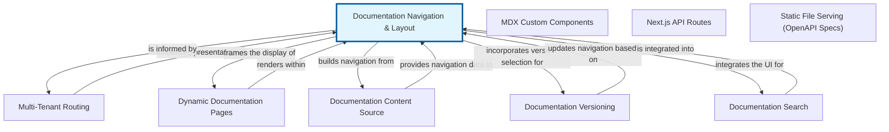

# Chapter 3: Documentation Navigation & Layout - Structuring Your Content

The 'Documentation Navigation & Layout' abstraction is fundamental to how users interact with and understand your documentation. It defines the overall visual structure and organization of your content, ensuring a consistent and intuitive user experience. At its core, this abstraction governs elements like the header, footer, main content area, and crucially, the dynamic sidebar navigation.

This dynamic sidebar is typically generated programmatically, often by parsing structured metadata files like 'meta.json'. These files act as a blueprint, describing the hierarchy, order, and titles of your documentation pages and sections. By centralizing this navigation logic, the system can automatically create a clickable, interactive sidebar that guides users through the documentation, reflecting the underlying content structure without manual updates to every page.

This abstraction works hand-in-hand with the 'Content Abstraction' to present a cohesive user interface. While 'Content Abstraction' focuses on the content of individual pages, 'Documentation Navigation & Layout' wraps that content in a navigable shell, providing context and facilitating discoverability. It transforms a collection of individual documents into a structured, easily explorable knowledge base.


## Architecture



## Code Examples

### Example 1: Basic 'meta.json' for Navigation Structure

This example illustrates a typical 'meta.json' file that defines a section of the documentation. The 'title' field specifies the display name for this section in the navigation. The 'pages' array lists individual documentation files within this section, often using their file names (without extension) as identifiers, which the system can then map to actual content files. The 'sections' array allows for nesting, creating sub-sections within the main one, enabling deep hierarchies for complex documentation. This structured data is the primary input for generating the dynamic sidebar navigation.


```json
{
  "title": "Getting Started",
  "pages": [
    "installation",
    "quick-start-guide",
    "configuration"
  ],
  "sections": [
    {
      "title": "Advanced Topics",
      "pages": [
        "custom-plugins",
        "api-integration"
      ]
    },
    {
      "title": "Troubleshooting",
      "pages": [
        "common-issues",
        "error-codes"
      ]
    }
  ]
}

```

### Example 2: Conceptual Navigation Generation Logic (TypeScript)

This conceptual TypeScript code snippet demonstrates how a build tool or templating engine might process a 'meta.json' file to construct the HTML for a dynamic sidebar. The 'generateNavigation' function recursively iterates through 'pages' and 'sections', creating list items ('<li>') and links ('<a>') for each entry. It also handles nested sections by calling itself. This logic transforms the declarative structure of 'meta.json' into the interactive navigation elements seen by the user, dynamically updating the sidebar whenever the 'meta.json' changes.


```typescript
// Assume 'metaData' is parsed from a 'meta.json' file
interface PageMeta {
  title?: string; // Optional, can derive from file name
  path: string;
}

interface SectionMeta {
  title: string;
  pages?: string[]; // File names or IDs
  sections?: SectionMeta[];
}

function generateNavigation(meta: SectionMeta | { pages: string[], sections: SectionMeta[] }): string {
  let html = '';

  if (meta.pages) {
    html += '<ul>';
    for (const pageId of meta.pages) {
      // In a real system, 'getPageTitle' would lookup the actual page title
      // and 'getLinkPath' would generate the correct URL.
      const pageTitle = pageId.split('-').map(word => word.charAt(0).toUpperCase() + word.slice(1)).join(' ');
      const linkPath = `/docs/${pageId}`;
      html += `<li><a href="${linkPath}">${pageTitle}</a></li>`;
    }
    html += '</ul>';
  }

  if (meta.sections) {
    for (const section of meta.sections) {
      html += `<details>`;
      html += `<summary>${section.title}</summary>`;
      html += generateNavigation(section); // Recursive call for nested sections
      html += `</details>`;
    }
  }

  return html;
}

// Example usage with the meta.json from Example 1:
// const sidebarHtml = generateNavigation(parsedMetaData);
// console.log(sidebarHtml);

```

## Implementation

Implementing the 'Documentation Navigation & Layout' abstraction typically involves several steps. First, the documentation build system reads and parses 'meta.json' files, often from various directories, to construct a complete, hierarchical representation of the documentation structure. This data is then passed to a templating engine (like Handlebars, Nunjucks, or Liquid) which iterates over the structure to generate the appropriate HTML for the sidebar navigation. This process often occurs during the build phase, creating static HTML pages.

For dynamic features, such as highlighting the current page, expanding/collapsing sections, or client-side searching, JavaScript is often employed. The generated HTML navigation includes IDs or classes that JavaScript can hook into. Best practices include ensuring accessibility (e.g., proper ARIA attributes, keyboard navigation), responsiveness for various screen sizes, and performance optimization to avoid layout shifts. The design should also allow for easy customization of visual styles via CSS, adhering to the project's 'Theming & Styling' guidelines.


## Related Concepts

- Content Abstraction

- Theming & Styling

- Metadata Management

- Build Process

- Routing
